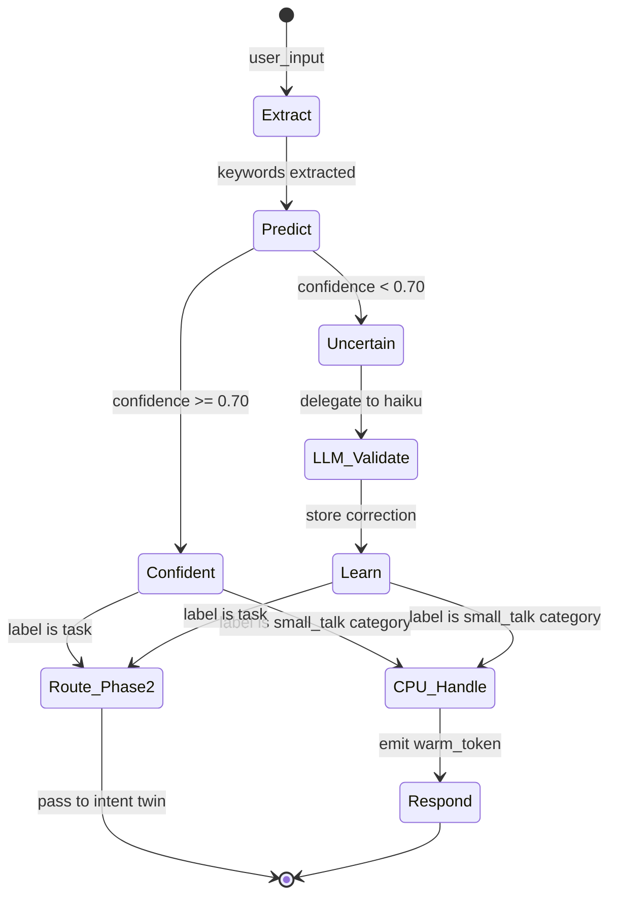

# Phase 1: Small Talk Twin

The Small Talk Twin fires on every incoming message. Its job is binary triage: is this message **small talk** (greeting, emotion, humor, off-domain chatter) or a **task** that should advance to Phase 2?

When the CPU is confident (above 0.70 threshold), it handles the response directly without calling the LLM validator. When uncertain, it delegates to a Haiku validator, learns from the correction, and routes accordingly.

Over time, the CPU absorbs common patterns and handles the majority of small-talk classification at zero LLM cost.

## State Machine



## Keyword Rules

Keyword-to-label mapping used for CPU-side prediction. Each keyword group maps to a label. When multiple keywords match, the highest-confidence keyword wins.

| Keyword Group | Label | Examples |
|---------------|-------|----------|
| hello, hi, hey, greetings, morning, evening | greeting | "hello there", "hey!" |
| thanks, thank, appreciate, grateful | gratitude | "thanks for the help" |
| happy, excited, great, awesome, amazing, wonderful | emotional_positive | "I'm so happy it works!" |
| sad, frustrated, angry, upset, annoyed, disappointed | emotional_negative | "this is so frustrating" |
| joke, funny, lol, haha, laugh, humor | humor | "tell me a joke" |
| weather, weekend, coffee, lunch, movie, music | small_talk | "how's the weather?" |
| random, unrelated, off-topic | off_domain | "what's the capital of France?" |
| what, how, why, explain, curious | question | "how does this work?" |
| fix, bug, deploy, test, build, create, add, refactor | task | "fix the login bug" |

## Confidence Curve

The CPU confidence for a keyword grows with observation count using a logistic-inspired formula:

```
confidence(keyword) = 1 - 1/(1 + 0.3 * count)
```

| Count | Confidence | Behavior |
|-------|------------|----------|
| 0 | 0.0000 | Unknown -- always delegate to LLM |
| 1 | 0.2308 | Low -- delegate to LLM |
| 2 | 0.3750 | Low -- delegate to LLM |
| 5 | 0.6000 | Approaching threshold -- delegate |
| 8 | 0.7059 | Above 0.70 -- CPU handles directly |
| 10 | 0.7500 | Confident -- CPU handles directly |
| 25 | 0.8824 | High confidence -- CPU handles directly |
| 50 | 0.9375 | Very high -- essentially learned |

## Learning Protocol

1. **Extract**: Pull keywords from user input using stop-word filtering and lowercase normalization.
2. **Predict**: Look up each keyword in the learned patterns. Return the highest-confidence match.
3. **Gate**: If confidence >= 0.70, CPU handles directly. Otherwise, delegate to Haiku validator.
4. **Learn**: When the LLM validator returns a classification, reinforce all extracted keywords with that label.
5. **Persist**: Append learned patterns to `learned_small_talk.jsonl` (local) and optionally sync to cloud.
6. **Merge**: On startup, load seeds from `seeds/small-talk-seeds.jsonl`, then overlay learned patterns from `learned_small_talk.jsonl`. Local patterns override seeds.

## Seed Data

The seeds file (`seeds/small-talk-seeds.jsonl`) provides a Day-1 baseline of ~10 pre-learned patterns so the CPU is not completely cold on first boot. These seeds were extracted from simulation runs and represent high-confidence keyword-to-label mappings.
