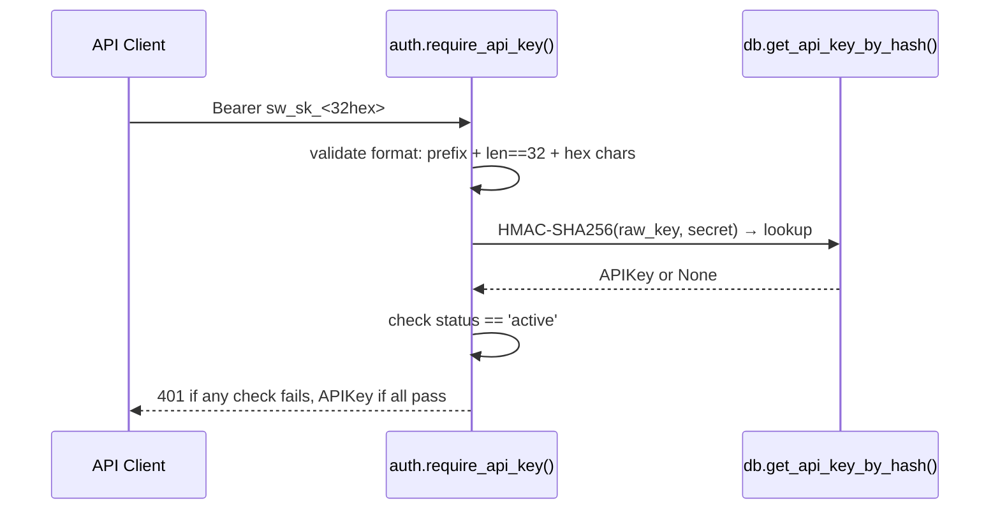
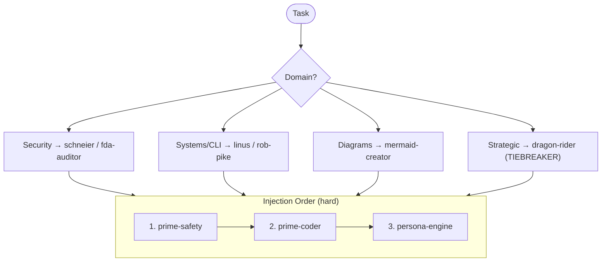
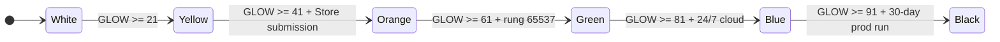
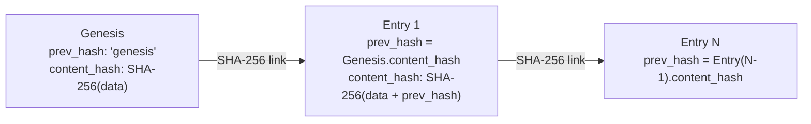
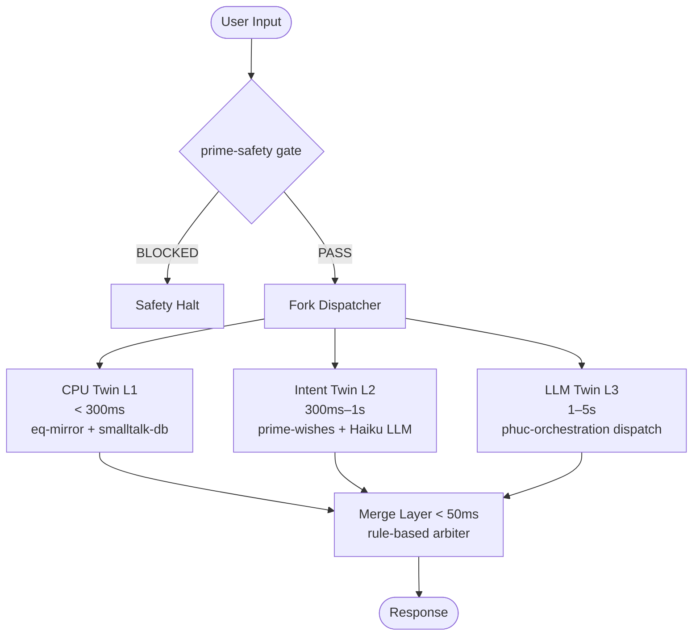

# CLAUDE.md — Stillwater Diagrams Specification

**Scope:** All diagrams in `data/default/diagrams/` and its subdirectories.
**Rule:** Diagrams are written FROM source code, not from memory. If source disagrees with diagram, fix the diagram.

---

## Subdirectory Purposes

| Dir | Files | Purpose |
|-----|-------|---------|
| `cli/` | 3 | Triple-twin CLI architecture (CPU/Intent/LLM forks), latency model, orchestration v2 |
| `compliance/` | 1 | FDA 21 CFR Part 11 audit trail, ALCOA+ mapping, hash chain mechanics |
| `dev/` | 1 | FSM-to-test development pipeline (red-green gate discipline) |
| `eq/` | 4 | EQ skill system: interaction flow, NUT Job FSM, smalltalk DB, twin integration |
| `stillwater/` | 39 | All core subsystems (01=system, 07=rung, 10=swarm, 14=evidence, 20=oauth3, 22=deploy, 57=security, 70=self-service) |
| `use-cases/` | 1 | Email triage: 7 guardrails, budget system, OAuth3 scope model, ALCOA+ |

---

## Color Coding Spec (Canonical — Do Not Override)

### Standard palette (all diagrams):
```
classDef active   fill:#2d7a2d,color:#fff,stroke:#1a5c1a   — running components, PASS
classDef portal   fill:#1a5cb5,color:#fff,stroke:#0f3d80   — admin/portal, orchestration
classDef gate     fill:#b58c1a,color:#fff,stroke:#806000   — validation gates, constraints
classDef store    fill:#7a2d7a,color:#fff,stroke:#5c1a5c   — store API, evidence, persistence
classDef external fill:#4a4a4a,color:#fff,stroke:#333      — external APIs, LLM providers
```

### Outcome palette (swarm/rung diagrams 07, 10, 14, 29):
```
classDef passNode    fill:#1a7a4a,color:#fff,stroke:#0f4f2f,font-weight:bold  — PASS
classDef blockedNode fill:#9b2335,color:#fff,stroke:#6b1520,font-weight:bold  — BLOCKED/INVALID
classDef gateNode    fill:#2c4f8c,color:#fff,stroke:#1a3060                   — gate decisions
classDef cnfNode     fill:#1e2d40,color:#cdd9e5,stroke:#4a6fa5               — CNF/sub-agent
```

### Security palette (diagrams 57+):
```
classDef secure     fill:#e6ffe6,stroke:#00cc00   — properly secured
classDef vulnerable fill:#ffefef,stroke:#cc0000   — known gap / unprotected
classDef warn       fill:#fff8e6,stroke:#cc8800   — partial or conditional
```

---

## Forbidden Paths (Cannot Appear in Any Diagram)

These transitions must never be shown as valid:

1. **Null rung → PASS** — `rung_target = null` never reaches VALID at any rung. Null is not 0, null is not 641.
2. **Lane C evidence → PASS claim** — FORECAST_MEMO.json, prose confidence, README documentation cannot alone claim rung. Only Lane A (executable artifacts) can.
3. **Persona overriding prime-safety** — No persona node may connect to a path that bypasses prime-safety. Persona is always load_order=3.
4. **Provider auto-select skipping cheapest** — Provider fallback chain must be: ollama → together → openai → openrouter → anthropic → offline. Any diagram showing a different order is wrong.
5. **Store submission without auth gate** — No path from `POST /store/submit` that bypasses `auth.require_api_key()`.
6. **Sub-agent without rung_target** — Any dispatch path missing `rung_target` in CNF capsule is UNDECLARED_RUNG (forbidden state).
7. **Token refresh without user consent** — OAuth3 tokens cannot auto-extend. Refresh requires explicit user approval shown in diagram.
8. **S2S calls without service principal token (future)** — Current architecture has this gap; mark it CRITICAL GAP, do not normalize it.
9. **Health endpoints behind auth** — `GET /api/health` on all 8 services (8787–8794) must show L0 (no auth).
10. **main context > 800 lines without COMPACTION** — Any orchestration flow that accumulates > 800 lines without a compaction node is showing a forbidden state.

---

## Universal Invariants (Must Be True Across All Diagrams)

### Rung invariants
- `VALID_RUNGS = {641, 274177, 65537}` — no other value is valid
- Higher rungs require all evidence from lower rungs (cumulative)
- `rung_integrated = MIN(rung of all contributing sub-agents)` — the slowest agent sets the floor
- 3-seed consensus uses seeds 42, 137, 9001 — any other seed combination is wrong
- behavior_hash normalization: split → strip → filter empty → sort lines → prepend `seed=N` → SHA-256

### Auth invariants
- API key format: `sw_sk_<32 hex chars>` (128 bits entropy via `secrets.token_hex(16)`)
- Key stored: only `HMAC-SHA256(raw_key, HMAC_SECRET)` is persisted — raw key never stored
- Rate limit: 10 submissions per 24-hour rolling window per key
- Reputation delta: +1.0 on accept, -0.5 on reject

### LLM provider invariants
- Cost is always stored as integer hundredths-of-a-cent — never float
- Call log: `~/.stillwater/llm_calls.jsonl` (thread-safe, append-only)
- Provider priority: ollama (free) > together (market rate) > openai > openrouter > anthropic > offline
- AES-256-GCM key store is memory-only — keys never written to disk, wiped on process exit

### OAuth3 invariants
- Scope hierarchy (web): read < write < admin < auth (ascending rung requirement)
- Scope hierarchy (machine): file.read < file.write < file.delete/terminal.execute/tunnel
- Rung gates: web.read/machine.file.read → 641; web.admin/machine.file.write → 274177; web.auth/machine.delete/tunnel → 65537
- Revocation is append-only — tokens are marked revoked, never deleted
- Hash chain: `prev_hash` field uses sentinel string `"genesis"` for first entry (not null)

### Security invariants (8 services, ports 8787–8794)
- Rate limiting MUST apply before auth checks (prevents DDoS on auth endpoint)
- All mutating endpoints require L2 (OAuth3 token) or L3 (step-up) — never just L1 (API key)
- Tunnel start (`POST /api/tunnel/start`) requires L3 step-up
- Failed auth attempts MUST be logged to Evidence Pipeline (8790)
- Admin proxy (8787) is the sole entry point for external traffic

### Evidence / Lane classification
- Lane A (PASS-eligible): tests.json, repro logs, behavior_hash.txt, security_scan.json, git log, SHA-256 artifact
- Lane B (supports PASS): plan.json, state.mmd, PATCH.diff
- Lane C (context only, NEVER upgrades to PASS): FORECAST_MEMO.json, prose, README, code comments

### Dispatch invariants
- prime-safety is always the first BEGIN_SKILL block — no sub-agent launched without it
- CNF capsule requires 7 fields: task_id, task_request, northstar_metric_targeted, constraints, context, allowed_tools, rung_target
- No "as before", "recall that", "as discussed" in any sub-agent prompt — rebuild from artifacts only
- Max dispatch rounds: 6

### GLOW scoring invariants
- Score AFTER commit, not before
- O ≥ 20 requires evidence bundle path in commit message
- W > 0 requires explicit NORTHSTAR metric citation
- When uncertain between two levels: take the LOWER score
- Total = G + L + O + W, no rounding up, no partial credit

---

## Persona Layering Rule

```
Load order (hard):
  1. prime-safety   (god-skill — wins all conflicts)
  2. prime-coder    (evidence discipline)
  3. persona-engine (style only — cannot grant capabilities)

Forbidden persona states:
  PERSONA_GRANTING_CAPABILITIES  — persona cannot unlock tools or permissions
  PERSONA_OVERRIDING_SAFETY      — persona cannot change rung targets or evidence requirements
  PERSONA_WITHOUT_TASK_MATCH     — loading a persona whose domain doesn't match the task
```

---

## Email Triage Scope Model (use-cases/email-triage.md)

| Scope | Rung | Default Budget |
|-------|------|---------------|
| `gmail.read.inbox` | 641 | 200/session |
| `gmail.read.labels` | 641 | unlimited |
| `gmail.modify.label` | 641 | 50/session |
| `gmail.modify.archive` | 274177 + CONFIRM | 10/session |
| `gmail.send.reply` | 274177 + CONFIRM | 0 (DISABLED) |
| `gmail.send.compose` | 274177 + CONFIRM | 0 (DISABLED) |
| `gmail.delete.message` | 65537 + CONFIRM | 0 (FORBIDDEN) |

Delete budget defaults to 0. It cannot be raised without both: explicit user config AND rung 65537 token.

---

## Representative Mermaid Per Subsystem

### Store Auth (06)


### Persona Selection (11)


### Security Enforcement Chain (57)
```mermaid
sequenceDiagram
    participant CLIENT
    participant ADMIN as Admin 8787
    participant RATE as Rate Limiter
    participant OAUTH3 as OAuth3 Auth 8791

    CLIENT->>ADMIN: Request (Bearer token)
    ADMIN->>RATE: Check rate (BEFORE auth — prevents DDoS)
    RATE-->>ADMIN: OK or 429
    ADMIN->>OAUTH3: POST /oauth3/enforce {token, scope, action}
    Note over OAUTH3: G1: not revoked; G2: not expired; G3: scope match; G4: step-up if high-risk
    OAUTH3-->>ADMIN: {valid: true/false, reason}
    ADMIN->>ADMIN: Log to Evidence 8790 (pass OR fail)
```

### GLOW Belt Progression (09)


### FDA ALCOA+ Hash Chain (compliance/)


### Triple-Twin Fork (cli/)

