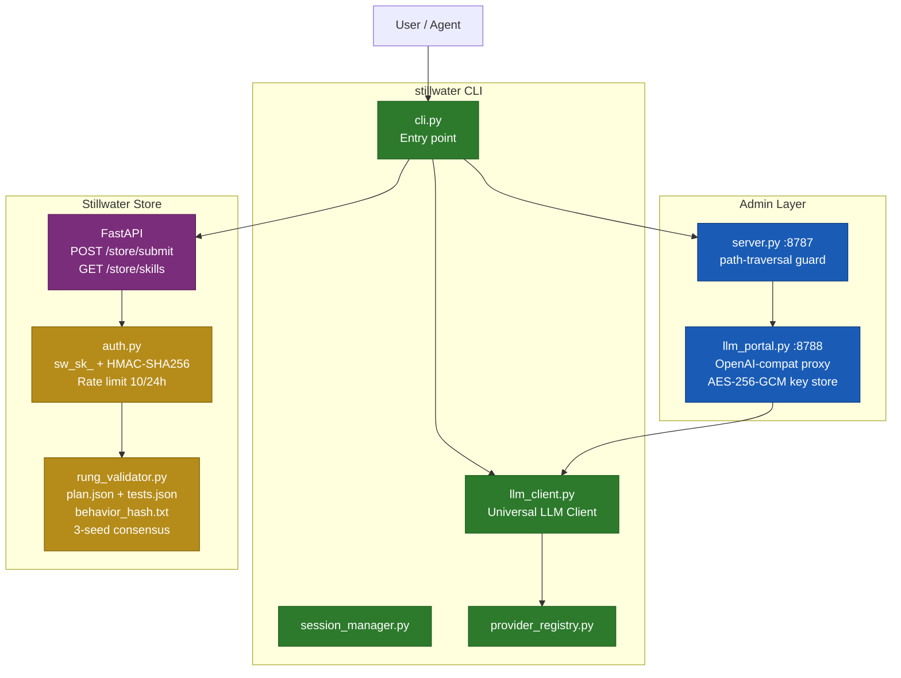
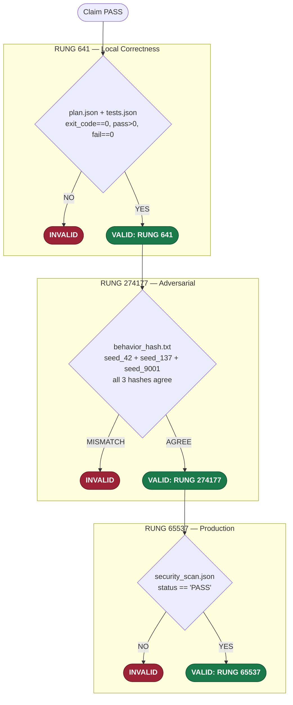
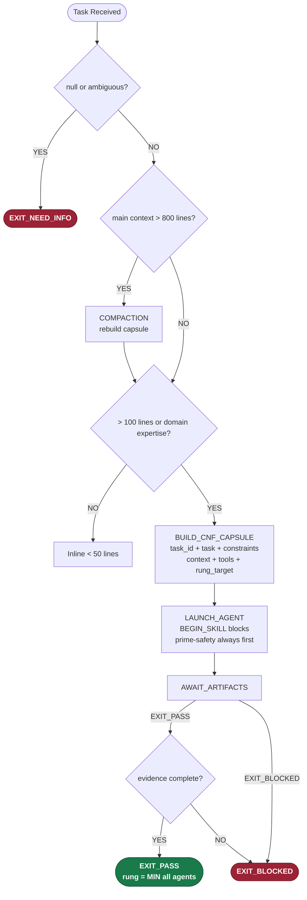
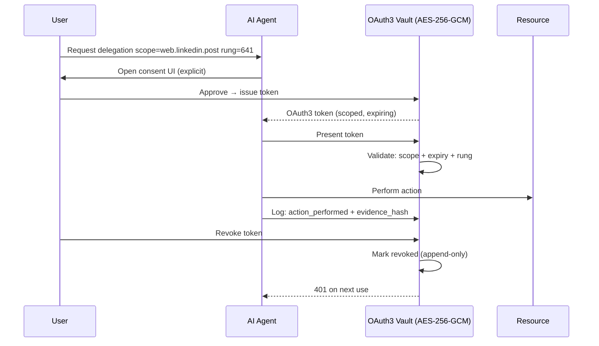
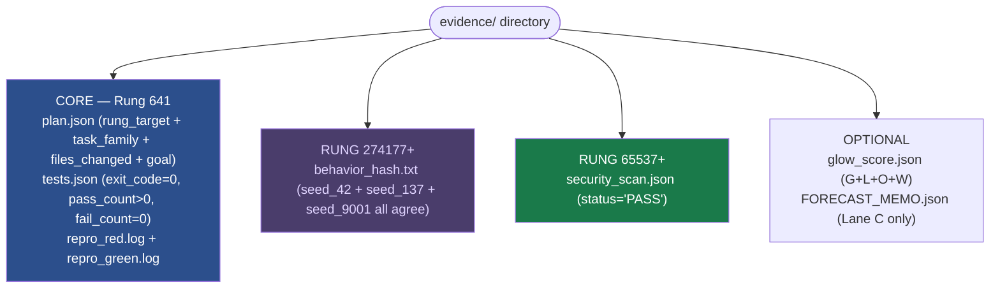

# Stillwater Diagrams — Index

**Sources:** 48 files across 6 subdirs, ~510 KB
**Purpose:** Mermaid diagrams for every major Stillwater subsystem. Each file is the authoritative visual specification for its subsystem — diagrams are written from source code, not from memory.

---

## Directory Structure

```
data/default/diagrams/
├── cli/           (3 files) — Triple-twin architecture, latency model, orchestration
├── compliance/    (1 file)  — FDA 21 CFR Part 11 audit logging, ALCOA+ chain
├── dev/           (1 file)  — FSM-to-test pipeline (red-green gate discipline)
├── eq/            (4 files) — EQ skill: interaction flow, NUT Job FSM, smalltalk DB, twin orchestration
├── stillwater/    (39 files)— Core subsystems (numbered 01–70, gaps are planned)
└── use-cases/     (1 file)  — Email triage (Summer Yue incident analysis, 7 guardrails)
```

---

## File Index

### cli/
| File | Shows |
|------|-------|
| `cli-triple-twin-architecture.md` | Full triple-twin fork: CPU Twin (L1 <300ms), Intent Twin (L2 300ms-1s), LLM Twin (L3 1-5s), Merge Layer |
| `cli-triple-twin-latency-model.md` | Latency breakdown and merge-mode selection rules |
| `cli-twin-orchestration-v2.md` | Twin orchestration v2 state machine |

### compliance/
| File | Shows |
|------|-------|
| `audit-logging-architecture.md` | FDA 21 CFR Part 11 compliance matrix, ALCOA+ field mapping, SHA-256 hash chain mechanics |

### dev/
| File | Shows |
|------|-------|
| `phuc-unit-test-dev-flow.md` | Mermaid FSM → pytest scaffolding → red gate → green gate → coverage → evidence seal |

### eq/
| File | Shows |
|------|-------|
| `eq-interaction-flow.md` | Five-Frame Triangulation, NUT Job trigger, smalltalk injection, warmth/competence calibration |
| `eq-nut-job-fsm.md` | NUT Job FSM: NAME → VALIDATE → UNDERSTAND (Low/High Road) → TRANSFORM |
| `eq-smalltalk-db-flow.md` | Category select, freshness check (>90d FLAG_FOR_REVIEW), personalization injection |
| `eq-twin-orchestration.md` | EQ twin dispatch within the triple-twin system |

### stillwater/ (key files)
| File | Shows |
|------|-------|
| `01-system-architecture.md` | All major components: CLI, Admin, Store, Skills/Swarms, Evidence, LLM Providers |
| `02-project-ecosystem.md` | 9-project map (OSS/private/paid), data flow, avatar system convergence |
| `03-cli-command-flow.md` | All 22 CLI subcommands, LLM provider selection chain, skill directory resolution |
| `04-store-data-model.md` | 8 Pydantic models, validator constraints (rung must be 641/274177/65537, kebab-case) |
| `05-store-operations.md` | Full submission lifecycle: auth → rate limit → rung validation → create → review |
| `06-auth-flow.md` | Key format `sw_sk_<32hex>`, HMAC-SHA256, rate limit 10/24h, reputation ±1.0/0.5 |
| `07-verification-ladder.md` | 3-tier rung ladder: 641/274177/65537, all fail-closed rules, belt mapping |
| `08-qa-pipeline.md` | CoVe decoupled QA (3 pillars: Questions, Tests, Diagrams), unified gap report |
| `09-glow-scoring.md` | GLOW G/L/O/W dimensions (0–25 each), belt progression, anti-patterns |
| `10-swarm-dispatch.md` | Main session state machine, 12-agent dispatch matrix, CNF capsule format, 8 forbidden states |
| `11-persona-engine.md` | 50+ persona registry, task→persona mapping, layering rule (prime-safety > prime-coder > persona) |
| `12-skill-lifecycle.md` | Skill file format, discovery, deduplication, loading order |
| `13-session-management.md` | Session TTL=86400s, skill packs, context lifecycle |
| `14-evidence-bundle.md` | All required files per rung, production sequence, Lane A/B/C classification |
| `15-llm-portal.md` | LLM Portal (port 8788), 5 providers + offline, provider priority chain, AES-256-GCM key store |
| `16-admin-server.md` | Admin server (port 8787), path-traversal guard, CLI allowlist |
| `17-northstar-reverse.md` | Reverse cascade from northstar to daily tasks |
| `18-user-journey.md` | User journey: White Belt → Black Belt |
| `19-content-syndication.md` | Content pipeline from phucnet to solaceagi.com |
| `20-oauth3-flow.md` | OAuth3 token lifecycle, scope hierarchy, vault architecture, FDA Part 11, OAuth2 comparison |
| `22-deployment.md` | Local dev setup, Admin services startup, Dev→QA→Prod pipeline, solaceagi.com cloud arch |
| `23-service-registry.md` | Service port registry (8787–8794) |
| `24-service-mesh.md` | Inter-service call graph and topology |
| `25-service-types.md` | Service classification and roles |
| `26-prime-mermaid-vs-json.md` | When to use prime-mermaid format vs plain JSON |
| `27-portal-architecture.md` | Portal mechanics for LEAK knowledge exchange |
| `28-wish-skill-recipe-triangle.md` | Triangle model, 7 vertex failure modes, 5-question completeness check, combos as pre-validated triangles |
| `29-three-pillars-lek-leak-lec.md` | LEK × LEAK × LEC = Mastery; Bruce Lee mapping; Trinity Equation; LEC lifecycle FSM |
| `30-reverse-cascade-full.md` | Full reverse cascade from Black Belt to White Belt |
| `31-openclaw-coverage-matrix.md` | Stillwater vs OpenClaw feature parity matrix |
| `32-seed-label-consistency.md` | 3-seed consensus protocol details |
| `33-persona-combo-mapping.md` | Persona × combo cross-reference |
| `56-service-error-recovery.md` | Error recovery patterns per service |
| `57-security-enforcement.md` | 8-service security matrix: L0–L3 auth layers, attack surface, OAuth3 enforcement chain (G1–G4), S2S gap |
| `58-cross-service-integration.md` | Cross-service call contracts |
| `59-operational-runbook.md` | Operational runbook for service management |
| `60-orchestration-service.md` | Orchestration service architecture |
| `61-solace-browser-openclaw-parity.md` | solace-browser vs OpenClaw feature parity |
| `70-self-service-architecture.md` | 4 deployment modes (cloud/local/hybrid A/hybrid B), tier gates, tunnel architecture |

### use-cases/
| File | Shows |
|------|-------|
| `email-triage.md` | End-to-end email triage: OAuth3 scope model, budget system, 7 guardrails (Summer Yue incident), classification pipeline, ALCOA+ mapping |

---

## Color Coding (Canonical)

All diagrams use a consistent 5-class palette:

| Class | Color | Meaning |
|-------|-------|---------|
| `active` | Green `#2d7a2d` | Running CLI components, PASS states |
| `portal` | Blue `#1a5cb5` | Admin/portal layer, orchestration nodes |
| `gate` | Gold `#b58c1a` | Validation gates, rung checks, constraints |
| `store` | Purple `#7a2d7a` | Store API, evidence, persistence |
| `external` | Dark gray `#4a4a4a` | External APIs and LLM providers |

For security diagrams (57+):

| Class | Color | Meaning |
|-------|-------|---------|
| `secure` | Light green `#e6ffe6` | Properly secured endpoints |
| `vulnerable` | Light red `#ffefef` | Known gaps / unprotected |
| `warn` | Light yellow `#fff8e6` | Conditional or partial protection |

For swarm/orchestration diagrams (10, 14, 29):

| Class | Color | Meaning |
|-------|-------|---------|
| `passNode` | Dark green `#1a7a4a` | PASS / EXIT_PASS outcomes |
| `blockedNode` | Dark red `#9b2335` | BLOCKED / INVALID outcomes |
| `gateNode` | Navy `#2c4f8c` | Gate decision nodes |
| `cnfNode` | Dark navy `#1e2d40` | CNF capsule / sub-agent nodes |

---

## Key Mermaid: System Architecture (01)



---

## Key Mermaid: Verification Ladder (07)



---

## Key Mermaid: Swarm Dispatch (10)



---

## Key Mermaid: OAuth3 Token Lifecycle (20)



---

## Key Mermaid: Evidence Bundle (14)


