# CLI Twin Orchestration v2 — CPU-LLM Feedback Loop Architecture

**Purpose:** Shows the CPU-LLM twin pattern where CPU makes fast heuristic decisions, LLM validates/overrides/augments, and feedback loops teach CPU to improve.

**Design:** Three phases (Small Talk, Intent, Execution), each with CPU first-pass + LLM validation, with self-improvement learning for CPU.

**User Experience:** Immediate CPU response (< 50ms), LLM refinement if context matters, emergent system that learns from every interaction.

---

## Architecture Diagram


---

## Webservice Hit Timeline

```mermaid
gantt
    title CPU-LLM Twin: Webservice Hit Timeline
    dateFormat X
    axisFormat %L ms

    section Phase 1: Small Talk
    CPU algorithm (local)           : active, p1c, 0, 50
    LLM validator (Portal haiku)    : active, p1l, 50, 300
    Feedback: learn emotion keywords: crit, p1f, 350, 10
    Emit warm token                 : milestone, p1e, 360, 0

    section Phase 2: Intent
    CPU keyword lookup (local)      : active, p2c, 0, 1
    LLM validator (Portal haiku)    : active, p2l, 1, 300
    Feedback: learn new keywords    : crit, p2f, 301, 10
    Emit intent token               : milestone, p2e, 311, 0

    section Phase 3: Execution
    CPU combo lookup (local)        : active, p3c, 0, 1
    LLM validator (Portal haiku)    : active, p3l, 1, 300
    Feedback: learn new combo       : crit, p3f, 301, 10
    Emit execution token            : milestone, p3e, 311, 0
    Dispatch to agent (Portal)      : active, p3a, 311, 3000
    Agent execution                 : active, p3x, 3311, 1000
    Emit final response             : milestone, p3r, 4311, 0

    section User Perception
    See warm response               : crit, up1, 360, 0
    See intent confirmation         : crit, up2, 311, 0
    See final answer                : crit, up3, 4311, 0
```

---

## Phase Details

### Phase 1: Small Talk Twin (CPU → LLM Validation)

```yaml
CPU Layer (< 50ms):
  Algorithm:
    - Detect user emotional state (keywords, session history)
    - Look up warm response templates (greeting, joke, sympathy, celebration)
    - Inject user name + project context
    - Generate warm_token

LLM Validator (Haiku, < 300ms):
  Input: warm_token + full prompt + session context
  Decision:
    - OVERRIDE: "CPU said joke about cats, but user's cat died"
              → Replace with sympathy
    - AUGMENT:  "CPU said 'congrats', but missing engagement details"
              → Enhance with context-specific details
    - CONFIRM:  "CPU response matches prompt context perfectly"
              → Use CPU response as-is

Feedback Loop:
  Store in CPU database: (emotion_keywords → response_type)
  Example: ("death", "lost", "passed away") → suppress_humor, show_sympathy
  Next time: CPU directly recognizes death keywords → proactively suppress humor
```

**Example Interaction:**
```
User: "I just lost my best friend... my cat 🐱"

CPU (< 50ms):
  Keywords detected: "cat", "best friend"
  → Returns: "Ha! Why did the cat sit on the laptop? 😹"

LLM (300ms, reads full context):
  Sees: "lost my best friend" + "cat" + "died"
  Decision: OVERRIDE this is inappropriate
  → "I'm deeply sorry about your loss. Your cat sounds like they were special. 💙"

CPU Learns:
  Add: death_keywords → {suppress_humor, show_sympathy, tone: compassionate}

Next time:
  User: "My cat passed away yesterday"
  CPU (< 50ms): Detects death_keywords → Directly returns compassionate response
  LLM: Confirms ✓ → No override needed
```

---

### Phase 2: Intent Twin (CPU Wish Match → LLM Validation)

```yaml
CPU Layer (< 1ms):
  Keyword Database: {"oauth": wish_id_41, "video_compress": wish_id_18, ...}
  Lookup: user_prompt_keywords → wish_id
  Output: wish_id OR null

LLM Validator (Haiku, < 300ms):
  If CPU returned wish_id:
    - CONFIRM: "Yes, this is the 'oauth-integration' wish"
             → Route to Phase 3 with wish_id
    - OVERRIDE: "No, they meant OAuth2, not OAuth3. Different wish."
              → Return correct wish_id

  If CPU returned null:
    - FIGURE OUT: "This is 'deterministic video compression' - novel request"
                → Create new wish + return intent details
                → Return: {intent, new_wish_id, create_cpu_entry: true}

Feedback Loop:
  Store in CPU database: (keywords → wish_id)
  Example: ("compress", "video", "deterministic") → wish_id_42
  Next time: CPU directly matches compressed video requests
```

**Example Interactions:**

```
Interaction 1 (CPU Hit):
User: "I need to implement OAuth3"

CPU (< 1ms):
  Keyword lookup: "oauth" → wish_id=41
  Return: {wish_id: 41, confidence: high}

LLM (300ms):
  Confirms: "Yes, OAuth integration wish. Correct!"

Result: Direct to Phase 3 ✓

---

Interaction 2 (CPU Miss):
User: "How do I compress video with deterministic output across all systems?"

CPU (< 1ms):
  Keyword lookup: "compress" "video" "deterministic" → No match
  Return: null

LLM (300ms):
  Figures out: "This is deterministic video compression - novel intent"
  Creates: wish_id=42, name="Deterministic Video Compression"
  Returns: {intent, wish_id: 42, create_cpu_entry: true}

CPU Learns:
  Add: ("compress", "video", "deterministic") → wish_id_42

Next time user mentions deterministic video → CPU directly matches it
```

---

### Phase 3: Execution Twin (CPU Combo Match → LLM Validation → Swarm Dispatch)

```yaml
CPU Layer (< 1ms):
  Combo Database: {wish_id_41: {swarm: "coder", recipe: ["prime-safety", "oauth3-enforcer"]}, ...}
  Lookup: wish_id → {swarm, recipe}
  Output: {swarm, recipe} OR null

LLM Validator (Haiku, < 300ms):
  If CPU returned combo:
    - CONFIRM: "Yes, run coder + prime-safety + oauth3-enforcer"
             → Dispatch to swarm
    - OVERRIDE: "No, this needs mathematician + prime-math. Different combo."
              → Return correct combo
              → Store new mapping

  If CPU returned null:
    - FIGURE OUT: "This needs mathematician + opus + prime-math skills"
                → Create new combo entry
                -> Return: {swarm, recipe, create_cpu_combo: true}

Feedback Loop:
  Store in CPU database: (wish_id → {swarm, recipe})
  Example: wish_id_42 → {swarm: "mathematician", recipe: ["prime-math", "prime-safety"]}
  Next time: CPU directly suggests mathematician for similar wishes
```

**Example Interactions:**

```
Interaction 1 (CPU Hit):
Phase 2 determined: wish_id=41 "oauth-integration"

CPU (< 1ms):
  Combo lookup: wish_id_41 → {swarm: "coder", recipe: ["prime-safety", "oauth3-enforcer"]}
  Return: combo found

LLM (300ms):
  Confirms: "Yes, coder + oauth3-enforcer is correct for OAuth integration"

Execution: Dispatch to Portal /v1/swarm/execute ✓

---

Interaction 2 (CPU Miss):
Phase 2 determined: wish_id=42 "Deterministic Video Compression" (novel)

CPU (< 1ms):
  Combo lookup: wish_id_42 → No match (new wish)
  Return: null

LLM (300ms):
  Figures out: "This is math problem + proof. Needs mathematician + prime-math + opus"
  Creates new combo mapping
  Returns: {swarm: "mathematician", recipe: ["prime-math", "prime-safety"], create_cpu_combo: true}

CPU Learns:
  Add: wish_id_42 → {swarm: "mathematician", recipe: ["prime-math", "prime-safety"]}

Execution: Dispatch to Portal /v1/swarm/execute with mathematician ✓

Next time: Similar deterministic compression request → CPU directly suggests mathematician
```

---

## Webservice Hits Summary

| Order | Phase | Endpoint | Timing | Input | Output | Purpose |
|-------|-------|----------|--------|-------|--------|---------|
| 1 | Small Talk | Portal v3 haiku | ~300ms | warm_token + prompt | override/augment/confirm | Validate CPU emotion detection |
| 2 | Intent | Portal v3 haiku | ~300ms | prompt + keywords | wish_id + feedback | Match wish OR figure out intent |
| 3 | Execution | Portal v3 haiku | ~300ms | wish_id | {swarm, recipe} + feedback | Match combo OR figure out swarm |
| 4 | Agent | Portal v3 swarm | 1-5s | prompt + skill_pack | answer + artifacts | Execute full task |

**Total Latency:**
- CPU only (95% of cases): < 50ms (immediate, no webservice)
- CPU + LLM validation (3 haiku calls): ~900ms + final answer
- User sees output: immediate warm response + intent + final answer

---

## Self-Improvement Mechanism

```mermaid
flowchart LR
    INTER["Interaction N"] --> CPU_DECIDE["CPU Makes Decision\n(keyword match)"]
    CPU_DECIDE --> LLM_VAL["LLM Validates\n(reads full context)"]

    LLM_VAL --> CHECK{CPU Decision\nCorrect?}
    CHECK -->|Yes| CONFIRM["Confirm\n(use CPU)"]
    CHECK -->|No| OVERRIDE["Override\n(LLM knows better)"]

    CONFIRM --> FEEDBACK["No feedback needed"]
    OVERRIDE --> LEARN["CPU LEARNS\nfrom override"]

    LEARN --> UPDATE["Update CPU database\n(add/refine pattern)"]
    UPDATE --> NEXT["Next Interaction N+1"]

    NEXT --> CPU_DECIDE2["CPU Makes Decision\n(now has new pattern!)"]
    CPU_DECIDE2 --> FASTER["✓ Faster\n✓ Fewer overrides\n✓ Better accuracy"]

    CONFIRM --> NEXT
    FASTER --> EMERGE["Emergent System:\nCPU + LLM\ntogetherget smarter"]
```



Over time: CPU absorbs LLM's intelligence → System converges to near-LLM quality at CPU speed.

---

## Key Differences from Current Portal Orchestrator

| Aspect | Current Portal | Twin Architecture |
|--------|---|---|
| **First Response Time** | 1-5s (LLM only) | <50ms (CPU) |
| **Self-Improvement** | None (static swarms) | Yes (CPU learns every interaction) |
| **CPU Knowledge** | Hardcoded swarms | Dynamic, grows from LLM feedback |
| **LLM Cost** | High (full context every time) | Low (small validation context) |
| **Cache Hit Rate** | Lower | Higher (CPU recognizes patterns) |
| **Scalability** | Add new swarm file | Emergent from interactions |
| **Feedback Loop** | No | Yes (LLM teaches CPU) |
| **User Experience** | Wait for full answer | Immediate CPU + refined by LLM |
| **Token Efficiency** | ~1000 tokens/request | ~5-10 tokens/request |

---

**Status:** Ready for implementation. Need:
1. CPU keyword databases (JSON or SQLite)
2. LLM validators at Portal (3 lightweight haiku endpoints)
3. Feedback mechanism to update CPU databases
4. Storage for learned patterns

