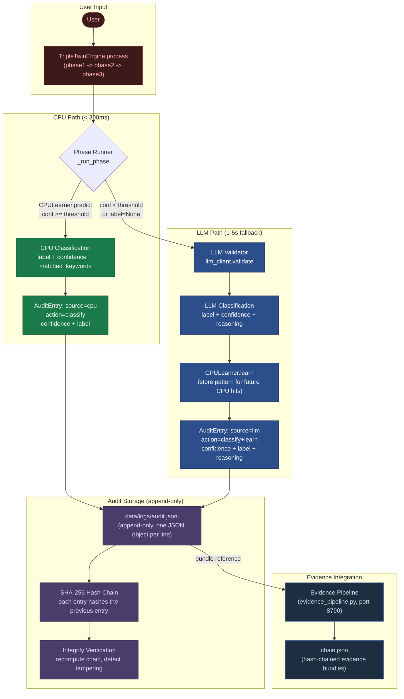
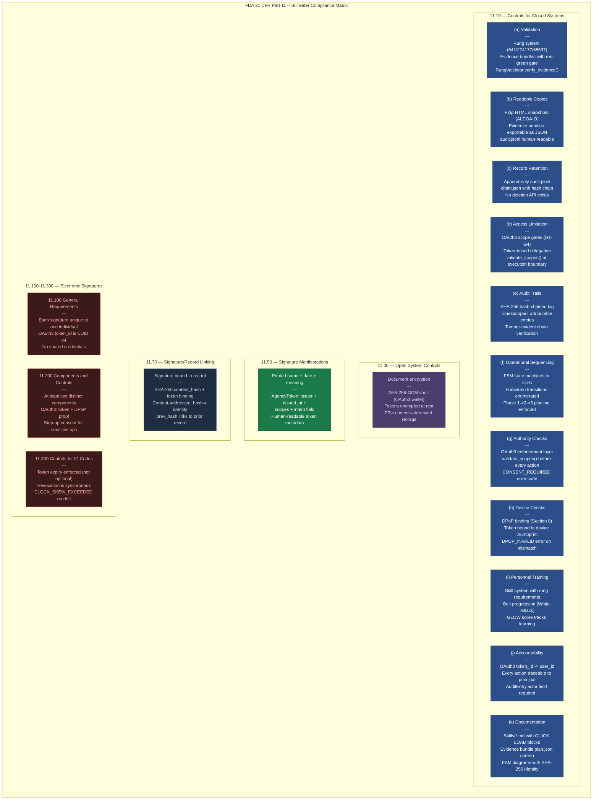
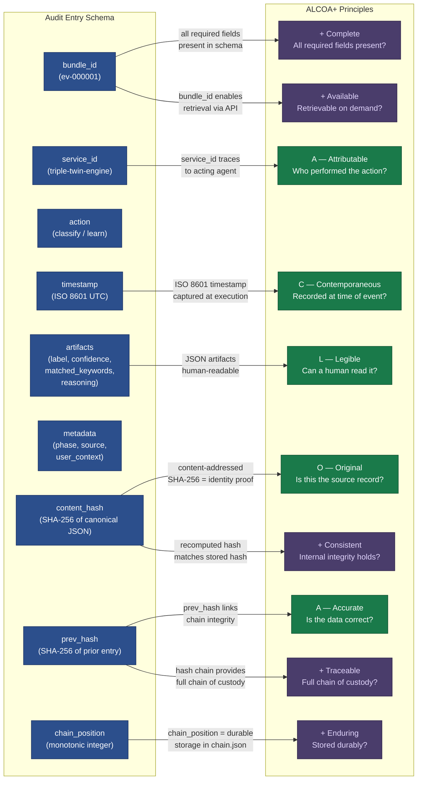

# Compliance Architecture — FDA Part 11 Audit Logging System

The Stillwater AI orchestration engine produces audit-grade evidence at every
decision point. The TripleTwinEngine processes user input through three phases
(Small Talk, Intent, Execution), each backed by a CPULearner that attempts local
classification before falling back to an LLM validator. Every classification
event -- whether handled by the CPU path or the LLM path -- is captured in a
SHA-256 hash-chained audit log that satisfies FDA 21 CFR Part 11 requirements
for electronic records and ALCOA+ data integrity principles.

This document contains four diagrams that describe the audit logging
architecture from data flow through regulatory mapping to cryptographic
integrity.

"Part 11 Architected means the compliance is the architecture, not a layer
on top of it."

---

## 1. Audit Trail Data Flow

The audit trail captures every classification decision made by the
TripleTwinEngine. When a user submits input, the engine forks through the
CPU path (CPULearner.predict) first. If the CPU learner's confidence exceeds
the phase threshold, the result is logged directly. If the CPU learner cannot
handle the input, the LLM validator is called, and both the LLM result and the
subsequent learning event are logged. All log entries flow into a single
append-only JSONL file with hash-chain integrity verification.

**Key takeaways:**

- Every classification decision is logged regardless of whether it was handled by the CPU path or the LLM path. There is no silent decision.
- The CPU path produces a lean audit entry (label + confidence + matched keywords). The LLM path produces a richer entry that also captures the reasoning string and the learning event.
- The audit log is append-only JSONL. Entries are never modified or deleted. Each entry carries a SHA-256 hash of the previous entry, forming a tamper-evident chain.
- The Evidence Pipeline service (port 8790) provides an API layer over the hash chain for programmatic ALCOA+ validation and bundle retrieval.

---

## 2. FDA 21 CFR Part 11 Compliance Matrix

The table below maps every subsection of FDA 21 CFR Part 11 to the
corresponding Stillwater architectural component. The mapping is not
approximate -- each requirement has a direct implementation in code or
protocol.

**Key takeaways:**

- Every subsection of Part 11 maps to an existing Stillwater component. There are no gaps that require new architecture.
- Section 11.10(e) (Audit Trails) is the load-bearing wall: the SHA-256 hash-chained log is the single source of truth for all compliance claims.
- Section 11.10(d) (Access Limitation) and 11.10(g) (Authority Checks) are both served by the OAuth3 enforcement layer, which calls validate_scopes() before every agent action.
- Electronic signature requirements (11.100-11.300) are satisfied by the OAuth3 token system: UUID v4 token IDs, DPoP binding for device authentication, step-up consent for sensitive operations, and synchronous revocation.

---

## 3. ALCOA+ Data Integrity Flow

ALCOA+ is the FDA's data integrity standard, extended from the original five
ALCOA principles (Attributable, Legible, Contemporaneous, Original, Accurate)
with four additional dimensions (Complete, Consistent, Enduring, Available) plus
Traceable. Each principle maps to a specific field or mechanism in the audit
entry schema. The Evidence Pipeline service (evidence_pipeline.py) validates
all nine dimensions programmatically via the /api/evidence/validate endpoint,
requiring a minimum score of 7/9 for compliance.

**Key takeaways:**

- Each ALCOA+ dimension maps to exactly one field or mechanism in the audit entry schema. The mapping is not approximate; it is enforced programmatically by the validate_alcoa endpoint.
- The five core ALCOA principles are structural: they are satisfied by the schema design itself (service_id for attribution, ISO 8601 for contemporaneousness, SHA-256 for originality).
- The four "plus" dimensions (Complete, Consistent, Enduring, Available) are validated at runtime: the Evidence Pipeline checks for missing fields, recomputes the content hash, verifies chain position, and confirms the bundle is retrievable.
- Traceable is the capstone: the prev_hash field links every entry to its predecessor, forming a complete chain of custody from genesis to the most recent entry.
- The compliance threshold is 7/9 dimensions. A bundle that fails on 3 or more dimensions is flagged as non-compliant.

---

## 4. Audit Entry Hash Chain

The hash chain is the tamper-evidence mechanism that makes the audit log
trustworthy under adversarial review. Each entry contains a content_hash
(SHA-256 of the canonical JSON representation of the entry's data fields) and a
prev_hash (the content_hash of the immediately preceding entry). The first entry
in the chain uses the sentinel string "genesis" as its prev_hash. To verify
integrity, a validator walks the chain from entry 0 to entry N, recomputing each
content_hash from the stored fields and confirming that each entry's prev_hash
matches the prior entry's content_hash. Any modification to any entry -- even a
single character -- breaks the chain at that point and all subsequent entries.

```mermaid
flowchart LR
    subgraph GENESIS["Genesis"]
        G_PREV["prev_hash: 'genesis'"]
        G_DATA["service_id + action +\ntimestamp + artifacts"]
        G_HASH["content_hash:\nSHA-256(canonical JSON)"]
        G_PREV --> G_DATA --> G_HASH
    end

    subgraph ENTRY1["Entry 1 (ev-000001)"]
        E1_PREV["prev_hash:\n= Genesis.content_hash"]
        E1_DATA["service_id + action +\ntimestamp + artifacts"]
        E1_HASH["content_hash:\nSHA-256(canonical JSON\nincluding prev_hash)"]
        E1_PREV --> E1_DATA --> E1_HASH
    end

    subgraph ENTRY2["Entry 2 (ev-000002)"]
        E2_PREV["prev_hash:\n= Entry1.content_hash"]
        E2_DATA["service_id + action +\ntimestamp + artifacts"]
        E2_HASH["content_hash:\nSHA-256(canonical JSON\nincluding prev_hash)"]
        E2_PREV --> E2_DATA --> E2_HASH
    end

    subgraph ENTRYN["Entry N (ev-00000N)"]
        EN_PREV["prev_hash:\n= Entry(N-1).content_hash"]
        EN_DATA["service_id + action +\ntimestamp + artifacts"]
        EN_HASH["content_hash:\nSHA-256(canonical JSON\nincluding prev_hash)"]
        EN_PREV --> EN_DATA --> EN_HASH
    end

    G_HASH -->|"SHA-256 link"| E1_PREV
    E1_HASH -->|"SHA-256 link"| E2_PREV
    E2_HASH -->|"..."| EN_PREV

    subgraph VERIFY["Integrity Verification"]
        direction TB
        V1["1. Load chain from chain.json"]
        V2["2. For each entry i (0..N):"]
        V3["   a. Recompute content_hash from\n      {service_id, action, timestamp,\n       artifacts, prev_hash}\n      using json.dumps(sort_keys=True)"]
        V4["   b. Assert recomputed ==\n      stored content_hash"]
        V5["   c. Assert entry[i].prev_hash ==\n      entry[i-1].content_hash\n      (or 'genesis' if i == 0)"]
        V6["3. Any mismatch =>\n   CHAIN BROKEN at position i\n   All entries >= i are suspect"]
        V1 --> V2 --> V3 --> V4 --> V5 --> V6
    end

    subgraph FIELDS["Audit Entry Fields"]
        direction TB
        FF1["bundle_id       — unique identifier (ev-NNNNNN)"]
        FF2["service_id      — acting service/agent identity"]
        FF3["action          — what was done (classify, learn, execute)"]
        FF4["timestamp       — ISO 8601 UTC, captured at execution time"]
        FF5["artifacts       — label, confidence, keywords, reasoning"]
        FF6["metadata        — phase, source (cpu/llm), user context"]
        FF7["content_hash    — SHA-256 of canonical JSON of data fields"]
        FF8["prev_hash       — content_hash of the previous entry"]
        FF9["chain_position  — monotonic integer (0, 1, 2, ...)"]
    end

    classDef genesisNode fill:#1a7a4a,color:#fff,stroke:#0f4f2f
    classDef entryNode fill:#2c4f8c,color:#fff,stroke:#1a3060
    classDef verifyNode fill:#4a3d6b,color:#e0d4ff,stroke:#2e2345
    classDef fieldNode fill:#1e2d40,color:#cdd9e5,stroke:#4a6fa5
    class G_PREV,G_DATA,G_HASH genesisNode
    class E1_PREV,E1_DATA,E1_HASH,E2_PREV,E2_DATA,E2_HASH,EN_PREV,EN_DATA,EN_HASH entryNode
    class V1,V2,V3,V4,V5,V6 verifyNode
    class FF1,FF2,FF3,FF4,FF5,FF6,FF7,FF8,FF9 fieldNode
```

**Key takeaways:**

- The hash chain uses SHA-256 with canonical JSON serialization (json.dumps with sort_keys=True). Canonical serialization eliminates key-ordering ambiguity that would produce different hashes for semantically identical data.
- The genesis entry uses the sentinel string "genesis" as its prev_hash, not a null value. This follows the Stillwater null-is-not-zero rule: null would be ambiguous, but "genesis" is an explicit, unambiguous sentinel.
- The prev_hash field is included in the content that is hashed to produce the content_hash. This means each entry's hash depends on the entire chain history before it. Modifying any entry breaks every subsequent hash in the chain.
- Verification is O(N) -- walk the full chain once. There is no shortcut. This is by design: an auditor must be able to verify the entire chain, not a sampled subset.
- The _compute_hash function in evidence_pipeline.py implements the canonical hashing: `json.dumps(data, sort_keys=True, default=str)` followed by SHA-256.

---

## Source Files

- `/home/phuc/projects/stillwater/src/cli/src/stillwater/triple_twin.py` -- `TripleTwinEngine`: the three-phase orchestration pipeline, `_run_phase()` CPU-first-then-LLM flow, `PhaseResult` data class (phase, handled_by, label, confidence)
- `/home/phuc/projects/stillwater/src/cli/src/stillwater/cpu_learner.py` -- `CPULearner`: predict(), learn(), can_handle(), confidence thresholds per phase (0.70/0.80/0.90), keyword extraction, JSONL serialization
- `/home/phuc/projects/stillwater/admin/services/evidence_pipeline.py` -- `EvidenceCapture`, `EvidenceBundle`, `ALCOAValidation`, `ALCOAResult` models; `_compute_hash()`, `capture_evidence()`, `validate_alcoa()` endpoints; SHA-256 hash chain management
- `/home/phuc/projects/stillwater/src/oauth3/enforcer.py` -- `OAuth3ErrorCode`, scope validation, DPoP binding, step-up consent, synchronous revocation
- `/home/phuc/projects/stillwater/papers/fda-part-11-architecture.md` -- Strategic paper mapping Part 11 requirements to Stillwater components, ALCOA principles, PZip storage economics, competitive moat analysis

## Coverage

- Full audit trail data flow from user input through CPU/LLM classification to hash-chained storage
- All 11 subsections of 21 CFR Part 11 Section 11.10 (closed system controls) mapped to Stillwater components
- Section 11.30 (open systems), 11.50 (signature manifestations), 11.70 (signature-record linking) mapped
- Sections 11.100, 11.200, 11.300 (electronic signature controls) mapped to OAuth3 token system
- All 10 ALCOA+ dimensions (A, L, C, O, A, Complete, Consistent, Enduring, Available, Traceable) mapped to specific audit entry fields
- Programmatic ALCOA+ validation via /api/evidence/validate endpoint (7/9 minimum threshold)
- Hash chain mechanics: genesis sentinel, canonical JSON serialization, SHA-256 linking, O(N) verification
- Evidence Pipeline service API: capture, chain retrieval, bundle lookup, ALCOA validation
- Integration with TripleTwinEngine phase pipeline and CPULearner confidence thresholds
