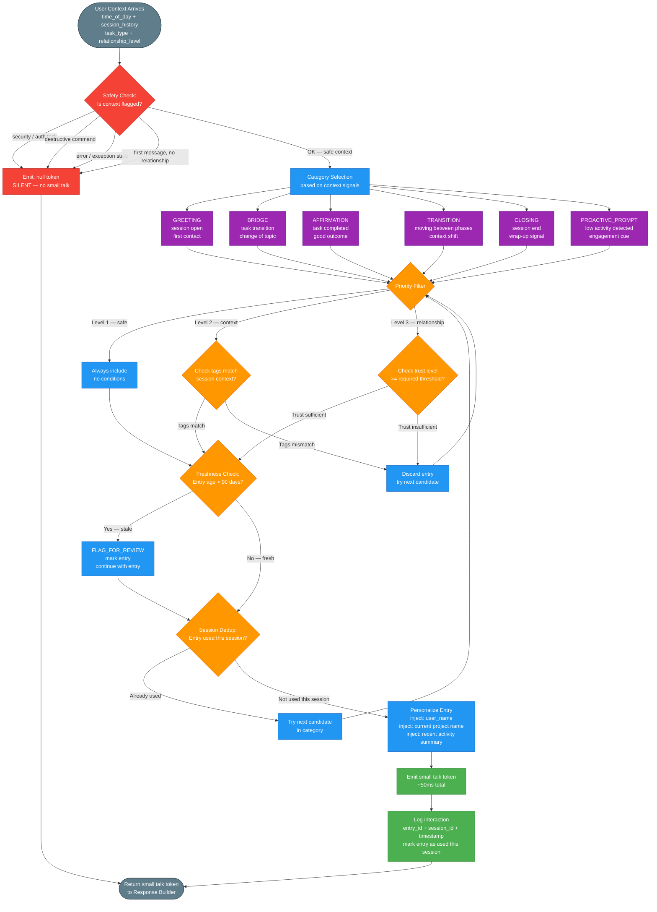

# EQ Smalltalk DB Flow

**Purpose:** Describes the complete small talk database pull pipeline, from context arrival through safety check, category selection, priority filtering, freshness check, personalization, and emission — with deduplication to prevent repeat entries within a session.
**Inputs:** User context (time of day, session history, task type, relationship level), session entry log
**Outputs:** Personalized small talk token (or null token if suppressed), interaction log entry
**Latency:** Full pipeline ~50ms (all local, no network); freshness check ~5ms; personalization ~10ms

---

## Notes

- **Safety check is the first and hardest gate.** It evaluates task_type and session_state before any DB query. In error states, the small talk system is entirely silent — injecting warmth during an error resolution would undermine trust and signal incompetence.
- **Category Selection** maps context signals to one of 6 categories. The mapping rules are: session_open → GREETING; task_completed → AFFIRMATION; topic_change → BRIDGE; phase_transition → TRANSITION; session_end → CLOSING; idle_detected → PROACTIVE_PROMPT. Multiple signals can apply; the highest-priority category wins.
- **Priority Levels** — Level 1 entries are generic, broadly safe, always usable. Level 2 entries require matching context tags (e.g., "python", "cli", "oauth3"). Level 3 entries require a relationship trust score above a threshold (e.g., >= 0.6 on a 0–1 scale).
- **FLAG_FOR_REVIEW** does not suppress the entry — the stale entry is still emitted with a flag in the log. A background maintenance task reviews flagged entries and either refreshes or retires them. This keeps the DB alive without blocking the real-time path.
- **Session Deduplication** operates on `entry_id` within `session_id` scope. Cross-session repeats are allowed; same-session repeats are not. This prevents the "parrot effect" where the agent says the same warm phrase twice in one conversation.
- **Personalization** is a template substitution step using the current session's user_name, project_name, and a one-sentence recent_activity summary. These are injected into placeholder slots in the entry text. If any slot is missing, the placeholder is removed cleanly (not left as a literal `{project_name}`).
- Entries that fail the candidate selection loop (all candidates in category discarded or used) result in a null token, same as the safety suppression path. The Response Builder treats null token as "no small talk prefix."
