# EQ Twin Orchestration — CPU + LLM Meta-Learning Architecture

**Purpose:** Shows the complete CPU + LLM Twin Orchestration architecture for Stillwater's small talk system. The CPU twin provides instant responses (<50ms); the LLM twin evaluates, predicts, and generates content in the background for the NEXT turn. Over multiple turns, CPU responses converge on perfection for the user's specific context.
**Inputs:** User message, session context, conversation history, previous LLM predictions (if any)
**Outputs:** WarmToken (instant response), LLM prediction bundle (saved for next turn), domain-specific content (saved for future turns)
**Latency:** CPU path: <50ms (queue hit <5ms, CPU fallback <50ms). LLM enrichment: 2-5s background (fire-and-forget, never blocks user).

---

## Diagram 1: Twin Orchestration Flow

```mermaid
stateDiagram-v2
    [*] --> USER_INPUT

    USER_INPUT : USER_INPUT\nUser sends message\n(Turn N)

    LOAD_PREDICTIONS : LOAD_PREDICTIONS\nLoad LLM predictions from Turn N-1\n(llm-predictions.jsonl)\nApply: domain filter, warmth delta,\nlevel recommendation, mode

    PHASE1_CLASSIFY : PHASE1_CLASSIFY\nCPU classifies input (<5ms)\nExtract tags from prompt + context\nDetect GLOW (emotional intensity)\nDetect register (formal/casual/energy)

    CONFIDENCE_CHECK : CONFIDENCE_CHECK\nEvaluate classification confidence\nand GLOW score

    QUEUE_CHECK : QUEUE_CHECK\nBanterQueueDB.get_next()\nCheck pre-computed banter (<5ms SLA)\nFilter by user_id + tags

    QUEUE_HIT : QUEUE_HIT\nQueue entry found\nmark_used(entry.id)\nSource: queue_hit

    HIGH_GLOW_RESPONSE : HIGH_GLOW_RESPONSE\nGLOW > 0.6\nKeyword + template generation\nCelebration / Struggle / Learning\nSource: cpu_glow

    LOW_GLOW_REPO : LOW_GLOW_REPO\nGLOW <= 0.6\nPull from deterministic repos:\n1. Joke (tagged, GLOW-filtered)\n2. Weather banter (rule-based)\n3. Tech fact (tagged)\n4. Hardcoded fallback (rotation)\nSource: cpu_repo

    GIFT_FALLBACK : GIFT_FALLBACK\nConfidence < 0.70 or unknown label\nServe gift: joke or fact\nAlternating: joke -> fact -> joke\nAlways include gentle redirect

    EMIT_RESPONSE : EMIT_RESPONSE\nEmit WarmToken to user\n(instant, <50ms total)\nIncludes: response, source,\nconfidence, latency_ms, glow_score

    LLM_DISPATCH : LLM_DISPATCH\nFire-and-forget to Haiku\nInput: user_text + cpu_label +\ncpu_response + conversation_context\n(last 5 turns)

    LLM_EVALUATE : LLM_EVALUATE\nQuality score of CPU response (1-5)\nOne-line rationale\nDomain detection with confidence\nDomain tags extraction

    LLM_GENERATE : LLM_GENERATE\nCheck domain content gaps\nGenerate 1-3 domain-specific:\njokes / facts / response templates\nQuality gate: self-score >= 3

    LLM_PREDICT : LLM_PREDICT\nNext-turn predictions:\nwarmth delta (+/- from current)\nVan Edwards level recommendation\ndomain filter for jokes/facts\nmode: normal/empathetic/energetic\ncompliment budget remaining\nover_watering_risk boolean

    SAVE_PREDICTIONS : SAVE_PREDICTIONS\nAppend to data/custom/smalltalk/:\nllm-predictions.jsonl (prediction bundle)\ndomain-content.jsonl (new content)\nAvailable from Turn N+1 onward

    CONVERGENCE_CHECK : CONVERGENCE_CHECK\n3+ turns in same domain?\nQuality scores trending up?\n3 consecutive scores >= 4 = converged\nConverged: reduce to every 3rd turn\nScore drops < 3: resume per-turn

    EXIT_SERVED : EXIT_SERVED\nUser received response\nLLM predictions saved for next turn\nTurn N complete

    EXIT_DEGRADED : EXIT_DEGRADED\nUser received CPU response\nLLM dispatch failed (network/timeout)\nSystem continues CPU-only\nNo user-visible impact

    USER_INPUT --> LOAD_PREDICTIONS
    LOAD_PREDICTIONS --> PHASE1_CLASSIFY
    PHASE1_CLASSIFY --> QUEUE_CHECK

    QUEUE_CHECK --> QUEUE_HIT : entry found\n(unused, not expired)
    QUEUE_CHECK --> CONFIDENCE_CHECK : queue empty

    CONFIDENCE_CHECK --> HIGH_GLOW_RESPONSE : GLOW > 0.6
    CONFIDENCE_CHECK --> LOW_GLOW_REPO : GLOW <= 0.6\nconfidence >= 0.70
    CONFIDENCE_CHECK --> GIFT_FALLBACK : confidence < 0.70\nor unknown label

    QUEUE_HIT --> EMIT_RESPONSE
    HIGH_GLOW_RESPONSE --> EMIT_RESPONSE
    LOW_GLOW_REPO --> EMIT_RESPONSE
    GIFT_FALLBACK --> EMIT_RESPONSE

    EMIT_RESPONSE --> LLM_DISPATCH : background\nfire-and-forget
    EMIT_RESPONSE --> EXIT_SERVED : response delivered

    LLM_DISPATCH --> LLM_EVALUATE : Haiku receives context
    LLM_DISPATCH --> EXIT_DEGRADED : dispatch fails\n(timeout/network)

    LLM_EVALUATE --> LLM_GENERATE : domain identified\nconfidence >= 0.5
    LLM_EVALUATE --> LLM_PREDICT : domain confidence < 0.5\nskip content generation

    LLM_GENERATE --> LLM_PREDICT : content generated\nor no gap found

    LLM_PREDICT --> SAVE_PREDICTIONS

    SAVE_PREDICTIONS --> CONVERGENCE_CHECK

    CONVERGENCE_CHECK --> EXIT_SERVED : predictions saved\nfor Turn N+1

    EXIT_SERVED --> [*]
    EXIT_DEGRADED --> [*]

    state FORBIDDEN_STATES {
        LLM_ON_CURRENT_TURN : LLM_ON_CURRENT_TURN\nLLM content served on\nsame turn it was produced\nBreaks <50ms guarantee
        PREDICTION_BLOCKING : PREDICTION_BLOCKING\nCPU waits for LLM\nprediction to complete\nCPU must NEVER block on LLM
        STALE_PREDICTION : STALE_PREDICTION\nPrediction from >5 turns ago\napplied to current turn\nExpired predictions are ignored
        OVER_WATERING_IGNORED : OVER_WATERING_IGNORED\nWarmth increased despite\nover_watering_risk = true\nPlant Watering Rule wins always
    }

    classDef forbidden fill:#f44336,color:#fff,stroke:#b71c1c,stroke-width:2px
    classDef cpu fill:#2196F3,color:#fff,stroke:#1565C0
    classDef llm fill:#9C27B0,color:#fff,stroke:#6A1B9A
    classDef emit fill:#4CAF50,color:#fff,stroke:#388E3C
    classDef exit fill:#4CAF50,color:#fff,stroke:#388E3C
    classDef io fill:#607D8B,color:#fff,stroke:#37474F
    classDef warning fill:#FF9800,color:#fff,stroke:#E65100

    class LLM_ON_CURRENT_TURN,PREDICTION_BLOCKING,STALE_PREDICTION,OVER_WATERING_IGNORED forbidden
    class PHASE1_CLASSIFY,QUEUE_CHECK,QUEUE_HIT,HIGH_GLOW_RESPONSE,LOW_GLOW_REPO,GIFT_FALLBACK,CONFIDENCE_CHECK cpu
    class LLM_DISPATCH,LLM_EVALUATE,LLM_GENERATE,LLM_PREDICT,SAVE_PREDICTIONS,CONVERGENCE_CHECK llm
    class EMIT_RESPONSE emit
    class EXIT_SERVED,EXIT_DEGRADED exit
    class USER_INPUT,LOAD_PREDICTIONS io
```



## Notes — Diagram 1

- **The CPU path and LLM path are fundamentally decoupled.** The user receives a response via the CPU path (queue hit, GLOW template, repo pull, or gift fallback) in under 50ms. The LLM path runs in parallel as fire-and-forget. If the LLM fails, the user is unaffected.
- **LOAD_PREDICTIONS is the bridge between turns.** At the start of each turn, the CPU loads the most recent LLM prediction from llm-predictions.jsonl. This prediction was saved during the previous turn's background LLM pass. It contains domain filters, warmth adjustments, and level recommendations that the CPU applies to improve response selection.
- **Queue check happens first, before any classification.** The BanterQueueDB contains pre-computed banter from background jobs, recipe banks, previous session notes, and LLM-generated content. A queue hit is the fastest path (<5ms) and provides the most contextual response.
- **GLOW (emotional intensity) determines the CPU fallback strategy.** High GLOW (>0.6) means the user is emotionally engaged (celebrating, frustrated, learning) and gets a keyword-matched template. Low GLOW gets a deterministic pull from joke/weather/fact repositories.
- **Gift fallback is the safety net for low-confidence classifications.** When the classifier is not sure (confidence < 0.70), the system serves a joke or fact with a gentle redirect to task work, rather than risking a mismatched response.
- **Forbidden states are architectural invariants.** LLM_ON_CURRENT_TURN is the most critical: if LLM output leaks into the current turn's response, the <50ms guarantee is broken. This is not a performance optimization — it is a correctness constraint.

---

## Diagram 2: Data Flow

```mermaid
flowchart TD
    subgraph DEFAULT["data/default/smalltalk/ (shipped, read-only)"]
        RESPONSES[responses.jsonl\n150 templates\nlabel + pattern + response\nlevel + warmth + confidence + tags]
        COMPLIMENTS[compliments.jsonl\n30 entries\ntrigger: task_completed / momentum / resilience\nwarmth score per entry]
        REMINDERS[reminders.jsonl\n15 templates\ntrigger: session_start / follow-through / progress\nrequires: template placeholders]
        CONFIG[config.jsonl\n13 settings\ncpu_first / llm_enrichment /\nmax_warmth_level / compliment_frequency /\nredirect_after_exchanges]
    end

    subgraph DEFAULT_REPOS["data/default/smalltalk/ (gift repos)"]
        JOKES_DEFAULT[jokes.json\nTagged by topic\nGLOW range filtered\nDeterministic selection]
        FACTS_DEFAULT[facts.json\nTagged by topic\nConfidence scored\nDeterministic selection]
    end

    subgraph INTERNAL["admin/orchestration/smalltalk/ (internal repos)"]
        JOKES_INTERNAL[jokes.jsonl\nDetailed entries with\nmin_glow + max_glow + tags\nAppend-only]
        FACTS_INTERNAL[tech_facts.jsonl\nDetailed entries with\ntags + confidence\nAppend-only]
    end

    subgraph CUSTOM["data/custom/smalltalk/ (LLM-generated, append-only)"]
        LLM_PREDICTIONS[llm-predictions.jsonl\nOne line per turn:\nquality_score + rationale\ndomain + domain_confidence\nnext_warmth_delta + next_level\nnext_domain_filter + next_mode\ncompliment_budget + over_watering_risk\nRotate at 10,000 lines]
        DOMAIN_CONTENT[domain-content.jsonl\nLLM-generated jokes/facts/responses\nTagged by domain + domain_tags\nQuality gate: self-score >= 3\nRotate at 10,000 lines]
        LLM_ENRICHMENT[llm-enrichment.jsonl\nBetter response templates\nfrom LLM evaluation\nMerged into PatternRepo at startup]
    end

    subgraph QUEUE["BanterQueueDB (SQLite)"]
        BANTER_QUEUE[banter_queue table\nPre-computed banter entries\nSources: job / recipe /\nprevious_session / llm_generated\nIndexed by user_id + used + expires_at]
    end

    subgraph CPU_TWIN["SmallTalkCPU (hot path, <50ms)"]
        CPU_ENGINE[SmallTalkCPU.generate\n1. Queue check (<5ms)\n2. GLOW detection\n3. Register detection\n4. Tag extraction\n5. Response selection]
    end

    subgraph LLM_TWIN["LLM Enricher (background, 2-5s)"]
        LLM_ENGINE[Haiku Predictor\n1. Quality evaluation (1-5)\n2. Domain detection\n3. Content generation\n4. Next-turn prediction\n5. Convergence check]
    end

    OUTPUT([WarmToken\nto caller])

    %% CPU reads from all default + custom sources
    RESPONSES -->|template lookup| CPU_ENGINE
    COMPLIMENTS -->|compliment selection| CPU_ENGINE
    REMINDERS -->|session start| CPU_ENGINE
    CONFIG -->|settings| CPU_ENGINE
    JOKES_DEFAULT -->|gift: joke| CPU_ENGINE
    FACTS_DEFAULT -->|gift: fact| CPU_ENGINE
    JOKES_INTERNAL -->|tagged jokes| CPU_ENGINE
    FACTS_INTERNAL -->|tagged facts| CPU_ENGINE
    LLM_PREDICTIONS -->|load previous\nprediction| CPU_ENGINE
    DOMAIN_CONTENT -->|domain-specific\ncontent| CPU_ENGINE
    LLM_ENRICHMENT -->|better templates| CPU_ENGINE
    BANTER_QUEUE -->|queue hit\n<5ms| CPU_ENGINE

    %% CPU emits response
    CPU_ENGINE -->|instant response| OUTPUT

    %% LLM writes to custom only
    LLM_ENGINE -->|quality + predictions| LLM_PREDICTIONS
    LLM_ENGINE -->|new domain content| DOMAIN_CONTENT
    LLM_ENGINE -->|better templates| LLM_ENRICHMENT
    LLM_ENGINE -->|generated banter| BANTER_QUEUE

    %% CPU feeds context to LLM
    CPU_ENGINE -.->|turn context\nfire-and-forget| LLM_ENGINE

    classDef default_data fill:#E3F2FD,color:#1565C0,stroke:#1565C0
    classDef custom_data fill:#F3E5F5,color:#6A1B9A,stroke:#6A1B9A
    classDef cpu fill:#E8F5E9,color:#2E7D32,stroke:#2E7D32
    classDef llm fill:#FFF3E0,color:#E65100,stroke:#E65100
    classDef queue fill:#FCE4EC,color:#C62828,stroke:#C62828
    classDef output fill:#4CAF50,color:#fff,stroke:#388E3C

    class RESPONSES,COMPLIMENTS,REMINDERS,CONFIG,JOKES_DEFAULT,FACTS_DEFAULT,JOKES_INTERNAL,FACTS_INTERNAL default_data
    class LLM_PREDICTIONS,DOMAIN_CONTENT,LLM_ENRICHMENT custom_data
    class CPU_ENGINE cpu
    class LLM_ENGINE llm
    class BANTER_QUEUE queue
    class OUTPUT output
```

## Notes — Diagram 2

- **Default data is shipped with Stillwater and is read-only.** The 150 response templates in responses.jsonl, 30 compliments, 15 reminders, jokes, and facts provide the base experience. These work without any LLM and without any network connectivity.
- **Custom data is LLM-generated and append-only.** The LLM enricher writes to data/custom/smalltalk/ after each turn. These files grow over time as the LLM detects new domains, generates domain-specific content, and produces predictions. Files are rotated at 10,000 lines to prevent unbounded growth.
- **The CPU reads from both default and custom sources.** At startup, the SmallTalkDB loads canonical patterns from default, then loads and merges learned patterns from custom. On the hot path, the CPU engine queries the in-memory PatternRepo (merged default+custom) with zero disk I/O.
- **The BanterQueueDB is SQLite-backed and persistent across sessions.** Queue entries come from four sources: background job completions, recipe banter banks, previous session notes, and LLM-generated banter. The queue is indexed by (user_id, used, expires_at) for <5ms lookup.
- **Data flow is asymmetric by design.** CPU reads from everything. LLM writes only to custom. This is the LEAK principle: the LLM teaches the CPU by enriching its database, and the CPU performs using that enriched database at native speed.

---

## Diagram 3: Meta-Learning Cycle

```mermaid
sequenceDiagram
    actor User
    participant CPU as SmallTalkCPU<br/>(< 50ms)
    participant DB as data/default +<br/>data/custom
    participant LLM as Haiku Enricher<br/>(background)
    participant Custom as data/custom/<br/>smalltalk/

    Note over User,Custom: TURN 1 — Generic Response (no predictions exist yet)

    User->>CPU: "I'm planning a trip to Greece!"
    CPU->>DB: Load predictions from previous turn
    Note over DB: No predictions exist<br/>(first turn)
    DB-->>CPU: null (no predictions)
    CPU->>DB: Query responses.jsonl + jokes + facts
    Note over CPU: GLOW = 0.4 (moderate)<br/>Tags: [travel]<br/>No travel-specific content<br/>in default DB
    CPU->>DB: Pull generic joke (no travel match)
    DB-->>CPU: "Why do programmers prefer dark mode?"
    CPU-->>User: Generic joke + redirect<br/>(source: cpu_repo, quality: ~3)

    CPU-)LLM: Fire-and-forget: {input, cpu_label, cpu_response, context}

    Note over LLM: Background evaluation
    LLM->>LLM: Quality score: 2/5<br/>"Generic programming joke<br/>for a travel conversation"
    LLM->>LLM: Domain: travel-greece<br/>Confidence: 0.92<br/>Tags: [travel, greece, vacation]
    LLM->>LLM: Content gap detected:<br/>No travel/greece jokes or facts
    LLM->>LLM: Generate:<br/>1. Greek philosophy joke<br/>2. Santorini fact<br/>Self-score: 4, 5
    LLM->>LLM: Predict next turn:<br/>warmth_delta: +1<br/>domain_filter: [travel, greece]<br/>level: 1, mode: warm
    LLM->>Custom: Save prediction bundle<br/>+ domain content

    Note over User,Custom: TURN 2 — Domain-Informed Response

    User->>CPU: "Thinking about island hopping!"
    CPU->>DB: Load predictions from Turn 1
    Note over DB: Prediction found:<br/>domain_filter: [travel, greece]<br/>warmth_delta: +1<br/>mode: warm
    DB-->>CPU: Apply domain filter + warmth adjustment
    CPU->>DB: Query with domain filter [travel, greece]
    Note over CPU: GLOW = 0.35<br/>Tags: [travel, greece, islands]<br/>Domain content NOW EXISTS<br/>from Turn 1 LLM generation
    DB-->>CPU: Santorini fact from domain-content.jsonl
    CPU-->>User: "Greece has 6,000+ islands but<br/>only 227 are inhabited. Santorini's<br/>white buildings reflect heat—<br/>the original passive cooling."<br/>(source: cpu_repo, quality: ~4)

    CPU-)LLM: Fire-and-forget: {input, cpu_label, cpu_response, context}

    Note over LLM: Background evaluation
    LLM->>LLM: Quality score: 4/5<br/>"Domain filter applied correctly.<br/>Relevant travel fact served."
    LLM->>LLM: Domain: travel-greece (stable)<br/>Tags expanded: [islands, santorini]
    LLM->>LLM: Generate 1 new joke<br/>about island hopping
    LLM->>LLM: Predict next turn:<br/>warmth_delta: 0 (holding steady)<br/>domain_filter: [travel, greece, islands]<br/>compliment_budget: 3
    LLM->>Custom: Save updated predictions<br/>+ new island content

    Note over User,Custom: TURN 3 — Near-Perfect Response (convergence)

    User->>CPU: "Should I visit Mykonos or Crete?"
    CPU->>DB: Load predictions from Turn 2
    Note over DB: Prediction found:<br/>domain_filter: [travel, greece, islands]<br/>warmth_delta: 0<br/>mode: warm
    DB-->>CPU: Apply filter + warmth
    CPU->>DB: Query with [travel, greece, islands]
    Note over CPU: GLOW = 0.3<br/>Tags: [travel, greece, islands, mykonos, crete]<br/>Multiple domain entries available<br/>Island hopping joke from Turn 2
    DB-->>CPU: Island hopping joke from domain-content.jsonl
    CPU-->>User: Perfectly matched travel humor<br/>+ context-aware redirect<br/>(source: cpu_repo, quality: ~5)

    CPU-)LLM: Fire-and-forget

    Note over LLM: Background evaluation
    LLM->>LLM: Quality score: 5/5<br/>"Perfect context match.<br/>Domain-specific, right warmth."
    LLM->>LLM: CONVERGENCE DETECTED<br/>3 consecutive scores: [2, 4, 5]<br/>Trend: improving<br/>Reduce frequency to every 3rd turn
    LLM->>Custom: Save convergence status<br/>prediction_frequency: every_3rd_turn

    Note over User,Custom: RESULT: CPU achieved LLM-quality<br/>at CPU speed within 3 turns.<br/>The student absorbed the teacher.
```



## Notes — Diagram 3

- **Turn 1 is always generic.** No predictions exist, no domain content exists. The CPU falls back to its shipped default database. The quality score will be low (2-3) because the response is not contextually relevant. This is expected and acceptable.
- **Turn 2 is the inflection point.** The CPU now has LLM predictions from Turn 1 (domain filter, warmth adjustment) AND LLM-generated domain content (travel-greece jokes and facts). The response quality jumps from 2-3 to 4 because the CPU is serving domain-specific content at CPU speed.
- **Turn 3 achieves convergence.** The content library for this domain is populated, the domain filter is refined, and the CPU consistently selects contextually perfect responses. The LLM detects 3 consecutive high-quality turns and reduces its prediction frequency to every 3rd turn, saving tokens.
- **The LLM is the teacher; the CPU is the student.** The LLM's 2-5 second evaluation time is invested BETWEEN turns, not during them. The CPU's <50ms response time is maintained on every turn. After convergence, the CPU has internalized the LLM's domain knowledge and operates independently.
- **Content generated on Turn N is NEVER served on Turn N.** It is only available from Turn N+1 onward. This architectural invariant preserves the <50ms latency guarantee. The LLM's value is in preparation, not interruption.

---

## Diagram 4: Compliment, Reminder, and Gift System

```mermaid
flowchart LR
    subgraph SESSION_START["Session Start"]
        SS_CHECK{Session just opened?}
        SS_CHECK -->|Yes| REMINDER_SELECT
        SS_CHECK -->|No| INTERACTION_PATH

        REMINDER_SELECT[Select reminder\nfrom reminders.jsonl\nTrigger: session_start]
        REMINDER_SELECT --> TEMPLATE_FILL
        TEMPLATE_FILL[Fill template placeholders:\nlast_task, open_tasks,\nbug_type, project_name]
        TEMPLATE_FILL --> REMINDER_GATE

        REMINDER_GATE{Template requires\nfilled?}
        REMINDER_GATE -->|All placeholders filled| EMIT_REMINDER[Emit reminder\nwarmth: 3-4\nOne per session start]
        REMINDER_GATE -->|Missing data| SKIP_REMINDER[Skip reminder\nFall through to\nnormal interaction]
    end

    subgraph INTERACTION_PATH["Per-Interaction Path"]
        INPUT([User message\narrives])

        INPUT --> CLASSIFY{Phase 1 Classify\n<5ms}

        CLASSIFY -->|label=task\nconf >= 0.70| TASK_ROUTE[Route to\nPhase 2/3\ntask pipeline]

        CLASSIFY -->|label=non-task\nconf >= 0.70| NONTASK_RESPONSE

        CLASSIFY -->|conf < 0.70\nor unknown| GIFT_PATH
    end

    subgraph NONTASK["Non-Task Response Selection"]
        NONTASK_RESPONSE[SmallTalkResponder\nMatch label in responses.jsonl]

        NONTASK_RESPONSE --> LEVEL_GATE

        LEVEL_GATE{Van Edwards\nThree Levels\nCheck}
        LEVEL_GATE -->|Level 1: Surface\nNew user / low trust\nwarmth 1-3| L1_POOL[Level 1 responses\nGeneric, safe\nAlways available]
        LEVEL_GATE -->|Level 2: Personal\nEstablished rapport\nwarmth 3-4| L2_POOL[Level 2 responses\nContext-aware\nDopamine questions\navailable]
        LEVEL_GATE -->|Level 3: Deep\nHigh trust only\nwarmth 4-5| L3_POOL[Level 3 responses\nPersonalized\nNever in first session\nRequires rapport >= 6]

        L1_POOL --> COMPLIMENT_CHECK
        L2_POOL --> COMPLIMENT_CHECK
        L3_POOL --> COMPLIMENT_CHECK
    end

    subgraph PLANT_WATER["Plant Watering Rule (Compliments)"]
        COMPLIMENT_CHECK{Task just completed\nor momentum detected?}

        COMPLIMENT_CHECK -->|No trigger| EMIT_SELECTED[Emit selected\nresponse template]

        COMPLIMENT_CHECK -->|Trigger detected| BUDGET_CHECK

        BUDGET_CHECK{Compliment budget\nthis session?\nmax 3 per session}
        BUDGET_CHECK -->|Budget remaining\n(count < 3)| OVERWATER_CHECK
        BUDGET_CHECK -->|Budget exhausted\n(count >= 3)| EMIT_SELECTED

        OVERWATER_CHECK{Last 2 responses\nhad warmth >= 4?}
        OVERWATER_CHECK -->|No\nSafe to water| SELECT_COMPLIMENT
        OVERWATER_CHECK -->|Yes\nOver-watering risk| COOL_DOWN[Cool down\nwarmth_delta = -1\nServe response only\nno compliment]

        SELECT_COMPLIMENT[Select compliment\nfrom compliments.jsonl\nMatch trigger type:\ntask_completed /\nmomentum / resilience]
        SELECT_COMPLIMENT --> DEDUP_CHECK

        DEDUP_CHECK{Already used\nthis session?}
        DEDUP_CHECK -->|Not used| EMIT_COMPLIMENT[Emit compliment\nDecrement budget\nLog entry_id +\nsession_id + timestamp]
        DEDUP_CHECK -->|Already used| NEXT_CANDIDATE[Try next\ncompliment\nin category]
        NEXT_CANDIDATE --> DEDUP_CHECK

        COOL_DOWN --> EMIT_SELECTED
    end

    subgraph GIFT["Gift System (Low Confidence Path)"]
        GIFT_PATH[Gift Fallback\nConf < 0.70 or unknown]

        GIFT_PATH --> GIFT_CYCLE

        GIFT_CYCLE{Gift alternation\ncycle}
        GIFT_CYCLE -->|Turn is odd\nor first gift| JOKE_PULL
        GIFT_CYCLE -->|Turn is even| FACT_PULL

        JOKE_PULL[Pull joke from\njokes.jsonl / jokes.json\nFilter by extracted tags\nFilter by GLOW range]
        FACT_PULL[Pull tech fact from\ntech_facts.jsonl / facts.json\nFilter by extracted tags]

        JOKE_PULL --> JOKE_FOUND{Joke found?}
        JOKE_FOUND -->|Yes| EMIT_GIFT
        JOKE_FOUND -->|No| WEATHER_CHECK

        WEATHER_CHECK{Weather context\navailable?}
        WEATHER_CHECK -->|Yes| WEATHER_BANTER[Generate weather banter\nRule-based, deterministic\ntemp/rain/snow/location]
        WEATHER_CHECK -->|No| FACT_PULL

        WEATHER_BANTER --> EMIT_GIFT

        FACT_PULL --> FACT_FOUND{Fact found?}
        FACT_FOUND -->|Yes| EMIT_GIFT
        FACT_FOUND -->|No| HARDCODED_FALLBACK[Rotate through\nhardcoded fallback list\n5 motivational strings\nDeterministic index]

        HARDCODED_FALLBACK --> EMIT_GIFT

        EMIT_GIFT[Emit gift +\ngentle redirect\nto task work]
    end

    subgraph REDIRECT["Redirect Gate"]
        EMIT_SELECTED --> REDIRECT_CHECK
        EMIT_COMPLIMENT --> REDIRECT_CHECK
        EMIT_GIFT --> REDIRECT_CHECK
        EMIT_REMINDER --> REDIRECT_CHECK

        REDIRECT_CHECK{Non-task exchanges\nthis session?}
        REDIRECT_CHECK -->|count < 2| EMIT_FINAL([Emit response\nto user])
        REDIRECT_CHECK -->|count >= 2| FORCE_REDIRECT[Append redirect:\n'What can I help\nyou build?'\nconfig: redirect_after_exchanges=2]
        FORCE_REDIRECT --> EMIT_FINAL
    end

    classDef trigger fill:#FF9800,color:#fff,stroke:#E65100
    classDef safe fill:#4CAF50,color:#fff,stroke:#388E3C
    classDef gate fill:#f44336,color:#fff,stroke:#b71c1c
    classDef action fill:#2196F3,color:#fff,stroke:#1565C0
    classDef gift fill:#9C27B0,color:#fff,stroke:#6A1B9A
    classDef io fill:#607D8B,color:#fff,stroke:#37474F
    classDef level fill:#00BCD4,color:#fff,stroke:#00838F

    class SS_CHECK,CLASSIFY,COMPLIMENT_CHECK,BUDGET_CHECK,OVERWATER_CHECK,DEDUP_CHECK,JOKE_FOUND,FACT_FOUND,WEATHER_CHECK,REDIRECT_CHECK,GIFT_CYCLE,REMINDER_GATE trigger
    class EMIT_SELECTED,EMIT_COMPLIMENT,EMIT_GIFT,EMIT_REMINDER,EMIT_FINAL safe
    class LEVEL_GATE,COOL_DOWN gate
    class NONTASK_RESPONSE,SELECT_COMPLIMENT,REMINDER_SELECT,TEMPLATE_FILL,TASK_ROUTE,FORCE_REDIRECT,NEXT_CANDIDATE action
    class GIFT_PATH,JOKE_PULL,FACT_PULL,WEATHER_BANTER,HARDCODED_FALLBACK gift
    class INPUT,OUTPUT io
    class L1_POOL,L2_POOL,L3_POOL level
```

## Notes — Diagram 4

- **Plant Watering Rule governs compliment frequency.** The maximum compliment budget is 3 per session (configurable via config.jsonl `compliment_frequency`). This prevents "over-watering" where excessive praise erodes its impact. The metaphor is deliberate: plants that are watered too frequently rot; users who are complimented excessively feel patronized.
- **Over-watering detection is a secondary gate.** Even if the compliment budget has remaining capacity, if the last 2 responses had warmth >= 4, the system detects over-watering risk and applies a warmth cooldown (warmth_delta = -1). This prevents warmth from ratcheting up indefinitely.
- **Reminders fire only at session start.** The reminder system (reminders.jsonl) checks at session open whether there is relevant context from the previous session (last_task, open_tasks, bug fixes, etc.). If template placeholders cannot be filled from session history, the reminder is skipped entirely rather than emitting a broken template.
- **Gift alternation is deterministic.** The joke/fact alternation follows a strict odd/even pattern: first gift is a joke, second is a fact, third is a joke, and so on. This prevents the system from serving five jokes in a row or five facts in a row. The fallback cascade is: joke -> weather banter -> tech fact -> hardcoded motivational string.
- **Van Edwards Three Levels gate response depth.** Level 1 (Surface) responses are safe for any user at any time. Level 2 (Personal) responses use context-awareness and dopamine questions and require established rapport. Level 3 (Deep) responses are personalized and intimate, requiring high trust (rapport >= 6) and are never available in the first session with a new user.
- **Redirect gate prevents infinite small talk.** After 2 consecutive non-task exchanges (configurable via config.jsonl `redirect_after_exchanges`), the system appends a gentle redirect to task work. This ensures the CLI remains a productivity tool and does not become a chatbot.
- **Session deduplication prevents the parrot effect.** Compliments and responses track their entry_id within the current session_id. The same compliment cannot be served twice in one session. Cross-session repeats are allowed since the user likely does not remember specific phrases from previous sessions.
