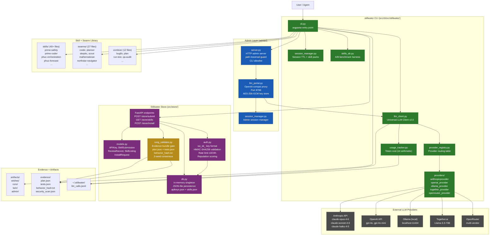

# Stillwater System Architecture

High-level view of all major components and their relationships within the
Stillwater OS. Stillwater is a Software 5.0 verification framework: skills,
swarms, evidence, and a governed store are first-class citizens.

## Source Files

- `src/cli/src/stillwater/cli.py` — main CLI entry point, command dispatch
- `src/cli/src/stillwater/llm_client.py` — universal LLM client, call logging
- `src/cli/src/stillwater/session_manager.py` — session lifecycle
- `src/cli/src/stillwater/usage_tracker.py` — cost tracking
- `src/cli/src/stillwater/skills_ab.py` — A/B benchmark harness
- `src/cli/src/stillwater/provider_registry.py` — provider routing table
- `src/cli/src/stillwater/providers/` — individual provider implementations
- `admin/server.py` — HTTP admin server with security guards
- `admin/llm_portal.py` — LLM portal, OpenAI-compat proxy
- `src/store/models.py` — Pydantic data models
- `src/store/db.py` — in-memory store with JSON persistence
- `src/store/auth.py` — API key generation, HMAC validation, rate limiting
- `src/store/rung_validator.py` — evidence bundle validation

## Coverage

- All major subsystems: CLI, Admin, Store, Skills, Swarms, Evidence
- LLM provider routing from CLI through provider registry to external APIs
- Store authentication and rung validation gates
- Call logging path to `~/.stillwater/llm_calls.jsonl`
- Color code: green = active CLI components, blue = portal/admin, yellow = gates, purple = store
