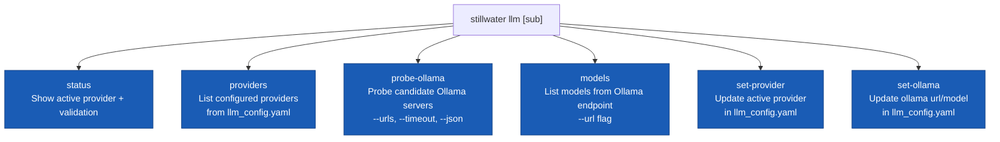
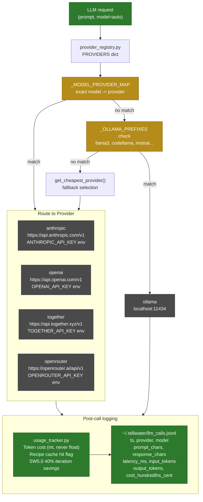
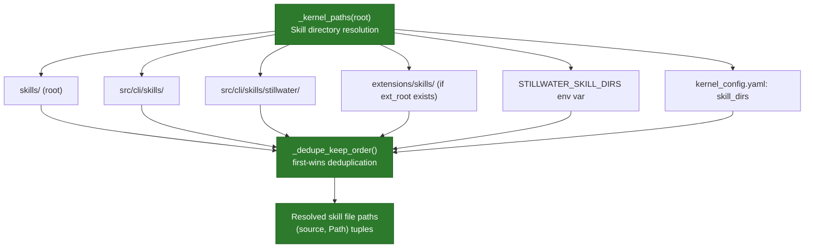

# CLI Command Flow

How the Stillwater CLI processes commands from entry point through dispatch to
execution. Based on the `main()` function in `cli.py`, which uses Python's
`argparse` with nested subparsers.

## Top-Level Command Dispatch

```mermaid
flowchart TD
    classDef cmd fill:#2d7a2d,color:#fff,stroke:#1a5c1a
    classDef sub fill:#1a5cb5,color:#fff,stroke:#0f3d80
    classDef gate fill:#b58c1a,color:#fff,stroke:#806000
    classDef io fill:#4a4a4a,color:#fff,stroke:#333

    ENTRY["stillwater [cmd]"]
    PARSER["argparse\nmain(argv)"]
    ROOT["_repo_root()\n4 parents up from cli.py"]

    ENTRY --> PARSER
    PARSER --> ROOT

    PARSER --> PATHS["paths\nPrint key repo paths\n--json flag"]
    PARSER --> PRINT["print\nPrint suggested next steps"]
    PARSER --> INIT["init\nScaffold project templates"]
    PARSER --> LLM["llm\nManage LLM providers"]
    PARSER --> TWIN["twin\nInteractive LLM REPL"]
    PARSER --> SKILLS["skills\nSkill inventory + install"]
    PARSER --> WISH["wish\nWish notebook workflow"]
    PARSER --> STACK["stack\nRun + verify stack workflows"]
    PARSER --> RECIPE["recipe\nRecipe governance"]
    PARSER --> BOOKS["books\nList/show markdown books"]
    PARSER --> PAPERS["papers\nList/show markdown papers"]
    PARSER --> MATH["math-universal\nMath proof workflow"]
    PARSER --> IMO["imo-phuc\nIMO benchmark"]
    PARSER --> IMO_HIST["imo-history\nIMO historical data"]
    PARSER --> OOLONG["oolong\nCounter-bypass workflow"]
    PARSER --> LEARN["learn\nExternalized learning loop"]
    PARSER --> CLEANUP["cleanup\nPhuc cleanup + archive"]
    PARSER --> REPLAY["replay\nReplay stack from manifest"]
    PARSER --> RUN["run\nRun task with skill context"]
    PARSER --> EVIDENCE["evidence\nEvidence dir management"]
    PARSER --> SKILLS_AB_CMD["skills-ab\nA/B benchmark harness"]
    PARSER --> DEMO["demo\nQuick demo (dry-run)"]

    class PATHS,PRINT,INIT,LLM,TWIN,SKILLS,WISH,STACK,RECIPE,BOOKS,PAPERS cmd
    class MATH,IMO,IMO_HIST,OOLONG,LEARN,CLEANUP,REPLAY,RUN,EVIDENCE,SKILLS_AB_CMD,DEMO cmd
```

## LLM Command Subflow

## LLM Provider Selection Flow

## Skills Load Flow

## Source Files

- `src/cli/src/stillwater/cli.py` — `main()` function, all `sub.add_parser()` calls (lines 5268–5822)
- `src/cli/src/stillwater/llm_client.py` — `LLMClient`, `_log_call()`, `get_call_history()`
- `src/cli/src/stillwater/provider_registry.py` — `PROVIDERS` dict, `_MODEL_PROVIDER_MAP`, `_OLLAMA_PREFIXES`
- `src/cli/src/stillwater/usage_tracker.py` — `SessionUsageTracker`, `SW5_ITERATION_REDUCTION_PCT=40`
- `src/cli/src/stillwater/session_manager.py` — `Session` dataclass, TTL=86400s
- `src/cli/src/stillwater/llm_cli_support.py` — Ollama probing helpers

## Coverage

- All top-level CLI commands extracted from `argparse` subparser definitions
- LLM subcommand breakdown (`status`, `providers`, `probe-ollama`, `models`, `set-provider`, `set-ollama`)
- LLM provider selection: model map lookup -> Ollama prefix match -> cheapest fallback
- Post-call logging: cost in integer hundredths-of-a-cent, JSONL call log
- Skill directory resolution with priority order and deduplication
