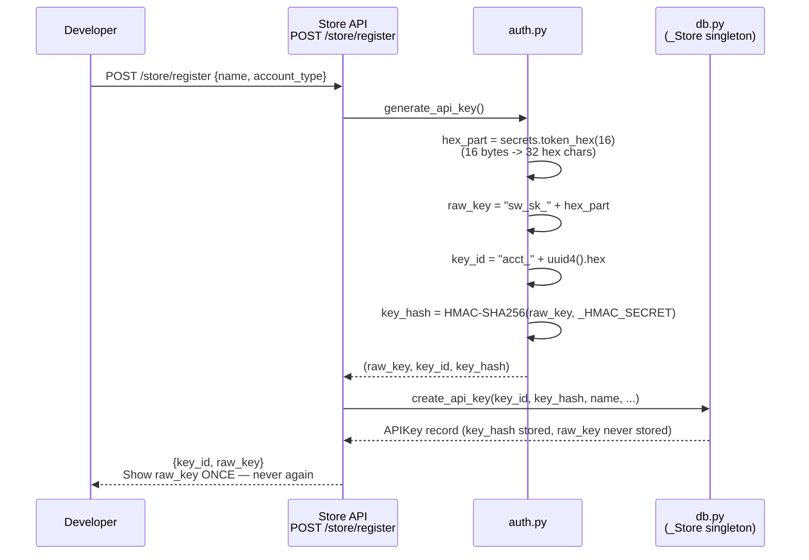
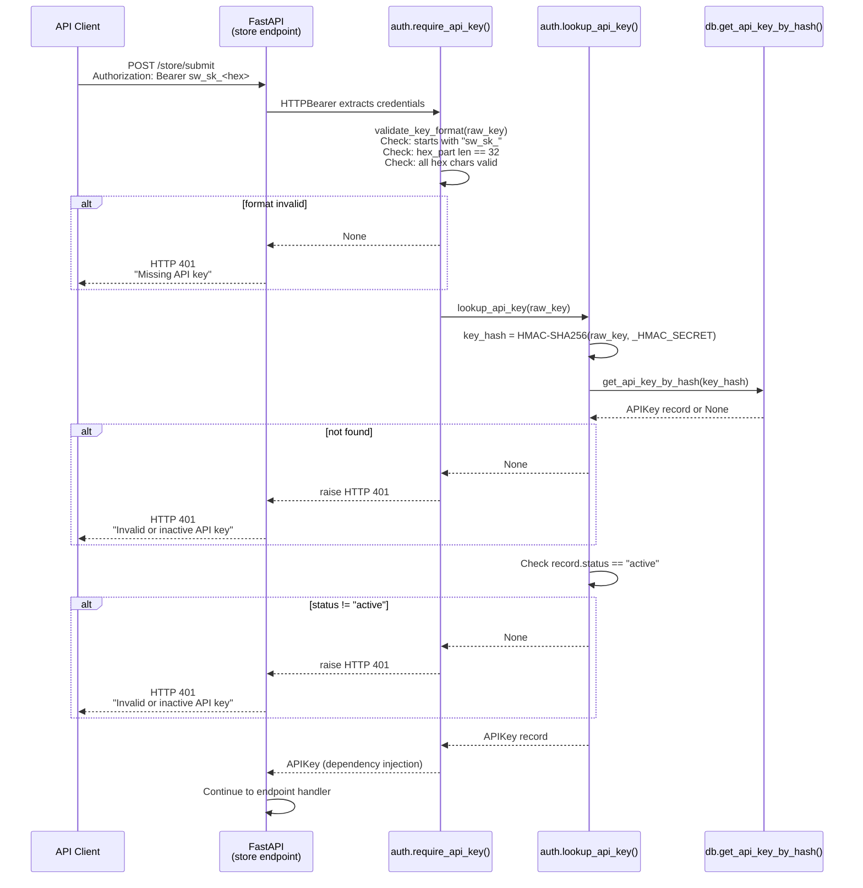
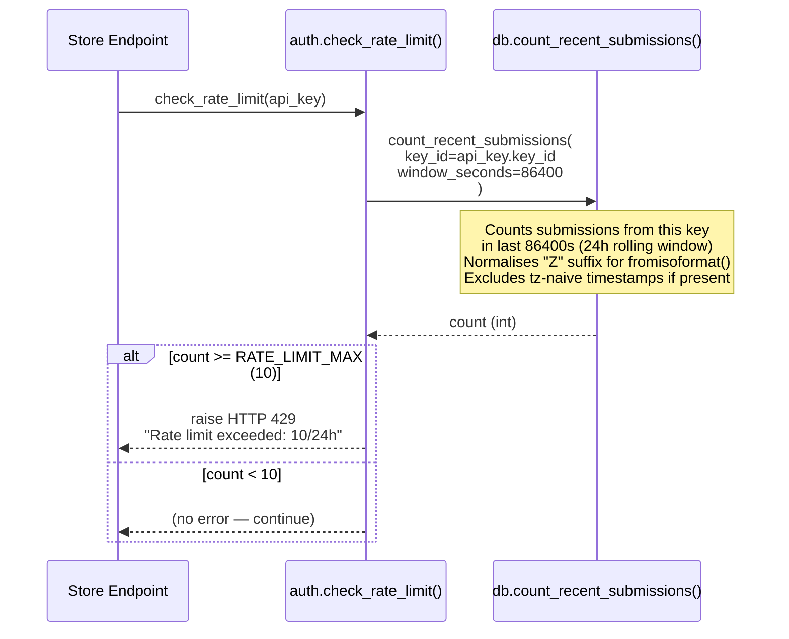
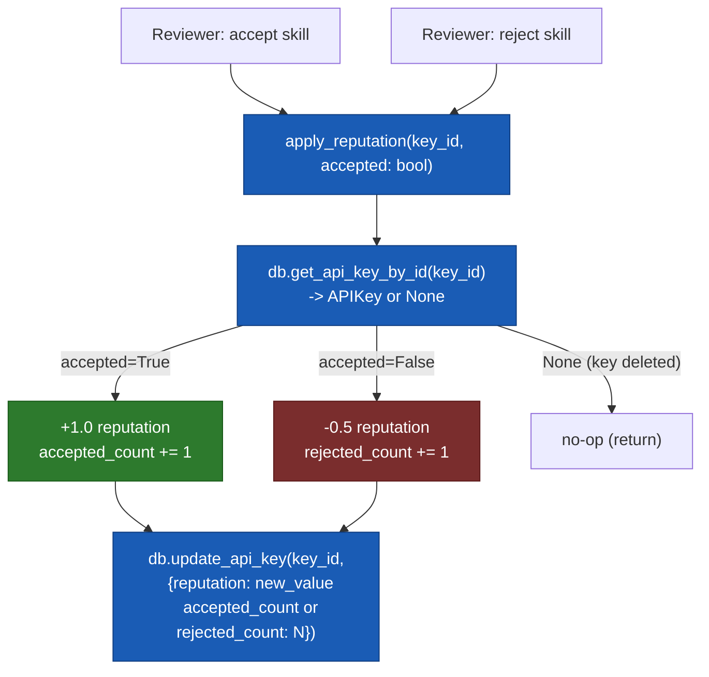
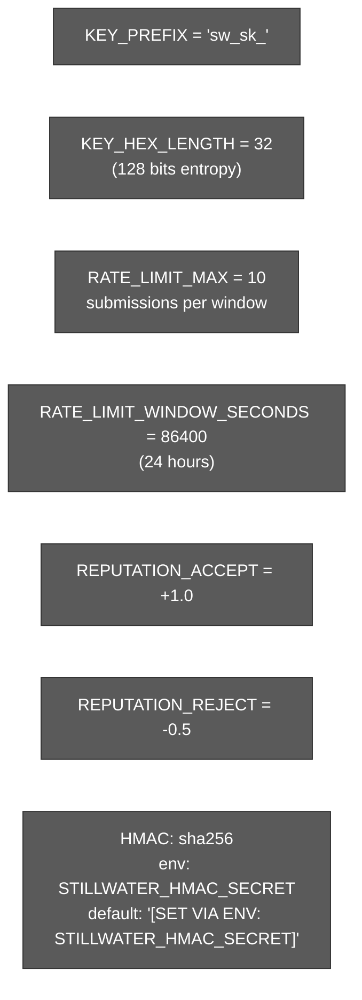

# Auth Flow

API key generation, validation, rate limiting, and reputation scoring for the
Stillwater Store. Based entirely on `src/store/auth.py`.

## Key Format

```
sw_sk_<32 hex chars>
       ^--- 128 bits of entropy (secrets.token_hex(16) -> 32 hex chars)

key_id:   acct_<uuid4 hex>   (stored in DB, returned to developer)
key_hash: HMAC-SHA256(raw_key, HMAC_SECRET)   (stored in DB, raw key never stored)

HMAC_SECRET: env STILLWATER_HMAC_SECRET
             default: "[SET VIA ENV: STILLWATER_HMAC_SECRET]" (override in production)
```

## Key Generation Flow



## Request Authentication Flow



## Rate Limiting Flow



## Reputation Scoring Flow



## Auth Constants Summary



## Source Files

- `src/store/auth.py` — `generate_api_key()`, `_hash_key()`, `validate_key_format()`, `lookup_api_key()`, `require_api_key()`, `check_rate_limit()`, `apply_reputation()` (lines 1-188)
- `src/store/db.py` — `get_api_key_by_hash()`, `count_recent_submissions()`, `update_api_key()`

## Coverage

- Key format: `sw_sk_<32hex>` with 128 bits entropy via `secrets.token_hex`
- HMAC-SHA256 hashing: raw key -> hash stored in DB, raw key never persisted
- Format validation: prefix check + length check + hex char check
- FastAPI dependency injection via `HTTPBearer` + `Security()`
- Rate limiting: rolling 24-hour window, max 10 submissions per key
- Reputation scoring: +1.0 on accept, -0.5 on reject
- All constants extracted directly from `auth.py` source
