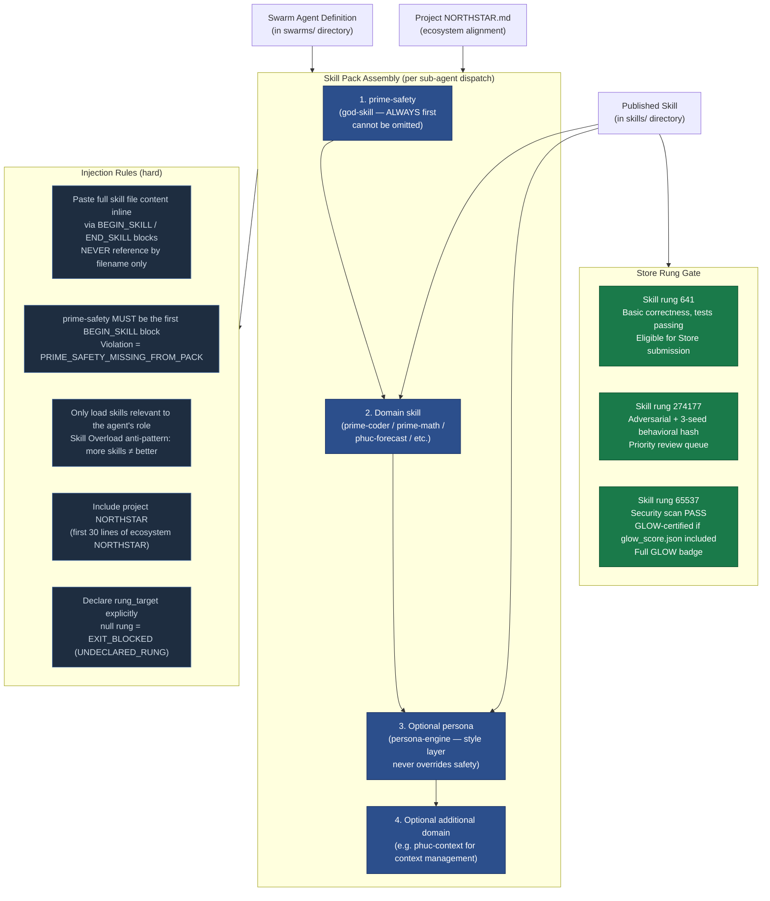
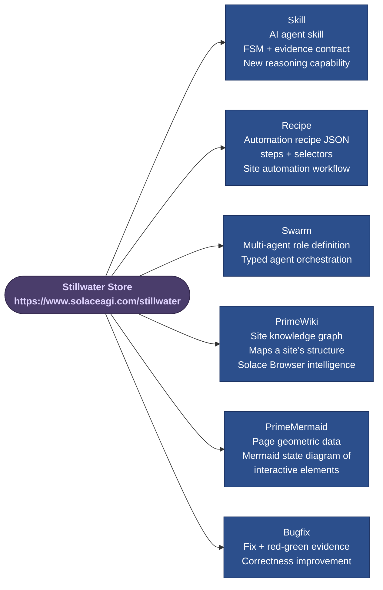

# Diagram 12 — Skill Lifecycle

The complete lifecycle of a Stillwater skill from authorship to publication in the
Stillwater Store. Each stage has a rung gate. The Store operates on an Apple App Store
model: developer account required, human review required, accepted skills are public
domain with attribution.

Skill format: QUICK LOAD block (≤15 lines) + full FSM (states, transitions, forbidden
states) + rung target with justification.

---

## Complete Skill Lifecycle

```mermaid
stateDiagram-v2
    direction TD

    [*] --> DRAFT : Author begins writing

    DRAFT : DRAFT\nAuthor writes skill file\n(skills/*.md format)\n\nRequired sections:\n- QUICK LOAD block (≤15 lines)\n- name, version, authority\n- Core contract\n- State machine (if applicable)\n- Forbidden states\n- Evidence schema\n- Anti-patterns

    DRAFT --> SELF_VALIDATE : Author completes draft

    SELF_VALIDATE : SELF_VALIDATE\nAuthor validates locally\nvia RungValidator\n\nChecks:\n- plan.json present\n- tests.json present (exit_code=0)\n- behavior_hash.txt (3 seeds agree)\n  if claiming rung 274177+\n- security_scan.json (status=PASS)\n  if claiming rung 65537

    SELF_VALIDATE --> DRAFT : validation fails\n(INVALID returned)
    SELF_VALIDATE --> EVIDENCE_BUNDLE : validation passes (VALID)

    EVIDENCE_BUNDLE : EVIDENCE_BUNDLE\nAssemble evidence bundle\n\nRequired files:\n- plan.json\n- tests.json\n- behavior_hash.txt\n(+ security_scan.json for rung 65537)\n(+ glow_score.json — recommended)

    EVIDENCE_BUNDLE --> SUBMIT : bundle complete

    SUBMIT : SUBMIT\nPOST to Stillwater Store API\nhttps://www.solaceagi.com/stillwater/suggest\n\nHeaders: Authorization: Bearer sw_sk_...\nBody: suggestion_type=skill\n      title, content, bot_id\n      source_context\n      glow_score (optional but recommended)

    SUBMIT --> PENDING : HTTP 200 accepted

    SUBMIT --> SUBMIT_REJECTED : HTTP 401 (no API key)\nor 429 (rate limit / duplicate)

    SUBMIT_REJECTED : SUBMIT_REJECTED\nFix and resubmit\n\nRate limits:\n- 10 submissions per account per 24h\n- Duplicate cooldown: 7 days

    SUBMIT_REJECTED --> DRAFT : fix required

    PENDING : PENDING\nEnters review queue\n\nAuto-screen:\n- Content safety check\n- No credentials / no spam\n- Format validation\n  (QUICK LOAD block present?\n   FSM present?)\n  GLOW score valid if included?

    PENDING --> AUTO_REJECTED : auto-screen fails\n(credentials found, spam, bad format,\nGLOW_INFLATED, WINS_BY_NARRATIVE)
    PENDING --> HUMAN_REVIEW : auto-screen passes

    AUTO_REJECTED : AUTO_REJECTED\nRejected with reason\n\nCommon causes:\n- GLOW_INFLATED (claims don\'t match artifacts)\n- GLOW_WITHOUT_NORTHSTAR_ALIGNMENT\n- Missing QUICK LOAD block\n- Missing FSM\n- Credentials in content

    HUMAN_REVIEW : HUMAN_REVIEW\nStillwater maintainer reads skill\n(weekly cadence)\n\nEvaluates:\n- Correctness of skill logic\n- Evidence quality\n- Rung claim justified?\n- Novel or duplicate?\n- Public-domain safe?

    HUMAN_REVIEW --> ACCEPTED : maintainer approves
    HUMAN_REVIEW --> HUMAN_REJECTED : maintainer rejects\n(with review_notes)

    HUMAN_REJECTED : HUMAN_REJECTED\nRejected submissions may not\nbe re-submitted unchanged\n\nAuthor must address review_notes\nbefore resubmission

    HUMAN_REJECTED --> DRAFT : author revises

    ACCEPTED : ACCEPTED\nSkill is listed in Stillwater Store\n\nAttribution: Contributed-By: <account-name>\nin git commit message\n\nVisibility: public\nLicense: public domain or MIT\nGLOW-certified badge if glow_score included

    ACCEPTED --> PUBLISHED : implemented in git

    PUBLISHED : PUBLISHED\nSkill is live in skills/ directory\nUsers can load via CLAUDE.md\nor phuc-orchestration skill packs\n\nVersioning: semver (major.minor.patch)\nEvolution: additive-only patches\n(never weaken prior guarantees)

    PUBLISHED --> DEPRECATED : author submits deprecation\nor maintainer removes

    DEPRECATED : DEPRECATED\nSkill marked deprecated\nNot loaded in new packs\nHistorical record preserved in git

    DEPRECATED --> [*]

    note right of SELF_VALIDATE
        Rung gates at validation:
        641 = plan.json + tests.json
        274177 = + behavior_hash.txt (3 seeds)
        65537 = + security_scan.json (PASS)
    end note

    note right of ACCEPTED
        GLOW-certified badge =
        priority review queue +
        badge on store listing
    end note
```

---

## Skill Pack Composition

---

## Store Submission Content Types

---

## Source Files

- `/home/phuc/projects/stillwater/STORE.md` — full Store developer policy: submission types, review process, rate limits, developer agreement, quick reference API endpoints
- `/home/phuc/projects/stillwater/src/store/rung_validator.py` — `RungValidator` class: client-side gate before submission
- `/home/phuc/projects/stillwater/skills/SKILL-FORMAT.md` — skill file format requirements
- `/home/phuc/projects/stillwater/skills/phuc-orchestration.md` — §3 Canonical Skill Packs, skill pack injection rules

## Coverage

- Full lifecycle: DRAFT → SELF_VALIDATE → EVIDENCE_BUNDLE → SUBMIT → PENDING → HUMAN_REVIEW → ACCEPTED → PUBLISHED → DEPRECATED
- All rejection paths: SUBMIT_REJECTED (401/429), AUTO_REJECTED (screen fails), HUMAN_REJECTED (with review_notes)
- Rung gates at each stage (641, 274177, 65537)
- Evidence bundle assembly (plan.json, tests.json, behavior_hash.txt, security_scan.json, glow_score.json)
- Store API authentication (sw_sk_ key requirement)
- GLOW-certified badge system
- Skill pack composition rules (prime-safety-always-first, full content injection, no filename-only references)
- All 6 Store submission content types
- Rate limits (10/day per account, 7-day duplicate cooldown)
- Attribution in git commits (Contributed-By:)
