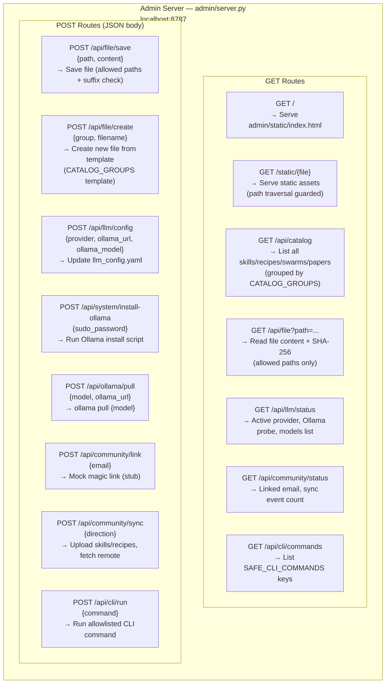
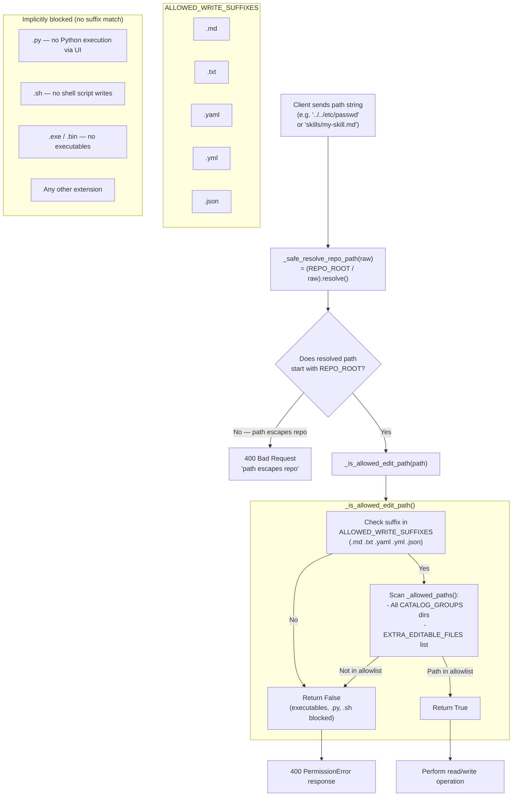
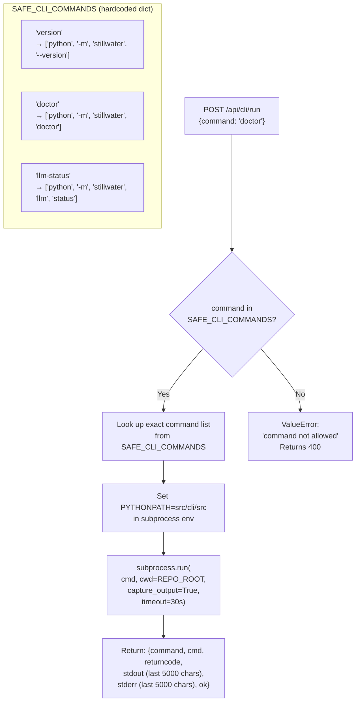
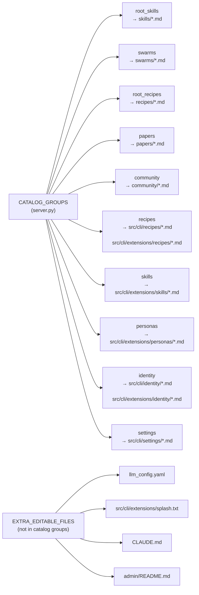
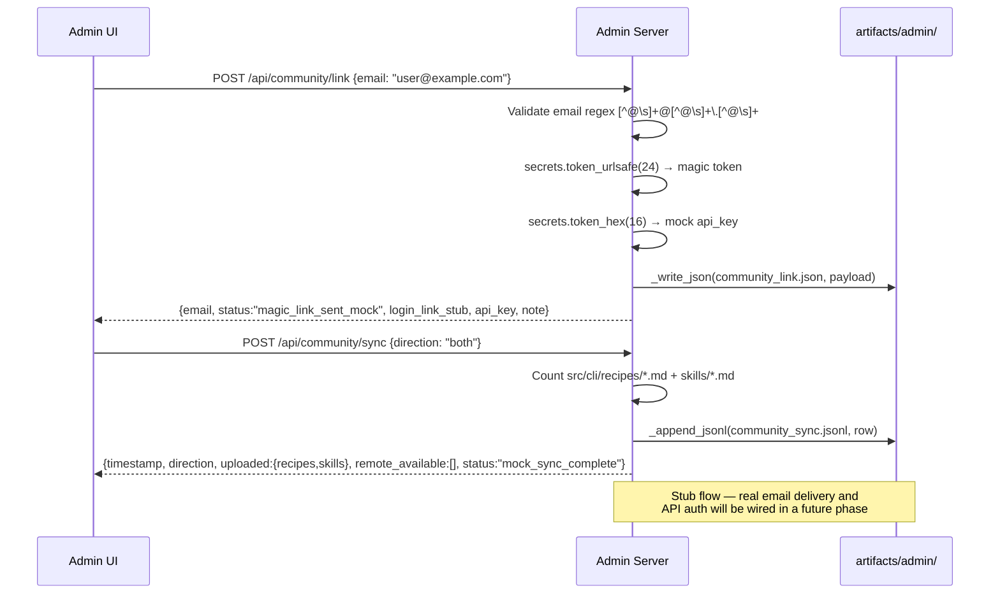

# Diagram 16: Admin Server Endpoints and Security Model

**Description:** The Stillwater Admin Server (`admin/server.py`) is a Python `ThreadingHTTPServer` running on `localhost:8787`. It provides a web UI for editing skills, recipes, and swarms within the repo, as well as LLM configuration, community linking, and safe CLI execution. All file operations enforce path traversal prevention, an allowed-directory allowlist, and a write-suffix whitelist. CLI execution uses a strict command allowlist.

---

## All HTTP Endpoints

---

## Path Traversal Prevention

---

## CLI Command Allowlist Enforcement

---

## File Operations Security Model

```mermaid
flowchart TD
    subgraph READ_OP["Read: GET /api/file?path=..."]
        R1["_safe_resolve_repo_path(path)"] --> R2["Path escapes repo? → 400"]
        R2 --> R3["_is_allowed_edit_path()? → 400 if not"]
        R3 --> R4["Read file text + compute SHA-256"]
        R4 --> R5["Return {path, content, size, sha256}"]
    end

    subgraph SAVE_OP["Save: POST /api/file/save"]
        S1["_safe_resolve_repo_path(path)"] --> S2["_is_allowed_edit_path()? → 400 if not"]
        S2 --> S3["len(content.encode()) > 2MB? → 400 if too large"]
        S3 --> S4["path.parent.mkdir(parents=True)"]
        S4 --> S5["path.write_text(content)"]
        S5 --> S6["Return _file_payload() with new SHA-256"]
    end

    subgraph CREATE_OP["Create: POST /api/file/create"]
        C1["Validate filename\nmatches [A-Za-z0-9._-]+"] --> C2["Look up group_id\nin CATALOG_GROUPS"]
        C2 --> C3["Compute target path\nin group['dirs'][0]"]
        C3 --> C4["_is_allowed_edit_path()? → 400 if not"]
        C4 --> C5["target.exists()? → 409 FileExistsError"]
        C5 --> C6["Write group template\ncreate_template string"]
        C6 --> C7["Return {path, created: True}"]
    end

    subgraph STATIC_OP["Static: GET /static/{file}"]
        T1["Resolve path under\nadmin/static/"] --> T2["Path within admin/static/?\n(startswith check)"]
        T2 -->|"No"| T3["404 not found"]
        T2 -->|"Yes"| T4["Serve file bytes\nwith guessed MIME type"]
    end
```

---

## Catalog Groups (Editable Content Registry)

---

## Community Link Flow

---

## Source Files

- `admin/server.py` — ThreadingHTTPServer, AdminHandler, all endpoint logic
- `admin/server.py` — `_safe_resolve_repo_path`, `_is_allowed_edit_path`, `ALLOWED_WRITE_SUFFIXES`
- `admin/server.py` — `SAFE_CLI_COMMANDS`, `_run_cli_command`, `CATALOG_GROUPS`, `EXTRA_EDITABLE_FILES`
- `admin/server.py` — `_community_link`, `_community_sync`, `_llm_status`, `_update_llm_config`

---

## Coverage

- All 15 HTTP endpoints (7 GET + 8 POST) with their exact path strings
- Path traversal prevention: `_safe_resolve_repo_path` + `_is_allowed_edit_path`
- Write suffix whitelist (`.md .txt .yaml .yml .json` — executables blocked)
- CLI command allowlist (`version`, `doctor`, `llm-status` only)
- CATALOG_GROUPS: 10 content groups covering all editable repo directories
- EXTRA_EDITABLE_FILES: 4 specific files outside catalog groups
- File size limit (2 MB) and filename character validation (`[A-Za-z0-9._-]+`)
- Static file serving with path containment check
- Community link stub flow (magic link + sync)
- Subprocess execution: cwd=REPO_ROOT, PYTHONPATH=src/cli/src, timeout=30s
