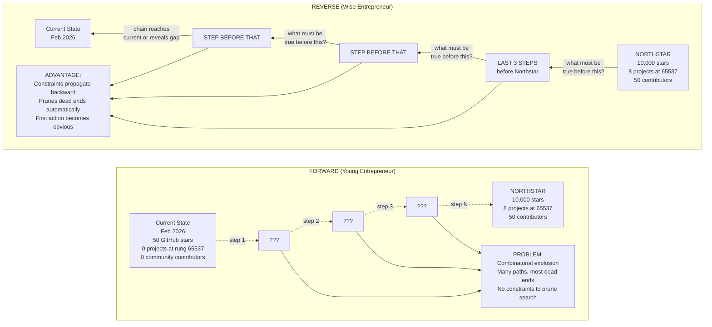
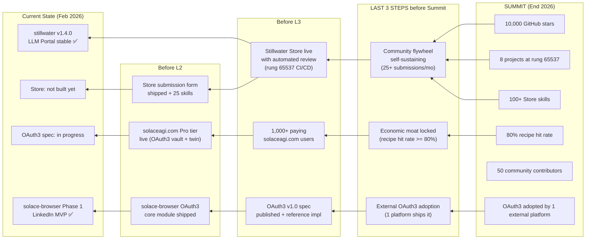
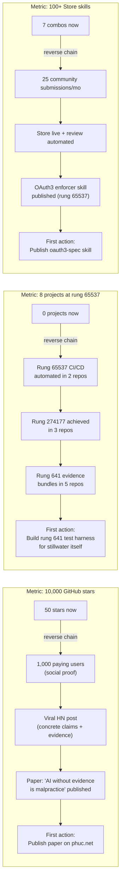

# Diagram 17: Northstar Reverse Engineering Algorithm

**Description:** The Northstar Reverse Engineering skill (`skills/northstar-reverse.md`) reframes goal pursuit from the naive forward direction (current state → ??? → Northstar) to a backward-chaining approach (Northstar → last 3 steps → chain backward → connect to current → forward plan). The maze insight: starting from the end of a maze and drawing back to the beginning prunes the combinatorial search space because constraints propagate backward. Applied to QA: reverse-engineer what tests must be true for a claim to hold.

---

## Forward vs Reverse Approach

---

## The 5-Step Algorithm

```mermaid
flowchart TD
    STEP1["STEP 1: DEFINE THE SUMMIT\nConcrete, measurable Northstar victory condition\nNot vague ('be successful')\nSpecific + falsifiable\n\nExample: 10,000 GitHub stars + 8 projects at rung 65537\n+ OAuth3 adopted by 1 external platform"]

    STEP1 --> STEP2["STEP 2: LAST 3 STEPS\nWhat MUST be true immediately before the Northstar?\nThink: What conditions make the goal inevitable?\n\nExample:\n- Store has 100+ skills (community flywheel self-sustains)\n- Recipe hit rate >= 80% (economic moat locked)\n- 1 external AI platform ships OAuth3 support"]

    STEP2 --> STEP3["STEP 3: CHAIN BACKWARD\nFor each step, what must be true before it?\nRepeat until you reach present or reveal a gap.\n\nExample (for '100+ skills'):\n  ← Store review process automated (rung 65537)\n  ← 25 skill submissions/mo (from 1,000 paying users)\n  ← Store live with public submission form\n  ← OAuth3 spec published + reference impl working\n  ← solace-browser Phase 1 (LinkedIn recipe) shipped ✅"]

    STEP3 --> STEP4["STEP 4: CONNECT TO CURRENT\nThe backward chain either:\n  (a) Reaches present state → path is clear\n  (b) Reveals a gap → identifies missing prerequisite\n\nExample gap found:\n  'Store review process automated' requires\n  rung 65537 CI/CD → not built yet → THIS is the bottleneck"]

    STEP4 --> STEP5["STEP 5: FORWARD PLAN\nReverse the backward chain → the first action is clear.\nNot 'what should I do?' but 'what is the prerequisite chain?'\n\nExample forward plan:\n  1. Build rung 65537 CI/CD (unblocks Store automation)\n  2. Publish OAuth3 spec (unblocks solace-browser Phase 2)\n  3. Ship Store submission form (unblocks community flywheel)\n  4. Ship 25 skills (unblocks recipe hit rate > 70%)\n  5. Hit 1,000 paying users (flywheel self-sustains)"]

    STEP5 --> SEAL["EXIT: First action is clear.\nNo combinatorial explosion.\nConstraints pruned the search."]

    style STEP1 text-align:left
    style STEP2 text-align:left
    style STEP3 text-align:left
    style STEP4 text-align:left
    style STEP5 text-align:left
```

---

## Applied to Stillwater's NORTHSTAR Metrics

---

## The Maze Insight: Applied to QA

```mermaid
flowchart TD
    subgraph MAZE["The Maze Insight"]
        START["Entry point\n(current state)"]
        DEAD1["Dead end"]
        DEAD2["Dead end"]
        DEAD3["Dead end"]
        EXIT["Exit\n(Northstar)"]

        START -->|"Forward search\ntries all paths"| DEAD1 & DEAD2 & DEAD3 & PATH_TO_EXIT
        PATH_TO_EXIT --> EXIT

        EXIT -->|"Backward from exit\nonly one path\nleads here"| ONLY_PATH["Only valid path\n(constraints pruned the rest)"]
        ONLY_PATH --> START
    end

    subgraph QA_REVERSE["Applied to QA (Reverse Engineering Evidence)"]
        CLAIM["CLAIM to verify:\n'This skill achieves rung 65537'"]

        CLAIM -->|"Forward: what tests do I write?"| F_EXPLODE["Combinatorial explosion\nof possible tests"]

        CLAIM -->|"Reverse: what MUST be true\nfor this claim to hold?"| R1["MUST: adversarial test passing"]
        R1 --> R2["MUST: security gate passing"]
        R2 --> R3["MUST: behavioral hash stable"]
        R3 --> R4["MUST: seed sweep at rung 274177"]
        R4 --> R5["MUST: red/green test at rung 641"]
        R5 --> R6["First test to write:\nred/green reproduction"]

        R6 --> EVIDENCE["Evidence bundle:\nrepro_red.log + repro_green.log\ntests.json + plan.json\nbehavioral_hash.json"]
    end

    style F_EXPLODE fill:#3a1a1a,stroke:#f85149
    style EVIDENCE fill:#1a3a2a,stroke:#3fb950
```

---

## Northstar Reverse for Each Stillwater Metric

---

## Source Files

- `NORTHSTAR.md` — Northstar metrics, reverse engineering algorithm, content pipeline
- `skills/northstar-reverse.md` — Full northstar-reverse skill specification
- `swarms/northstar-navigator.md` — Sun Tzu persona swarm agent
- `papers/41-northstar-reverse-engineering.md` — Full paper
- `papers/42-reverse-paths.md` — Applied reverse paths for each metric

---

## Coverage

- Forward vs reverse approach comparison (why reverse wins)
- The 5-step algorithm: DEFINE SUMMIT → LAST 3 STEPS → CHAIN BACKWARD → CONNECT TO CURRENT → FORWARD PLAN
- Applied to Stillwater's own NORTHSTAR metrics (stars, rung 65537, Store skills, recipe hit rate, contributors, OAuth3 adoption)
- The maze insight (exit → entry is faster than entry → exit)
- Applied to QA: reverse-engineering what evidence must exist before a claim holds
- Backward constraint propagation as the mechanism that prunes combinatorial explosion
- Per-metric reverse chains showing the first concrete action for each NORTHSTAR goal
