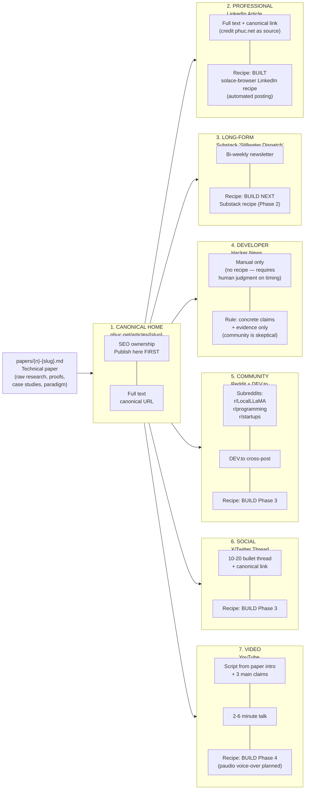
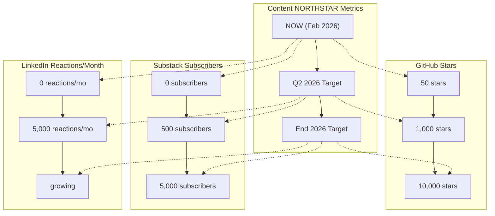
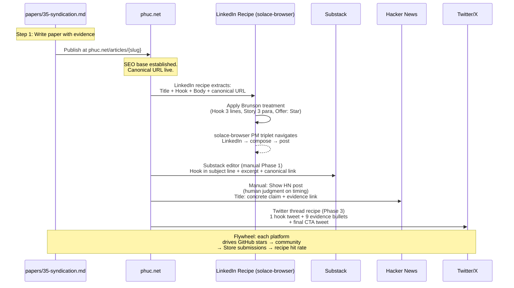

# Diagram 19: Content Syndication Pipeline

**Description:** Every paper in `papers/` is a potential content asset. The syndication pipeline converts technical papers through a canonical home on phuc.net and then to all major distribution channels — LinkedIn, Substack, HN, Reddit, Twitter, and YouTube. The Brunson treatment (Hook + Story + Offer) is applied at every stage. Recipe automation handles platform-specific formatting and posting where built.

---

## Full Pipeline Overview

---

## Brunson Treatment at Each Stage

```mermaid
flowchart TD
    subgraph BRUNSON["Brunson Treatment (Required for Every Piece)"]
        direction TB
        HOOK["HOOK\nFirst 3 lines\nSpecific + counterintuitive + promise\n\nExample:\n'Every AI agent I've seen produces outputs.\nNone of them produce proof.\nHere is a framework that does.'"]

        STORY["STORY\nHarvard → CRIO → FDA clinical trials → Stillwater\n\n'In clinical trials, trust me is not evidence.\nOnly the original, timestamped, attributable\nrecord is evidence. I built software that\nsurvives real FDA audits. That experience\nis now in the architecture.'"]

        OFFER["OFFER\nOne action. Low friction.\n\nFor developers: 'Star on GitHub'\nFor readers: 'Free account at solaceagi.com'\nFor enterprises: 'Book a demo'\n\nNEVER: multiple CTAs\nALWAYS: lowest friction path first"]

        HOOK --> STORY --> OFFER
    end

    subgraph PER_PLATFORM["Platform-Specific Brunson Application"]
        LI_B["LinkedIn:\nHook in first line (no 'see more' cut)\nStory = professional credibility\nOffer = 'comment STILLWATER\nfor the repo link'"]

        SS_B["Substack:\nHook in subject line\nStory = 3 paragraphs max\nOffer = 'try it for free\n(no CC required)'"]

        HN_B["Hacker News:\nHook = Show HN title\n(concrete, specific, no hype)\nStory = evidence bundle link\nOffer = none (community first)"]

        TW_B["Twitter/X Thread:\nHook tweet = the counterintuitive claim\nThread = 10 tweets of evidence\nFinal tweet = GitHub star CTA"]

        YT_B["YouTube:\nHook = first 30 seconds\n(problem + why you should care)\nStory = demo + proof\nOffer = subscribe + GitHub link"]
    end

    BRUNSON --> PER_PLATFORM
```

---

## Recipe Automation Status

```mermaid
flowchart TD
    subgraph PHASE1["Phase 1 — AVAILABLE NOW"]
        R1_LI["LinkedIn Recipe\nsolace-browser\n(BUILT)\nAutomated article posting\nwith PM triplet navigation"]
    end

    subgraph PHASE2["Phase 2 — BUILD NEXT"]
        R2_SS["Substack Recipe\n(PLANNED)\nNewsletter publish + email send"]
        R2_DEVTO["DEV.to Recipe\n(PLANNED)\nCross-post from canonical"]
    end

    subgraph PHASE3["Phase 3 — BUILD AFTER"]
        R3_TW["Twitter Thread Recipe\n(PLANNED)\nThread composer + scheduler"]
        R3_RD["Reddit Recipe\n(PLANNED)\nSubreddit targeting + posting"]
    end

    subgraph PHASE4["Phase 4 — FUTURE"]
        R4_YT["YouTube Recipe\n(PLANNED)\npaudio voice-over +\nauto-upload"]
        R4_HN["HN Submission Helper\n(PLANNED — manual confirm required)\nDraft + schedule but human submits"]
    end

    PHASE1 --> PHASE2 --> PHASE3 --> PHASE4

    style R1_LI fill:#1a3a2a,stroke:#3fb950
    style R2_SS fill:#2a2a1a,stroke:#d29922
    style R2_DEVTO fill:#2a2a1a,stroke:#d29922
    style R3_TW fill:#1a1a3a,stroke:#58a6ff
    style R3_RD fill:#1a1a3a,stroke:#58a6ff
    style R4_YT fill:#2a1a2a,stroke:#a371f7
    style R4_HN fill:#2a1a2a,stroke:#a371f7
```

---

## Content NORTHSTAR Metrics

---

## Paper to Canonical to Platform: Detailed Flow

---

## Source Files

- `NORTHSTAR.md` — Content syndication pipeline, Brunson treatment, NORTHSTAR content metrics
- `papers/35-syndication-strategy.md` — Full syndication strategy paper
- `admin/server.py` — `_community_sync` (skill/recipe upload to community)
- `src/cli/recipes/` — Platform-specific recipe files (LinkedIn etc.)

---

## Coverage

- Full 7-stage pipeline: Paper → phuc.net → LinkedIn → Substack → HN → Reddit → Twitter → YouTube
- Brunson treatment: Hook + Story + Offer at each platform with specific examples
- Recipe automation status for each platform (Phase 1 built, Phase 2-4 planned)
- Content NORTHSTAR metrics: GitHub stars (50 → 10,000), Substack (0 → 5,000), LinkedIn reactions (0 → 5,000/mo)
- Platform-specific rules (HN: manual only, no hype; LinkedIn: no 'see more' cut on hook)
- Persona mapping: Brunson persona for conversion copy, Mr. Beast for viral hooks
- Community flywheel: content drives stars → contributors → store skills → recipe hit rate
