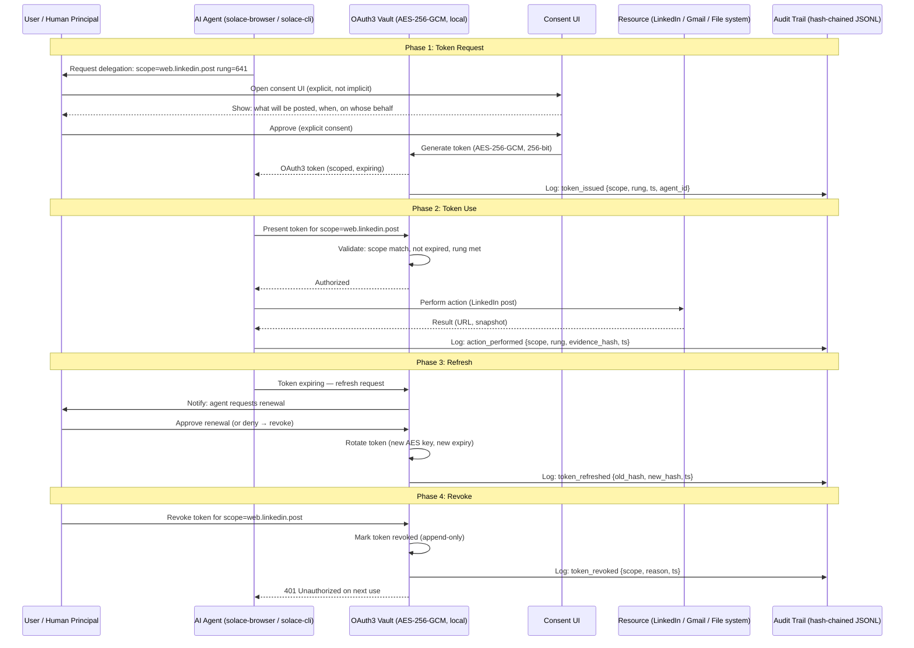
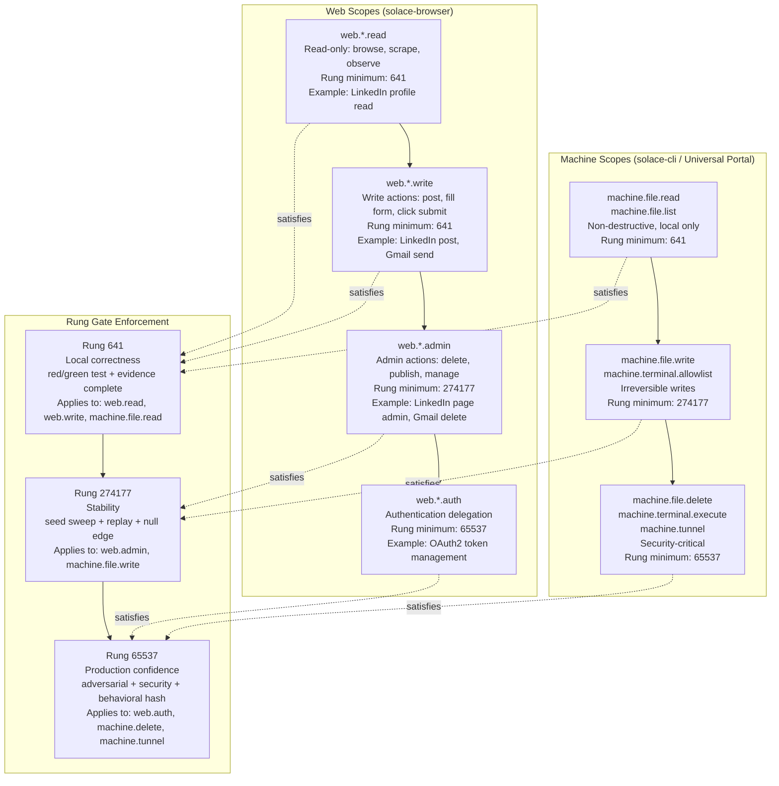
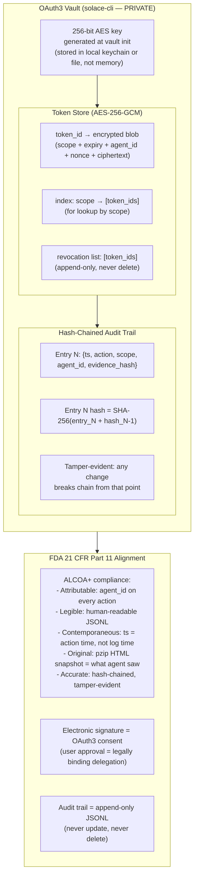
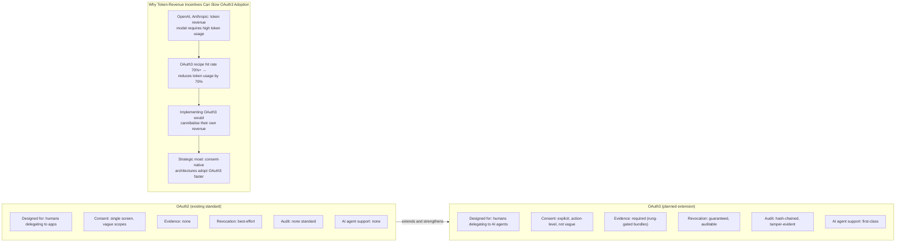
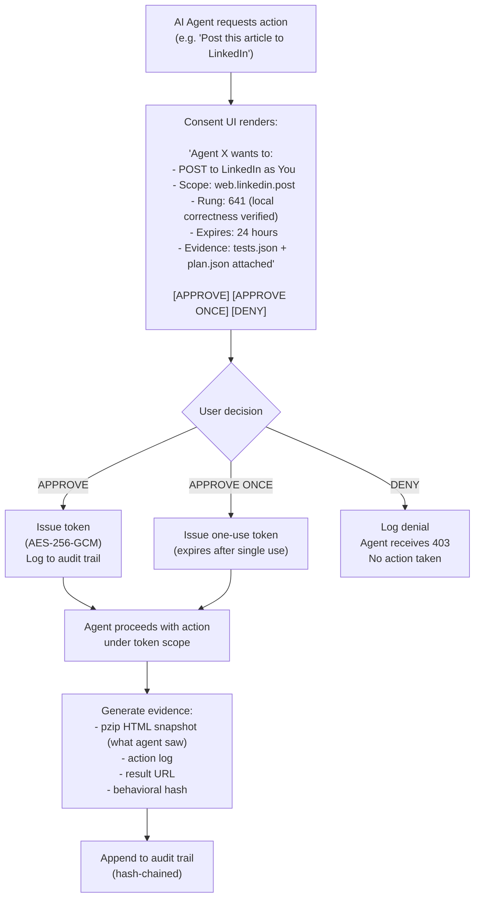

# Diagram 20: OAuth3 Token Lifecycle

**Description:** OAuth3 is the planned formal standard for AI agency delegation. It extends OAuth2 with consent-bound, evidence-gated, rung-verified permissions for both web actions (click, fill, navigate) and machine actions (file read/write, terminal commands, tunnel). The full token lifecycle covers: request → consent → grant → store → use → refresh → revoke. Scope hierarchy ties each permission category to a minimum rung requirement.

---

## Token Lifecycle: Full Sequence

---

## Scope Hierarchy and Rung Requirements

---

## Vault Storage Architecture

---

## OAuth3 vs OAuth2: Key Differences

---

## Consent UI Flow

---

## Implementation Roadmap (OAuth3 Build Phases)

```mermaid
flowchart LR
    subgraph P1["Phase 1 — OAuth3 Spec (stillwater)"]
        P1A["oauth3-spec skill\n(formal specification)"]
        P1B["Scope taxonomy defined\n(web + machine)"]
        P1C["Rung requirements documented"]
    end

    subgraph P2["Phase 2 — OAuth3 Core (solace-browser)"]
        P2A["Token issuance module\n(AES-256-GCM)"]
        P2B["Consent UI\n(explicit, action-level)"]
        P2C["Revocation API"]
    end

    subgraph P3["Phase 3 — OAuth3 Vault (solace-cli PRIVATE)"]
        P3A["Local vault storage\n(persistent, encrypted)"]
        P3B["CLI auth commands\n(sw auth login, sw auth revoke)"]
        P3C["Team tokens (Enterprise)"]
    end

    subgraph P4["Phase 4 — OAuth3 Enforcer (stillwater Store)"]
        P4A["oauth3-enforcer skill\n(rung gate for all scopes)"]
        P4B["Store requires OAuth3\nfor all published skills"]
        P4C["Rung 65537 certification\nfor production skills"]
    end

    subgraph P5["Phase 5 — External Adoption"]
        P5A["OAuth3 v1.0 spec published\n(IETF or similar)"]
        P5B["1 external AI platform\nadopts OAuth3"]
        P5C["NORTHSTAR metric achieved"]
    end

    P1 --> P2 --> P3 --> P4 --> P5
```

---

## Source Files

- `NORTHSTAR.md` — OAuth3 strategic position, scope hierarchy, rung semantics for machine layer
- `ROADMAP.md` — OAuth3 build phases (Phase 2: oauth3-spec skill, Phase 3: store governance)
- `admin/session_manager.py` — AES-256-GCM pattern (same architecture as OAuth3 vault)
- `admin/llm_portal.py` — Phase 3 `/api/providers/auth` (memory-only key pattern)
- `case-studies/solace-browser.md` — OAuth3 core module build plan
- `case-studies/solace-cli.md` — OAuth3 vault commands (PRIVATE)

---

## Coverage

- Complete token lifecycle: request → consent → grant → store → use → refresh → revoke
- Scope hierarchy: web.read, web.write, web.admin, web.auth; machine.file.*, machine.terminal.*, machine.tunnel
- Rung requirements per scope type (641 / 274177 / 65537)
- Vault storage: AES-256-GCM, nonce-per-write, local only
- Hash-chained audit trail for FDA 21 CFR Part 11 compliance (ALCOA+)
- OAuth2 vs OAuth3 comparison: AI-first design, evidence requirement, guaranteed revocation
- Why token-revenue incentives can slow OAuth3 adoption (strategic moat)
- Consent UI: explicit action-level approval, one-use tokens, deny path
- 5-phase implementation roadmap from spec to external adoption
