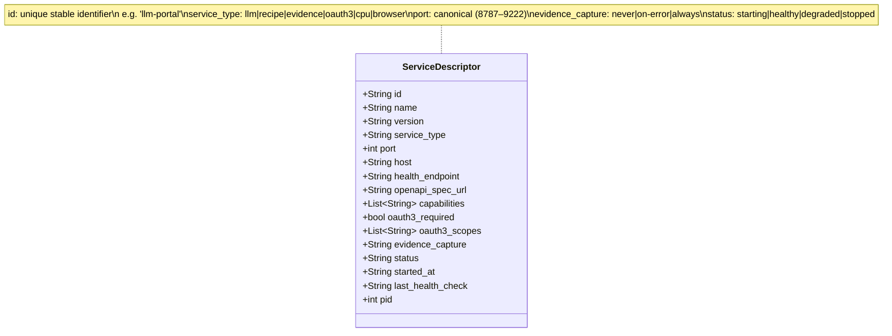
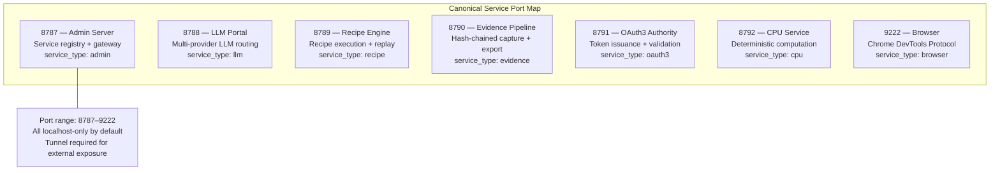
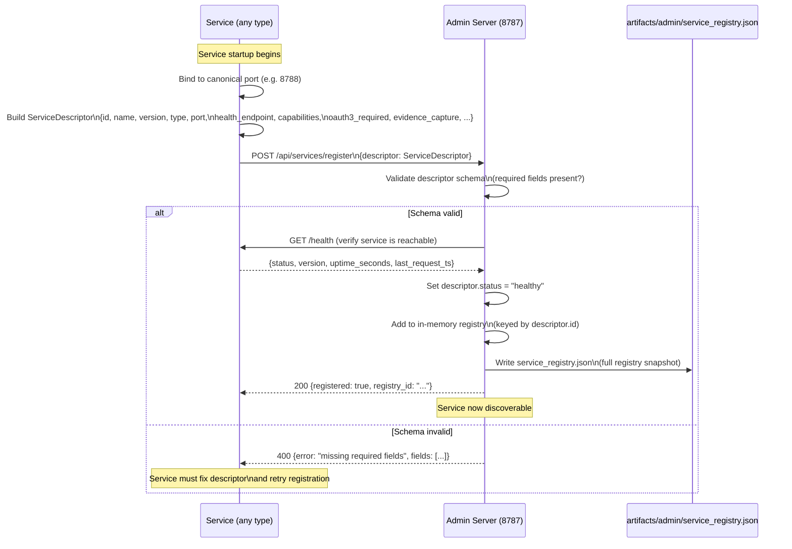
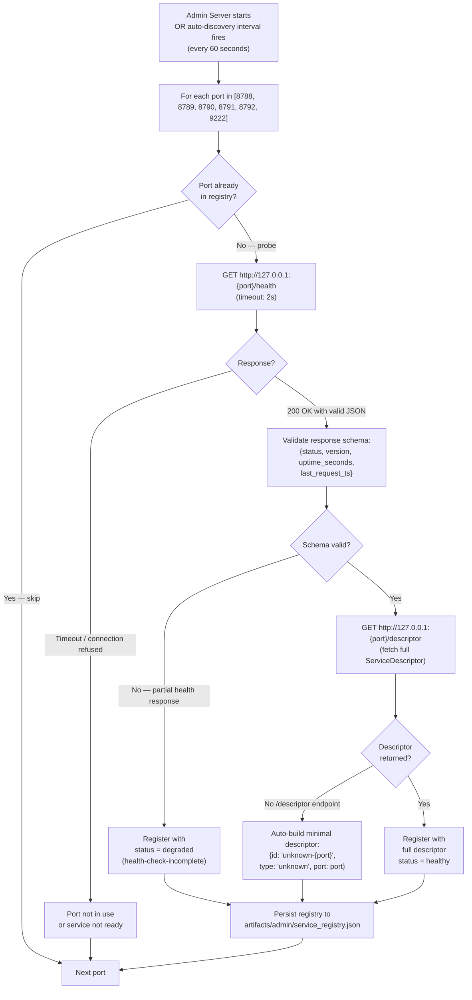
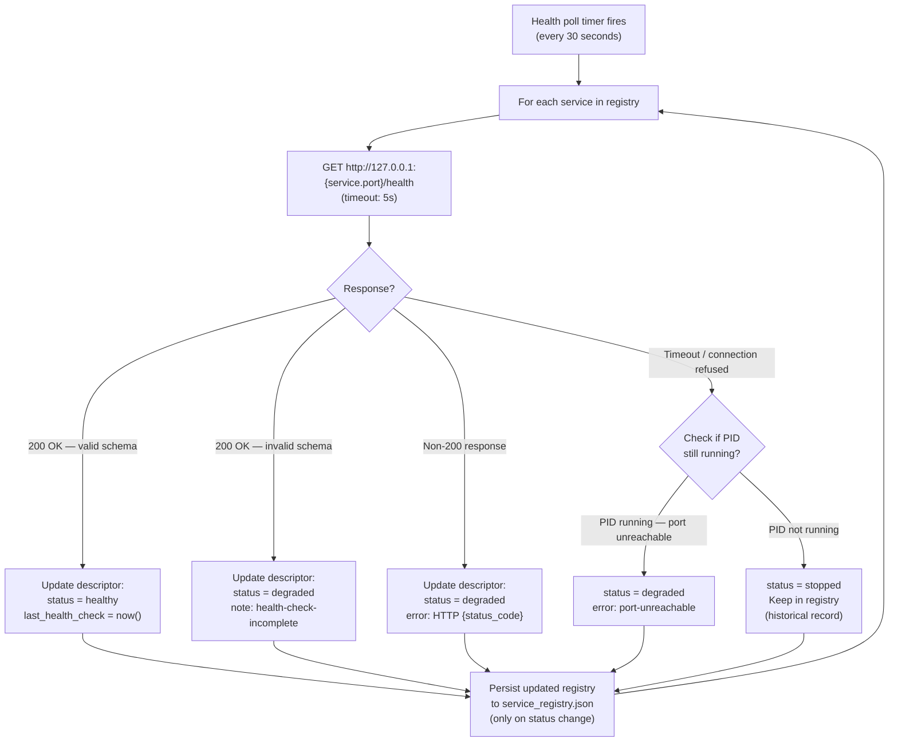
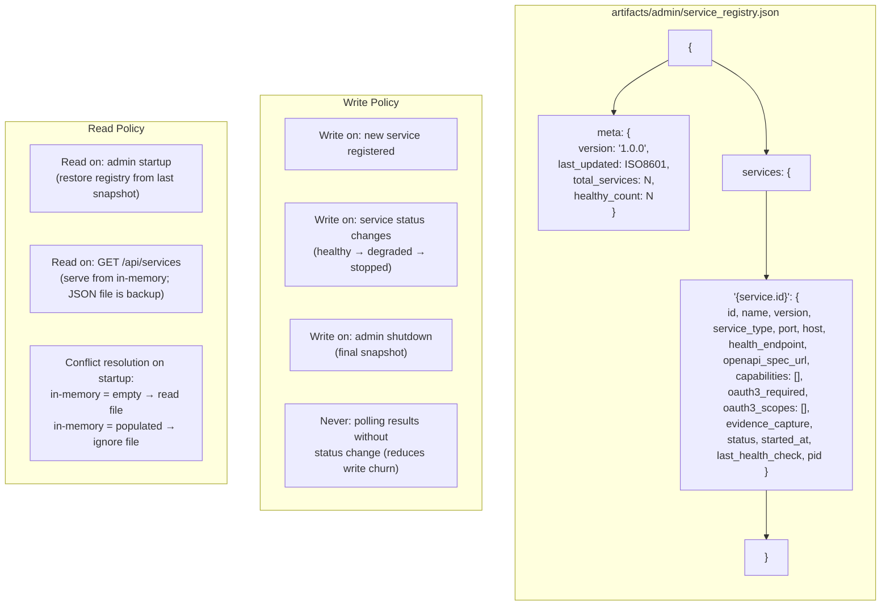
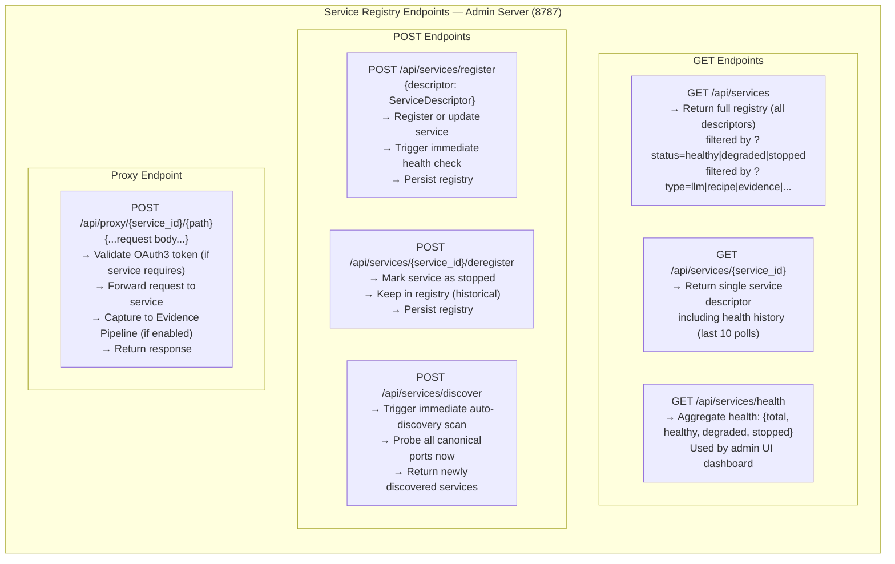
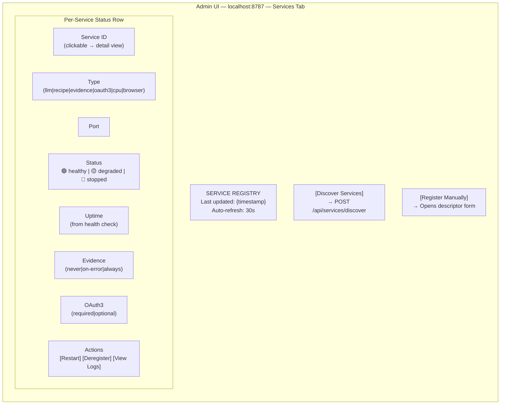

# Diagram 23: Service Registry Architecture

**Description:** The Admin Server (localhost:8787) is the mandatory discovery gateway for all Stillwater services. It maintains a service registry — a live, persisted map of every running service and its health status. Services register themselves on startup. The admin server auto-discovers services by probing canonical ports on startup. A health polling loop updates each service's status every 30 seconds. The registry is persisted to `artifacts/admin/service_registry.json` on every change.

---

## ServiceDescriptor Model (All Fields)

---

## Canonical Port Assignments

---

## Service Registration Flow (Service → Admin)

---

## Auto-Discovery Flow (Admin Probes Known Ports)

---

## Health Check Polling Cycle

---

## Registry Persistence: service_registry.json Schema

---

## Registry API Endpoints (Admin Server Extensions)

---

## Admin UI: Service Registry Dashboard

---

## Source Files

- `admin/server.py` — Admin Server (Phase 1 service; registry endpoints to be added in Phase 2)
- `admin/llm_portal.py` — LLM Portal (first service to self-register in Phase 2)
- `artifacts/admin/service_registry.json` — Registry persistence file (created by admin on first registration)
- `papers/54-webservice-first-architecture.md` — Full architectural narrative

---

## Coverage

- ServiceDescriptor model: all 15 fields with types and semantics
- Canonical port assignments: 7 services (8787–9222)
- Service registration flow: startup → descriptor build → POST /register → health verify → persist
- Auto-discovery: admin probes all canonical ports on startup and on 60s interval
- Health check polling: 30s cycle, status transitions (healthy → degraded → stopped)
- Registry persistence: service_registry.json schema, write policy (on status change), read policy (on startup)
- Registry API: 3 GET + 3 POST endpoints + 1 proxy endpoint
- Admin UI dashboard: per-service status row with all columns
- Degraded vs stopped distinction (PID check)
- Schema validation for health check responses
