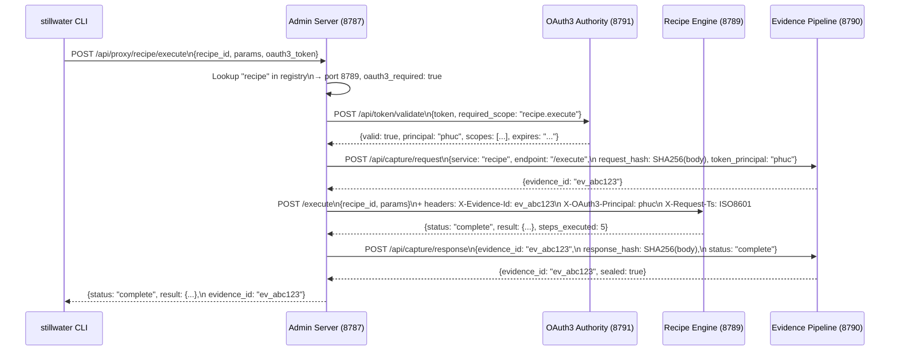
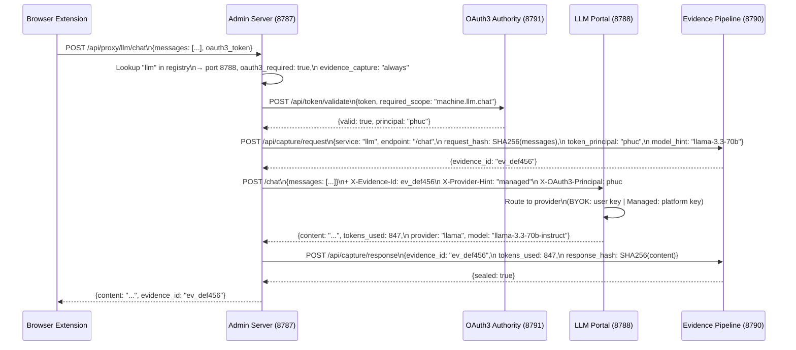
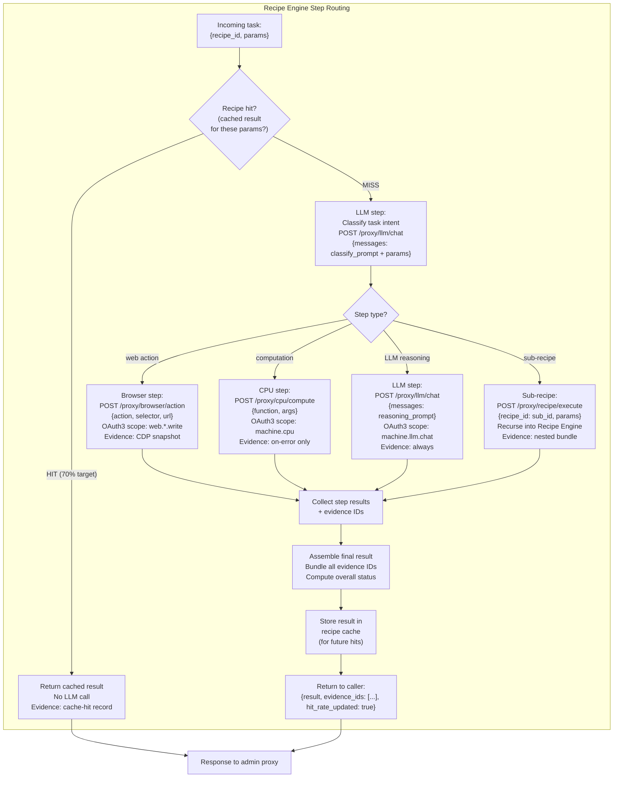
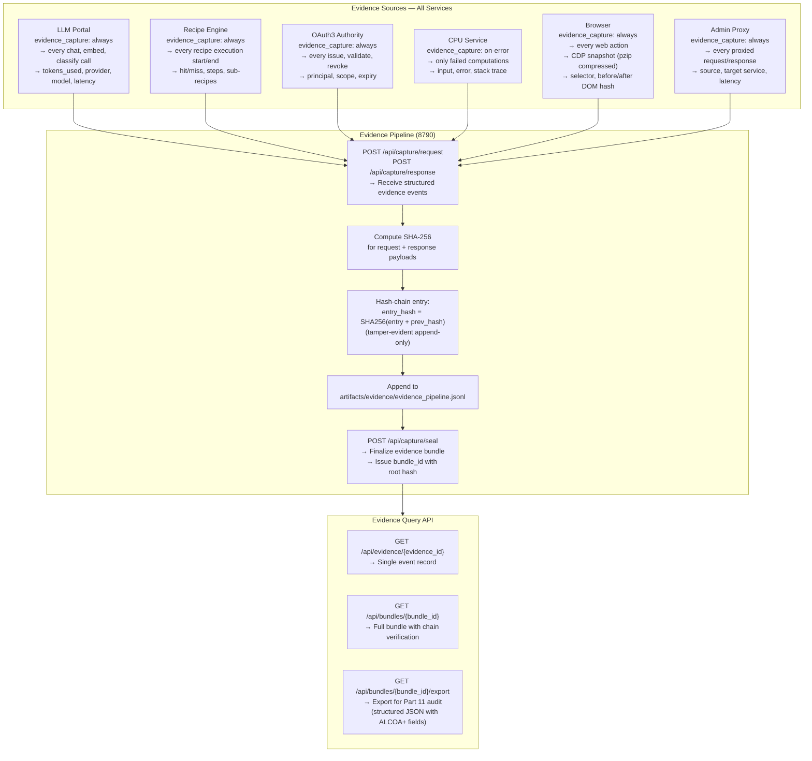
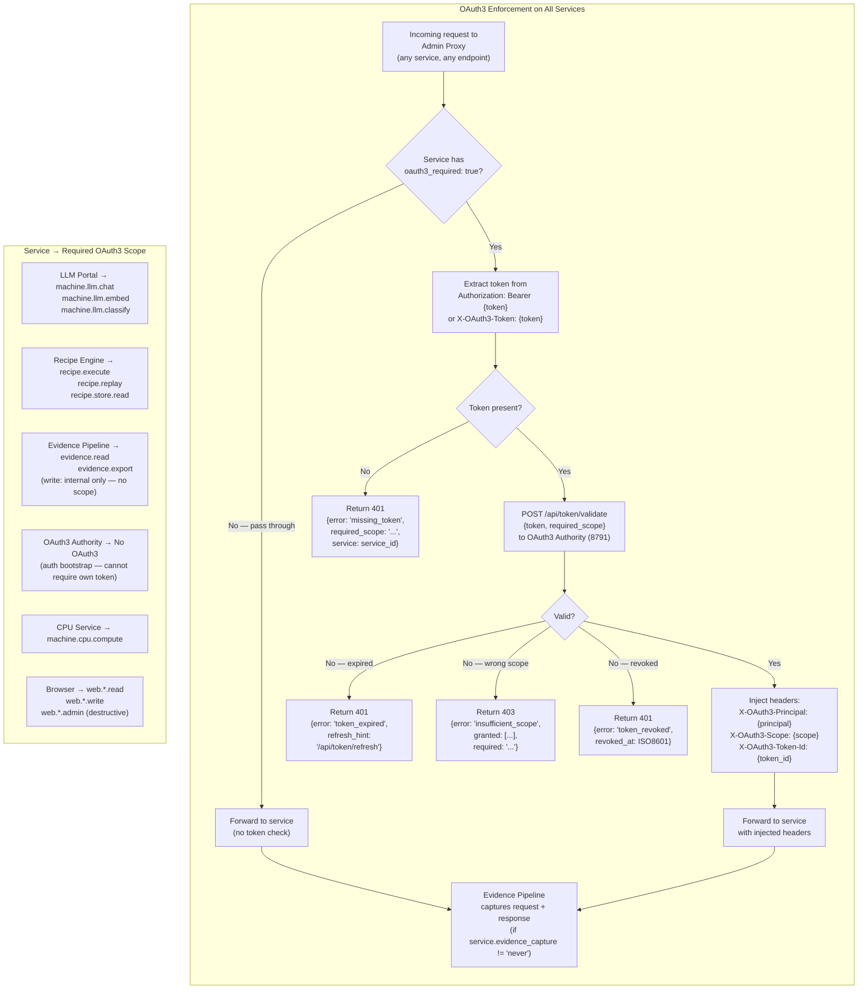
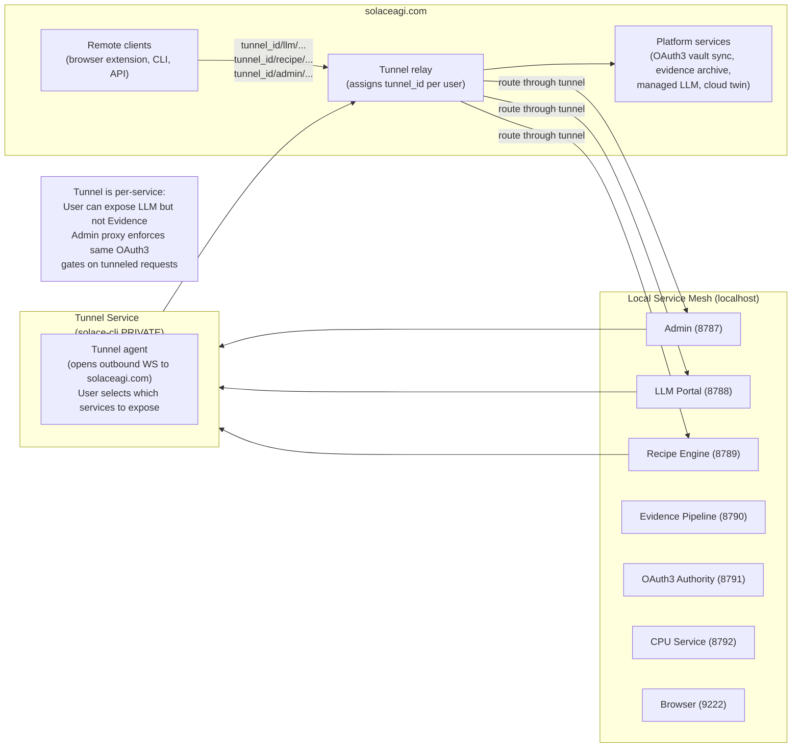

# Diagram 24: Service Mesh — Inter-Service Communication

**Description:** The Stillwater service mesh connects seven services (Admin, LLM Portal, Recipe Engine, Evidence Pipeline, OAuth3 Authority, CPU Service, Browser) through a hub-and-spoke topology centered on the Admin Server (8787). All external-facing calls route through the admin proxy. Services can also call each other directly for performance-critical paths, but all such direct calls are captured by the Evidence Pipeline. OAuth3 Authority enforces scope requirements on every call that the admin proxy routes.

---

## Full Service Mesh: All 7 Services and Connections

```mermaid
flowchart TD
    subgraph EXTERNAL["External Callers"]
        CLI["stillwater CLI\n(thin HTTP client)"]
        BROWSER_EXT["Browser Extension\n(solace-browser)"]
        REMOTE["Remote Client\n(via tunnel: solaceagi.com)"]
    end

    subgraph MESH["Service Mesh — localhost:8787–9222"]
        direction TB

        ADMIN["Admin Server\nlocalhost:8787\nService registry + proxy\nOAuth3 header injection\nEvidence capture routing"]

        LLM["LLM Portal\nlocalhost:8788\nMulti-provider LLM\nBYOK + managed"]

        RECIPE["Recipe Engine\nlocalhost:8789\nRecipe execution\nStep routing + replay\nHit rate tracking"]

        EVIDENCE["Evidence Pipeline\nlocalhost:8790\nHash-chained JSONL\nTamper-evident audit\nPart 11 capture"]

        OAUTH["OAuth3 Authority\nlocalhost:8791\nToken issuance\nScope validation\nRevocation"]

        CPU["CPU Service\nlocalhost:8792\nDeterministic computation\nExact arithmetic\nNo LLM calls"]

        BROWSER["Browser\nlocalhost:9222\nChrome DevTools Protocol\nWeb automation\nSnapshot capture"]
    end

    subgraph PERSISTENCE["Persistence Layer"]
        REG_JSON["artifacts/admin/\nservice_registry.json"]
        EV_JSONL["artifacts/evidence/\nevidence_pipeline.jsonl"]
        OAUTH_STORE["~/.stillwater/\noauth3_vault.enc\n(AES-256-GCM)"]
    end

    CLI & BROWSER_EXT & REMOTE --> ADMIN

    ADMIN -->|"proxy + OAuth3 check"| LLM & RECIPE & EVIDENCE & OAUTH & CPU & BROWSER
    ADMIN --> REG_JSON

    RECIPE -->|"direct: LLM call"| LLM
    RECIPE -->|"direct: CPU step"| CPU
    RECIPE -->|"direct: web step"| BROWSER
    RECIPE -->|"capture: every step"| EVIDENCE

    LLM -->|"capture: every call"| EVIDENCE
    CPU -->|"capture: on-error only"| EVIDENCE
    BROWSER -->|"capture: every action"| BROWSER
    BROWSER -->|"snapshot + evidence"| EVIDENCE

    OAUTH -->|"persist tokens"| OAUTH_STORE
    EVIDENCE --> EV_JSONL

    style ADMIN fill:#1a3a2a,stroke:#3fb950
    style OAUTH fill:#2a1a3a,stroke:#a371f7
    style EVIDENCE fill:#1a2a3a,stroke:#58a6ff
```

---

## CLI → Admin → Service Routing

---

## Browser → Admin → LLM Routing

---

## Recipe Engine → LLM + Browser + CPU Routing

---

## Evidence Pipeline: Captures from All Services

---

## OAuth3 Enforcement: All Services

---

## Tunnel: Services Exposed to solaceagi.com

---

## Source Files

- `admin/server.py` — Admin Server (Phase 1; proxy and registry endpoints added in Phase 2)
- `admin/llm_portal.py` — LLM Portal (Phase 1; first service to join mesh)
- `papers/54-webservice-first-architecture.md` — Full architectural narrative
- `data/default/diagrams/stillwater/23-service-registry.md` — Service registry detail
- `data/default/diagrams/stillwater/25-service-types.md` — Per-service endpoint catalog
- `data/default/diagrams/stillwater/20-oauth3-flow.md` — OAuth3 token lifecycle

---

## Coverage

- Full 7-service topology (Admin, LLM, Recipe, Evidence, OAuth3, CPU, Browser)
- CLI → admin → service routing with OAuth3 validation and evidence capture
- Browser extension → admin → LLM routing with provider selection
- Recipe Engine step routing: hit/miss, web/CPU/LLM/sub-recipe classification
- Evidence Pipeline: all 6 capture sources, hash-chaining, bundle sealing
- OAuth3 enforcement flow: token extraction, validation, scope check, header injection
- Per-service OAuth3 scope requirements table
- Tunnel architecture: local → outbound WS → solaceagi.com relay → remote clients
- Error cases: missing token (401), expired (401), wrong scope (403), revoked (401)
- Evidence capture modes: never, on-error, always — per service
