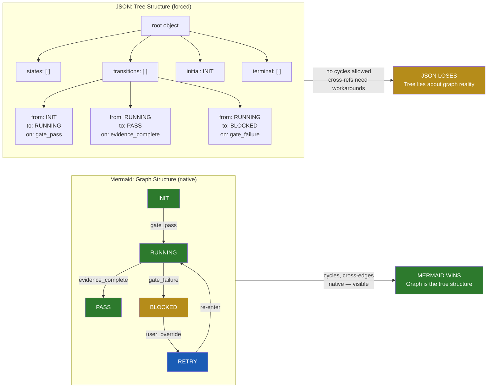
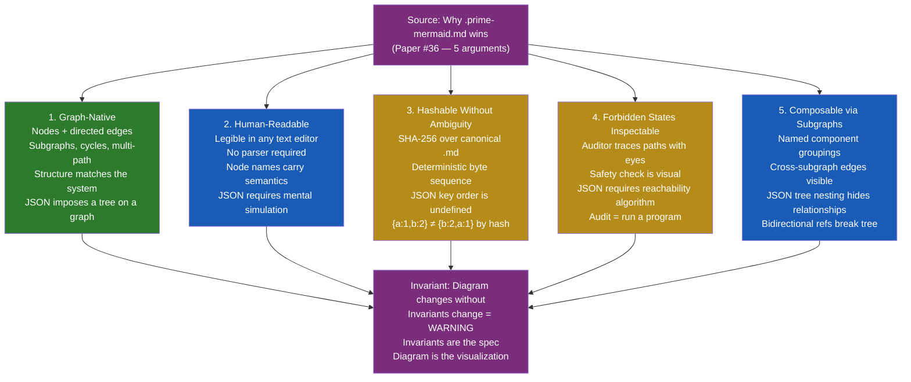
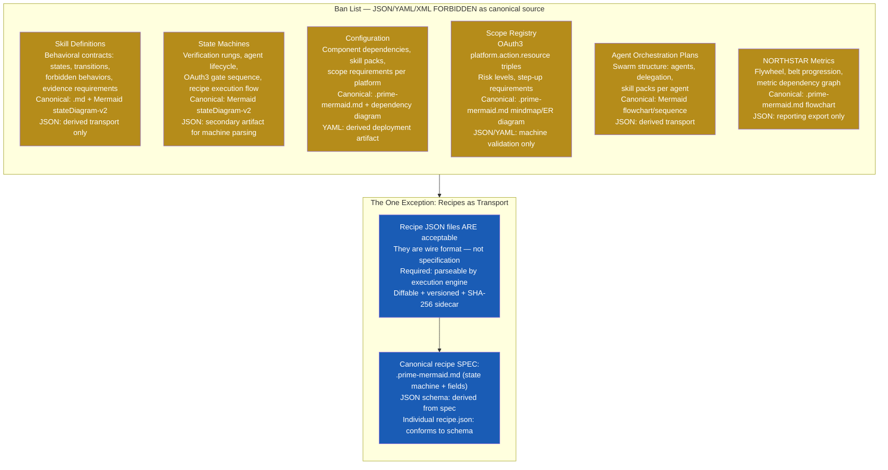
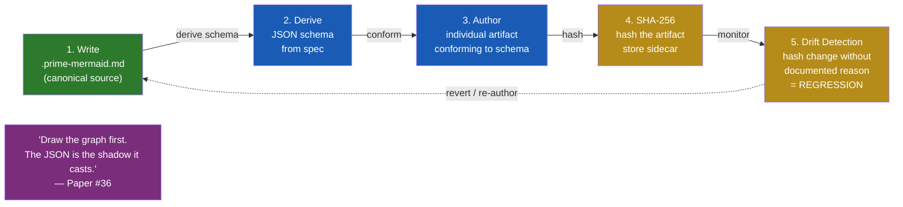

# Diagram 26: Prime Mermaid vs JSON — Why .prime-mermaid.md Is the Canonical Source of Truth

**Description:** Companion diagram for Paper #36 (Prime Mermaid Primacy). Contrasts graph-native Mermaid structure against JSON's tree constraint, shows the 5 structural advantages of .prime-mermaid.md, enumerates the ban list of artifact categories that must use .prime-mermaid.md as canonical source, and illustrates the 4-section standard format.

---

## Structure Contrast: Graph vs Tree

---

## The 5 Structural Advantages of .prime-mermaid.md

---

## The Ban List: Artifact Categories That Must Use .prime-mermaid.md

---

## The .prime-mermaid.md Standard: 4-Section Format

```mermaid
flowchart TD
    classDef active fill:#2d7a2d,color:#fff
    classDef portal fill:#1a5cb5,color:#fff
    classDef gate fill:#b58c1a,color:#fff
    classDef store fill:#7a2d7a,color:#fff

    subgraph FORMAT[".prime-mermaid.md — Required Sections"]
        direction TB

        S1["## Overview\nOne paragraph\nWhat system does this describe?\nWhat are the key entities?\nHuman reads this first"]:::portal

        S2["## Diagram\nOne or more Mermaid blocks\nstateDiagram-v2 → state machines\nflowchart → process flows\nsequenceDiagram → protocols\nerDiagram → data relationships\nmindmap → taxonomy"]:::active

        S3["## Invariants\nBullet list of always-true properties\n'State X only reachable via gate Y'\n'No path from START to FORBIDDEN\nwithout CONFIRMATION'\n'Every non-terminal node has outgoing edge'\nThese ARE the specification"]:::gate

        S4["## Derivations\nWhat is mechanically derivable?\n'JSON schema for recipe.json\nderived from Recipe state machine'\n'OAuth3 scope list derived from\nScope registry mindmap'\nOutputs from this canonical source"]:::store

        HASH["SHA-256 Hash\nComputed over entire .prime-mermaid.md\nChange any section = different hash\nStored in: filename.prime-mermaid.md.sha256\nHash is the drift detector"]:::gate

        S1 --> S2 --> S3 --> S4 --> HASH
    end

    subgraph DIAGRAM_TYPES["Mermaid Diagram Type Selection"]
        direction LR
        DT1["stateDiagram-v2\n→ agent FSMs\n→ verification rungs\n→ OAuth3 gate flow"]:::active
        DT2["flowchart\n→ process flows\n→ orchestration plans\n→ dependency graphs"]:::portal
        DT3["sequenceDiagram\n→ interaction protocols\n→ cross-service comms\n→ portal handshakes"]:::portal
        DT4["erDiagram\n→ data models\n→ scope registry\n→ token schema"]:::store
        DT5["mindmap\n→ taxonomy trees\n→ skill families\n→ magic word tiers"]:::store
    end

    FORMAT --> DIAGRAM_TYPES
```

---

## Workflow: Draw the Graph First

---

## Source Files

- `papers/36-prime-mermaid-primacy.md` — Foundational paper this diagram accompanies
- `skills/prime-mermaid.md` — Prime Mermaid standard (full skill)
- `skills/prime-safety.md` — Forbidden states as first-class architectural concept
- `papers/03-verification-ladder.md` — Rung system graph structure

---

## Coverage

- Graph vs tree structural contrast with concrete state machine example
- 5 structural advantages of .prime-mermaid.md with JSON failure modes per advantage
- Full ban list: 6 artifact categories that must use .prime-mermaid.md as canonical source
- The one exception: recipe.json as wire format (not specification)
- 4-section .prime-mermaid.md standard (Overview, Diagram, Invariants, Derivations)
- Mermaid diagram type selection guide (5 types, when to use each)
- End-to-end workflow: write canonical → derive schema → author artifact → hash → monitor drift
