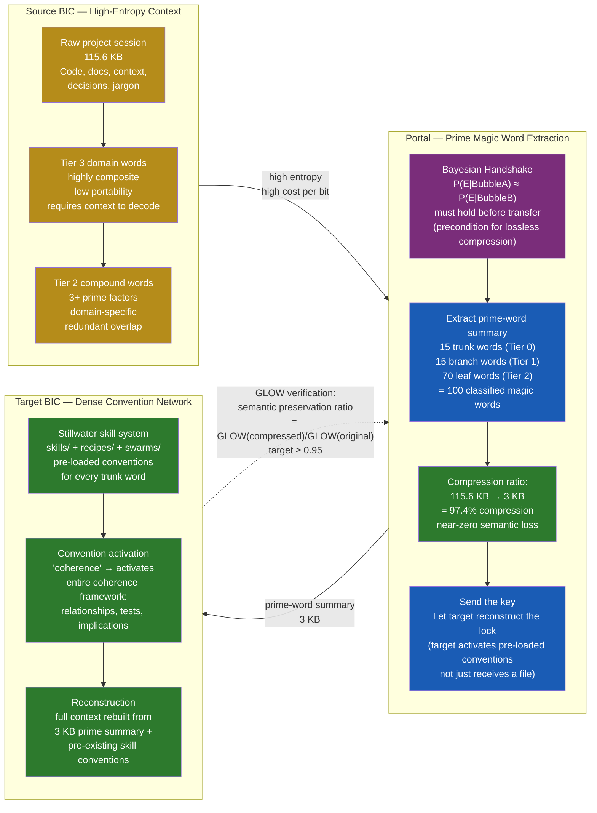
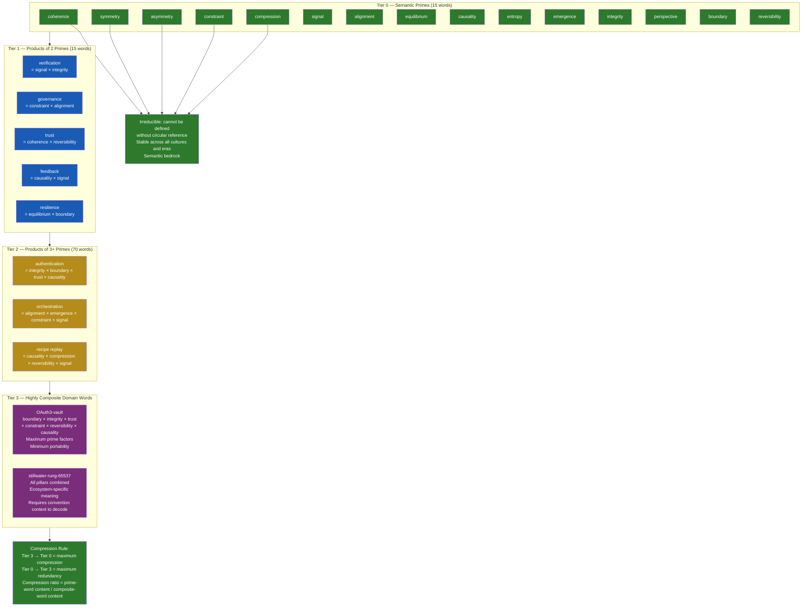
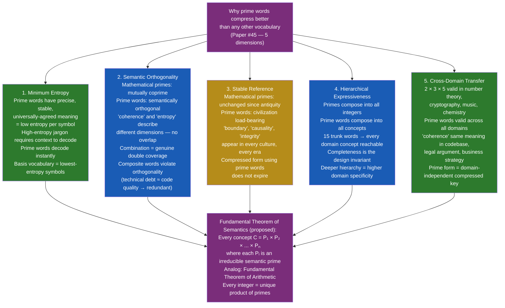
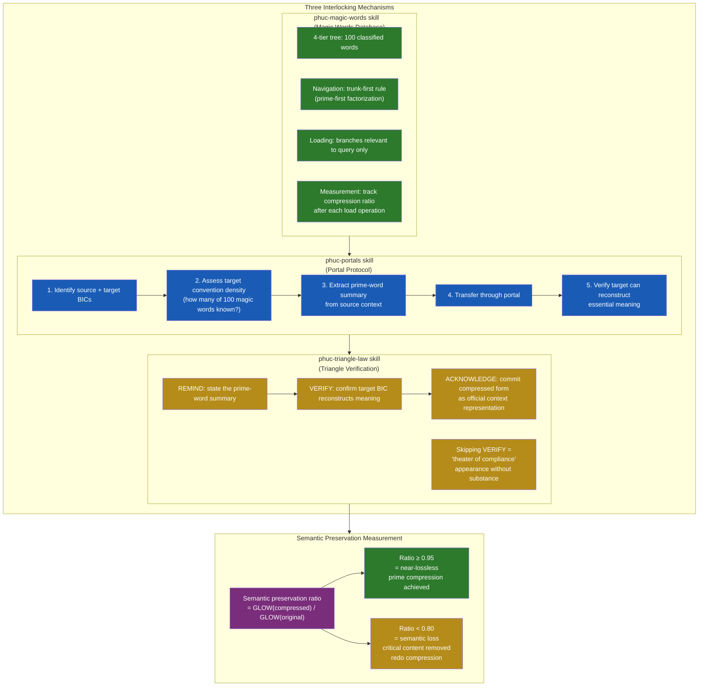

# Diagram 27: Portal Architecture — Prime Compression as BIC Boundary Crossing

**Description:** Companion diagram for Paper #45 (Prime Compression / Magic Words). Shows the source BIC → portal → target BIC compression flow, the 4-tier semantic prime hierarchy, the 97.4% compression ratio mechanism, and the 5 dimensions that make prime words compression-superior to any other vocabulary.

---

## BIC-to-BIC Portal: The Compression Gateway

---

## The 4-Tier Prime Hierarchy

---

## The 5 Compression Advantages of Prime Magic Words

---

## Portal Protocol: Stillwater Implementation

---

## Source Files

- `papers/45-prime-compression-magic-words.md` — Foundational paper this diagram accompanies
- `skills/phuc-magic-words.md` — 4-tier magic word database
- `skills/phuc-portals.md` — BIC portal protocol + Bayesian Handshake
- `skills/phuc-triangle-law.md` — REMIND → VERIFY → ACKNOWLEDGE for compressed contexts
- `skills/prime-llm-portal.md` — LLM-to-LLM portal instantiation
- `papers/36-prime-mermaid-primacy.md` — Related: canonical representation theory

---

## Coverage

- Source BIC → Portal → Target BIC flow with concrete 115.6 KB → 3 KB numbers
- 4-tier semantic prime hierarchy (Tier 0: 15 primes → Tier 1: 15 branches → Tier 2: 70 leaves → Tier 3: domain)
- Tier 0 complete: all 15 prime words listed
- Tier 1 examples with prime factorization notation
- Tier 2 and Tier 3 examples showing increasing composite complexity
- 5 compression advantage dimensions with failure mode per dimension
- Fundamental Theorem of Semantics formal statement
- Bayesian Handshake precondition for lossless compression
- Three interlocking mechanisms: magic-words + portals + triangle-law
- GLOW-based semantic preservation ratio with pass/fail thresholds
