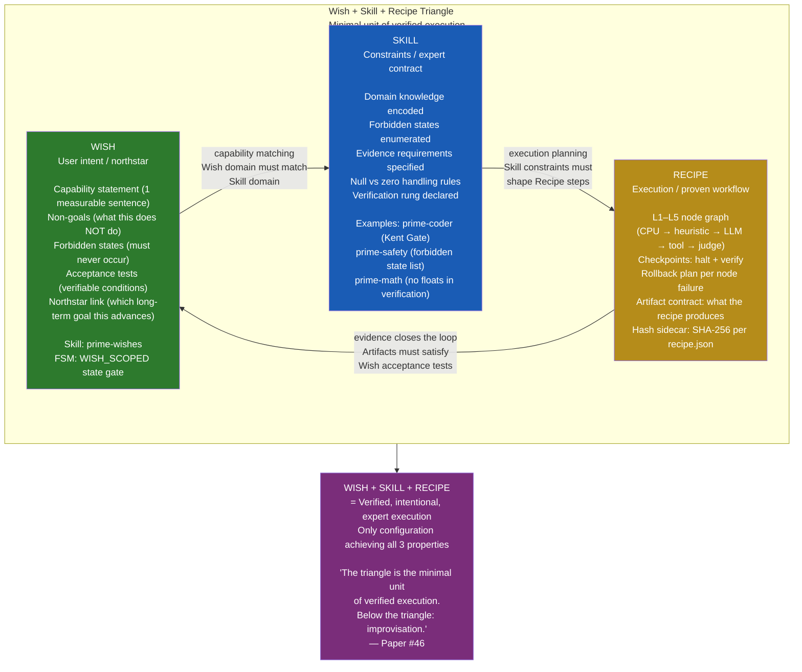
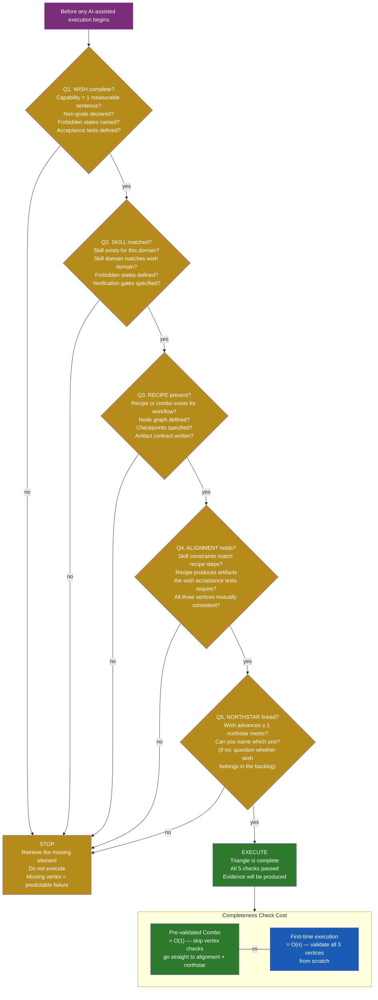
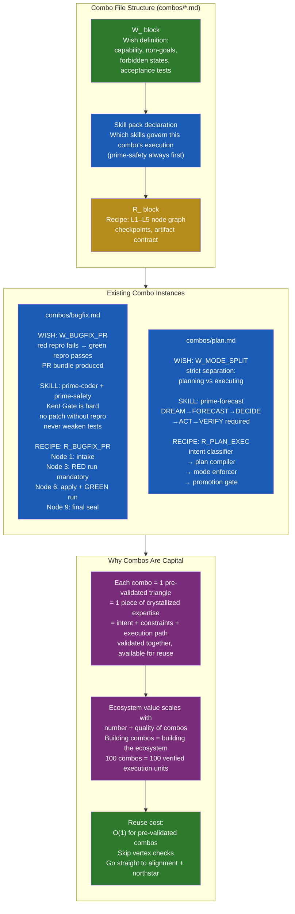

# Diagram 28: Wish + Skill + Recipe Triangle — The Fundamental Execution Model

**Description:** Companion diagram for Paper #46 (Wish+Skill+Recipe Triangle). Shows the three-vertex execution model, the characteristic failure mode for each missing vertex, the completeness check (5 questions), evidence flow through the triangle, and how Combos implement the triangle as pre-validated execution units.

---

## The Triangle: Three Vertices

---

## Failure Modes: What Happens When a Vertex Is Missing

```mermaid
flowchart TD
    classDef active fill:#2d7a2d,color:#fff
    classDef portal fill:#1a5cb5,color:#fff
    classDef gate fill:#b58c1a,color:#fff
    classDef store fill:#7a2d7a,color:#fff

    subgraph ONE_VERTEX["Single Vertex — Worst Degradation"]
        direction LR

        W_ONLY["WISH only\n(no Skill, no Recipe)\n\nUnconstrained execution\nAgent fulfills wish by any means\nIncluding unsafe ones\nNo acceptance test → over-executes\nChat-prompt paradigm:\ngoal-directed but unsafe + unreliable"]:::gate

        S_ONLY["SKILL only\n(no Wish, no Recipe)\n\nPurposeless expertise\nConstraints applied to undefined purpose\nSafety gates on a task not defined\nMathematically precise\nStrategically irrelevant"]:::gate

        R_ONLY["RECIPE only\n(no Wish, no Skill)\n\nAimless execution\nProven workflow produces artifacts\nthat nobody wanted\nNo domain expertise for edge cases\nFails silently on boundary conditions"]:::gate
    end

    subgraph TWO_VERTEX["Two Vertices — Partial Function"]
        direction LR

        WS["WISH + SKILL\n(no Recipe)\n\nExpert knowledge of goal\nPath improvised each time\nSafe but inconsistent\nDifferent execution per session\nExpertise unapplied to reproducible workflow"]:::portal

        WR["WISH + RECIPE\n(no Skill)\n\nReliable execution of wrong thing\nProven workflow runs predictably\nNo domain expertise for edge cases\nFails outside safety envelope\nIncorrect on boundary conditions"]:::portal

        SR["SKILL + RECIPE\n(no Wish)\n\nExpert, reliable — no purpose\nBoth safe and proven\nProduces artifacts nobody asked for\nConstraints not connected to user goal\nInverse of aimless recipe case"]:::portal
    end

    ONE_VERTEX --> TWO_VERTEX

    ALL_THREE["WISH + SKILL + RECIPE\nAll 3 present + aligned\n\nVerified execution\nIntentional\nExpert\nReproducible\nEvidence-backed"]:::active

    TWO_VERTEX --> ALL_THREE
```

---

## The Completeness Check: 5 Questions

---

## Evidence Flow Through the Triangle

```mermaid
flowchart LR
    classDef active fill:#2d7a2d,color:#fff
    classDef portal fill:#1a5cb5,color:#fff
    classDef gate fill:#b58c1a,color:#fff
    classDef store fill:#7a2d7a,color:#fff

    subgraph DISPATCH["At Dispatch Time (phuc-orchestration)"]
        direction TB
        D1["Skill pack required\n(SKILL_LESS_DISPATCH → BLOCKED)"]:::gate
        D2["CNF capsule required\n(FORGOTTEN_CAPSULE → BLOCKED)\nCNF capsule = full wish context"]:::gate
        D1 & D2 --> D3["Dispatch permitted"]:::active
    end

    subgraph EXECUTION["At Execution Time (prime-wishes)"]
        direction TB
        E1["Wish must reach\nWISH_SCOPED state"]:::portal
        E2["WISH_WITHOUT_NONGOALS → BLOCKED"]:::gate
        E3["AMBIGUOUS_WISH → BLOCKED"]:::gate
        E1 --> E4["Wish validated"]:::active
        E2 & E3 -.->|"forbidden states\nblock progress"| E1
    end

    subgraph VERIFICATION["At Verification Time (prime-coder)"]
        direction TB
        V1["Recipe artifact contract\nspecifies required evidence"]:::gate
        V2["Lane A artifacts required:\ntests.json + PATCH_DIFF"]:::portal
        V3["UNWITNESSED_PASS → BLOCKED\n(no claim of success\nwithout artifact evidence)"]:::gate
        V1 --> V2
        V3 -.->|"blocked"| V2
        V2 --> V4["Rung achieved"]:::active
    end

    DISPATCH -->|"wish + skill delivered\nto sub-agent"| EXECUTION
    EXECUTION -->|"wish validated\nexecution begins"| VERIFICATION
    VERIFICATION -->|"evidence closes loop\nartifacts satisfy\nwish acceptance tests"| DONE["Triangle complete\nVerified execution\nEvidence bundle sealed"]:::store

    DONE -.->|"northstar metric advances\ntriangle crystallizes\nas Combo for reuse"| COMBO["Combo\n(pre-validated triangle)"]:::active
```

---

## Combos: Canonical Triangle Implementation

---

## Source Files

- `papers/46-wish-skill-recipe-triangle.md` — Foundational paper this diagram accompanies
- `combos/bugfix.md` — Bugfix combo (W_BUGFIX_PR + prime-coder + R_BUGFIX_PR)
- `combos/plan.md` — Plan combo (W_MODE_SPLIT + prime-forecast + R_PLAN_EXEC)
- `skills/prime-wishes.md` — Wish completeness enforcement
- `skills/prime-coder.md` — Evidence gate + UNWITNESSED_PASS forbidden state
- `skills/phuc-orchestration.md` — SKILL_LESS_DISPATCH + FORGOTTEN_CAPSULE enforcement
- `papers/49-three-pillars-software-5-kung-fu.md` — Triangle Law as LEC convention

---

## Coverage

- Triangle diagram with 3 vertices (WISH, SKILL, RECIPE) and 3 directed edges
- Each vertex: key properties, required fields, governing skill
- All 7 vertex combinations and their characteristic failure modes
- Completeness check: 5 questions with stop/execute outcomes
- O(1) vs O(n) complexity for pre-validated combos vs first-time executions
- Evidence flow: dispatch → execution → verification → evidence bundle
- 3 forbidden states that block progression (SKILL_LESS_DISPATCH, AMBIGUOUS_WISH, UNWITNESSED_PASS)
- Combo structure (W_ + skill pack + R_)
- Two concrete combo examples (bugfix + plan) with all three vertices shown
- Ecosystem capital argument: combos = crystallized expertise
