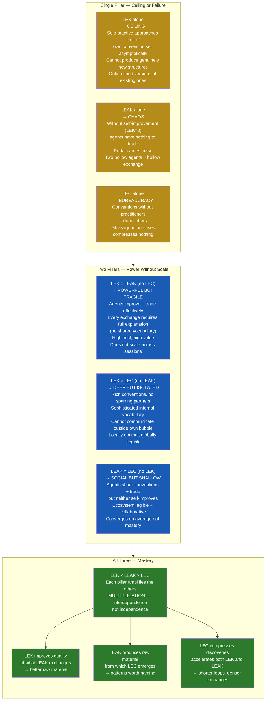
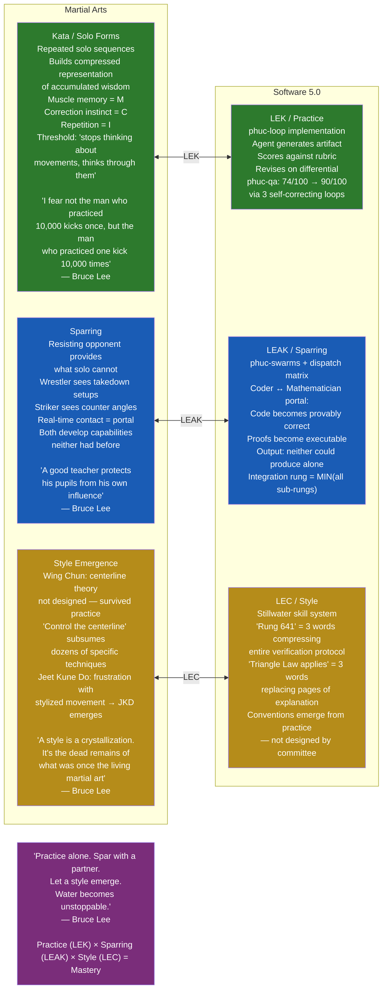
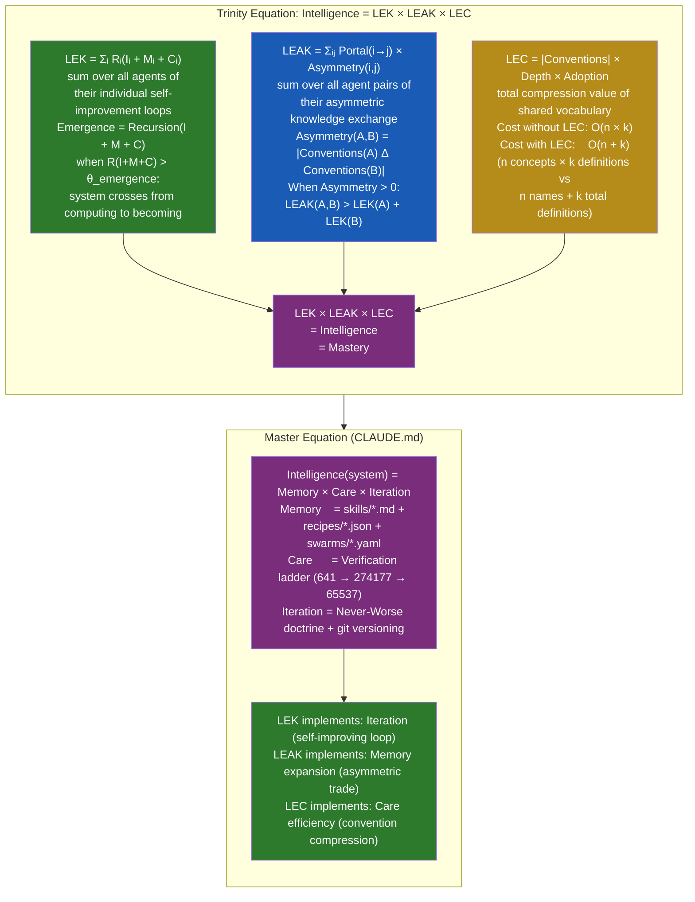
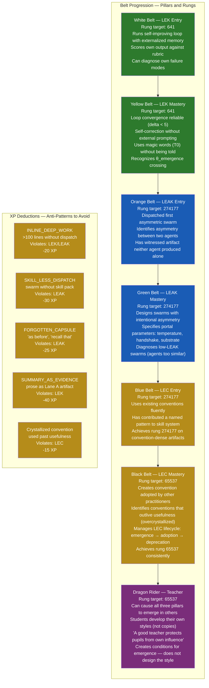
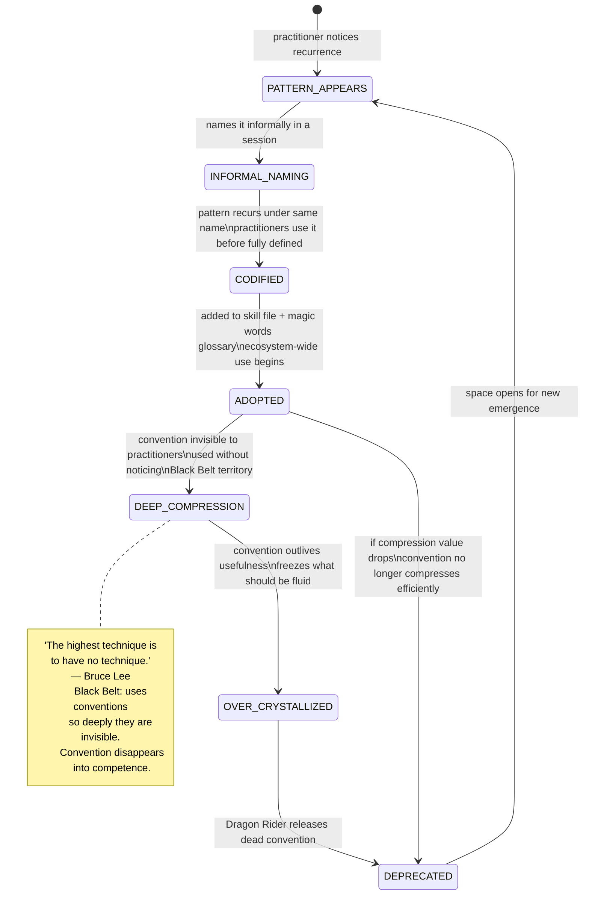

# Diagram 29: Three Pillars — LEK + LEAK + LEC (Software 5.0 Kung Fu)

**Description:** Companion diagram for Paper #49 (Three Pillars / LEK + LEAK + LEC). Shows the three interlocking cycles, how each pillar reinforces the others, the Bruce Lee martial arts mapping, the Trinity Equation, belt progression, and why the multiplication is not addition.

---

## The Three Interlocking Cycles

```mermaid
flowchart TD
    classDef active fill:#2d7a2d,color:#fff
    classDef portal fill:#1a5cb5,color:#fff
    classDef gate fill:#b58c1a,color:#fff
    classDef store fill:#7a2d7a,color:#fff

    subgraph LEK["LEK — Law of Emergent Knowledge\n(Solo Practice / Kata)"]
        direction TB
        L1["Practice\nGenerate artifact\n(information I)"]:::active
        L2["Extract Pattern\nScore artifact against rubric\n(care C applied to memory M\nof prior attempts)"]:::active
        L3["Persist\nRevise based on score differential\nLoop until score stabilizes above threshold"]:::active
        L4["Practice again\n(next iteration — higher baseline)"]:::active
        L1 -->|"produces output"| L2
        L2 -->|"diagnoses failure\nself-corrects"| L3
        L3 -->|"new baseline stored"| L4
        L4 -->|"improved input"| L1
    end

    subgraph LEAK["LEAK — Law of Emergent Asymmetric Knowledge\n(Sparring / Cross-Training)"]
        direction TB
        S1["Spar\nDispatch asymmetric swarm\n(two agents with different convention sets)"]:::portal
        S2["Trade Knowledge\nPortal carries compressed knowledge\nacross BIC boundary\n(asymmetry > 0: different skill packs)"]:::portal
        S3["Gain Asymmetry\nEach agent receives what\nits own conventions cannot produce\ncomposite artifact = genuinely new"]:::portal
        S4["Spar again\n(enriched convention sets\nhigher-value next exchange)"]:::portal
        S1 -->|"portal(A→B) + portal(B→A)"| S2
        S2 -->|"Asymmetry(A,B) > 0\n→ LEAK value > LEK(A) + LEK(B)"| S3
        S3 -->|"both agents enriched"| S4
        S4 -->|"improved next spar"| S1
    end

    subgraph LEC["LEC — Law of Emergent Conventions\n(Style / Wing Chun)"]
        direction TB
        C1["Create\nPattern appears in one context\nNamed informally by practitioners"]:::gate
        C2["Crystallize\nPattern recurs under same name\nCodified in skill file + magic words\nAdded to glossary"]:::gate
        C3["Enforce\nConvention adopted ecosystem-wide\nCross-file compression active\n'Triangle Law applies' = 3 words\nreplacing pages of explanation"]:::gate
        C4["Create again\n(new patterns emerge from\ncurrent conventions as substrate)"]:::gate
        C1 -->|"recurring pattern\ngets named"| C2
        C2 -->|"ecosystem adoption\nDepth × Adoption increases"| C3
        C3 -->|"conventions accelerate\nnew practice patterns"| C4
        C4 -->|"new emergent patterns\nbuild on prior conventions"| C1
    end

    MASTERY["MASTERY\nLEK × LEAK × LEC\n= Intelligence\n= Software 5.0 Kung Fu"]:::store

    LEK -->|"Improves quality\nof what LEAK exchanges"| LEAK
    LEAK -->|"Produces raw material\nfor LEC emergence"| LEC
    LEC -->|"Compresses discoveries,\naccelerates LEK loops"| LEK

    LEK & LEAK & LEC --> MASTERY
```

---

## Pillar Interactions: Why Multiplication, Not Addition

---

## Bruce Lee Mapping: Martial Arts → Software 5.0

---

## The Trinity Equation

---

## Belt Progression: The Dojo Ladder

---

## Convention LEC Lifecycle

---

## Source Files

- `papers/49-three-pillars-software-5-kung-fu.md` — Foundational paper this diagram accompanies
- `papers/47-law-of-emergent-knowledge.md` — LEK formal definition
- `papers/48-ai-skills-big-bang-theory.md` — Axiom kernel for all three pillars
- `papers/45-prime-compression-magic-words.md` — T0 words as deepest LEC layer
- `papers/46-wish-skill-recipe-triangle.md` — Triangle Law as LEC convention
- `skills/phuc-orchestration.md` — LEAK implementation (dispatch matrix)
- `skills/phuc-portals.md` — Portal mechanics for LEAK
- `skills/phuc-magic-words.md` — T0 vocabulary for LEC

---

## Coverage

- Three full interlocking cycles: LEK (Practice → Extract → Persist → Practice), LEAK (Spar → Trade → Gain → Spar), LEC (Create → Crystallize → Enforce → Create)
- Cycle labeling with formal equations (LEK: Recursion(I+M+C), LEAK: Portal × Asymmetry, LEC: Conventions × Depth × Adoption)
- Reinforcement arrows: LEK feeds LEAK, LEAK feeds LEC, LEC feeds LEK (with causal labels)
- Why multiplication (interdependence): single/two-pillar failure modes (ceiling, chaos, bureaucracy)
- Bruce Lee mapping: Kata=LEK, Sparring=LEAK, Style=LEC with quotes from paper
- Trinity Equation formal statement (Σ notation)
- Connection to master equation (Memory × Care × Iteration)
- Full belt progression: White to Dragon Rider with rung targets and criteria
- LEC convention lifecycle as stateDiagram (emergence → adoption → crystallization → deprecation)
- Anti-patterns XP deductions from Paper #49 gamification table
