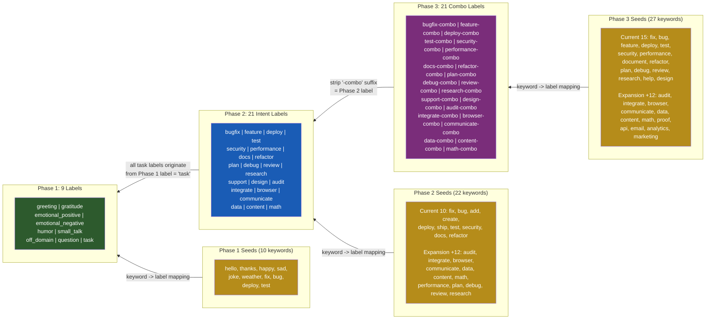

# Diagram 30: Reverse Cascade — Full Trace (Phase 3 to Phase 1)

**Description:** Complete reverse trace from Phase 3 execution combos backwards through
Phase 2 intent labels and Phase 1 small-talk classification, showing how 21 combos resolve
through the CascadeResolver convention, their agents, skills, personas, and model tiers.
Also shows the forward cascade path from user input to execution.

---

## Forward Cascade: User Input to Execution

```mermaid
flowchart TD
    classDef phase1 fill:#2d5a2d,color:#fff
    classDef phase2 fill:#1a5cb5,color:#fff
    classDef phase3 fill:#7a2d7a,color:#fff
    classDef convention fill:#b58c1a,color:#fff
    classDef combo fill:#1e2d40,color:#cdd9e5,stroke:#4a6fa5

    INPUT([User Input]) --> P1

    subgraph P1["Phase 1: Small Talk Twin (threshold 0.70)"]
        direction TB
        P1_CPU["CPU Learner\n10 seed keywords\n9 labels"]:::phase1
        P1_LABELS["Labels:\ngreeting | gratitude | emotional_positive\nemotional_negative | humor | small_talk\noff_domain | question | task"]:::phase1
        P1_CPU --> P1_LABELS
    end

    P1 -->|"label = task"| P2

    subgraph P2["Phase 2: Intent Twin (threshold 0.80)"]
        direction TB
        P2_CPU["CPU Learner\n10 seed keywords\n14 labels (expanding to 21)"]:::phase2
        P2_LABELS["Current labels (14):\nbugfix | feature | deploy | test | security\nperformance | docs | refactor | plan | debug\nreview | research | support | integrate\n\nExpansion labels (+7):\nbrowser | communicate | data | content\nmath | design | audit"]:::phase2
        P2_CPU --> P2_LABELS
    end

    P2 -->|"label = wish_id"| CONVENTION

    subgraph CONVENTION["CascadeResolver Convention"]
        direction TB
        CONV1["combo_id = f'{wish_id}-combo'\nRails-style naming convention"]:::convention
        CONV2["CascadeResolver.resolve(wish_id)\n  1. Look up wish in wishes.md\n  2. Derive combo_id = '{wish_id}-combo'\n  3. Load combos/{combo_id}.md\n  4. Return ExecutionPlan"]:::convention
        CONV1 --> CONV2
    end

    CONVENTION --> P3

    subgraph P3["Phase 3: Execution Twin (threshold 0.90)"]
        direction TB
        P3_CPU["CPU Learner\n15 seed keywords (expanding to 27)\n16 combo labels (expanding to 21)"]:::phase3
        P3_EXEC["ExecutionPlan:\n  agents: list\n  skills: list\n  rung_target: int\n  model_tier: str"]:::phase3
        P3_CPU --> P3_EXEC
    end

    P3 --> DISPATCH([Dispatch Swarm])
```



---

## Reverse Cascade: Phase 3 Backwards to Seeds



---

## All 21 Combos: Agents, Skills, Personas, Model Tiers

```mermaid
flowchart TD
    classDef haiku fill:#2d5a2d,color:#fff
    classDef sonnet fill:#1a5cb5,color:#fff
    classDef opus fill:#9b2335,color:#fff
    classDef header fill:#1e2d40,color:#cdd9e5,stroke:#4a6fa5

    TITLE["21 Combos — Full Expansion\n(grouped by model tier)"]:::header

    subgraph HAIKU_TIER["HAIKU TIER (3 combos)"]
        direction TB
        H1["docs-combo\nagent: writer\nskills: prime-safety\npersona: Richard Feynman\nrung: 641"]:::haiku
        H2["research-combo\nagent: scout\nskills: prime-safety + phuc-forecast\npersona: Ken Thompson\nrung: 641"]:::haiku
        H3["support-combo\nagent: support\nskills: prime-safety\npersona: --\nrung: 641"]:::haiku
    end

    subgraph SONNET_TIER["SONNET TIER (15 combos)"]
        direction TB
        S1["bugfix-combo\nagents: coder + skeptic\nskills: prime-safety + prime-coder\npersona: Donald Knuth\nrung: 641"]:::sonnet
        S2["feature-combo\nagent: coder\nskills: prime-safety + prime-coder\npersona: Donald Knuth\nrung: 641"]:::sonnet
        S3["deploy-combo\nagent: coder\nskills: prime-safety + devops\npersona: Mitchell Hashimoto\nrung: 641"]:::sonnet
        S4["test-combo\nagent: coder\nskills: prime-safety + prime-coder\npersona: Kent Beck\nrung: 641"]:::sonnet
        S5["performance-combo\nagent: coder\nskills: prime-safety + prime-coder\npersona: Brendan Gregg\nrung: 641"]:::sonnet
        S6["refactor-combo\nagent: coder\nskills: prime-safety + prime-coder\npersona: Martin Fowler\nrung: 641"]:::sonnet
        S7["plan-combo\nagent: planner\nskills: prime-safety + phuc-forecast\npersona: Grace Hopper\nrung: 641"]:::sonnet
        S8["debug-combo\nagent: coder\nskills: prime-safety + prime-coder\npersona: Grace Hopper\nrung: 641"]:::sonnet
        S9["review-combo\nagent: skeptic\nskills: prime-safety + prime-coder\npersona: Alan Turing\nrung: 641"]:::sonnet
        S10["design-combo\nagent: planner\nskills: prime-safety + prime-coder\npersona: Barbara Liskov\nrung: 641"]:::sonnet
        S11["integrate-combo\nagent: coder\nskills: prime-safety + prime-coder + prime-api\npersona: Roy Fielding\nrung: 641"]:::sonnet
        S12["browser-combo\nagent: twin-agent\nskills: prime-safety + prime-browser\npersona: Tim Berners-Lee\nrung: 641"]:::sonnet
        S13["communicate-combo\nagent: coder\nskills: prime-safety + prime-coder + prime-api\npersona: Ray Tomlinson\nrung: 641"]:::sonnet
        S14["data-combo\nagent: coder\nskills: prime-safety + prime-coder + prime-data\npersona: Jeff Dean\nrung: 641"]:::sonnet
        S15["content-combo\nagents: writer + social-media\nskills: prime-safety + prime-docs\npersona: Seth Godin\nrung: 641"]:::sonnet
    end

    subgraph OPUS_TIER["OPUS TIER (3 combos)"]
        direction TB
        O1["security-combo\nagent: security-auditor\nskills: prime-safety + security\npersona: Bruce Schneier\nrung: 65537"]:::opus
        O2["audit-combo\nagent: security-auditor\nskills: prime-safety + security\npersona: Linus Torvalds\nrung: 274177"]:::opus
        O3["math-combo\nagent: mathematician\nskills: prime-safety + prime-math\npersona: Emmy Noether\nrung: 274177"]:::opus
    end

    TITLE --> HAIKU_TIER & SONNET_TIER & OPUS_TIER
```



---

## Detailed Resolution Chain: Label to Combo to Agents

```mermaid
flowchart LR
    classDef label fill:#1a5cb5,color:#fff
    classDef combo fill:#7a2d7a,color:#fff
    classDef agent fill:#2d5a2d,color:#fff
    classDef skill fill:#b58c1a,color:#fff

    subgraph LABELS["Phase 2 Labels (21)"]
        direction TB
        L_bugfix["bugfix"]:::label
        L_feature["feature"]:::label
        L_deploy["deploy"]:::label
        L_test["test"]:::label
        L_security["security"]:::label
        L_perf["performance"]:::label
        L_docs["docs"]:::label
        L_refactor["refactor"]:::label
        L_plan["plan"]:::label
        L_debug["debug"]:::label
        L_review["review"]:::label
        L_research["research"]:::label
        L_support["support"]:::label
        L_design["design"]:::label
        L_audit["audit"]:::label
        L_integrate["integrate"]:::label
        L_browser["browser"]:::label
        L_communicate["communicate"]:::label
        L_data["data"]:::label
        L_content["content"]:::label
        L_math["math"]:::label
    end

    subgraph COMBOS["Combos (convention: {label}-combo)"]
        direction TB
        C_bugfix["bugfix-combo"]:::combo
        C_feature["feature-combo"]:::combo
        C_deploy["deploy-combo"]:::combo
        C_test["test-combo"]:::combo
        C_security["security-combo"]:::combo
        C_perf["performance-combo"]:::combo
        C_docs["docs-combo"]:::combo
        C_refactor["refactor-combo"]:::combo
        C_plan["plan-combo"]:::combo
        C_debug["debug-combo"]:::combo
        C_review["review-combo"]:::combo
        C_research["research-combo"]:::combo
        C_support["support-combo"]:::combo
        C_design["design-combo"]:::combo
        C_audit["audit-combo"]:::combo
        C_integrate["integrate-combo"]:::combo
        C_browser["browser-combo"]:::combo
        C_communicate["communicate-combo"]:::combo
        C_data["data-combo"]:::combo
        C_content["content-combo"]:::combo
        C_math["math-combo"]:::combo
    end

    subgraph AGENTS["Agent Types"]
        direction TB
        A_coder["coder"]:::agent
        A_skeptic["skeptic"]:::agent
        A_planner["planner"]:::agent
        A_writer["writer"]:::agent
        A_scout["scout"]:::agent
        A_secaudit["security-auditor"]:::agent
        A_support["support"]:::agent
        A_twin["twin-agent"]:::agent
        A_social["social-media"]:::agent
        A_math["mathematician"]:::agent
    end

    L_bugfix --> C_bugfix --> A_coder & A_skeptic
    L_feature --> C_feature --> A_coder
    L_deploy --> C_deploy --> A_coder
    L_test --> C_test --> A_coder
    L_security --> C_security --> A_secaudit
    L_perf --> C_perf --> A_coder
    L_docs --> C_docs --> A_writer
    L_refactor --> C_refactor --> A_coder
    L_plan --> C_plan --> A_planner
    L_debug --> C_debug --> A_coder
    L_review --> C_review --> A_skeptic
    L_research --> C_research --> A_scout
    L_support --> C_support --> A_support
    L_design --> C_design --> A_planner
    L_audit --> C_audit --> A_secaudit
    L_integrate --> C_integrate --> A_coder
    L_browser --> C_browser --> A_twin
    L_communicate --> C_communicate --> A_coder
    L_data --> C_data --> A_coder
    L_content --> C_content --> A_writer & A_social
    L_math --> C_math --> A_math
```



---

## Seed Cascade: Keywords Through All Three Phases

```mermaid
flowchart TD
    classDef seed fill:#b58c1a,color:#fff
    classDef phase1 fill:#2d5a2d,color:#fff
    classDef phase2 fill:#1a5cb5,color:#fff
    classDef phase3 fill:#7a2d7a,color:#fff

    subgraph EXAMPLE_FIX["Example: keyword 'fix'"]
        direction LR
        FIX_P1["Phase 1 seed:\nkeyword='fix' -> label='task'\ncount=25, conf=0.8824"]:::phase1
        FIX_P2["Phase 2 seed:\nkeyword='fix' -> label='bugfix'\ncount=25, conf=0.8824"]:::phase2
        FIX_P3["Phase 3 seed:\nkeyword='fix' -> label='bugfix-combo'\ncount=35, conf=0.9130"]:::phase3
        FIX_P1 -->|"classified as task"| FIX_P2
        FIX_P2 -->|"intent = bugfix"| FIX_P3
    end

    subgraph EXAMPLE_DEPLOY["Example: keyword 'deploy'"]
        direction LR
        DEP_P1["Phase 1 seed:\nkeyword='deploy' -> label='task'\ncount=25, conf=0.8824"]:::phase1
        DEP_P2["Phase 2 seed:\nkeyword='deploy' -> label='deploy'\ncount=25, conf=0.8824"]:::phase2
        DEP_P3["Phase 3 seed:\nkeyword='deploy' -> label='deploy-combo'\ncount=35, conf=0.9130"]:::phase3
        DEP_P1 -->|"classified as task"| DEP_P2
        DEP_P2 -->|"intent = deploy"| DEP_P3
    end

    subgraph EXAMPLE_HELLO["Example: keyword 'hello'"]
        direction LR
        HI_P1["Phase 1 seed:\nkeyword='hello' -> label='greeting'\ncount=25, conf=0.8824"]:::phase1
        HI_STOP["STOP: small talk\nNo Phase 2 or Phase 3"]
        HI_P1 -->|"classified as greeting"| HI_STOP
    end

    subgraph NEW_KEYWORD["Example: new keyword 'integrate' (no seed)"]
        direction LR
        INT_P1["Phase 1:\nno seed -> LLM validates\nlabel='task', learned"]:::phase1
        INT_P2["Phase 2:\nno seed -> LLM validates\nlabel='integrate', learned"]:::phase2
        INT_P3["Phase 3:\nno seed -> LLM validates\nlabel='integrate-combo', learned"]:::phase3
        INT_P1 -->|"below threshold -> LLM"| INT_P2
        INT_P2 -->|"below threshold -> LLM"| INT_P3
    end
```



---

## Explanation

### What This Diagram Shows

The reverse cascade traces how execution decisions are built bottom-up from seed
keywords through three phases of increasing precision:

1. **Phase 1 (Small Talk Twin)** uses 10 seed keywords to classify input into 9
   labels. Only the label `task` advances to Phase 2. The threshold is 0.70 --
   the cheapest possible gate.

2. **Phase 2 (Intent Twin)** uses 10 seed keywords (expanding to 22) to classify
   tasks into 14 intent labels (expanding to 21). The threshold is 0.80 -- higher
   because intent misclassification wastes an agent dispatch.

3. **Phase 3 (Execution Twin)** uses 15 seed keywords (expanding to 27) to map
   intents to 16 combo labels (expanding to 21). The threshold is 0.90 -- highest
   because execution errors are the most costly.

### The Convention

The `CascadeResolver` uses a Rails-style naming convention:
```
combo_id = f"{wish_id}-combo"
```

This means no mapping file is needed. The convention IS the mapping. A Phase 2
label of `bugfix` automatically resolves to `bugfix-combo` in the `combos/` directory.

### The 21-Combo Expansion

The current system has 15 combos. The planned expansion adds 6 new combos:
- **integrate-combo** -- API integration tasks (Roy Fielding persona)
- **browser-combo** -- web automation tasks (Tim Berners-Lee persona)
- **communicate-combo** -- email/messaging tasks (Ray Tomlinson persona)
- **data-combo** -- data/analytics tasks (Jeff Dean persona)
- **content-combo** -- content/marketing tasks (Seth Godin persona)
- **math-combo** -- mathematical proof tasks (Emmy Noether persona)

### Reverse Trace

Reading the diagram right-to-left:
```
Phase 3 combo label (e.g. "bugfix-combo")
  <- strip "-combo" suffix = Phase 2 intent label ("bugfix")
    <- all intent labels originate from Phase 1 label = "task"
      <- user input classified by CPU learner or LLM validator
```

### Forward Trace

Reading the diagram left-to-right:
```
User input -> Phase 1 CPU (or LLM fallback) -> label="task"
  -> Phase 2 CPU (or LLM fallback) -> label="bugfix"
    -> CascadeResolver.resolve("bugfix") -> combo_id="bugfix-combo"
      -> Phase 3 CPU (or LLM fallback) -> ExecutionPlan(agents, skills, rung, model)
        -> Dispatch swarm
```

---

## Cross-References

- **Diagram 10** (Swarm Dispatch) -- The dispatch matrix that Phase 3 feeds into
- **Diagram 11** (Persona Engine) -- How personas are loaded into agent skill packs
- **Diagram 31** (OpenClaw Coverage Matrix) -- How the 21 combos map to OpenClaw's categories
- **Diagram 32** (Seed-Label Consistency) -- Verification that all seeds map correctly
- **Diagram 33** (Persona-Combo Mapping) -- Full persona chain for all 21 combos

## Source Files

- `src/cli/src/stillwater/cascade.py` -- CascadeResolver implementation
- `src/cli/src/stillwater/triple_twin.py` -- TripleTwinEngine (Phase 1/2/3 pipeline)
- `src/cli/src/stillwater/cpu_learner.py` -- CPULearner (keyword-to-label prediction)
- `data/default/cpu-nodes/small-talk.md` -- Phase 1 CPU node config (9 labels)
- `data/default/cpu-nodes/intent-match.md` -- Phase 2 CPU node config (14 labels)
- `data/default/cpu-nodes/execution-match.md` -- Phase 3 CPU node config (16 labels)
- `data/default/seeds/small-talk-seeds.jsonl` -- Phase 1 seed keywords (10)
- `data/default/seeds/intent-seeds.jsonl` -- Phase 2 seed keywords (10)
- `data/default/seeds/execution-seeds.jsonl` -- Phase 3 seed keywords (15)
- `data/default/combos/*.md` -- Combo definitions (15 current, 21 planned)

## Coverage

- Complete forward cascade: user input -> Phase 1 -> Phase 2 -> CascadeResolver -> Phase 3 -> ExecutionPlan
- Complete reverse cascade: Phase 3 labels <- Phase 2 labels <- Phase 1 labels <- seed keywords
- All 21 combos listed with agents, skills, personas, model tiers, and rung targets
- CascadeResolver convention-over-configuration rule documented
- Seed keyword flow through all three phases with concrete examples
- LLM fallback path for unseen keywords shown
- Model tier grouping: haiku (3), sonnet (15), opus (3)
- Threshold progression: 0.70 -> 0.80 -> 0.90
