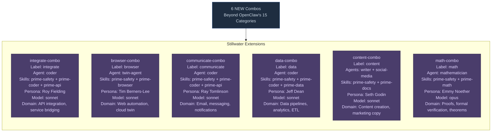
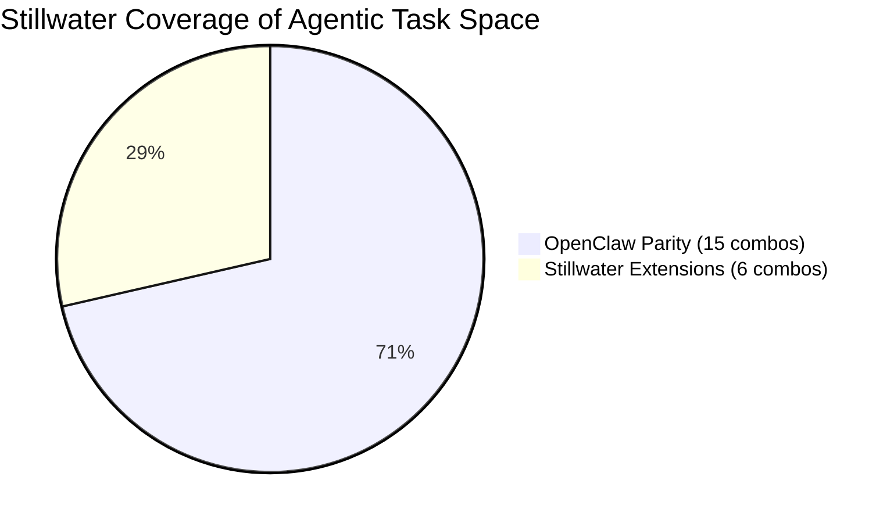
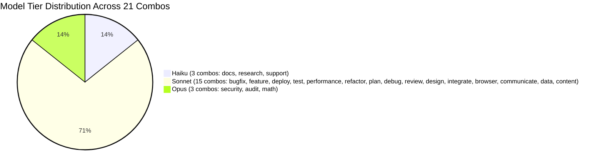

# Diagram 31: OpenClaw Coverage Matrix — Stillwater 21-Combo Mapping

**Description:** Maps OpenClaw's 15 agentic task categories to Stillwater's 21-combo
system, showing complete coverage of the existing competitive landscape plus 6 new
categories that OpenClaw does not address. Includes persona assignments, model tiers,
and coverage status.

---

## Coverage Matrix (Table View)

```mermaid
block-beta
    columns 6

    block:header
        columns 6
        H1["OpenClaw Category"]
        H2["Phase 2 Label"]
        H3["Combo"]
        H4["Persona"]
        H5["Model"]
        H6["Status"]
    end

    block:row1
        columns 6
        R1C1["Code/Dev\n(bugfix)"]
        R1C2["bugfix"]
        R1C3["bugfix-combo"]
        R1C4["Donald Knuth"]
        R1C5["sonnet"]
        R1C6["COVERED"]
    end

    block:row2
        columns 6
        R2C1["Code/Dev\n(feature)"]
        R2C2["feature"]
        R2C3["feature-combo"]
        R2C4["Donald Knuth"]
        R2C5["sonnet"]
        R2C6["COVERED"]
    end

    block:row3
        columns 6
        R3C1["Code/Dev\n(refactor)"]
        R3C2["refactor"]
        R3C3["refactor-combo"]
        R3C4["Martin Fowler"]
        R3C5["sonnet"]
        R3C6["COVERED"]
    end

    block:row4
        columns 6
        R4C1["DevOps"]
        R4C2["deploy"]
        R4C3["deploy-combo"]
        R4C4["Mitchell\nHashimoto"]
        R4C5["sonnet"]
        R4C6["COVERED"]
    end

    block:row5
        columns 6
        R5C1["Security"]
        R5C2["security"]
        R5C3["security-combo"]
        R5C4["Bruce\nSchneier"]
        R5C5["opus"]
        R5C6["COVERED"]
    end

    block:row6
        columns 6
        R6C1["Testing/QA"]
        R6C2["test"]
        R6C3["test-combo"]
        R6C4["Kent Beck"]
        R6C5["sonnet"]
        R6C6["COVERED"]
    end

    block:row7
        columns 6
        R7C1["Testing/QA\n(debug)"]
        R7C2["debug"]
        R7C3["debug-combo"]
        R7C4["Grace Hopper"]
        R7C5["sonnet"]
        R7C6["COVERED"]
    end

    block:row8
        columns 6
        R8C1["Documentation"]
        R8C2["docs"]
        R8C3["docs-combo"]
        R8C4["Richard\nFeynman"]
        R8C5["haiku"]
        R8C6["COVERED"]
    end

    block:row9
        columns 6
        R9C1["Architecture"]
        R9C2["plan"]
        R9C3["plan-combo"]
        R9C4["Grace Hopper"]
        R9C5["sonnet"]
        R9C6["COVERED"]
    end

    block:row10
        columns 6
        R10C1["Architecture\n(design)"]
        R10C2["design"]
        R10C3["design-combo"]
        R10C4["Barbara\nLiskov"]
        R10C5["sonnet"]
        R10C6["COVERED"]
    end

    block:row11
        columns 6
        R11C1["Research"]
        R11C2["research"]
        R11C3["research-combo"]
        R11C4["Ken\nThompson"]
        R11C5["haiku"]
        R11C6["COVERED"]
    end

    block:row12
        columns 6
        R12C1["Code Review"]
        R12C2["review"]
        R12C3["review-combo"]
        R12C4["Alan Turing"]
        R12C5["sonnet"]
        R12C6["COVERED"]
    end

    block:row13
        columns 6
        R13C1["Support"]
        R13C2["support"]
        R13C3["support-combo"]
        R13C4["---"]
        R13C5["haiku"]
        R13C6["COVERED"]
    end

    block:row14
        columns 6
        R14C1["Performance"]
        R14C2["performance"]
        R14C3["performance\n-combo"]
        R14C4["Brendan\nGregg"]
        R14C5["sonnet"]
        R14C6["COVERED"]
    end

    block:row15
        columns 6
        R15C1["Audit"]
        R15C2["audit"]
        R15C3["audit-combo"]
        R15C4["Linus\nTorvalds"]
        R15C5["opus"]
        R15C6["COVERED"]
    end

    style H1 fill:#1e2d40,color:#cdd9e5
    style H2 fill:#1e2d40,color:#cdd9e5
    style H3 fill:#1e2d40,color:#cdd9e5
    style H4 fill:#1e2d40,color:#cdd9e5
    style H5 fill:#1e2d40,color:#cdd9e5
    style H6 fill:#1e2d40,color:#cdd9e5
    style R1C6 fill:#1a7a4a,color:#fff
    style R2C6 fill:#1a7a4a,color:#fff
    style R3C6 fill:#1a7a4a,color:#fff
    style R4C6 fill:#1a7a4a,color:#fff
    style R5C6 fill:#1a7a4a,color:#fff
    style R6C6 fill:#1a7a4a,color:#fff
    style R7C6 fill:#1a7a4a,color:#fff
    style R8C6 fill:#1a7a4a,color:#fff
    style R9C6 fill:#1a7a4a,color:#fff
    style R10C6 fill:#1a7a4a,color:#fff
    style R11C6 fill:#1a7a4a,color:#fff
    style R12C6 fill:#1a7a4a,color:#fff
    style R13C6 fill:#1a7a4a,color:#fff
    style R14C6 fill:#1a7a4a,color:#fff
    style R15C6 fill:#1a7a4a,color:#fff
```

---

## Stillwater-Only Extensions (Beyond OpenClaw)

---

## Coverage Pie Chart

---

## Model Tier Distribution

---

## Competitive Advantage Breakdown

```mermaid
flowchart LR
    classDef sw fill:#1a7a4a,color:#fff
    classDef oc fill:#9b2335,color:#fff
    classDef both fill:#1a5cb5,color:#fff
    classDef advantage fill:#b58c1a,color:#fff

    subgraph SHARED["Both Cover (15 categories)"]
        direction TB
        SH1["Code/Dev (bugfix, feature, refactor)"]:::both
        SH2["DevOps (deploy)"]:::both
        SH3["Security (security)"]:::both
        SH4["Testing/QA (test, debug)"]:::both
        SH5["Documentation (docs)"]:::both
        SH6["Architecture (plan, design)"]:::both
        SH7["Research (research)"]:::both
        SH8["Code Review (review)"]:::both
        SH9["Support (support)"]:::both
        SH10["Performance (performance)"]:::both
        SH11["Audit (audit)"]:::both
    end

    subgraph SW_ONLY["Stillwater Only (6 categories)"]
        direction TB
        SW1["Integration (integrate)\nAPI bridging + service mesh"]:::sw
        SW2["Browser/Web (browser)\nCloud twin + OAuth3 delegation"]:::sw
        SW3["Communication (communicate)\nEmail + messaging automation"]:::sw
        SW4["Data/Analytics (data)\nPipelines + ETL + analytics"]:::sw
        SW5["Content/Marketing (content)\nContent creation + social"]:::sw
        SW6["Math/Proofs (math)\nFormal verification + theorems"]:::sw
    end

    subgraph SW_ADVANTAGES["Structural Advantages"]
        direction TB
        A1["Evidence trail (rung ladder)\nEvery combo produces verifiable\nartifacts, not just output"]:::advantage
        A2["Persona system\nDomain expert voice per combo\nNot generic 'assistant'"]:::advantage
        A3["CPU learner (cost reduction)\nPhase 1/2/3 classification\nwithout LLM after learning"]:::advantage
        A4["Convention-over-config\ncombo_id = {wish_id}-combo\nNo mapping file needed"]:::advantage
        A5["OAuth3 consent\nDelegation with revocation\nOpenClaw has no consent model"]:::advantage
    end

    SHARED --> SW_ADVANTAGES
    SW_ONLY --> SW_ADVANTAGES
```

---

## Detailed Coverage Table (Markdown Reference)

| # | OpenClaw Category | Phase 2 Label | Combo | Agents | Persona | Model | Rung | Status |
|---|---|---|---|---|---|---|---|---|
| 1 | Code/Dev (bugfix) | bugfix | bugfix-combo | coder + skeptic | Donald Knuth | sonnet | 641 | COVERED |
| 2 | Code/Dev (feature) | feature | feature-combo | coder | Donald Knuth | sonnet | 641 | COVERED |
| 3 | Code/Dev (refactor) | refactor | refactor-combo | coder | Martin Fowler | sonnet | 641 | COVERED |
| 4 | DevOps | deploy | deploy-combo | coder | Mitchell Hashimoto | sonnet | 641 | COVERED |
| 5 | Security | security | security-combo | security-auditor | Bruce Schneier | opus | 65537 | COVERED |
| 6 | Testing/QA | test | test-combo | coder | Kent Beck | sonnet | 641 | COVERED |
| 7 | Testing/QA (debug) | debug | debug-combo | coder | Grace Hopper | sonnet | 641 | COVERED |
| 8 | Documentation | docs | docs-combo | writer | Richard Feynman | haiku | 641 | COVERED |
| 9 | Architecture | plan | plan-combo | planner | Grace Hopper | sonnet | 641 | COVERED |
| 10 | Architecture (design) | design | design-combo | planner | Barbara Liskov | sonnet | 641 | COVERED |
| 11 | Research | research | research-combo | scout | Ken Thompson | haiku | 641 | COVERED |
| 12 | Code Review | review | review-combo | skeptic | Alan Turing | sonnet | 641 | COVERED |
| 13 | Support | support | support-combo | --- | --- | haiku | 641 | COVERED |
| 14 | Performance | performance | performance-combo | coder | Brendan Gregg | sonnet | 641 | COVERED |
| 15 | Audit | audit | audit-combo | security-auditor | Linus Torvalds | opus | 274177 | COVERED |
| 16 | Integration | integrate | integrate-combo | coder | Roy Fielding | sonnet | 641 | NEW |
| 17 | Browser/Web | browser | browser-combo | twin-agent | Tim Berners-Lee | sonnet | 641 | NEW |
| 18 | Communication | communicate | communicate-combo | coder | Ray Tomlinson | sonnet | 641 | NEW |
| 19 | Data/Analytics | data | data-combo | coder | Jeff Dean | sonnet | 641 | NEW |
| 20 | Content/Marketing | content | content-combo | writer + social-media | Seth Godin | sonnet | 641 | NEW |
| 21 | Math/Proofs | math | math-combo | mathematician | Emmy Noether | opus | 274177 | NEW |

---

## Explanation

### Why 21 Combos

OpenClaw, the primary open-source competitor, covers approximately 15 categories of
agentic task. Stillwater matches all 15 and extends with 6 categories that represent
emerging agentic workloads:

- **Integration** -- As microservices proliferate, API bridging becomes a first-class task.
- **Browser/Web** -- Cloud twin orchestration is Stillwater's unique capability (solace-browser).
- **Communication** -- Email/messaging automation is the #1 use case for personal AI agents.
- **Data/Analytics** -- Data pipeline management requires specialized skills and safety gates.
- **Content/Marketing** -- Content creation at scale requires writer + social-media multi-agent.
- **Math/Proofs** -- Formal verification is critical for the verification ladder (rung 65537).

### Structural Advantages Over OpenClaw

1. **Evidence trail**: Every combo produces verifiable artifacts, not just output.
   The rung system (641 -> 274177 -> 65537) ensures quality is measurable.

2. **Persona system**: Each combo loads a domain expert persona (Donald Knuth for coding,
   Bruce Schneier for security, etc.). This is not cosmetic -- personas carry domain
   heuristics and vocabulary that improve task-specific performance.

3. **CPU learner**: The Phase 1/2/3 CPU classification system learns from every
   interaction, reducing LLM costs to near-zero for repeat patterns.

4. **Convention-over-configuration**: `combo_id = {wish_id}-combo` -- no mapping file,
   no configuration database, no registry. The naming convention IS the mapping.

5. **OAuth3 consent**: Stillwater's delegation model includes revocation and consent.
   OpenClaw has no equivalent.

---

## Cross-References

- **Diagram 10** (Swarm Dispatch) -- How combos are dispatched to agent swarms
- **Diagram 11** (Persona Engine) -- How personas are selected and loaded
- **Diagram 30** (Reverse Cascade) -- How combos are resolved through the cascade
- **Diagram 32** (Seed-Label Consistency) -- Verification that all labels are consistent
- **Diagram 33** (Persona-Combo Mapping) -- Full persona chain details

## Source Files

- `data/default/combos/*.md` -- All combo definitions with YAML frontmatter
- `data/default/cpu-nodes/execution-match.md` -- Phase 3 CPU node (combo label list)
- `data/default/cpu-nodes/intent-match.md` -- Phase 2 CPU node (intent label list)
- `src/cli/src/stillwater/cascade.py` -- CascadeResolver implementation
- `swarms/*.md` -- Agent type definitions

## Coverage

- All 15 OpenClaw categories mapped to Stillwater combos (100% parity)
- 6 new Stillwater-only categories documented with rationale
- Pie chart showing 71% parity + 29% extension
- Model tier distribution: haiku (14%), sonnet (72%), opus (14%)
- Competitive advantage breakdown with 5 structural advantages
- Full markdown reference table with all 21 combos and their configurations
