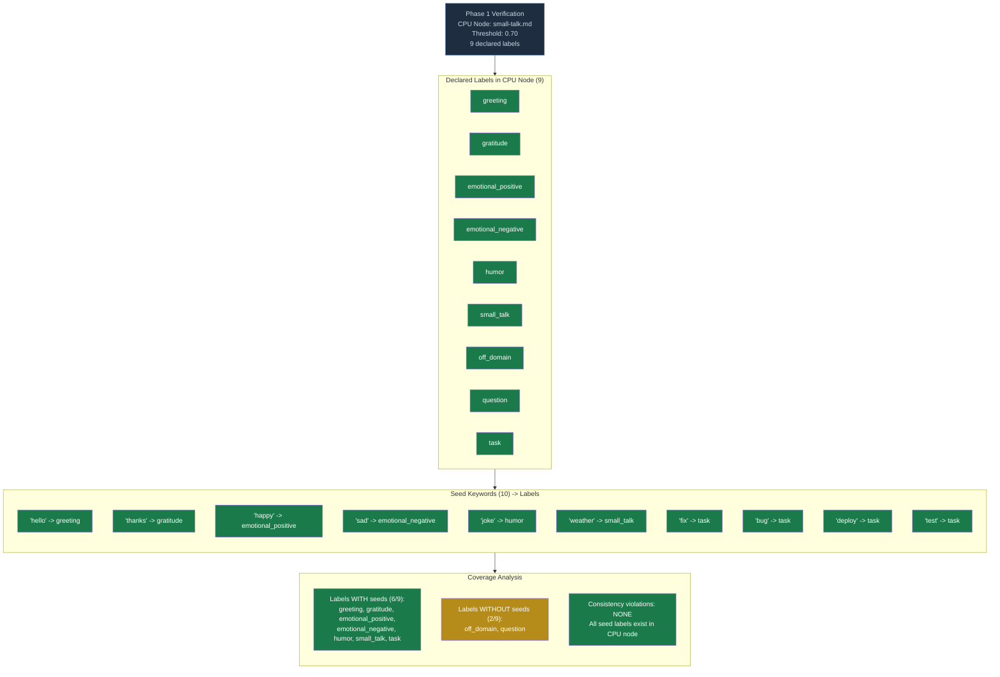
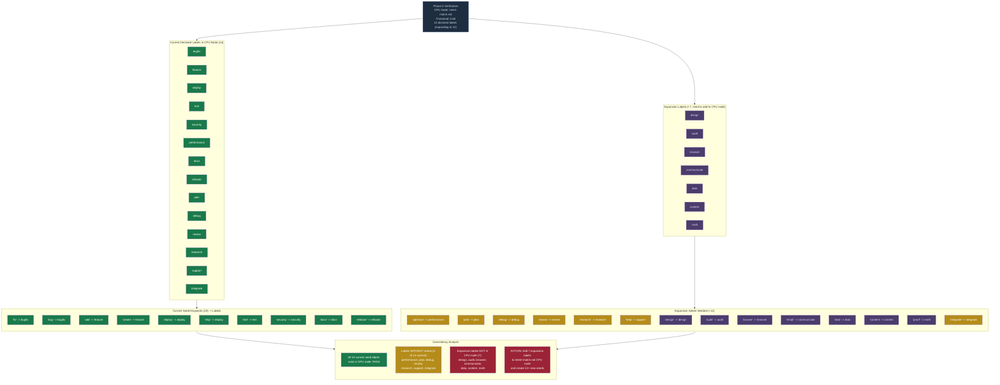

# Diagram 32: Seed-Label Consistency Verification Matrix

**Description:** Verification matrix showing ALL seed keywords mapped to their labels
and CPU node label lists across all three phases. Highlights any keyword that maps to
a label NOT present in the CPU node's declared label list -- these are consistency
violations that would cause silent failures at runtime.

---

## Phase 1: Small Talk Twin Verification



---

## Phase 2: Intent Twin Verification



---

## Phase 3: Execution Twin Verification

```mermaid
flowchart TD
    classDef valid fill:#1a7a4a,color:#fff
    classDef warn fill:#b58c1a,color:#fff
    classDef error fill:#9b2335,color:#fff
    classDef new fill:#4a3d6b,color:#e0d4ff
    classDef header fill:#1e2d40,color:#cdd9e5,stroke:#4a6fa5

    TITLE3["Phase 3 Verification\nCPU Node: execution-match.md\nThreshold: 0.90\n16 declared labels (expanding to 21)"]:::header

    subgraph P3_LABELS["Current Declared Labels in CPU Node (16)"]
        direction LR
        L1["bugfix-combo"]:::valid
        L2["feature-combo"]:::valid
        L3["deploy-combo"]:::valid
        L4["test-combo"]:::valid
        L5["security-combo"]:::valid
        L6["performance-combo"]:::valid
        L7["docs-combo"]:::valid
        L8["refactor-combo"]:::valid
        L9["plan-combo"]:::valid
        L10["debug-combo"]:::valid
        L11["review-combo"]:::valid
        L12["research-combo"]:::valid
        L13["support-combo"]:::valid
        L14["design-combo"]:::valid
        L15["audit-combo"]:::valid
        L16["integrate-combo"]:::valid
    end

    subgraph P3_EXPANSION["Expansion Labels (+5, need to add to CPU node)"]
        direction LR
        EL1["browser-combo"]:::new
        EL2["communicate-combo"]:::new
        EL3["data-combo"]:::new
        EL4["content-combo"]:::new
        EL5["math-combo"]:::new
    end

    subgraph P3_SEEDS["Current Seed Keywords (15) -> Labels"]
        direction TB
        S1["'fix' -> bugfix-combo"]:::valid
        S2["'bug' -> bugfix-combo"]:::valid
        S3["'feature' -> feature-combo"]:::valid
        S4["'deploy' -> deploy-combo"]:::valid
        S5["'test' -> test-combo"]:::valid
        S6["'security' -> security-combo"]:::valid
        S7["'performance' -> performance-combo"]:::valid
        S8["'document' -> docs-combo"]:::valid
        S9["'refactor' -> refactor-combo"]:::valid
        S10["'plan' -> plan-combo"]:::valid
        S11["'debug' -> debug-combo"]:::valid
        S12["'review' -> review-combo"]:::valid
        S13["'research' -> research-combo"]:::valid
        S14["'help' -> support-combo"]:::valid
        S15["'design' -> design-combo"]:::valid
    end

    subgraph P3_NEEDED_SEEDS["Expansion Seeds Needed (+12)"]
        direction TB
        NS1["'audit' -> audit-combo"]:::warn
        NS2["'integrate' -> integrate-combo"]:::warn
        NS3["'browse' -> browser-combo"]:::new
        NS4["'website' -> browser-combo"]:::new
        NS5["'email' -> communicate-combo"]:::new
        NS6["'message' -> communicate-combo"]:::new
        NS7["'data' -> data-combo"]:::new
        NS8["'analytics' -> data-combo"]:::new
        NS9["'content' -> content-combo"]:::new
        NS10["'marketing' -> content-combo"]:::new
        NS11["'proof' -> math-combo"]:::new
        NS12["'theorem' -> math-combo"]:::new
    end

    subgraph P3_ANALYSIS["Consistency Analysis"]
        direction TB
        A1["All 15 current seed labels exist in CPU node: PASS"]:::valid
        A2["Declared labels WITHOUT seeds (2 of 16):\naudit-combo, integrate-combo"]:::warn
        A3["Expansion labels NOT in CPU node (5):\nbrowser-combo, communicate-combo,\ndata-combo, content-combo, math-combo"]:::error
        A4["ACTION: Add 5 expansion labels\nto execution-match.md CPU node\nand create 12+ new seeds"]:::error
    end

    TITLE3 --> P3_LABELS & P3_EXPANSION
    P3_LABELS --> P3_SEEDS
    P3_EXPANSION --> P3_NEEDED_SEEDS
    P3_SEEDS & P3_NEEDED_SEEDS --> P3_ANALYSIS
```



---

## Cross-Phase Seed Consistency Verification

```mermaid
flowchart LR
    classDef valid fill:#1a7a4a,color:#fff
    classDef warn fill:#b58c1a,color:#fff
    classDef error fill:#9b2335,color:#fff
    classDef header fill:#1e2d40,color:#cdd9e5,stroke:#4a6fa5

    subgraph VERIFY["Cross-Phase Keyword Tracing"]
        direction TB

        TITLE["Verify: every Phase 3 seed keyword\nhas a valid path through Phase 1 and Phase 2"]:::header

        V1["'fix': P1(task) -> P2(bugfix) -> P3(bugfix-combo) = CONSISTENT"]:::valid
        V2["'bug': P1(task) -> P2(bugfix) -> P3(bugfix-combo) = CONSISTENT"]:::valid
        V3["'feature': P1(no seed) -> P2(no seed) -> P3(feature-combo) = GAP in P1+P2"]:::warn
        V4["'deploy': P1(task) -> P2(deploy) -> P3(deploy-combo) = CONSISTENT"]:::valid
        V5["'test': P1(task) -> P2(test) -> P3(test-combo) = CONSISTENT"]:::valid
        V6["'security': P1(no seed) -> P2(security) -> P3(security-combo) = GAP in P1"]:::warn
        V7["'performance': P1(no seed) -> P2(no seed) -> P3(performance-combo) = GAP in P1+P2"]:::warn
        V8["'document': P1(no seed) -> P2(no seed) -> P3(docs-combo) = GAP in P1+P2"]:::warn
        V9["'refactor': P1(no seed) -> P2(refactor) -> P3(refactor-combo) = GAP in P1"]:::warn
        V10["'plan': P1(no seed) -> P2(no seed) -> P3(plan-combo) = GAP in P1+P2"]:::warn
        V11["'debug': P1(no seed) -> P2(no seed) -> P3(debug-combo) = GAP in P1+P2"]:::warn
        V12["'review': P1(no seed) -> P2(no seed) -> P3(review-combo) = GAP in P1+P2"]:::warn
        V13["'research': P1(no seed) -> P2(no seed) -> P3(research-combo) = GAP in P1+P2"]:::warn
        V14["'help': P1(no seed) -> P2(no seed) -> P3(support-combo) = GAP in P1+P2"]:::warn
        V15["'design': P1(no seed) -> P2(no seed) -> P3(design-combo) = GAP in P1+P2"]:::warn

        TITLE --> V1 & V2 & V3 & V4 & V5
        TITLE --> V6 & V7 & V8 & V9 & V10
        TITLE --> V11 & V12 & V13 & V14 & V15
    end
```



---

## Verification Flow: Seed to Label to CPU Node

```mermaid
flowchart TD
    classDef valid fill:#1a7a4a,color:#fff
    classDef warn fill:#b58c1a,color:#fff
    classDef error fill:#9b2335,color:#fff
    classDef gate fill:#2c4f8c,color:#fff,stroke:#1a3060
    classDef header fill:#1e2d40,color:#cdd9e5,stroke:#4a6fa5

    START(["Verification Start"]) --> LOAD_SEEDS

    LOAD_SEEDS["Load all seed files\nsmall-talk-seeds.jsonl (10 records)\nintent-seeds.jsonl (10 records)\nexecution-seeds.jsonl (15 records)"]:::header

    LOAD_SEEDS --> LOAD_NODES

    LOAD_NODES["Load all CPU node configs\nsmall-talk.md (9 labels)\nintent-match.md (14 labels)\nexecution-match.md (16 labels)"]:::header

    LOAD_NODES --> CHECK_PHASE

    subgraph CHECK_PHASE["For Each Seed Record"]
        direction TB
        C1["Extract: phase, keyword, label"]:::gate
        C2{label in\nCPU node's\nlabels list?}
        C3["PASS: seed label is valid\nCPU node can classify to this label"]:::valid
        C4["FAIL: seed label NOT in CPU node\nAt runtime: CPU will assign label\nthat Phase 3 cannot match to a combo"]:::error
        C1 --> C2
        C2 -->|"YES"| C3
        C2 -->|"NO"| C4
    end

    CHECK_PHASE --> CROSS_CHECK

    subgraph CROSS_CHECK["Cross-Phase Consistency"]
        direction TB
        X1{For each P3 seed:\ndoes a P2 seed exist\nwith matching label\n(strip '-combo')?}
        X2["CONSISTENT: Full path seeded\nP1 -> P2 -> P3 all have seeds"]:::valid
        X3["GAP: P3 seed has no P2 partner\nLLM must classify first few\ninstances (higher cost)"]:::warn
        X1 -->|"YES"| X2
        X1 -->|"NO"| X3
    end

    CROSS_CHECK --> SUMMARY

    subgraph SUMMARY["Current State Summary"]
        direction TB
        SUM1["Phase 1: 10 seeds, 0 violations, 2 labels unseeded"]:::valid
        SUM2["Phase 2: 10 seeds, 0 violations, 4 labels unseeded\n+ 7 expansion labels not yet in CPU node"]:::warn
        SUM3["Phase 3: 15 seeds, 0 violations, 2 labels unseeded\n+ 5 expansion labels not yet in CPU node"]:::warn
        SUM4["Cross-phase: 4 of 15 P3 keywords\nhave full P1+P2+P3 seed chain\n11 have gaps (will use LLM fallback initially)"]:::warn
        SUM5["ACTION ITEMS:\n1. Add 7 labels to intent-match.md\n2. Add 5 labels to execution-match.md\n3. Create 12+ new seeds per phase\n4. Add P1 task seeds for all P3 keywords"]:::error
    end
```

---

## Summary Scorecard

| Phase | Declared Labels | Seeds | Seed Coverage | Violations | Expansion Needed |
|-------|----------------|-------|---------------|------------|------------------|
| Phase 1 | 9 | 10 keywords | 7/9 labels seeded (78%) | 0 | +0 labels, +8 seed keywords |
| Phase 2 | 14 | 10 keywords | 8/14 labels seeded (57%) | 0 | +7 labels, +14 seed keywords |
| Phase 3 | 16 | 15 keywords | 14/16 labels seeded (88%) | 0 | +5 labels, +12 seed keywords |

### Cross-Phase Seed Chain Completeness

| P3 Keyword | P1 Seed? | P2 Seed? | P3 Seed? | Full Chain? |
|-----------|----------|----------|----------|-------------|
| fix | YES (task) | YES (bugfix) | YES (bugfix-combo) | COMPLETE |
| bug | YES (task) | YES (bugfix) | YES (bugfix-combo) | COMPLETE |
| deploy | YES (task) | YES (deploy) | YES (deploy-combo) | COMPLETE |
| test | YES (task) | YES (test) | YES (test-combo) | COMPLETE |
| feature | -- | -- | YES (feature-combo) | P1+P2 GAP |
| security | -- | YES (security) | YES (security-combo) | P1 GAP |
| performance | -- | -- | YES (performance-combo) | P1+P2 GAP |
| document | -- | -- | YES (docs-combo) | P1+P2 GAP |
| refactor | -- | YES (refactor) | YES (refactor-combo) | P1 GAP |
| plan | -- | -- | YES (plan-combo) | P1+P2 GAP |
| debug | -- | -- | YES (debug-combo) | P1+P2 GAP |
| review | -- | -- | YES (review-combo) | P1+P2 GAP |
| research | -- | -- | YES (research-combo) | P1+P2 GAP |
| help | -- | -- | YES (support-combo) | P1+P2 GAP |
| design | -- | -- | YES (design-combo) | P1+P2 GAP |

---

## Explanation

### What This Diagram Verifies

The seed-label consistency check ensures that the three-phase pipeline cannot
produce label values that downstream phases cannot handle. Specifically:

1. **Every seed record's label must exist in its CPU node's declared label list.**
   If a seed maps keyword "fix" to label "bugfix" but the Phase 2 CPU node does
   not list "bugfix" in its labels, the Phase 2 runner will accept a label it was
   never configured to handle.

2. **Cross-phase consistency means a keyword seeded in Phase 3 should ideally
   have corresponding seeds in Phase 1 and Phase 2.** Without this, the first
   several uses of that keyword will fall through to LLM validation (costing tokens)
   rather than being handled by the CPU learner.

### Current State

The current system has **zero consistency violations** -- all seed labels exist in
their respective CPU node label lists. However, there are significant **coverage gaps**:

- Phase 2 has only 10 seeds covering 8 of 14 declared labels (57%)
- Only 4 of 15 Phase 3 keywords have a complete P1 -> P2 -> P3 seed chain
- 11 of 15 Phase 3 keywords will require LLM fallback for Phase 1 and/or Phase 2

### Expansion Work Required

To support the full 21-combo system:
1. Add 7 new labels to `intent-match.md` (Phase 2 CPU node)
2. Add 5 new labels to `execution-match.md` (Phase 3 CPU node)
3. Create new seed records for all expansion keywords
4. Add Phase 1 "task" seeds for all task-related keywords to ensure CPU handling

---

## Cross-References

- **Diagram 30** (Reverse Cascade) -- Shows the full cascade that this diagram verifies
- **Diagram 31** (OpenClaw Coverage) -- The 21 combos that require label consistency
- **Diagram 33** (Persona-Combo Mapping) -- Combo configurations that depend on correct labels

## Source Files

- `data/default/cpu-nodes/small-talk.md` -- Phase 1 CPU node (9 labels)
- `data/default/cpu-nodes/intent-match.md` -- Phase 2 CPU node (14 labels)
- `data/default/cpu-nodes/execution-match.md` -- Phase 3 CPU node (16 labels)
- `data/default/seeds/small-talk-seeds.jsonl` -- Phase 1 seeds (10 records)
- `data/default/seeds/intent-seeds.jsonl` -- Phase 2 seeds (10 records)
- `data/default/seeds/execution-seeds.jsonl` -- Phase 3 seeds (15 records)
- `src/cli/src/stillwater/triple_twin.py` -- TripleTwinEngine (loads seeds + CPU nodes)
- `src/cli/src/stillwater/cpu_learner.py` -- CPULearner (keyword-to-label prediction)

## Coverage

- All 35 current seed records verified against their CPU node label lists
- Zero consistency violations in current system
- Cross-phase keyword tracing for all 15 Phase 3 seed keywords
- Coverage gap analysis: 78% (P1), 57% (P2), 88% (P3)
- Full chain completeness: 4/15 keywords (27%) have complete P1+P2+P3 seeds
- Expansion action items documented: +12 labels, +34 seed keywords needed
- Verification flow as mermaid state machine for automated checking
