# Diagram 33: Persona-Combo Mapping — Full Chain for All 21 Combos

**Description:** Shows the complete chain from combo to agent type to swarm definition
to persona to domain expertise to skill pack to model tier, for all 21 combos. Grouped
by model tier (haiku, sonnet, opus) to show the cost/capability tradeoff.

---

## Full Chain: Combo to Persona to Model


---

## Persona Distribution by Agent Type

```mermaid
flowchart LR
    classDef agent fill:#2c4f8c,color:#fff,stroke:#1a3060
    classDef persona fill:#4a3d6b,color:#e0d4ff,stroke:#2e2345
    classDef combo fill:#1e2d40,color:#cdd9e5,stroke:#4a6fa5

    subgraph AGENTS["Agent Types (10)"]
        direction TB
        A_CODER["coder\n(10 combos)"]:::agent
        A_SKEPTIC["skeptic\n(2 combos)"]:::agent
        A_PLANNER["planner\n(2 combos)"]:::agent
        A_WRITER["writer\n(2 combos)"]:::agent
        A_SCOUT["scout\n(1 combo)"]:::agent
        A_SECAUD["security-auditor\n(2 combos)"]:::agent
        A_SUPPORT["support\n(1 combo)"]:::agent
        A_TWIN["twin-agent\n(1 combo)"]:::agent
        A_SOCIAL["social-media\n(1 combo, paired)"]:::agent
        A_MATH["mathematician\n(1 combo)"]:::agent
    end

    subgraph PERSONAS["Personas (16 unique)"]
        direction TB
        P_KNUTH["Donald Knuth\nbugfix, feature"]:::persona
        P_HASHIMOTO["Mitchell Hashimoto\ndeploy"]:::persona
        P_BECK["Kent Beck\ntest"]:::persona
        P_SCHNEIER["Bruce Schneier\nsecurity"]:::persona
        P_GREGG["Brendan Gregg\nperformance"]:::persona
        P_FEYNMAN["Richard Feynman\ndocs"]:::persona
        P_FOWLER["Martin Fowler\nrefactor"]:::persona
        P_HOPPER["Grace Hopper\nplan, debug"]:::persona
        P_TURING["Alan Turing\nreview"]:::persona
        P_THOMPSON["Ken Thompson\nresearch"]:::persona
        P_LISKOV["Barbara Liskov\ndesign"]:::persona
        P_TORVALDS["Linus Torvalds\naudit"]:::persona
        P_FIELDING["Roy Fielding\nintegrate"]:::persona
        P_TBL["Tim Berners-Lee\nbrowser"]:::persona
        P_TOMLINSON["Ray Tomlinson\ncommunicate"]:::persona
        P_DEAN["Jeff Dean\ndata"]:::persona
        P_GODIN["Seth Godin\ncontent"]:::persona
        P_NOETHER["Emmy Noether\nmath"]:::persona
    end

    A_CODER --> P_KNUTH & P_HASHIMOTO & P_BECK & P_GREGG & P_FOWLER & P_HOPPER & P_FIELDING & P_TOMLINSON & P_DEAN
    A_SKEPTIC --> P_KNUTH & P_TURING
    A_PLANNER --> P_HOPPER & P_LISKOV
    A_WRITER --> P_FEYNMAN & P_GODIN
    A_SCOUT --> P_THOMPSON
    A_SECAUD --> P_SCHNEIER & P_TORVALDS
    A_SUPPORT --> |"no persona"| A_SUPPORT
    A_TWIN --> P_TBL
    A_SOCIAL --> P_GODIN
    A_MATH --> P_NOETHER
```



---

## Persona Reuse Map

```mermaid
flowchart TD
    classDef single fill:#1a7a4a,color:#fff
    classDef multi fill:#b58c1a,color:#fff
    classDef header fill:#1e2d40,color:#cdd9e5,stroke:#4a6fa5

    TITLE["Persona Reuse\n(2 personas serve multiple combos)"]:::header

    subgraph MULTI_USE["Multi-Combo Personas"]
        direction TB
        M1["Donald Knuth\n  -> bugfix-combo (coder + skeptic)\n  -> feature-combo (coder)"]:::multi
        M2["Grace Hopper\n  -> plan-combo (planner)\n  -> debug-combo (coder)"]:::multi
    end

    subgraph SINGLE_USE["Single-Combo Personas (14)"]
        direction TB
        S1["Mitchell Hashimoto -> deploy-combo"]:::single
        S2["Kent Beck -> test-combo"]:::single
        S3["Bruce Schneier -> security-combo"]:::single
        S4["Brendan Gregg -> performance-combo"]:::single
        S5["Richard Feynman -> docs-combo"]:::single
        S6["Martin Fowler -> refactor-combo"]:::single
        S7["Alan Turing -> review-combo"]:::single
        S8["Ken Thompson -> research-combo"]:::single
        S9["Barbara Liskov -> design-combo"]:::single
        S10["Linus Torvalds -> audit-combo"]:::single
        S11["Roy Fielding -> integrate-combo"]:::single
        S12["Tim Berners-Lee -> browser-combo"]:::single
        S13["Ray Tomlinson -> communicate-combo"]:::single
        S14["Jeff Dean -> data-combo"]:::single
        S15["Seth Godin -> content-combo"]:::single
        S16["Emmy Noether -> math-combo"]:::single
    end

    subgraph NO_PERSONA["No Persona (1)"]
        direction TB
        NP1["support-combo -> no persona assigned"]
    end

    TITLE --> MULTI_USE & SINGLE_USE & NO_PERSONA
```



---

## Skill Pack Composition by Combo

```mermaid
flowchart TD
    classDef safety fill:#9b2335,color:#fff,stroke:#6b1520
    classDef coder fill:#1a5cb5,color:#fff
    classDef domain fill:#2d5a2d,color:#fff
    classDef header fill:#1e2d40,color:#cdd9e5,stroke:#4a6fa5

    TITLE["Skill Pack Composition\n(prime-safety is ALWAYS first)"]:::header

    subgraph SINGLE_SKILL["prime-safety only (3 combos)"]
        direction TB
        SS1["docs-combo: prime-safety"]:::safety
        SS2["support-combo: prime-safety"]:::safety
    end

    subgraph TWO_SKILLS["prime-safety + 1 domain skill (11 combos)"]
        direction TB
        TS1["bugfix-combo: prime-safety + prime-coder"]:::coder
        TS2["feature-combo: prime-safety + prime-coder"]:::coder
        TS3["test-combo: prime-safety + prime-coder"]:::coder
        TS4["performance-combo: prime-safety + prime-coder"]:::coder
        TS5["refactor-combo: prime-safety + prime-coder"]:::coder
        TS6["debug-combo: prime-safety + prime-coder"]:::coder
        TS7["review-combo: prime-safety + prime-coder"]:::coder
        TS8["design-combo: prime-safety + prime-coder"]:::coder
        TS9["deploy-combo: prime-safety + devops"]:::domain
        TS10["security-combo: prime-safety + security"]:::domain
        TS11["audit-combo: prime-safety + security"]:::domain
        TS12["browser-combo: prime-safety + prime-browser"]:::domain
        TS13["math-combo: prime-safety + prime-math"]:::domain
        TS14["research-combo: prime-safety + phuc-forecast"]:::domain
        TS15["plan-combo: prime-safety + phuc-forecast"]:::domain
        TS16["content-combo: prime-safety + prime-docs"]:::domain
    end

    subgraph THREE_SKILLS["prime-safety + 2 domain skills (3 combos)"]
        direction TB
        THS1["integrate-combo: prime-safety + prime-coder + prime-api"]:::domain
        THS2["communicate-combo: prime-safety + prime-coder + prime-api"]:::domain
        THS3["data-combo: prime-safety + prime-coder + prime-data"]:::domain
    end

    TITLE --> SINGLE_SKILL & TWO_SKILLS & THREE_SKILLS
```



---

## Model Tier Decision Logic

```mermaid
flowchart TD
    classDef haiku fill:#2d5a2d,color:#fff
    classDef sonnet fill:#1a5cb5,color:#fff
    classDef opus fill:#9b2335,color:#fff
    classDef gate fill:#2c4f8c,color:#fff,stroke:#1a3060
    classDef header fill:#1e2d40,color:#cdd9e5,stroke:#4a6fa5

    TASK([Task Arrives]) --> RISK_CHECK

    RISK_CHECK{Task involves\nsecurity, adversarial\ntesting, or formal\nproofs?}:::gate

    RISK_CHECK -->|"YES: security/audit/math"| OPUS
    RISK_CHECK -->|"NO"| COMPLEXITY_CHECK

    COMPLEXITY_CHECK{Task requires\nminimal reasoning?\n(docs, research, support)}:::gate

    COMPLEXITY_CHECK -->|"YES: simple output"| HAIKU
    COMPLEXITY_CHECK -->|"NO: coding/planning/design"| SONNET

    subgraph HAIKU["HAIKU -- $0.25/M input, $1.25/M output"]
        direction TB
        H_WHY["Why haiku:\n- Low reasoning requirements\n- High volume tasks\n- Cost efficiency\n- No adversarial pressure"]:::haiku
        H_COMBOS["Combos: docs, research, support\nPersonas: Feynman, Thompson, ---\nRung: 641 (all)"]:::haiku
        H_WHY --> H_COMBOS
    end

    subgraph SONNET["SONNET -- $3/M input, $15/M output"]
        direction TB
        S_WHY["Why sonnet:\n- Balanced reasoning/cost\n- Code generation quality\n- Planning capability\n- Most tasks land here"]:::sonnet
        S_COMBOS["Combos: bugfix, feature, deploy, test,\nperformance, refactor, plan, debug,\nreview, design, integrate, browser,\ncommunicate, data, content\nRung: 641 (all)"]:::sonnet
        S_WHY --> S_COMBOS
    end

    subgraph OPUS["OPUS -- $15/M input, $75/M output"]
        direction TB
        O_WHY["Why opus:\n- Adversarial reasoning\n- Security analysis\n- Formal proof capability\n- Cannot downgrade for safety"]:::opus
        O_COMBOS["Combos: security, audit, math\nPersonas: Schneier, Torvalds, Noether\nRung: 65537, 274177, 274177"]:::opus
        O_WHY --> O_COMBOS
    end
```

---

## Complete Reference Table

| # | Combo | Wish | Agent(s) | Swarm File(s) | Persona | Expertise | Skills | Model | Rung |
|---|---|---|---|---|---|---|---|---|---|
| 1 | bugfix-combo | bugfix | coder, skeptic | coder.md, skeptic.md | Donald Knuth | Algorithm correctness | prime-safety, prime-coder | sonnet | 641 |
| 2 | feature-combo | feature | coder | coder.md | Donald Knuth | Algorithm correctness | prime-safety, prime-coder | sonnet | 641 |
| 3 | deploy-combo | deploy | coder | coder.md | Mitchell Hashimoto | Infrastructure as code | prime-safety, devops | sonnet | 641 |
| 4 | test-combo | test | coder | coder.md | Kent Beck | Test-driven development | prime-safety, prime-coder | sonnet | 641 |
| 5 | security-combo | security | security-auditor | security-auditor.md | Bruce Schneier | Threat modeling | prime-safety, security | opus | 65537 |
| 6 | performance-combo | performance | coder | coder.md | Brendan Gregg | Systems observability | prime-safety, prime-coder | sonnet | 641 |
| 7 | docs-combo | docs | writer | writer.md | Richard Feynman | Clear explanation | prime-safety | haiku | 641 |
| 8 | refactor-combo | refactor | coder | coder.md | Martin Fowler | Refactoring patterns | prime-safety, prime-coder | sonnet | 641 |
| 9 | plan-combo | plan | planner | planner.md | Grace Hopper | Systems architecture | prime-safety, phuc-forecast | sonnet | 641 |
| 10 | debug-combo | debug | coder | coder.md | Grace Hopper | Root-cause analysis | prime-safety, prime-coder | sonnet | 641 |
| 11 | review-combo | review | skeptic | skeptic.md | Alan Turing | Logical rigor | prime-safety, prime-coder | sonnet | 641 |
| 12 | research-combo | research | scout | scout.md | Ken Thompson | Unix philosophy | prime-safety, phuc-forecast | haiku | 641 |
| 13 | support-combo | support | support | --- | --- | General help | prime-safety | haiku | 641 |
| 14 | design-combo | design | planner | planner.md | Barbara Liskov | Abstraction, LSP | prime-safety, prime-coder | sonnet | 641 |
| 15 | audit-combo | audit | security-auditor | security-auditor.md | Linus Torvalds | OSS governance | prime-safety, security | opus | 274177 |
| 16 | integrate-combo | integrate | coder | coder.md | Roy Fielding | REST, HTTP, APIs | prime-safety, prime-coder, prime-api | sonnet | 641 |
| 17 | browser-combo | browser | twin-agent | --- | Tim Berners-Lee | Web standards | prime-safety, prime-browser | sonnet | 641 |
| 18 | communicate-combo | communicate | coder | coder.md | Ray Tomlinson | Email protocols | prime-safety, prime-coder, prime-api | sonnet | 641 |
| 19 | data-combo | data | coder | coder.md | Jeff Dean | Large-scale systems | prime-safety, prime-coder, prime-data | sonnet | 641 |
| 20 | content-combo | content | writer, social-media | writer.md, social-media.md | Seth Godin | Permission marketing | prime-safety, prime-docs | sonnet | 641 |
| 21 | math-combo | math | mathematician | mathematician.md | Emmy Noether | Abstract algebra | prime-safety, prime-math | opus | 274177 |

---

## Explanation

### The Full Chain

Every combo resolves through a deterministic chain:

```
combo_id (e.g. "bugfix-combo")
  -> agents: [coder, skeptic]
    -> swarm definitions: coder.md, skeptic.md
      -> persona: Donald Knuth
        -> expertise: algorithm correctness, exact computation
          -> skills: [prime-safety, prime-coder]
            -> model_tier: sonnet
              -> rung_target: 641
```

The persona is loaded LAST in the skill pack injection order:
1. **prime-safety** (god-skill, always first, wins all conflicts)
2. **domain skill** (prime-coder, security, phuc-forecast, etc.)
3. **persona-engine** (style + domain knowledge only, cannot override safety)

### Persona Selection Rationale

Each persona was selected for domain alignment:

- **Donald Knuth** (bugfix, feature) -- Algorithm correctness and mathematical rigor
  ensure code is not just working but provably correct.
- **Mitchell Hashimoto** (deploy) -- Infrastructure as code philosophy aligns with
  deployment automation tasks.
- **Kent Beck** (test) -- TDD inventor; the red/green gate in prime-coder is his methodology.
- **Bruce Schneier** (security) -- Security architecture and adversarial thinking are
  essential for vulnerability analysis.
- **Brendan Gregg** (performance) -- Systems observability expertise directly applies
  to performance optimization tasks.
- **Richard Feynman** (docs) -- Making complex things simple is the core documentation skill.
- **Martin Fowler** (refactor) -- Refactoring patterns inventor; his work defines the field.
- **Grace Hopper** (plan, debug) -- Pioneer of practical engineering; debugging discipline.
- **Alan Turing** (review) -- Logical rigor and completeness analysis for code review.
- **Ken Thompson** (research) -- Unix philosophy of elegant minimalism applies to research.
- **Barbara Liskov** (design) -- Liskov Substitution Principle; abstraction design expert.
- **Linus Torvalds** (audit) -- OSS governance and systems architecture audit.
- **Roy Fielding** (integrate) -- REST inventor; API integration patterns expert.
- **Tim Berners-Lee** (browser) -- Web standards and open web philosophy.
- **Ray Tomlinson** (communicate) -- Email inventor; messaging architecture.
- **Jeff Dean** (data) -- Large-scale distributed systems and data infrastructure.
- **Seth Godin** (content) -- Permission marketing and tribe building.
- **Emmy Noether** (math) -- Abstract algebra and invariant theory for formal proofs.

### Model Tier Logic

The model tier is NOT arbitrary. It follows a risk-based decision:

- **Haiku** for tasks where misclassification has low cost (docs, research, support).
  These tasks are high-volume, low-complexity, and benefit from cost efficiency.
- **Sonnet** for tasks requiring solid reasoning but not adversarial analysis.
  This covers 15 of 21 combos (72%) and represents the best cost/quality tradeoff.
- **Opus** for tasks where errors have security or correctness implications.
  Security, audit, and math combos use opus because downgrading the model tier
  for these tasks is a safety violation.

---

## Cross-References

- **Diagram 10** (Swarm Dispatch) -- How the dispatch matrix maps task types to agents
- **Diagram 11** (Persona Engine) -- Persona registry and selection logic
- **Diagram 30** (Reverse Cascade) -- How combos are resolved through the cascade
- **Diagram 31** (OpenClaw Coverage) -- How the 21 combos cover the competitive landscape
- **Diagram 32** (Seed-Label Consistency) -- Verification that all labels are consistent

## Source Files

- `data/default/combos/*.md` -- Combo definitions with YAML frontmatter
- `swarms/*.md` -- Agent type definitions (coder, skeptic, planner, writer, etc.)
- `skills/persona-engine.md` -- Full persona registry
- `skills/prime-safety.md` -- God-skill (always first in pack)
- `skills/prime-coder.md` -- Coding discipline skill
- `src/cli/src/stillwater/cascade.py` -- CascadeResolver (combo_id = {wish_id}-combo)

## Coverage

- All 21 combos with complete chain: combo -> agent -> swarm -> persona -> expertise -> skills -> model -> rung
- 16 unique personas mapped to 21 combos (2 personas serve 2 combos each)
- 10 agent types documented with combo counts
- Persona reuse analysis (Knuth: 2 combos, Hopper: 2 combos, 14 single-use, 1 unassigned)
- Skill pack composition: 2 single-skill, 16 two-skill, 3 three-skill combos
- Model tier decision logic with cost rationale
- Injection order documented: prime-safety > domain skill > persona-engine
- Full markdown reference table for quick lookup
