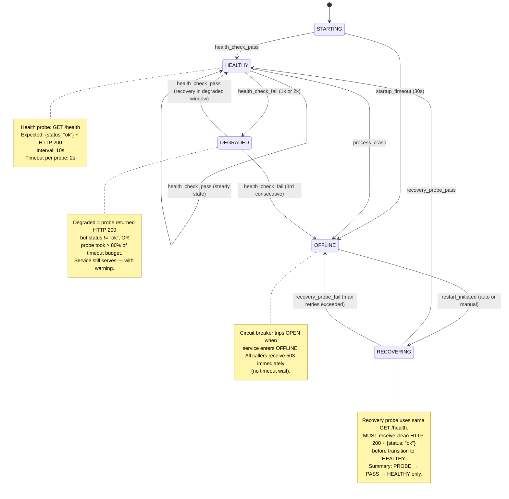
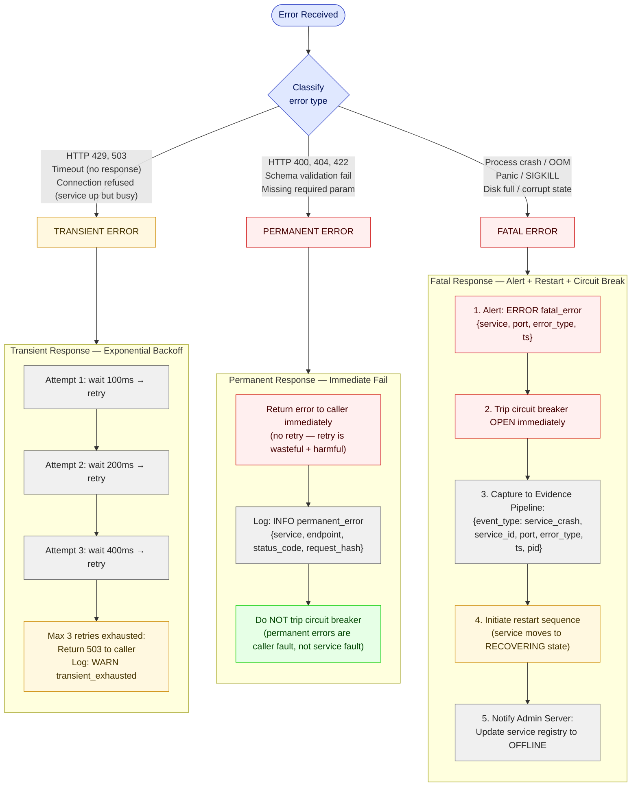
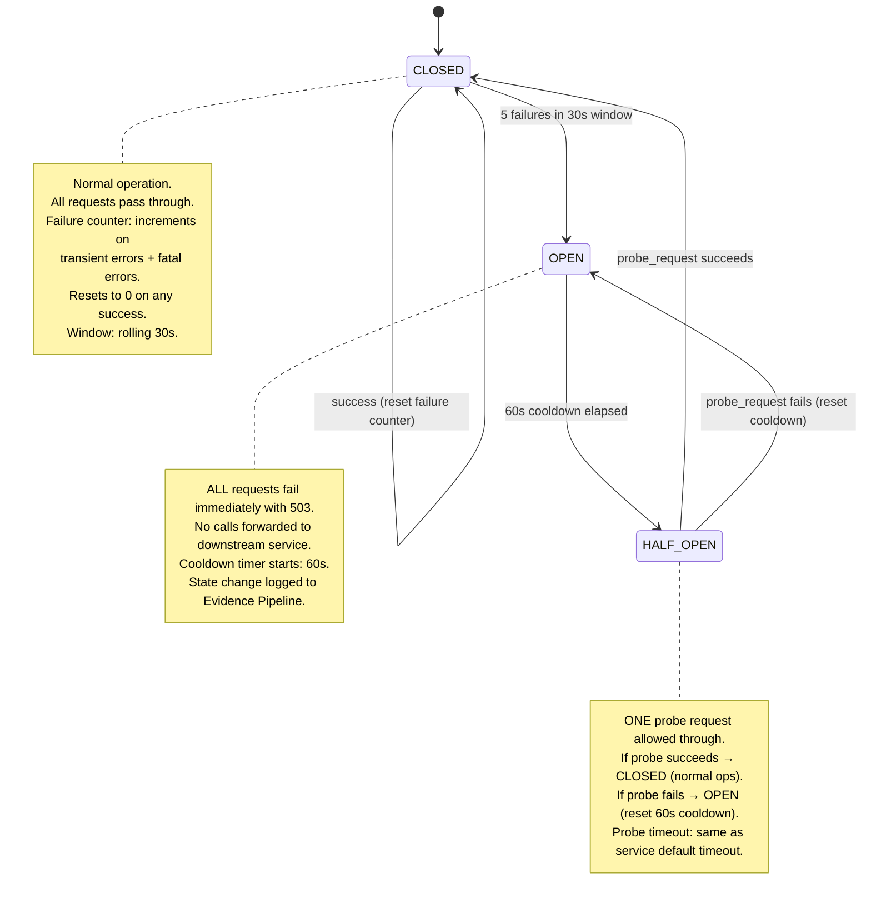
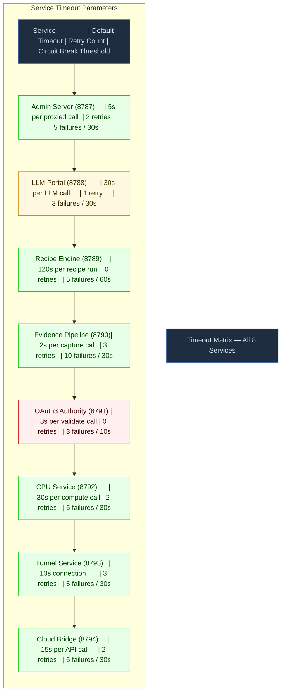

# Diagram 56: Service Error & Recovery — Stillwater Admin Services (8787–8794)

**Persona: Barbara Liskov** — Every service must honor its contract even during degradation.
The Liskov Substitution Principle applied to microservices: a degraded service must still
satisfy its callers' expectations — or fail loudly so they can adapt. Silent degradation is
a contract violation.

---

## Overview

This diagram covers the complete error and recovery surface for the 8 Stillwater admin
microservices (ports 8787–8794). It defines:

- **Service state machine** — transitions from HEALTHY through DEGRADED, OFFLINE,
  and RECOVERING back to HEALTHY.
- **Error classification** — transient vs permanent vs fatal, with the correct response
  to each class.
- **Circuit breaker pattern** — CLOSED → OPEN → HALF_OPEN → CLOSED lifecycle that
  protects the system from cascading failures.
- **Graceful degradation matrix** — per-service fallback policy, with OAuth3 Authority
  as the only FAIL-CLOSED service (never degrades — denies all).
- **Timeout matrix** — per-service timeout budget, retry count, and circuit break threshold.

---

## Diagram 1: Service State Machine

**Key takeaways:**
- RECOVERING requires a successful health probe before returning to HEALTHY — never skip.
- DEGRADED is a warning window (1–2 failed probes); do not alert until OFFLINE.
- Process crashes (OOM, segfault) skip DEGRADED entirely and go straight to OFFLINE.
- The STARTING state has its own timeout (30s); a service that never responds goes OFFLINE.

---

## Diagram 2: Error Classification and Response

**Key takeaways:**
- Retry ONLY transient errors. Retrying permanent (4xx) errors wastes tokens and hides bugs.
- Fatal errors trip the circuit breaker before restart — callers get 503, not timeout.
- Permanent errors do NOT increment the circuit breaker failure counter.
- All fatal errors are captured to the Evidence Pipeline, even if the pipeline is the crashed service
  (in that case: buffer locally in `data/logs/` and flush on restoration).

---

## Diagram 3: Circuit Breaker Pattern

**Key takeaways:**
- Threshold: 5 failures in a 30-second rolling window trips the breaker OPEN.
- Cooldown: 60 seconds before HALF_OPEN probe attempt.
- State transitions (CLOSED→OPEN, OPEN→HALF_OPEN, HALF_OPEN→CLOSED) MUST be logged
  to the Evidence Pipeline as `circuit_breaker_state_change` events.
- HALF_OPEN allows exactly ONE probe — concurrent requests during HALF_OPEN get 503.
- OAuth3 Authority (8791) uses a stricter threshold: 3 failures in 10s (auth is critical).

---

## Diagram 4: Graceful Degradation Matrix

```mermaid
flowchart LR
    classDef healthy fill:#e6ffe6,stroke:#00cc00,color:#004400
    classDef degraded fill:#fff8e0,stroke:#cc8800,color:#443300
    classDef forbidden fill:#ffefef,stroke:#cc0000,color:#440000
    classDef gate fill:#e0e8ff,stroke:#4455cc,color:#001155
    classDef svc fill:#f5f5f5,stroke:#888888,color:#222222

    ADMIN["Admin Server\n8787"]:::svc
    LLM["LLM Portal\n8788"]:::svc
    RECIPE["Recipe Engine\n8789"]:::svc
    EVIDENCE["Evidence Pipeline\n8790"]:::svc
    OAUTH["OAuth3 Authority\n8791"]:::svc
    CPU["CPU Service\n8792"]:::svc
    TUNNEL["Tunnel Service\n8793"]:::svc
    BRIDGE["Cloud Bridge\n8794"]:::svc

    subgraph LLM_DOWN["LLM Portal DOWN"]
        direction TB
        LLM_FB["Fallback: CPU-only mode\n- Recipe steps skip LLM validation\n- Deterministic CPU functions only\n- Log: WARN llm_unavailable\n- No silent degradation: log every skipped step\n- Evidence: capture degradation_event"]:::degraded
    end

    subgraph EVIDENCE_DOWN["Evidence Pipeline DOWN"]
        direction TB
        EV_FB["Fallback: local buffer\n- Write to data/logs/evidence_buffer.jsonl\n- Flush to Evidence Pipeline on restore\n- NEVER drop audit entries\n- Buffer cap: 10,000 entries (then alert)\n- Log: CRITICAL evidence_pipeline_down"]:::degraded
    end

    subgraph OAUTH_DOWN["OAuth3 Authority DOWN"]
        direction TB
        OA_FB["FAIL-CLOSED (no fallback)\n- Deny ALL requests requiring auth\n- Return 503 with: Retry-After: 60\n- Log: CRITICAL oauth3_down\n- Never cache tokens for offline use\n- Never skip scope check"]:::forbidden
    end

    subgraph RECIPE_DOWN["Recipe Engine DOWN"]
        direction TB
        RE_FB["Fallback: direct service calls\n- Admin Server routes directly to\n  LLM Portal / Browser / CPU Service\n- No recipe caching, no hit rate\n- Log: WARN recipe_unavailable\n- Evidence: capture degradation_event"]:::degraded
    end

    subgraph CPU_DOWN["CPU Service DOWN"]
        direction TB
        CPU_FB["Fallback: LLM fallback for verification\n- Route CPU computation steps to LLM Portal\n- Log: WARN cpu_unavailable with task detail\n- Non-deterministic — flag result as APPROXIMATE\n- Evidence: capture degradation_event\n  {fallback_used: 'llm', deterministic: false}"]:::degraded
    end

    subgraph TUNNEL_DOWN["Tunnel Service DOWN"]
        direction TB
        TUN_FB["Fallback: local-only mode\n- All services remain available on localhost\n- Remote (solaceagi.com) callers disconnected\n- Log: WARN tunnel_unavailable\n- No data loss — local state unaffected"]:::degraded
    end

    subgraph BRIDGE_DOWN["Cloud Bridge DOWN"]
        direction TB
        BR_FB["Fallback: local-only mode\n- solaceagi.com API bridge offline\n- All 8787–8792 services continue locally\n- Managed LLM tier unavailable (BYOK still works)\n- Log: WARN cloud_bridge_down"]:::degraded
    end

    LLM --> LLM_DOWN
    EVIDENCE --> EVIDENCE_DOWN
    OAUTH --> OAUTH_DOWN
    RECIPE --> RECIPE_DOWN
    CPU --> CPU_DOWN
    TUNNEL --> TUNNEL_DOWN
    BRIDGE --> BRIDGE_DOWN
```

**Key takeaways:**
- OAuth3 Authority is the ONLY service that FAILS-CLOSED. It never degrades auth to allow access.
- Evidence Pipeline MUST buffer locally — no audit entry may be discarded.
- LLM degradation is always explicit: every skipped LLM step must be logged.
- CPU fallback to LLM produces approximate (non-deterministic) results — always flagged.
- Tunnel and Cloud Bridge are network-edge services; their failure isolates to remote callers
  only. Local CLI and browser extension continue working.

---

## Diagram 5: Timeout Matrix

**Timeout rationale:**
- **LLM Portal (8788):** 30s because LLM calls can be slow; only 1 retry because retrying a slow
  LLM call doubles latency. Circuit break after 3 failures (tighter — LLM provider outages cascade).
- **Recipe Engine (8789):** 120s because a recipe may have many steps. Zero retries at the recipe
  level — individual steps handle their own retries.
- **Evidence Pipeline (8790):** 2s because evidence capture must be fast or it blocks all callers.
  3 retries because losing audit entries is unacceptable. 10-failure threshold before circuit break
  because the pipeline is high-frequency and occasional hiccups are normal.
- **OAuth3 Authority (8791):** 3s hard deadline — auth must be fast or UX degrades. Zero retries
  because retrying a failed auth check could create a race condition against revocation.
  Strictest circuit break: 3 failures in 10s (auth failures are catastrophic).
- **CPU Service (8792):** 30s with a subprocess hard kill at the timeout boundary.

---

## Invariants

1. **OAuth3 MUST fail-closed.** If OAuth3 Authority (8791) is OFFLINE or RECOVERING, ALL
   authenticated requests return 503. Token caching for offline use is forbidden.

2. **Evidence MUST buffer locally.** If Evidence Pipeline (8790) is unavailable, every service
   writes to `data/logs/evidence_buffer.jsonl` and flushes on restore. No audit entry may be
   silently dropped.

3. **LLM fallback MUST be explicit.** Any step that skips LLM processing due to LLM Portal
   unavailability MUST log `WARN llm_unavailable` with the skipped step hash. Silent LLM
   degradation is a contract violation.

4. **Circuit breaker state changes MUST be logged.** Every transition (CLOSED→OPEN,
   OPEN→HALF_OPEN, HALF_OPEN→CLOSED or HALF_OPEN→OPEN) MUST be captured to the Evidence
   Pipeline (or local buffer if pipeline is down) as a `circuit_breaker_state_change` event.

5. **RECOVERING state requires a clean health probe.** A service in RECOVERING MUST receive
   `HTTP 200` with `{status: "ok"}` from `GET /health` before the Admin Server transitions it
   back to HEALTHY in the service registry. Summary-only or partial responses do not qualify.

6. **Permanent errors (4xx) MUST NOT increment circuit breaker counters.** They are caller
   errors, not service errors. Counting them would cause spurious circuit breaks on bad clients.

7. **CPU fallback results MUST be flagged as APPROXIMATE.** When CPU Service is down and an
   LLM is used for computation, the result MUST carry `{deterministic: false}` in the Evidence
   record.

8. **Admin Server (8787) is the single source of truth for service health state.** No service
   may self-report its own state as healthy when the Admin Server's registry shows OFFLINE.

---

## Derivations

- **Diagram 16** (Admin Server) derives its health-check polling logic from this state machine.
  The 10s probe interval and 3-consecutive-fail OFFLINE threshold come from this diagram.

- **Diagram 23** (Service Registry) derives its `{status: "healthy"|"degraded"|"offline"|"recovering"}`
  enum from the state machine states defined here.

- **Diagram 24** (Service Mesh) derives circuit breaker placement — every inter-service call
  path has a circuit breaker at the caller end, not the callee end.

- **Diagram 25** (Service Types) derives the per-service evidence capture policy for error
  events. The `on-error` mode for CPU Service and `always` mode for OAuth3 come from the
  degradation rules here.

- **Diagram 14** (Evidence Bundle) derives the `circuit_breaker_state_change` event schema
  and the `service_crash` event schema captured during fatal error recovery.

- **The Evidence local buffer** (`data/logs/evidence_buffer.jsonl`) is the implementation
  artifact derived from Invariant 2. Services must implement a flush-on-restore routine that
  replays buffered entries to the Evidence Pipeline in timestamp order when connectivity resumes.

- **The FAIL-CLOSED invariant for OAuth3** derives the `Retry-After: 60` header in all 503
  responses from the OAuth3 Authority during downtime — callers must backoff, not hammer.

---

## Source Files

- `admin/server.py` — Admin Server health poll loop and registry state transitions
- `admin/services/base.py` — `StillwaterService` ABC; `health()` method contract
- `admin/services/oauth3_service.py` — FAIL-CLOSED enforcement on token validate
- `admin/services/evidence_pipeline.py` — Local buffer fallback on capture failures
- `data/default/diagrams/stillwater/16-admin-server.md` — Admin Server endpoint reference
- `data/default/diagrams/stillwater/23-service-registry.md` — ServiceDescriptor health state enum
- `data/default/diagrams/stillwater/24-service-mesh.md` — Inter-service communication topology
- `data/default/diagrams/stillwater/25-service-types.md` — Per-service evidence capture mode

## Coverage

- Service state machine: 5 states (STARTING, HEALTHY, DEGRADED, OFFLINE, RECOVERING) with 8 transitions
- Error classification: 3 classes (transient, permanent, fatal) with distinct response strategies
- Exponential backoff: 100ms → 200ms → 400ms → exhaust (max 3 retries for transient errors)
- Circuit breaker: 3 states (CLOSED, OPEN, HALF_OPEN) with per-service thresholds
- Graceful degradation: 7 services with explicit fallback or FAIL-CLOSED policy documented
- Timeout matrix: 8 services with default timeout, retry count, and circuit break threshold
- 8 invariants covering OAuth3 fail-closed, evidence buffering, LLM explicitness, circuit log, health probe, error classification, determinism flagging, and registry authority
- 7 derivations linking this diagram to its downstream diagrams and implementation artifacts
