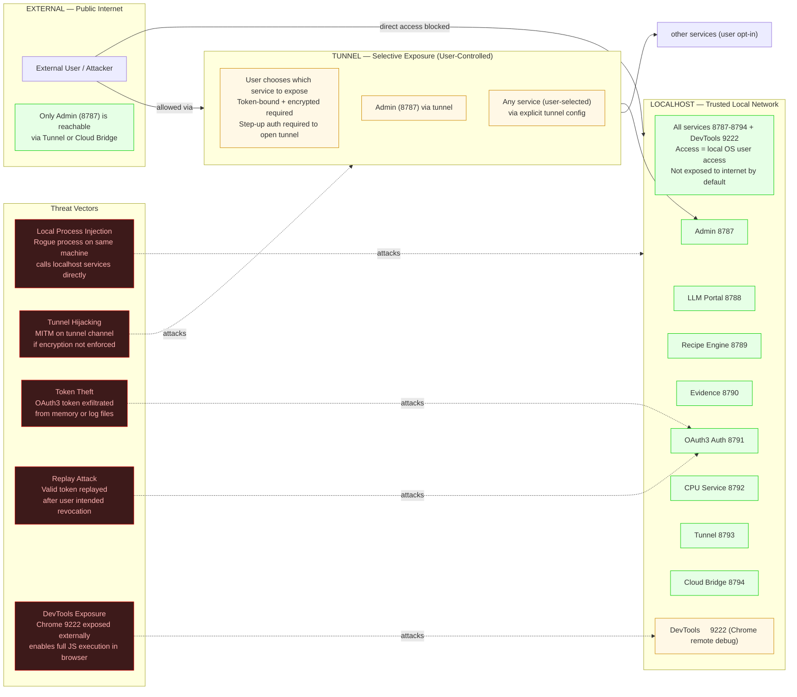
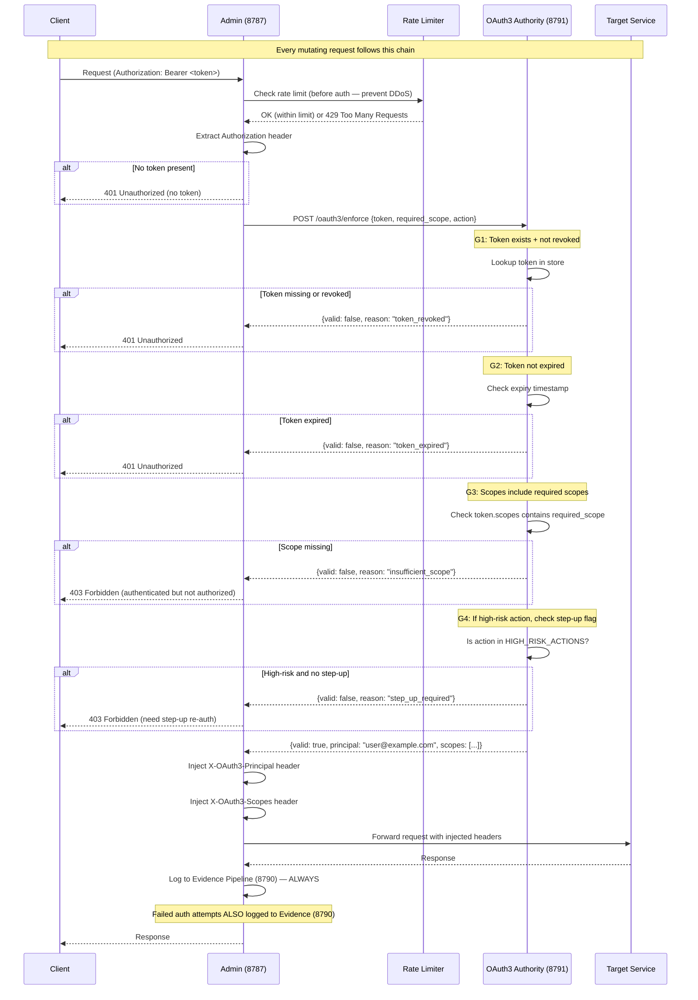
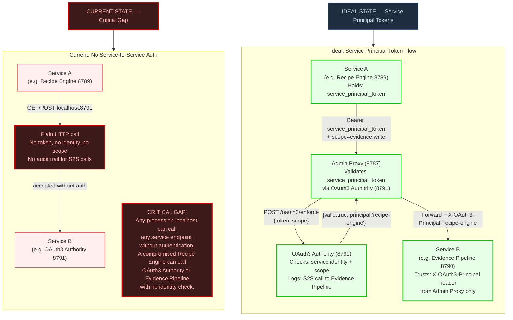

# Diagram 57: Security Enforcement Matrix — Stillwater Admin Services

## Overview

This diagram covers the Security Enforcement Matrix for the Stillwater admin services
system: 8 microservices running on ports 8787–8794. Security here is not a single
gate but a layered process — rate limiting before authentication, authentication before
authorization, authorization before action, and evidence logging after every action.

The diagrams document: authentication layers (L0–L3), the endpoint × auth matrix for
all 8 services, the attack surface and exposure model, the OAuth3 enforcement chain,
and the current critical gap in service-to-service authentication.

> "Security is a process, not a product." — Bruce Schneier

---

## Diagram 1: Authentication Layers

```mermaid
flowchart TD
    classDef secure fill:#e6ffe6,stroke:#00cc00
    classDef vulnerable fill:#ffefef,stroke:#cc0000
    classDef warn fill:#fff8e6,stroke:#cc8800
    classDef layer fill:#1e2d40,color:#cdd9e5,stroke:#4a6fa5

    RATE_LIMIT["Rate Limiter\n(MUST apply BEFORE all auth checks)\nPrevents auth endpoint DDoS"]:::warn

    RATE_LIMIT --> L0 & L1 & L2 & L3

    subgraph L0["Layer 0: NONE — Health and Info Endpoints"]
        direction TB
        L0_DESC["No authentication required\nMonitoring must always work\nEven under full auth system failure"]:::secure
        L0_EX["Examples:\n  GET /api/health (all 8 services)\n  GET /api/service-info"]:::secure
        L0_WHY["Rationale:\n  Liveness + readiness probes must\n  succeed before auth is configured.\n  A health check behind auth is\n  worse than no health check."]:::secure
    end

    subgraph L1["Layer 1: API_KEY — Basic Identification"]
        direction TB
        L1_DESC["Static API key in Authorization header\nIdentifies caller — does not authorize scopes\nLow-cost check, high-throughput read paths"]:::secure
        L1_EX["Examples:\n  GET /api/services (Admin 8787)\n  GET /api/llm/providers (LLM Portal 8788)\n  GET /api/recipes (Recipe Engine 8789)\n  GET /api/evidence/bundles (Evidence 8790)\n  GET /api/cpu/hash (CPU Service 8792)\n  GET /api/tunnel/status (Tunnel 8793)"]:::secure
        L1_WHY["Rationale:\n  Read-only browsing needs identity\n  but not full OAuth3 scope overhead.\n  API key is revocable and auditable."]:::secure
    end

    subgraph L2["Layer 2: OAUTH3_TOKEN — Scoped Authorization"]
        direction TB
        L2_DESC["OAuth3 bearer token\nMUST carry explicit scope claim\nAll mutating endpoints require this layer\nToken validated by OAuth3 Authority (8791)"]:::secure
        L2_EX["Examples:\n  POST /api/proxy/* (Admin 8787)\n  POST /api/llm/chat (LLM Portal 8788)\n  POST /api/recipes/*/run (Recipe Engine 8789)\n  POST /api/evidence/capture (Evidence 8790)\n  POST /oauth3/tokens (OAuth3 Auth 8791)\n  POST /api/cpu/validate-rung (CPU 8792)\n  POST /api/bridge/route (Cloud Bridge 8794)"]:::secure
        L2_WHY["Rationale:\n  Mutations change state — they must\n  be bound to a scoped principal with\n  explicit consent and a revocable token."]:::secure
    end

    subgraph L3["Layer 3: STEP_UP — Re-Authentication Required"]
        direction TB
        L3_DESC["OAuth3 token + fresh step-up challenge\nHigh-risk actions only\nStep-up flag checked in OAuth3 Authority\nToken must be re-authenticated within window"]:::warn
        L3_EX["Examples:\n  POST /api/tunnel/start (Tunnel 8793)\n  POST /api/bridge/connect (Cloud Bridge 8794)\n  vault.write, store.publish (future)"]:::warn
        L3_WHY["Rationale:\n  Tunnel start and bridge connect expose\n  the local network externally. A stolen\n  ambient token must not be enough to\n  open an inbound tunnel."]:::warn
    end
```

---

## Diagram 2: Endpoint × Auth Matrix

```mermaid
flowchart TD
    classDef secure fill:#e6ffe6,stroke:#00cc00
    classDef warn fill:#fff8e6,stroke:#cc8800
    classDef svc fill:#1e2d40,color:#cdd9e5,stroke:#4a6fa5

    subgraph SVC_8787["Admin (8787) — Entry Point"]
        direction LR
        A_H["GET /api/health → L0"]:::secure
        A_S["GET /api/services → L1"]:::secure
        A_P["POST /api/proxy/* → L2"]:::secure
    end

    subgraph SVC_8788["LLM Portal (8788) — Inference Gateway"]
        direction LR
        B_H["GET /api/health → L0"]:::secure
        B_P["GET /api/llm/providers → L1"]:::secure
        B_C["POST /api/llm/chat → L2"]:::secure
    end

    subgraph SVC_8789["Recipe Engine (8789) — Automation Replay"]
        direction LR
        C_H["GET /api/health → L0"]:::secure
        C_R["GET /api/recipes → L1"]:::secure
        C_RUN["POST /api/recipes/*/run → L2"]:::secure
    end

    subgraph SVC_8790["Evidence Pipeline (8790) — Audit Trail"]
        direction LR
        D_H["GET /api/health → L0"]:::secure
        D_B["GET /api/evidence/bundles → L1"]:::secure
        D_CAP["POST /api/evidence/capture → L2"]:::secure
    end

    subgraph SVC_8791["OAuth3 Authority (8791) — Token Issuer"]
        direction LR
        E_H["GET /api/health → L0"]:::secure
        E_T["POST /oauth3/tokens → L2"]:::secure
        E_ENF["POST /oauth3/enforce → L2"]:::secure
    end

    subgraph SVC_8792["CPU Service (8792) — Hash and Rung"]
        direction LR
        F_H["GET /api/health → L0"]:::secure
        F_HASH["GET /api/cpu/hash → L1"]:::secure
        F_RUNG["POST /api/cpu/validate-rung → L2"]:::secure
    end

    subgraph SVC_8793["Tunnel (8793) — External Exposure"]
        direction LR
        G_H["GET /api/health → L0"]:::secure
        G_ST["GET /api/tunnel/status → L1"]:::secure
        G_START["POST /api/tunnel/start → L3"]:::warn
    end

    subgraph SVC_8794["Cloud Bridge (8794) — Cloud Sync"]
        direction LR
        H_H["GET /api/health → L0"]:::secure
        H_R["POST /api/bridge/route → L2"]:::secure
        H_C["POST /api/bridge/connect → L3"]:::warn
    end

    subgraph LEGEND["Auth Level Key"]
        direction LR
        LEG_L0["L0 = No auth"]:::secure
        LEG_L1["L1 = API key"]:::secure
        LEG_L2["L2 = OAuth3 token"]:::secure
        LEG_L3["L3 = Step-up re-auth"]:::warn
    end
```

---

## Diagram 3: Attack Surface Map

---

## Diagram 4: OAuth3 Enforcement Flow

---

## Diagram 5: Service-to-Service Authentication Gap

---

## Invariants

1. **Health endpoints never require auth.** `GET /api/health` on all 8 services (8787–8794) must return 200 without any Authorization header. Monitoring and liveness probes must function even when the auth subsystem is degraded.

2. **All mutating endpoints must require OAuth3 tokens (L2 or L3).** Any endpoint that changes state (POST, PUT, DELETE, or equivalent) must validate a scoped OAuth3 bearer token via the OAuth3 Authority (8791). API key (L1) is never sufficient for mutations.

3. **Service-to-service calls should use service principal tokens.** Currently missing (critical gap). Until implemented, any localhost process can call any service without identity. This is a known accepted risk, not intended design.

4. **Tunnel connections must be token-bound and encrypted.** `POST /api/tunnel/start` requires L3 step-up auth. The tunnel channel itself must be encrypted. Token must be bound to the tunnel session — not ambient.

5. **Rate limiting must apply before auth checks.** The rate limiter must intercept requests before any authentication logic executes. An auth endpoint that can be called at unlimited rate is a DDoS vector against the OAuth3 Authority.

6. **Failed auth attempts must be logged to the Evidence Pipeline (8790).** Every 401 and 403 response — including the reason (token_revoked, token_expired, insufficient_scope, step_up_required) — must be appended to the Evidence Pipeline audit trail. Silent auth failures are invisible to forensic analysis.

7. **Step-up re-auth is required for network exposure actions.** Opening a tunnel (8793) or connecting a cloud bridge (8794) exposes local services to external networks. These actions require L3 — an ambient OAuth3 token is not sufficient.

8. **The Admin proxy (8787) is the sole entry point for external traffic.** All other services are localhost-only. No other service should accept connections from outside the loopback interface without explicit tunnel configuration.

---

## Derivations

- **From Diagram 1 (Authentication Layers) + Diagram 2 (Endpoint Matrix):** Every endpoint has exactly one auth level assignment. The matrix is exhaustive — there is no endpoint without an explicit auth classification. New endpoints must be classified at design time, not at deployment.

- **From Diagram 3 (Attack Surface Map):** The default posture is minimal exposure. The only surface visible to the internet is through an explicit user action (tunnel/bridge). DevTools port 9222 is a lateral risk that must be bound to 127.0.0.1, not 0.0.0.0.

- **From Diagram 4 (OAuth3 Enforcement Flow):** The four gates (G1–G4) must execute in order. Skipping G1 (revocation check) while passing G2–G4 allows a revoked token to authorize actions. The Evidence Pipeline receives a log entry for every enforcement decision, pass or fail.

- **From Diagram 5 (Service-to-Service Gap):** The current architecture trusts localhost as a security boundary. This is acceptable only for a single-user local deployment. For multi-user or cloud deployment, service principal tokens must be implemented before the system is exposed to more than one OS user. The gap is the highest-priority security debt in the current system.

- **Rate limiting placement:** Because rate limiting precedes authentication, the rate limiter must not inspect tokens. It operates on IP address, endpoint path, and request rate only. This prevents a situation where a valid token bypasses rate limiting.

- **Evidence Pipeline as security log:** The Evidence Pipeline (8790) is both a product feature (audit trail for AI actions) and the security event log (auth failures, S2S calls, rung validations). These two roles must not be separated — the same append-only JSONL store serves both purposes, providing a single tamper-evident record of all system events.

---

## Cross-References

- **Diagram 6** (Auth Flow) — User-facing OAuth3 consent and token issuance
- **Diagram 16** (Admin Server) — Admin (8787) endpoint catalog and path traversal guards
- **Diagram 20** (OAuth3 Flow) — Full token lifecycle: request → consent → grant → store → use → refresh → revoke
- **Diagram 24** (Service Mesh) — Inter-service topology and call graph

## Source Files

- `admin/server.py` — ThreadingHTTPServer on 8787; current auth model (no token validation yet)
- `admin/llm_portal.py` — LLM Portal on 8788; memory-only API key pattern
- `admin/session_manager.py` — AES-256-GCM session pattern (OAuth3 vault reference implementation)
- `data/default/diagrams/stillwater/20-oauth3-flow.md` — OAuth3 token lifecycle and scope hierarchy
- `ROADMAP.md` — Phase 2: oauth3-spec skill; Phase 3: service principal tokens

## Coverage

- Authentication layers L0–L3 with rationale for each level
- Endpoint × auth matrix for all 8 services (8787–8794), 24 endpoints total
- Attack surface: external vs. localhost vs. tunnel exposure zones
- Four threat vectors: process injection, tunnel hijacking, token theft, replay
- OAuth3 enforcement chain: 4 gates (G1–G4) with precise HTTP status codes (401 vs. 403)
- Rate limiting placement invariant (before auth, not after)
- Evidence Pipeline dual role: product audit trail + security event log
- Service-to-service authentication gap marked CRITICAL with current vs. ideal state
- Six invariants derived from Bruce Schneier's process-not-product principle
