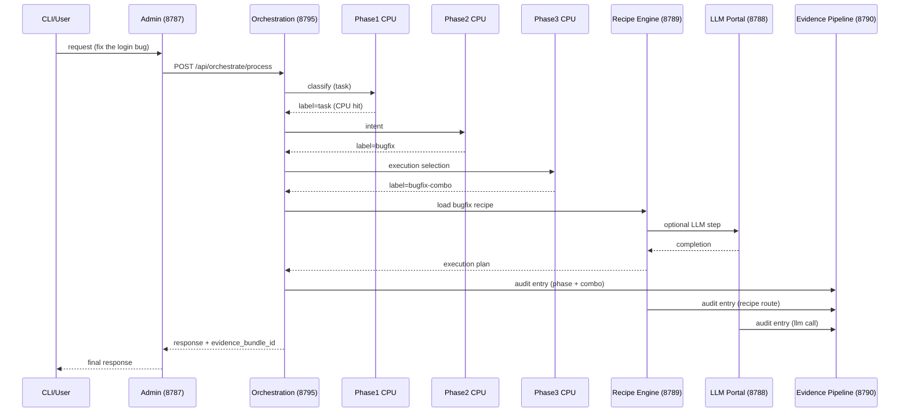
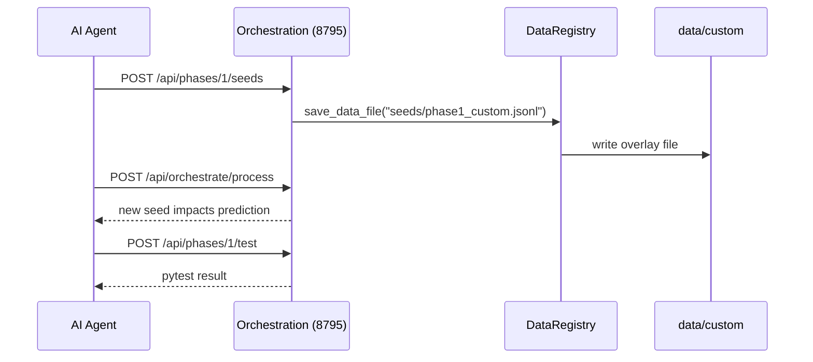

# Diagram 58: Cross-Service Integration

## Overview

End-to-end request flow for `"fix the login bug"` and the tuning loop that updates seeds in `data/custom/`.

## Diagram

### Main Flow

### Customization Flow

## Invariants

- Orchestration is the only phase gateway for pipeline execution.
- All persisted tuning changes are overlay writes (`data/custom/*`).
- Evidence capture happens per step, not only at final response.

## Derivations

- If CPU confidence misses threshold, same flow holds with LLM fallback in phase runner.
- The customization loop is safe to run repeatedly; default data remains untouched.
