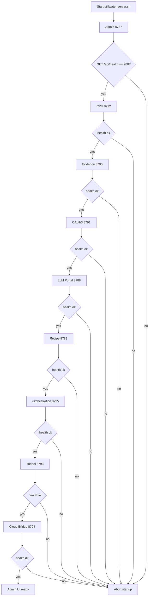
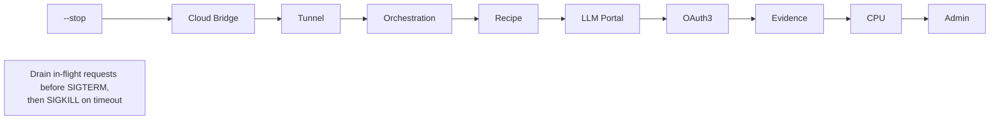
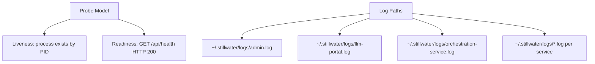
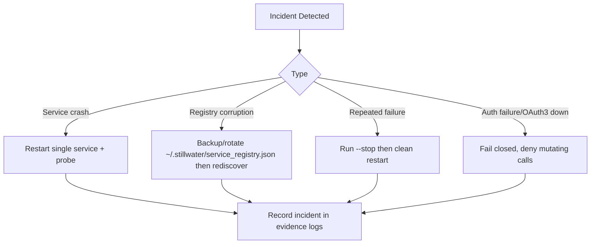

# Diagram 59: Operational Runbook

## Overview

Runbook for `stillwater-server.sh`: dependency startup order, reverse shutdown, readiness probes, log paths, and incident handling.

## Diagram

### Startup Sequence

### Shutdown Sequence (Reverse + Drain)

### Health Probes and Log Locations

### Emergency Procedures

## Invariants

- Readiness gate before dependency startup.
- Reverse-order shutdown to avoid dangling upstream callers.
- OAuth3 outage is fail-closed for write paths.

## Derivations

- Single script controls lifecycle state through PID files in `~/.stillwater/pids/`.
- `--status` combines liveness (PID) and readiness (`/api/health`) per service.
