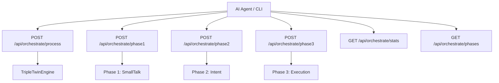
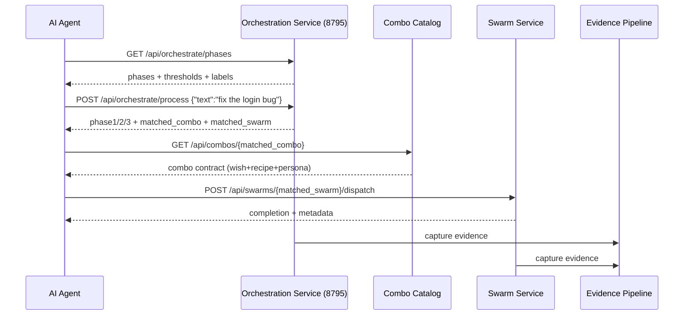

# Diagram 60: Orchestration Service API

## Overview

This contract exposes Triple-Twin orchestration as HTTP: Phase 1 (small-talk), Phase 2 (intent), Phase 3 (execution).
The interface is swarm-first: swarms and combos are first-class, then skills/recipes/personas.

## Diagram

### Diagram 1: Orchestration Service API



### Diagram 2: Swarm-First Interface Hierarchy

```mermaid
flowchart LR
    AGENT[AI Agent] --> SWLIST[GET /api/swarms]
    AGENT --> SWGET[GET /api/swarms/{id}]
    AGENT --> SWDISPATCH[POST /api/swarms/{id}/dispatch]

    AGENT --> CBLIST[GET /api/combos]
    AGENT --> CBGET[GET /api/combos/{id}]
    AGENT --> CBEXEC[POST /api/combos/{id}/execute]

    AGENT --> SK[GET /api/skills]
    AGENT --> RC[GET /api/recipes]
    AGENT --> PS[GET /api/personas]
```

### Diagram 3: Customization and Testing API

```mermaid
flowchart TD
    TUNE[AI Tuner] --> GS[GET /api/phases/{n}/seeds]
    TUNE --> PS[POST /api/phases/{n}/seeds]
    TUNE --> GC[GET /api/phases/{n}/config]
    TUNE --> PC[PUT /api/phases/{n}/config]

    QA[QA Agent] --> PT[POST /api/phases/{n}/test]
    QA --> PP[POST /api/orchestrate/test]
    QA --> TR[GET /api/phases/{n}/test-results]

    PS --> CUSTOM[data/custom/* overlay]
    PC --> CUSTOM
```

### Diagram 4: End-to-End AI Agent Flow



## Invariants

- Every API call must emit an audit/evidence record.
- All tuning writes target `data/custom/` only; `data/default/` remains immutable.
- Test endpoints run real pytest commands (no mock test execution).
- Swarm dispatch is OAuth3-protected (L2 scope gate).

## Derivations

- Diagram -> service contract: each endpoint maps to a concrete route in `admin/services/orchestration_service.py` and `admin/services/swarm_service.py`.
- Service -> tests: unit tests validate lifecycle, orchestration behavior, customization overlay, catalog reads, and audit chain integrity.
- Service -> CLI: `stillwater-server.sh` starts orchestration after dependencies and gates startup on `/api/health`.
