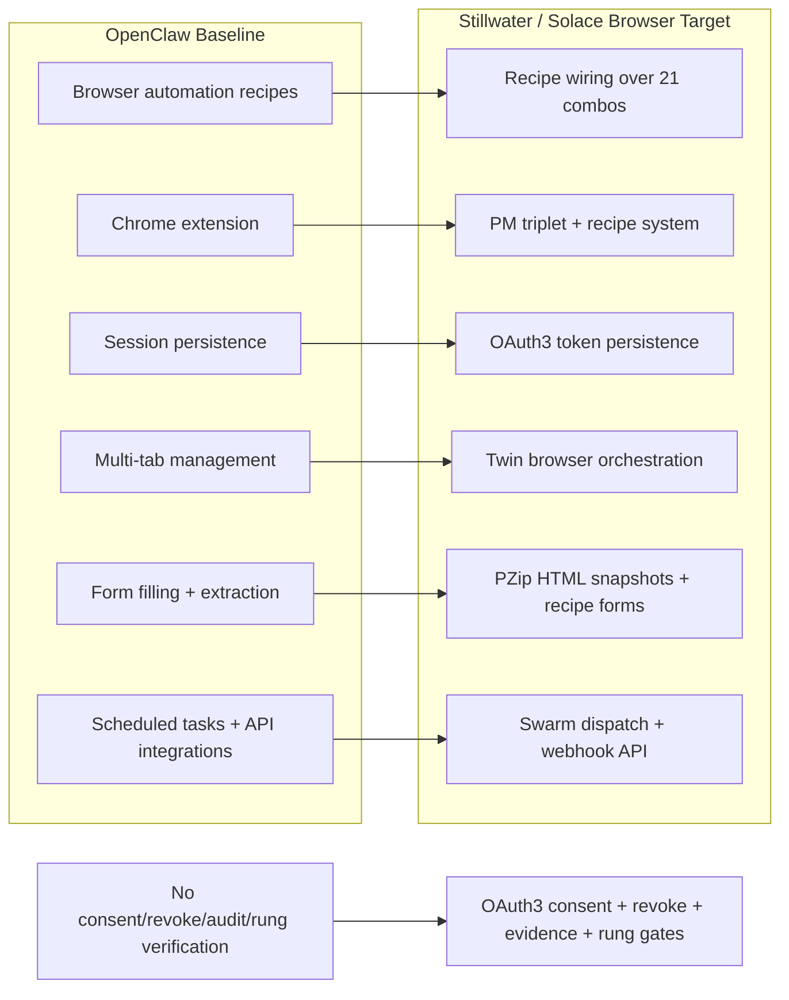
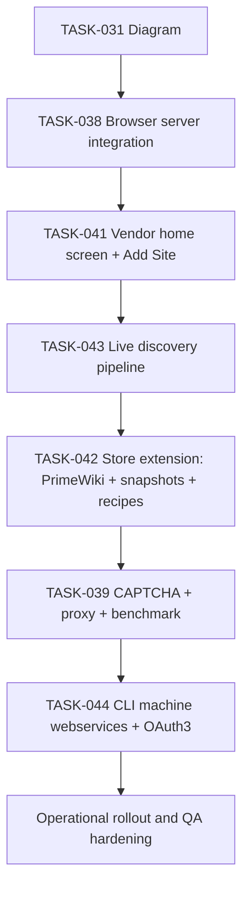
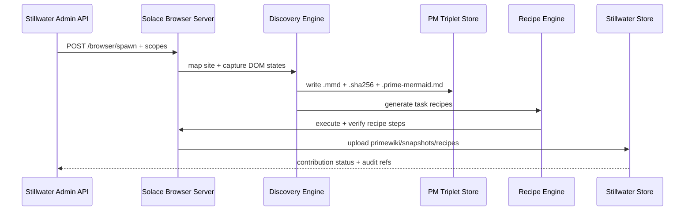
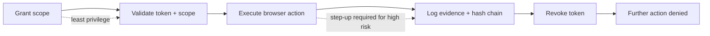

# Diagram 61: Solace Browser OpenClaw Parity

## Overview

This diagram maps OpenClaw feature parity against the Stillwater/Solace Browser northstar and defines implementation order.
The plan prioritizes real differentiators first: OAuth3 consent, revocation, evidence, and recipe-backed browser automation.

## Diagram

### Diagram 1: Competitive Feature Matrix (OpenClaw vs Stillwater)

### Diagram 2: Implementation Priority Order

### Diagram 3: Integration Flow (Admin API -> Browser -> PM Triplets -> Recipes)

### Diagram 4: OAuth3 Advantage Flow (Grant -> Scope -> Execute -> Evidence -> Revoke)

## Invariants

- Every remote browser action is OAuth3-scoped and revocable.
- Every discovery and execution event emits audit evidence with stable references.
- PM triplets are canonical for page/state snapshots (`.mmd`, `.sha256`, `.prime-mermaid.md`).
- Recipe execution must be replayable from stored artifacts.

## Derivations

- TASK-038/041/043/044 service contracts derive from this flow.
- Store schema for PrimeWiki/snapshots/recipes derives from Diagram 3.
- OAuth3 endpoint and policy checks derive from Diagram 4.
