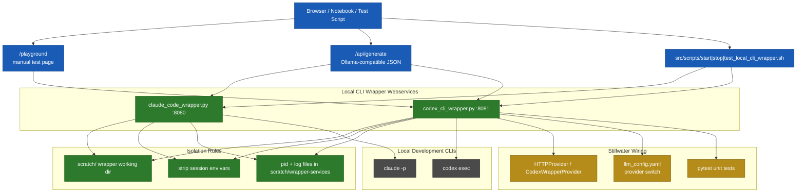

# 62. Local CLI Wrapper Bridge

**Purpose:** Show how Stillwater can expose local development CLIs as stable HTTP webservices, with Codex and Claude wrappers sharing the same operational shape.

## Contract

- Webservice: `GET /`, `GET /api/tags`, `GET /playground`, `POST /api/generate`
- Evidence: unit tests validate handler behavior, CLI error handling, and provider wiring
- Operations: start/stop/test scripts manage pid files and surface playground URLs
