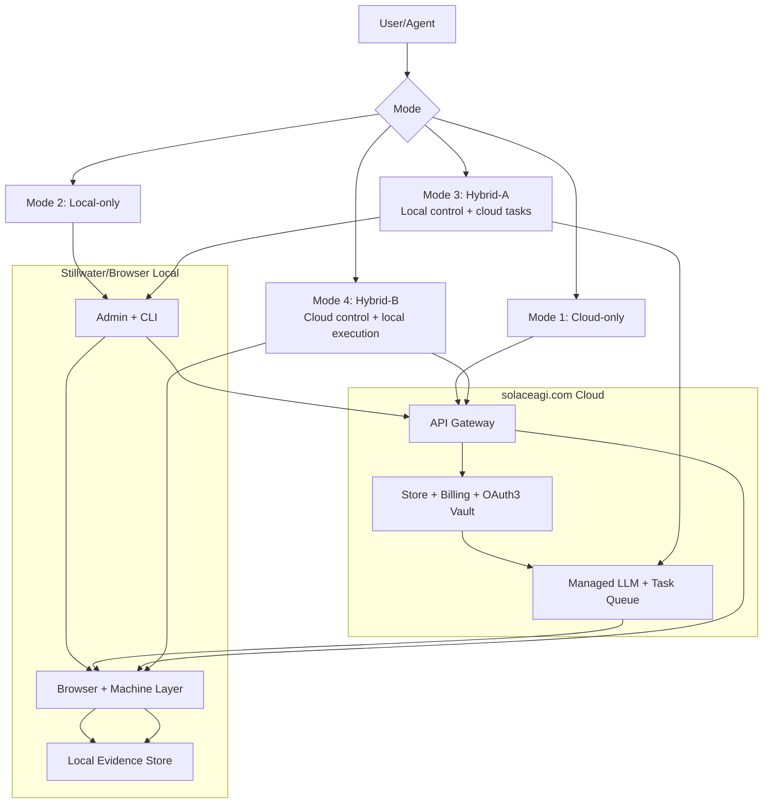
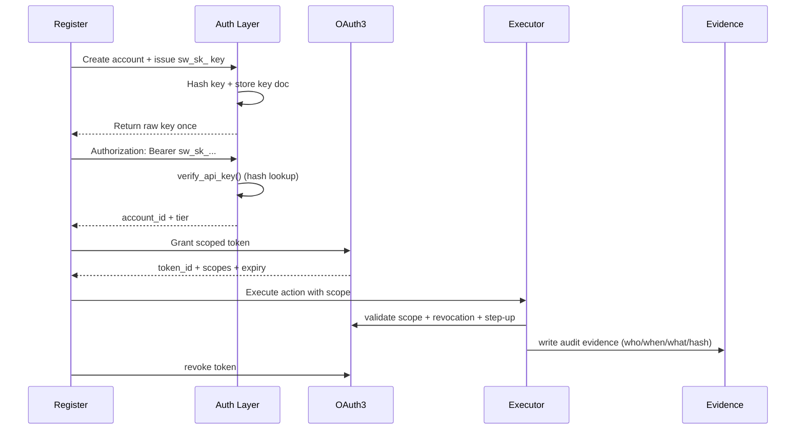
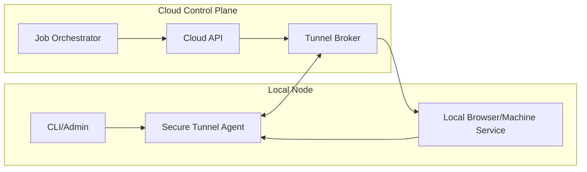
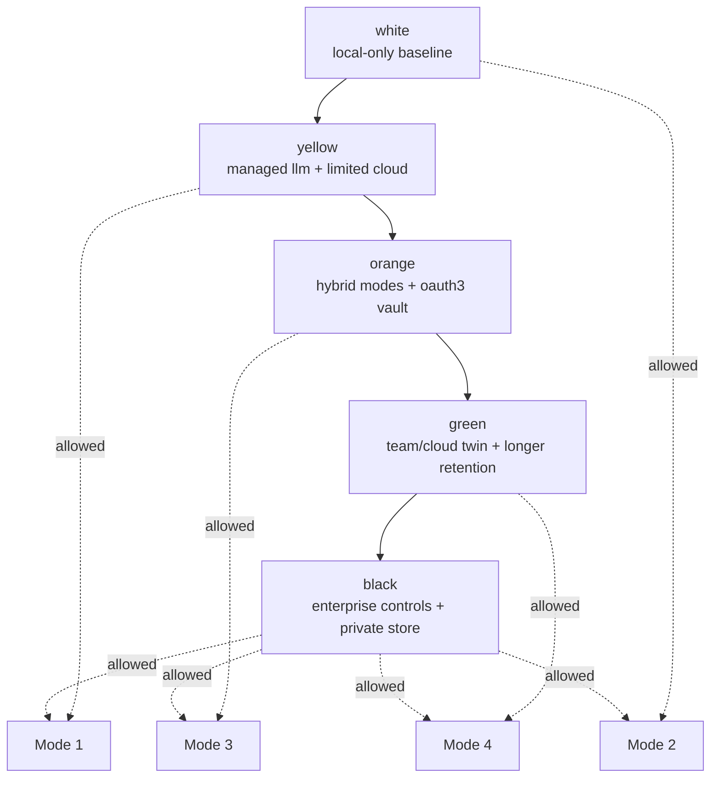
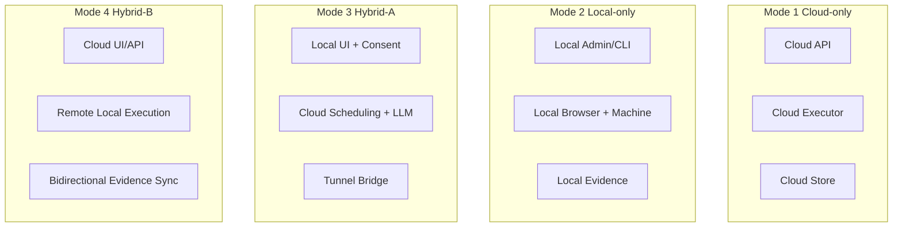

# Diagram 70: Self-Service Architecture

## Diagram 1: Four Modes

## Diagram 2: API Key + OAuth3 Flow

## Diagram 3: Tunnel Architecture (Modes 3/4)

## Diagram 4: Tier Gates by Mode

## Diagram 5: Component Placement Matrix

## Invariants

- API keys are never stored raw; only hashes are persisted.
- Every privileged action must pass OAuth3 scope checks.
- Tunnel links are explicit, revocable, and auditable.
- Tier enforcement is fail-closed (unknown tier => lowest privileges).
- Every execution path emits evidence with stable references.
