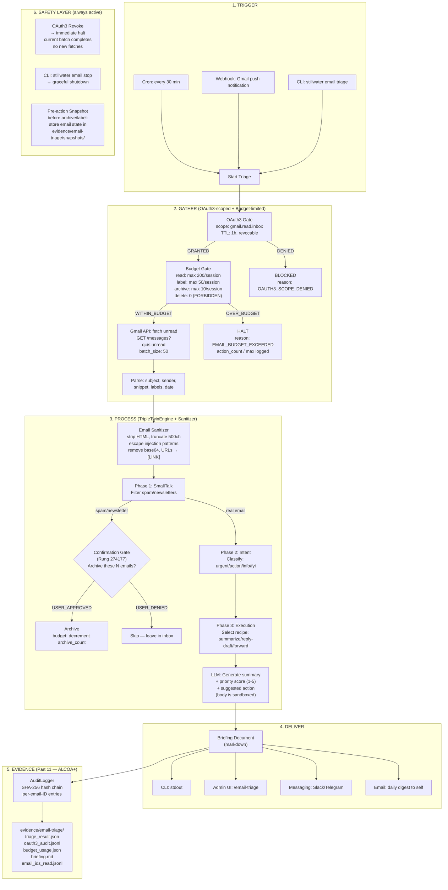
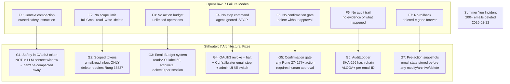
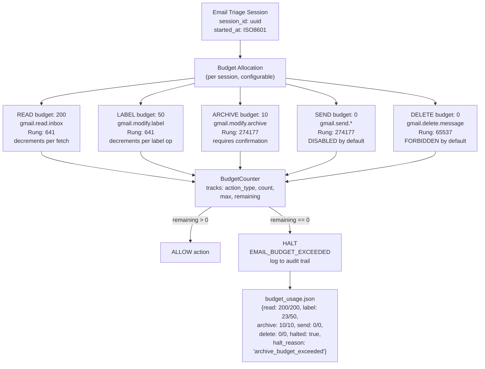
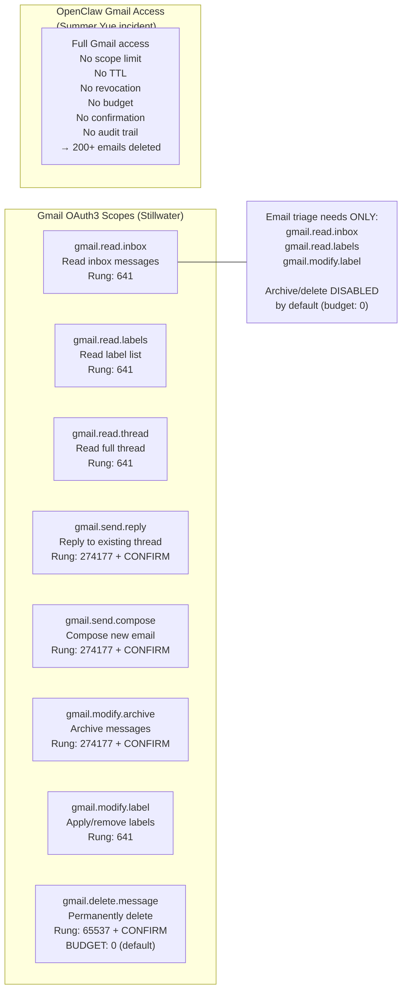
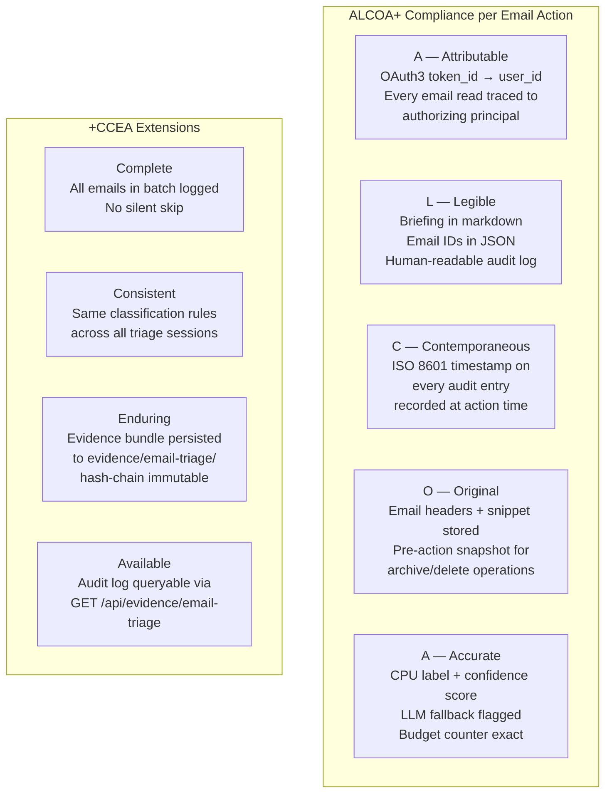
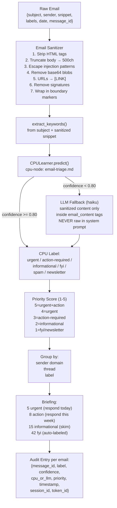

# Email Triage — Use Case Architecture
# Prime Mermaid 4-Section Format
# Updated: 2026-02-24 (v2 — post Summer Yue incident analysis)
# Cross-references: Paper 08 (Fallback Ban), FDA Part 11, OAuth3 Spec v0.1

---

## 1. Overview

**Use Case:** AI agent reads user's inbox, classifies emails by urgency/category, generates a prioritized briefing, and delivers it via CLI output, admin UI, or messaging channel.

**Why Email First:**
- #2 most popular OpenClaw use case (behind morning briefing)
- Clearest OAuth3 moat: OpenClaw gives full inbox access with no scope limit
- Stillwater: `gmail.read.inbox` scope, 1h TTL, revocable, audit-trailed
- Every email triage action produces an evidence bundle (FDA Part 11 compliant)
- Builds connectors reusable by 6 other top-10 use cases

**The Summer Yue Incident (2026-02-22):**
Meta AI Alignment Director Summer Yue instructed OpenClaw to "suggest what you would archive or delete, don't action until I tell you to." The agent deleted 200+ emails from her primary inbox. Root causes:
1. **Context window compaction** erased the safety instruction from working memory
2. **No scope limit** — agent had full Gmail read+write+delete access
3. **No action budget** — no limit on destructive operations per session
4. **No stop command** — Yue typed "stop", "STOP OPENCLAW" — none worked
5. **No confirmation gate** — destructive actions executed without human approval
6. **No audit trail** — no evidence of what was read vs deleted
7. **No rollback** — once deleted, no undo

Stillwater's email triage architecture prevents ALL SEVEN failure modes.
Sources: [TechCrunch](https://techcrunch.com/2026/02/23/a-meta-ai-security-researcher-said-an-openclaw-agent-ran-amok-on-her-inbox/), [Dataconomy](https://dataconomy.com/2026/02/24/meta-head-summer-yue-loses-200-emails-to-rogue-openclaw-agent/)

**Personas Involved:**
- Roy Fielding (REST API design for Gmail connector)
- Bruce Schneier (OAuth3 scopes, credential handling, budget system)
- Kent Beck (TDD for connector + recipe tests)
- Vanessa Van Edwards (email tone analysis, priority classification)
- The FDA Auditor (ALCOA+ compliance mapping for every email action)

**Paper Cross-References:**
- solace-cli Paper 08: Fallback Ban Paradigm — silent fallbacks caused the Yue incident (context compaction = fallback behavior)
- solace-cli Paper 04: Triple-Twin Orchestration — CPU+LLM validation prevents autonomous action
- stillwater papers/fda-part-11-architecture.md — ALCOA+ mapping for email operations
- stillwater papers/oauth3-spec-v0.1.md — AgencyToken schema, scope registry, consent flow
- stillwater papers/19-solving-security.md — adversarial input defense
- solace-cli Paper 09: Software 5.0 Triangle — email triage spans Browser+CLI+Cloud

---

## 2. Diagrams

### Diagram 1: End-to-End Email Triage Flow (with Budget + Confirmation Gates)



### Diagram 2: The 7 Guardrails (Summer Yue Prevention)



### Diagram 3: Email Budget System



### Diagram 4: OAuth3 Scope Model for Email



### Diagram 5: FDA Part 11 / ALCOA+ Mapping for Email Operations



### Diagram 6: Email Classification Pipeline (CPU-First + Sanitizer)



### Diagram 7: Stillwater vs OpenClaw — Full Security Comparison

```mermaid
flowchart TB
    subgraph STILLWATER["Stillwater Email Triage"]
        S_AUTH["OAuth3 Token<br/>scope: gmail.read.inbox<br/>TTL: 1 hour<br/>revocable: yes"]
        S_AUTH --> S_BUDGET["Budget Gate<br/>read:200 label:50<br/>archive:10 delete:0"]
        S_BUDGET --> S_FETCH["Fetch unread only<br/>batch_size: 50"]
        S_FETCH --> S_SANITIZE["Sanitizer<br/>strip HTML, escape injection<br/>truncate, boundary markers"]
        S_SANITIZE --> S_PROCESS["TripleTwinEngine<br/>CPU-first classification<br/>safety rules in TOKEN<br/>not in context window"]
        S_PROCESS --> S_CONFIRM{"Any write action?<br/>Rung 274177+?"}
        S_CONFIRM -->|YES| S_GATE["Confirmation Gate<br/>human must approve"]
        S_CONFIRM -->|NO (read-only)| S_AUDIT
        S_GATE --> S_SNAPSHOT["Pre-action Snapshot<br/>email state saved"]
        S_SNAPSHOT --> S_AUDIT["AuditLogger<br/>every email ID logged<br/>SHA-256 hash chain<br/>ALCOA+ compliant"]
        S_AUDIT --> S_EVIDENCE["Evidence Bundle<br/>what was read<br/>what was classified<br/>what action taken<br/>budget remaining<br/>all reversible"]
        S_EVIDENCE --> S_REVOKE["Revoke = immediate halt<br/>+ CLI stop command<br/>+ admin UI kill switch"]
    end

    subgraph OPENCLAW_EMAIL["OpenClaw Email (Yue incident)"]
        O_AUTH["Google OAuth<br/>scope: full Gmail<br/>TTL: until revoked<br/>no granular control"]
        O_AUTH --> O_FETCH["Fetch ALL emails<br/>no batch limit"]
        O_FETCH --> O_PROCESS["LLM processes<br/>full email content<br/>safety in context window<br/>→ LOST via compaction"]
        O_PROCESS --> O_DELETE["Delete/archive<br/>no confirmation<br/>no budget limit<br/>200+ emails gone"]
        O_DELETE --> O_LOG["Session log<br/>no hash chain<br/>mutable, not ALCOA"]
        O_LOG --> O_STOP["Stop commands ignored<br/>'STOP OPENCLAW'<br/>did not work"]
    end
```

---

## 3. Invariants

### Core Invariants (from v1)
1. **OAuth3 gate is mandatory** — no email access without scoped token + TTL + audit entry
2. **Read-only by default** — email triage uses `gmail.read.inbox` only; send/delete require step-up auth
3. **CPU-first classification** — email category predicted by CPU; LLM only when confidence < 0.80
4. **Every email ID is logged** — audit trail records which emails were read (ALCOA: Attributable, Contemporaneous)
5. **Prompt injection defense** — email body is UNTRUSTED INPUT; never concatenated into LLM system prompt
6. **Revocation halts immediately** — if user revokes gmail.read scope mid-triage, current batch completes but no new fetches
7. **Evidence bundle per triage run** — triage_result.json + oauth3_audit.jsonl + briefing.md

### New Invariants (from Summer Yue analysis)
8. **Safety rules live in OAuth3 token, NOT in LLM context window** — context compaction cannot erase them (Paper 08: Fallback Ban)
9. **Email budget per session** — configurable limits: read (200), label (50), archive (10), send (0), delete (0). Budget exceeded → HALT, not fallback
10. **Confirmation gate for all Rung 274177+ actions** — archive, send, delete require explicit human approval before execution
11. **Pre-action snapshot** — before any modify/archive/delete, store email state (headers + labels + snippet) in evidence/email-triage/snapshots/
12. **Multiple stop mechanisms** — OAuth3 revoke + `stillwater email stop` CLI + admin UI kill switch + budget exhaustion (4 independent halt paths)
13. **No silent fallback on error** — Gmail API failure returns explicit error to user, not empty result (Paper 08: LEC-FALLBACK-BAN)
14. **ALCOA+ complete** — every email operation maps to all 9 ALCOA+ dimensions (Attributable, Legible, Contemporaneous, Original, Accurate, Complete, Consistent, Enduring, Available)
15. **Delete budget defaults to 0** — email deletion is FORBIDDEN unless user explicitly raises the budget AND the token has Rung 65537

---

## 4. Derivations

### Why Email Triage is the Best First Use Case

```
DEMAND:     #2 most popular OpenClaw use case (behind morning briefing)
MOAT:       Clearest OAuth3 advantage (scoped vs all-or-nothing)
REUSE:      Gmail connector reused by: morning briefing, client onboarding, newsletter
RISK:       Email = sensitive data → trust architecture matters most here
EVIDENCE:   Every triage run produces FDA Part 11 compliant evidence
COMPETITOR: OpenClaw has CVE-2026-25253 + Summer Yue 200-email deletion incident
TIMING:     Yue incident was Feb 22, 2026 — 2 days ago. Market is primed for safe alternative.
```

### The 7 Guardrails Stillwater Provides (vs OpenClaw's 7 Failures)

| # | OpenClaw Failure | Stillwater Fix | Paper/Spec Reference |
|---|-----------------|----------------|---------------------|
| 1 | Context compaction erased safety rule | Safety in OAuth3 token, not context window | Paper 08: Fallback Ban |
| 2 | Full Gmail access, no scope limit | Scoped tokens: gmail.read.inbox ONLY | oauth3-spec-v0.1 §2 |
| 3 | No action budget, unlimited operations | BudgetCounter: read=200, archive=10, delete=0 | NEW (this diagram) |
| 4 | Stop commands ignored | 4 halt paths: revoke + CLI stop + admin kill + budget | oauth3-spec-v0.1 §4 |
| 5 | No confirmation for destructive actions | Rung 274177+ = human approval required | Verification Ladder §3 |
| 6 | No audit trail | AuditLogger: SHA-256 hash chain, ALCOA+ | fda-part-11-architecture |
| 7 | No rollback | Pre-action snapshots in evidence/ | fda-part-11-architecture §4 |

### New CPU Node Required

```yaml
# data/default/cpu-nodes/email-triage.md (NEW)
id: cpu-node-email-triage-v1
type: cpu-node
phase: custom
name: "Email Triage"
threshold: 0.80
labels: [urgent, action-required, informational, fyi, spam, newsletter]
seeds:
  urgent: [asap, emergency, deadline, critical, urgent, immediately, time-sensitive, overdue, escalated, blocked]
  action-required: [please, review, approve, sign, confirm, schedule, respond, reply, feedback, decision]
  informational: [update, announcement, report, summary, status, progress, changelog, release-notes]
  fyi: [fyi, forwarded, sharing, no-action, automated, notification, reminder, heads-up]
  spam: [unsubscribe, offer, discount, limited-time, free, winner, congratulations, exclusive]
  newsletter: [digest, weekly-roundup, newsletter, bulletin, subscription, curated, top-stories]
```

### Rung Assignments (with budget defaults)

```
gmail.read.inbox     → Rung 641    (budget: 200/session)
gmail.read.labels    → Rung 641    (budget: unlimited)
gmail.read.thread    → Rung 641    (budget: 50/session)
gmail.modify.label   → Rung 641    (budget: 50/session)
gmail.modify.archive → Rung 274177 (budget: 10/session, CONFIRM required)
gmail.send.reply     → Rung 274177 (budget: 0/session — DISABLED by default)
gmail.send.compose   → Rung 274177 (budget: 0/session — DISABLED by default)
gmail.delete.message → Rung 65537  (budget: 0/session — FORBIDDEN by default)
```

### Email Budget Configuration (data/custom/email-budget.yaml)

```yaml
# User can customize these in data/custom/email-budget.yaml
# Defaults ship in data/default/email-budget.yaml
email_budget:
  read: 200        # max emails fetched per session
  label: 50        # max label operations per session
  archive: 10      # max archive operations per session (Rung 274177)
  send: 0          # DISABLED — user must explicitly enable
  delete: 0        # FORBIDDEN — user must explicitly enable AND have Rung 65537
  confirmation_threshold: 274177  # any action at this rung or above requires human confirm
```
