# Stillwater Orchestration Workflow

**Triple-Twin Architecture** — CPU validates each decision stage with LLM validators.

---

## Overview Diagram


---

## Phase 1: Small Talk Twin (warm_token Validation)

**Purpose**: Validate CPU's emotional response tone. Ensure empathy, humor, or support matches user's emotional state.

### State Machine

```mermaid
stateDiagram-v2
    [*] --> CPU_Decide: user_input
    CPU_Decide --> Emit: warm_token generated
    Emit --> LLM_Check: send to haiku validator

    LLM_Check --> Confidence_Gate{confidence > 0.70?}

    Confidence_Gate -->|YES| LEARN: append to smalltalk_learn.jsonl
    Confidence_Gate -->|NO| SKIP: no learning signal

    LEARN --> Merge: CPU merges at startup
    SKIP --> Merge

    Merge --> [*]
```

### Configuration

Users can customize Phase 1 behavior in `data/custom/orchestration-phase1.md`:

```yaml
---
phase: 1
name: "Small Talk Twin"
enabled: true
validator: "haiku"
model: "claude-haiku-4.5"
threshold: 0.70
learnings_file: "learned_smalltalk.jsonl"
---

# Phase 1 Customization

## Validator Prompt Customization

You can override the default validator instructions:

**default**: Validates emotional tone (empathy, humor, support)
**custom**: Validate your specific communication style

Example custom instructions:
- "Only accept responses that are 3 sentences or less"
- "Enforce formal professional tone (no humor)"
- "Always include a call-to-action"

## Confidence Thresholds

| Threshold | Behavior |
|-----------|----------|
| 0.70 | (Default) Learn when confident |
| 0.80 | Stricter - only very confident patterns |
| 0.60 | Permissive - learn more patterns |

## Actions to Learn

Which emotional actions should be learned?

- suppress_humor (when user shares loss/sadness)
- celebrate (user achieved something)
- encourage (user struggling)
- neutral_professional (business context)
- warm_friendly (casual conversation)
```

---

## Phase 2: Intent Twin (IntentMatch Validation)

**Purpose**: Validate that the user's actual intent was correctly identified. Ensure wish matching is accurate.

### State Machine

```mermaid
stateDiagram-v2
    [*] --> Extract: keywords extracted from user input
    Extract --> CPU_Match: CPU finds best matching wish

    CPU_Match --> Match_Found{wish found?}

    Match_Found -->|YES| LLM_Confirm: haiku validates match
    Match_Found -->|NO| LLM_Infer: haiku infers intent

    LLM_Confirm --> Conf_Gate{confidence > 0.80?}
    LLM_Infer --> Conf_Gate

    Conf_Gate -->|YES| LEARN: append to learned_wishes.jsonl
    Conf_Gate -->|NO| SKIP: no learning signal

    LEARN --> Merge: CPU merges at startup
    SKIP --> Merge

    Merge --> [*]
```

### Configuration

Users can customize Phase 2 behavior in `data/custom/orchestration-phase2.md`:

```yaml
---
phase: 2
name: "Intent Twin"
enabled: true
validator: "haiku"
model: "claude-haiku-4.5"
threshold: 0.80
learnings_file: "learned_wishes.jsonl"
---

# Phase 2 Customization

## Keyword Extraction

You can customize which keywords matter:

**Default keywords**: ["project", "bug", "feature", "review", "deploy"]
**Custom keywords**: Add domain-specific terms

Example for data scientists:
- ["experiment", "model", "dataset", "evaluation", "hyperparameter"]

## Wish Priority

Which wishes should be checked first?

| Priority | Wish ID | Confidence |
|----------|---------|------------|
| 1 | bugfix | 0.95 (always first) |
| 2 | code-review | 0.85 |
| 3 | new-feature | 0.75 |
| 4 | refactor | 0.70 |

## Custom Wishes

Add your own wishes here. Format:

```json
{
  "wish_id": "my-wish",
  "name": "My Custom Wish",
  "keywords": ["word1", "word2"],
  "skill_pack_hint": "coder+security",
  "confidence": 0.88
}
```
```

---

## Phase 3: Execution Twin (ExecutionMatch Validation)

**Purpose**: Validate that the right skills/combos were selected for execution. Ensure the recipe is appropriate for the wish.

### State Machine

```mermaid
stateDiagram-v2
    [*] --> CPU_Execute: wish_id selected
    CPU_Execute --> Match_Combo{combo found?}

    Match_Combo -->|YES| LLM_Validate: haiku validates combo
    Match_Combo -->|NO| LLM_Infer: haiku recommends combo

    LLM_Validate --> Conf_Gate{confidence > 0.90?}
    LLM_Infer --> Conf_Gate

    Conf_Gate -->|YES| LEARN: append to learned_combos.jsonl
    Conf_Gate -->|NO| SKIP: no learning signal

    LEARN --> Merge: CPU merges at startup
    SKIP --> Merge

    Merge --> Swarm[🌀 Dispatch Swarm]
    Merge --> [*]
```

### Configuration

Users can customize Phase 3 behavior in `data/custom/orchestration-phase3.md`:

```yaml
---
phase: 3
name: "Execution Twin"
enabled: true
validator: "haiku"
model: "claude-haiku-4.5"
threshold: 0.90
learnings_file: "learned_combos.jsonl"
---

# Phase 3 Customization

## Combo Selection

Which skill combos are best for each wish?

| Wish ID | Swarm | Recipe | Skills |
|---------|-------|--------|--------|
| bugfix | coder | bugfix | prime-safety, prime-coder |
| code-review | skeptic | qa-audit | prime-safety, prime-coder, prime-forecast |
| docs | writer | paper-from-run | prime-safety, software5.0-paradigm |

## Skill Pack Hints

Override default skill recommendations:

**Default for bugfix**: [prime-coder, prime-safety]
**Custom for bugfix**: [prime-coder, prime-safety, prime-math] (if math-heavy)

## Execution Confidence Gates

| Threshold | Behavior |
|-----------|----------|
| 0.90 | (Default) Very confident executions |
| 0.85 | Confident executions |
| 0.75 | Learning more patterns |

## Post-Execution Actions

What happens after swarm completes?

- auto_commit: commit code changes automatically
- auto_push: push to remote after commit
- auto_report: summarize findings and email
- no_action: just present results
```

---

## End-to-End Flow (Full User Session)

```mermaid
graph LR
    A["🧑 User: 'I found a bug'"]

    B["Phase 1: Small Talk<br/>CPU generates warm_token<br/>LLM validates tone<br/>learns emotional context"]

    C["Phase 2: Intent Twin<br/>CPU matches to 'bugfix' wish<br/>LLM validates intent<br/>learns keyword mapping"]

    D["Phase 3: Execution<br/>CPU selects bugfix combo<br/>LLM validates recipe<br/>learns skill pairing"]

    E["🌀 Swarm Dispatched<br/>coder + prime-safety<br/>+ prime-coder"]

    F["📚 Learning Saved<br/>smalltalk_learn.jsonl<br/>learned_wishes.jsonl<br/>learned_combos.jsonl"]

    A --> B --> C --> D --> E --> F
```



---

## Webservices Contacted (Per Request)


### Request Counts (Per Session)

| Service | Endpoint | Requests | Cost |
|---------|----------|----------|------|
| Stillwater Admin | /api/data/* | 5-10 | $0 (local) |
| Stillwater CLI | read/write | 2-5 | $0 (local) |
| Haiku Validators | small-talk, intent, exec | 3 | ~$0.001 |
| Cloud API | read learned entries | 1 | ~$0.0001 |
| Cloud API | sync push (optional) | 1 | ~$0.0001 |
| **TOTAL per session** | | ~12-20 | ~$0.0011 |

---

## Customization: Add Your Own Phase

Users can extend with Phase 4 (e.g., "Safety Twin"):

Create `data/custom/orchestration-phase4.md`:

```yaml
---
phase: 4
name: "Safety Twin"
enabled: true
validator: "opus"  # more powerful model for safety
model: "claude-opus-4.6"
threshold: 0.95  # very strict for safety
learnings_file: "learned_safety.jsonl"
---

# Phase 4: Safety Validation

Validate that proposed actions are safe, don't violate policies, etc.

## Custom Checks

- [ ] Code doesn't use sudo without confirmation
- [ ] Database migrations include rollback plan
- [ ] Security keys are not logged
- [ ] API calls respect rate limits
```

---

## Cost Control

Validators run per-request, costing ~$0.001 per session. To reduce costs:

```yaml
# Skip validators when CPU confident
skip_validator_if_cpu_confidence: 0.70
# Result: 50% fewer validator calls, 50% cost reduction

# Batch validators (every 10 requests)
batch_every_n_requests: 10
# Result: 90% cost reduction, learning slower
```

---

## Learn & Merge Algorithm

At startup, CPU loads and merges learned patterns:

```python
# 1. Load shared patterns (cloud, if configured via solace-cli)
shared = load_cloud("learned_*.jsonl")

# 2. Load user's local patterns
local = load_local("data/custom/learned_*.jsonl")

# 3. Merge: local overrides shared
merged = {**shared, **local}

# 4. Gate by phase threshold
filtered = {k: v for k, v in merged.items()
           if v["confidence"] > phase_threshold}

# 5. Register with CPU
cpu.register_learned_patterns(filtered)
```

---

## Next Steps

1. ✅ Understand the three phases (Small Talk, Intent, Execution)
2. 📝 Create custom phases in `data/custom/orchestration-phaseX.md`
3. 🎯 Adjust thresholds to match your confidence levels
4. 📊 Monitor costs with `stillwater admin learned list`
5. ☁️ Sync to cloud when ready: `stillwater data sync push`

---

**Last Updated**: 2026-02-23
**Status**: LIVE — Fully operational with triple-twin validators
**Format**: Can customize per phase in `data/custom/`
