```mermaid
stateDiagram-v2
    direction LR
    [*] --> VALIDATE_OAUTH3 : triage requested
    VALIDATE_OAUTH3 --> EXIT_BLOCKED : token missing, expired, or wrong scope
    VALIDATE_OAUTH3 --> INIT_BUDGET : gmail.read.inbox token valid
    INIT_BUDGET --> FETCH_INBOX : budget counters initialized
    FETCH_INBOX --> EXIT_BLOCKED : budget.read exhausted before fetch
    FETCH_INBOX --> SANITIZE : headers fetched within budget
    SANITIZE --> CPU_CLASSIFY : HTML stripped, injection patterns removed
    CPU_CLASSIFY --> RANK_PRIORITY : keywords + CPULearner prediction complete
    RANK_PRIORITY --> PRESENT_SUMMARY : emails scored and sorted
    PRESENT_SUMMARY --> REQUEST_ACTIONS : triage list shown to user
    REQUEST_ACTIONS --> EXIT_PASS : user selects "done" or no actions
    REQUEST_ACTIONS --> CONFIRMATION_GATE : user selects label/archive actions
    CONFIRMATION_GATE --> EXIT_BLOCKED : user declines or budget=0
    CONFIRMATION_GATE --> SNAPSHOT : user confirms; budget reserves checked
    SNAPSHOT --> EXECUTE : pre-action state captured and hashed
    EXECUTE --> AUDIT : actions applied within budget
    AUDIT --> EXIT_PASS : ALCOA+ evidence bundle complete
    EXECUTE --> EXIT_BLOCKED : budget exhausted mid-execution (partial rollback)
```

# Recipe: Email Triage — Safe Inbox Processing with Budget Controls

> "The Summer Yue Incident (Feb 22, 2026): an OpenClaw agent deleted 200+ emails because
>  its safety rules were in the context window — and the context window compacted them away.
>  Safety rules that live only in the prompt are not safety rules. They are suggestions."
> — Stillwater Incident Report, Feb 2026

This recipe executes safe email triage with OAuth3 scoped tokens, session budgets, and ALCOA+ audit trails. The budget is a hard gate, not a soft limit. The snapshot is taken before every modify action. The confirmation gate is mandatory at Rung 274177+. Safety enforcement lives in OAuth3 token scopes — not in the context window.

```
SUMMER YUE PREVENTION ARCHITECTURE:

Safety layer 1 — OAuth3 token scope (lives in the token vault, NOT the context):
  gmail.read.inbox → read-only; no write scope granted unless user explicitly re-authorizes
  gmail.modify.labels → label-only; no archive/delete unless separate token issued
  gmail.archive → requires step-up auth (Rung 274177+)
  gmail.send → FORBIDDEN; requires human to compose and send manually
  gmail.delete → FORBIDDEN; token not issued under any automated scenario

Safety layer 2 — BudgetCounter (lives in memory + budget_log.json):
  Counters are one-way ratchets: decrement only, never reset during session
  Budget exhausted → HALT immediately; do not attempt fallback or retry
  Default budgets: read:200, label:50, archive:10, send:0 (human), delete:0 (human)

Safety layer 3 — Confirmation gate (rung 274177+):
  Any label/archive action on >1 email requires explicit "yes" from user
  Gate shows: action type, count, email subjects preview, budget remaining
  No auto-confirm, no default-yes, no timeout-implies-yes

Safety layer 4 — Pre-action snapshot:
  Full email metadata (id, threadId, labelIds, subject, from, date) captured before any modify
  Snapshot stored in snapshot_bundle/ with SHA256 integrity hash
  Rollback path: restore labelIds from snapshot if action regretted

HALTING CRITERION: all requested actions executed within budget
  OR budget exhausted (HALT — report budget_log.json + remaining counts)
  OR OAuth3 scope missing (HALT — do not retry with broader scope)
  OR user declines confirmation gate (HALT — no partial execution)
```

**Rung target:** 274177
**Time estimate:** 12 steps; 3-5 turns
**Agent:** Email Classifier (swarms/email-classifier.md)

---



---

## Prerequisites

- [ ] Gmail OAuth3 token exists in vault (`oauth3 list --scope gmail.read.inbox`)
- [ ] Token not expired (check `exp` field vs current time)
- [ ] BudgetConfig loaded: `data/custom/email-budget.json` or `data/default/email-budget.json`
- [ ] CPULearner model file present: `models/email-classifier.pkl` (or stub for first run)
- [ ] Snapshot directory writable: `snapshot_bundle/` under session working dir
- [ ] ALCOA+ schema loaded: `data/alcoa-schema.json`

---

## Step 1 — VALIDATE_OAUTH3: Check Token Scope and Freshness

**Action:** Retrieve the gmail OAuth3 token from the local vault. Verify scope, expiry, and that no broader scope than requested is present.

**Scope ladder (narrowest to broadest — use narrowest available):**
- `gmail.read.inbox` — headers and body, no write
- `gmail.modify.labels` — add/remove labels only
- `gmail.archive` — move to archive (requires step-up)
- `gmail.send` — FORBIDDEN for automated triage (human only)
- `gmail.delete` — FORBIDDEN (token never issued for triage)

**Scope escalation rule:** If the required scope is not present, HALT with `EXIT_BLOCKED`. Do NOT retry with a broader scope. Do NOT request a new token automatically. Instruct user to run `oauth3 grant --scope <required>`.

**Artifact:** `scratch/oauth3_validation.json`
```json
{
  "token_id": "<vault id>",
  "scope_required": "gmail.read.inbox",
  "scope_present": "<actual scope>",
  "scope_sufficient": true,
  "exp": "<ISO 8601>",
  "exp_valid": true,
  "broader_scope_present": false,
  "validation_pass": true
}
```

**Checkpoint:** validation_pass == true; broader_scope_present == false (over-privileged token is a red flag, halt for user confirmation).

**Rollback:** EXIT_BLOCKED — do not proceed. Print token_id and scope_required. Instruct user to run `oauth3 grant`.

---

## Step 2 — INIT_BUDGET: Create Session BudgetCounter

**Action:** Load budget configuration from `data/custom/email-budget.json` (user override) or `data/default/email-budget.json` (system defaults). Instantiate BudgetCounter with session limits.

**Default budget limits:**
```
read:    200  (API calls fetching email headers/bodies)
label:    50  (label add/remove operations)
archive:  10  (archive operations — requires confirmation gate)
send:      0  (FORBIDDEN — human only)
delete:    0  (FORBIDDEN — not issued)
```

**BudgetCounter contract:**
- `budget.consume(action_type, count=1)` → decrements; returns remaining
- `budget.remaining(action_type)` → current remaining count
- `budget.exhausted(action_type)` → True if remaining == 0
- `budget.to_evidence()` → serializable dict of all counters + consumed + remaining
- Counters are one-way ratchets: no reset, no override, no fallback escalation

**Artifact:** `scratch/budget_init.json`
```json
{
  "session_id": "<uuid>",
  "config_source": "data/custom/email-budget.json | data/default/email-budget.json",
  "limits": {"read": 200, "label": 50, "archive": 10, "send": 0, "delete": 0},
  "consumed": {"read": 0, "label": 0, "archive": 0, "send": 0, "delete": 0},
  "remaining": {"read": 200, "label": 50, "archive": 10, "send": 0, "delete": 0},
  "init_timestamp": "<ISO 8601>"
}
```

**Checkpoint:** All counter values match config. send == 0 and delete == 0 exactly — any config that sets these > 0 is rejected as BUDGET_BYPASS.

---

## Step 3 — FETCH_INBOX: Retrieve Email Headers Within Budget

**Action:** Call Gmail API to fetch inbox messages. Respect `budget.read` limit. Fetch headers first (From, Subject, Date, Labels, ThreadId) — fetch body only for emails selected by user in Step 8.

**Fetch order:** Most recent first. Stop when `budget.remaining('read') == 0`.

**API call pattern:**
```
GET /gmail/v1/users/me/messages?maxResults={min(budget.remaining('read'), 100)}&labelIds=INBOX
GET /gmail/v1/users/me/messages/{id}?format=metadata&metadataHeaders=From,Subject,Date
```

Each API call consumes `budget.consume('read', 1)`.

**Artifact:** `scratch/inbox_raw.json`
```json
{
  "fetch_timestamp": "<ISO 8601>",
  "messages_fetched": 47,
  "budget_read_consumed": 47,
  "budget_read_remaining": 153,
  "messages": [
    {
      "id": "<gmail message id>",
      "threadId": "<thread id>",
      "labelIds": ["INBOX", "UNREAD"],
      "from": "<sender>",
      "subject": "<subject>",
      "date": "<RFC 2822>",
      "snippet": "<50 char snippet>"
    }
  ]
}
```

**Checkpoint:** messages_fetched + budget_read_consumed == original_remaining (no phantom reads). budget_read_remaining >= 0.

**Rollback:** If budget.exhausted('read') before fetch complete, HALT with partial results. Report budget_log.json. Do not attempt to fetch remaining messages.

---

## Step 4 — SANITIZE: Strip HTML and Neutralize Injection Patterns

**Action:** For each fetched message, sanitize all text fields before any LLM exposure. This is the injection defense gate.

**Sanitization pipeline (in order):**
1. Strip HTML tags (preserve text content only)
2. Truncate body to 500 characters maximum
3. Escape injection patterns: `<`, `>`, `{`, `}`, `[INST]`, `<|im_start|>`, prompt-boundary tokens
4. Remove base64 blobs (attachments, inline images) — replace with `[ATTACHMENT_REDACTED]`
5. Remove URLs with schemes other than `https://` — replace with `[URL_REDACTED]`
6. Flag any message where sanitization altered the content for human review

**Quarantine rule:** Any message where the subject or body contains injection patterns → `quarantine: true`. Quarantined messages are shown to the user as `[QUARANTINED — injection pattern detected]` and are excluded from LLM classification.

**Artifact:** `scratch/inbox_sanitized.json`
```json
{
  "sanitization_timestamp": "<ISO 8601>",
  "messages_processed": 47,
  "messages_quarantined": 1,
  "messages": [
    {
      "id": "<gmail message id>",
      "from_sanitized": "<sanitized>",
      "subject_sanitized": "<sanitized, <=100 chars>",
      "snippet_sanitized": "<sanitized, <=500 chars>",
      "quarantine": false,
      "injection_patterns_removed": []
    }
  ]
}
```

**Checkpoint:** Every message has `quarantine` field. Any message with `injection_patterns_removed` non-empty is flagged for user review.

---

## Step 5 — CPU_CLASSIFY: CPU-First Classification Pipeline

**Action:** Classify each non-quarantined email using the CPU-first pipeline. LLM fallback only when CPU confidence < 0.6.

**CPU pipeline (in order):**
1. **Keyword matcher** — match subject + sender against `data/keyword-rules.json` (e.g., `invoice`, `urgent`, `meeting`, `unsubscribe`)
2. **Stop-word filter** — exclude newsletters, auto-replies, mailing lists by sender domain pattern
3. **CPULearner.predict()** — scikit-learn or equivalent; returns `(label, confidence)` tuple

**Label taxonomy:**
- `ACTION_REQUIRED` — needs a response or decision from user
- `FYI` — informational, no action needed
- `NEWSLETTER` — bulk/marketing; can be archived without reading
- `MEETING` — calendar invite or scheduling request
- `FINANCIAL` — invoice, receipt, payment notification
- `AUTOMATED` — CI/CD notification, system alert, bot-generated
- `UNKNOWN` — confidence < 0.6; falls through to LLM

**LLM fallback rule:** Only invoked for `UNKNOWN` class. Uses 500-char sanitized snippet only (no full body). LLM result replaces `UNKNOWN` label.

**Artifact:** `scratch/classification_result.json`
```json
{
  "classification_timestamp": "<ISO 8601>",
  "messages_classified": 46,
  "messages_quarantined": 1,
  "cpu_hits": 35,
  "llm_fallbacks": 11,
  "cpu_hit_rate": 0.76,
  "classifications": [
    {
      "id": "<gmail message id>",
      "label": "ACTION_REQUIRED",
      "confidence": 0.91,
      "classifier": "cpu|llm",
      "keyword_matched": "<keyword or null>"
    }
  ]
}
```

**Checkpoint:** cpu_hit_rate >= 0.70 (target from northstar_metric). If < 0.70, emit warning and log for model improvement. LLM was not invoked on quarantined messages (hard rule).

---

## Step 6 — RANK_PRIORITY: Score and Sort Triage List

**Action:** Compute a priority score for each email and produce a ranked triage list.

**Scoring formula:**
```
priority_score = (sender_weight × 0.40)
              + (urgency_score × 0.30)
              + (recency_score × 0.20)
              + (thread_depth_score × 0.10)

sender_weight:     1.0 if sender in VIP list, 0.5 if known, 0.1 if unknown
urgency_score:     1.0 if label=ACTION_REQUIRED, 0.5 if MEETING/FINANCIAL, 0.1 otherwise
recency_score:     1.0 if <1h, 0.8 if <24h, 0.5 if <7d, 0.1 if older
thread_depth_score: 0.1 × min(thread_depth, 10)   (longer threads → more engagement)
```

**Artifact:** `scratch/triage_ranked.json`
```json
{
  "ranking_timestamp": "<ISO 8601>",
  "emails_ranked": 46,
  "ranked_list": [
    {
      "rank": 1,
      "id": "<gmail message id>",
      "from": "<sender>",
      "subject": "<sanitized subject>",
      "label": "ACTION_REQUIRED",
      "priority_score": 0.87,
      "age": "2h",
      "thread_depth": 3
    }
  ]
}
```

**Checkpoint:** ranked_list length == emails_classified (excluding quarantined). Scores are in [0.0, 1.0].

---

## Step 7 — PRESENT_SUMMARY: Display Triage List to User

**Action:** Present the ranked triage list in a human-readable format. Show budget status. Do not take any action yet.

**Display format:**
```
EMAIL TRIAGE — [session_id] — [timestamp]
Budget: read 153/200 remaining | label 50/50 | archive 10/10

PRIORITY INBOX (46 emails, 1 quarantined)
━━━━━━━━━━━━━━━━━━━━━━━━━━━━━━━━━━━━━━━━
 1. [ACTION_REQUIRED] From: alice@example.com — "Q4 budget approval needed" (2h ago)
 2. [MEETING]         From: calendar@company.com — "Standup tomorrow 9am" (3h ago)
 3. [FINANCIAL]       From: invoices@vendor.com — "Invoice #4421 due" (5h ago)
...
46. [NEWSLETTER]      From: news@substack.com — "Weekly digest" (6d ago)

[QUARANTINED: 1 email — injection pattern detected. Review manually.]

Budget status: 47 reads consumed. 153 remaining.
```

**Artifact:** `scratch/triage_summary.md` (human-readable display)

**Checkpoint:** All ranked emails shown. Quarantined count displayed. Budget remaining shown. No actions taken yet.

---

## Step 8 — REQUEST_ACTIONS: User Selects Actions

**Action:** Prompt user to select actions from the triage list. User can select: label (assign a label), archive (move to archive), flag (add STARRED label), or done (exit without action).

**Permitted actions:**
- `label <id> <label>` — requires `gmail.modify.labels` scope; consumes `budget.consume('label', 1)`
- `archive <id>` — requires `gmail.archive` scope; consumes `budget.consume('archive', 1)`
- `flag <id>` — same as label STARRED; consumes `budget.consume('label', 1)`
- `done` — exits; no further actions

**FORBIDDEN actions (regardless of user request):**
- `send` — not implemented in this recipe; instruct user to use their email client
- `delete` — FORBIDDEN; inform user: "Deletion is not permitted in automated triage. Use your email client."

**Artifact:** `scratch/actions_requested.json`
```json
{
  "request_timestamp": "<ISO 8601>",
  "actions": [
    {"action_type": "label", "email_id": "<id>", "label": "ACTION_REQUIRED", "budget_type": "label"},
    {"action_type": "archive", "email_id": "<id>", "budget_type": "archive"}
  ],
  "forbidden_actions_rejected": []
}
```

**Checkpoint:** No send or delete actions present. Each action has a budget_type. Budget capacity check: `budget.remaining(budget_type) >= count_of_actions_of_that_type`.

---

## Step 9 — CONFIRMATION_GATE: Explicit Human Approval (Rung 274177+)

**Action:** For any action list with >= 1 archive action, OR any label action on >= 5 emails, present a confirmation gate. Require explicit "yes" from user. No timeout-implies-yes. No default-yes.

**Gate display format:**
```
CONFIRMATION REQUIRED (Rung 274177)
━━━━━━━━━━━━━━━━━━━━━━━━━━━━━━━━━━━
You are about to:
  Archive 3 emails:
    - "Invoice #4421 due" (invoices@vendor.com)
    - "Weekly digest" (news@substack.com)
    - "Automated build report #889" (ci@github.com)
  Apply label ACTION_REQUIRED to 2 emails

Budget after execution:
  archive: 10 → 7 remaining
  label:   50 → 48 remaining

Type "yes" to proceed, anything else to cancel:
```

**Gate outcomes:**
- User types "yes" (case-insensitive) → proceed to SNAPSHOT
- Any other input, or no input → HALT; exit with no actions taken

**Artifact:** `scratch/confirmation_gate.json`
```json
{
  "gate_timestamp": "<ISO 8601>",
  "actions_presented": 5,
  "archive_count": 3,
  "label_count": 2,
  "user_response": "yes",
  "gate_passed": true,
  "budget_preview": {"archive_after": 7, "label_after": 48}
}
```

**Checkpoint:** gate_passed == true before proceeding. If false, EXIT_BLOCKED with `CONFIRMATION_DECLINED`.

---

## Step 10 — SNAPSHOT: Capture Pre-Action State

**Action:** For every email that will be modified, capture its complete current state before any action is taken. This is the ALCOA-O (Original) gate.

**Snapshot per email:**
```json
{
  "snapshot_timestamp": "<ISO 8601>",
  "email_id": "<gmail message id>",
  "threadId": "<thread id>",
  "labelIds_before": ["INBOX", "UNREAD"],
  "subject": "<sanitized subject>",
  "from": "<from>",
  "date": "<RFC 2822>",
  "integrity_hash": "<sha256 of this record>"
}
```

**Snapshot bundle:** All per-email snapshots stored in `snapshot_bundle/` as individual JSON files named `<email_id>.snapshot.json`. Bundle index stored as `snapshot_bundle/index.json` with SHA256 of each file.

**Artifact:** `snapshot_bundle/index.json`
```json
{
  "snapshot_bundle_id": "<uuid>",
  "snapshot_timestamp": "<ISO 8601>",
  "email_count": 5,
  "files": [
    {"email_id": "<id>", "file": "<email_id>.snapshot.json", "sha256": "<hash>"}
  ],
  "bundle_integrity": "<sha256 of entire index>"
}
```

**Checkpoint:** Every email to be modified has a snapshot file. integrity_hash present for each. bundle_integrity computed over all files. No action proceeds if snapshot_bundle is incomplete.

---

## Step 11 — EXECUTE: Apply Actions Within Budget

**Action:** Execute each confirmed action. Check budget before each individual action. Stop immediately if budget exhausted.

**Execution loop:**
```
for each action in confirmed_actions:
    if budget.exhausted(action.budget_type):
        HALT — emit BUDGET_EXHAUSTED with remaining actions unexecuted
        break
    call Gmail API with correct scope
    budget.consume(action.budget_type, 1)
    record result in execution_log
```

**API call → budget scope mapping:**
- `label` → `gmail.modify.labels` scope required
- `archive` → `gmail.archive` scope required
- Scope not present → HALT with `SCOPE_MISSING` (do not retry with broader scope)

**Artifact:** `scratch/execution_log.json`
```json
{
  "execution_start": "<ISO 8601>",
  "execution_end": "<ISO 8601>",
  "actions_requested": 5,
  "actions_executed": 5,
  "actions_skipped": 0,
  "halt_reason": null,
  "results": [
    {
      "action_type": "archive",
      "email_id": "<id>",
      "api_response_status": 200,
      "budget_consumed": 1,
      "budget_remaining_after": 7,
      "timestamp": "<ISO 8601>"
    }
  ]
}
```

**Checkpoint:** actions_executed + actions_skipped == actions_requested. Each result has timestamp and budget_remaining_after. If halt_reason non-null, actions_skipped > 0 is expected and not an error.

**Rollback:** If any action returns API error (4xx/5xx), do not retry. Record error in execution_log. Snapshot_bundle available for manual rollback — present email_id + labelIds_before to user.

---

## Step 12 — AUDIT: Build ALCOA+ Evidence Bundle

**Action:** Compile the complete ALCOA+ evidence bundle. This is the final step and must complete before EXIT_PASS.

**ALCOA+ nine dimensions:**

| Dimension | Requirement | Source |
|-----------|-------------|--------|
| **A** (Attributable) | Who performed each action | agent_type + session_id in each record |
| **L** (Legible) | Human-readable record | execution_log.json + triage_summary.md |
| **C** (Contemporaneous) | Timestamp within 1s of action | ISO 8601 timestamp on each execution result |
| **O** (Original) | Pre-action state captured | snapshot_bundle/ with integrity hashes |
| **A** (Accurate) | Action matches what was confirmed | confirmation_gate.json vs execution_log.json cross-check |
| **+C** (Complete) | All 12 steps documented | audit_trail.json step_coverage field |
| **+C** (Consistent) | No contradictions between artifacts | cross-check budget_log vs execution_log counts |
| **+E** (Enduring) | Artifacts stored durably | committed to evidence_bundle/ |
| **+A** (Available) | Retrievable on demand | evidence_bundle/index.json with file manifest |

**Artifact:** `evidence_bundle/audit_trail.json`
```json
{
  "schema_version": "1.0.0",
  "agent_type": "email-classifier",
  "session_id": "<uuid>",
  "rung_target": 274177,
  "alcoa_dimensions": {
    "attributable": {"agent": "email-classifier", "session_id": "<uuid>", "pass": true},
    "legible": {"artifacts": ["execution_log.json", "triage_summary.md"], "pass": true},
    "contemporaneous": {"max_lag_seconds": 0.8, "threshold": 1.0, "pass": true},
    "original": {"snapshot_bundle_id": "<uuid>", "email_count": 5, "pass": true},
    "accurate": {"confirmation_matches_execution": true, "pass": true},
    "complete": {"steps_documented": 12, "steps_required": 12, "pass": true},
    "consistent": {"budget_log_matches_execution_log": true, "pass": true},
    "enduring": {"evidence_bundle_committed": true, "pass": true},
    "available": {"index_present": true, "pass": true}
  },
  "all_dimensions_pass": true,
  "triage_result_summary": {
    "emails_triaged": 46,
    "emails_quarantined": 1,
    "actions_executed": 5,
    "cpu_hit_rate": 0.76,
    "budget_consumed": {"read": 47, "label": 2, "archive": 3}
  },
  "summer_yue_prevention_check": {
    "safety_in_context_only": false,
    "oauth3_scopes_enforced": true,
    "budget_counters_enforced": true,
    "confirmation_gate_enforced": true,
    "snapshot_taken_before_modify": true,
    "delete_scope_issued": false,
    "send_scope_issued": false
  }
}
```

**Checkpoint:** all_dimensions_pass == true. summer_yue_prevention_check: all boolean fields match expected values (safety_in_context_only: false; delete_scope_issued: false; send_scope_issued: false).

---

## Success Criteria

- [ ] oauth3_validation.json: validation_pass == true; broader_scope_present == false
- [ ] budget_init.json: send == 0 and delete == 0 exactly
- [ ] inbox_sanitized.json: every message has quarantine field; quarantined messages excluded from LLM
- [ ] classification_result.json: cpu_hit_rate >= 0.70; LLM not invoked on quarantined messages
- [ ] confirmation_gate.json: gate_passed == true (or EXIT_BLOCKED with CONFIRMATION_DECLINED)
- [ ] snapshot_bundle/index.json: every modified email has snapshot file with integrity_hash
- [ ] execution_log.json: all actions have contemporaneous timestamps; no send or delete actions
- [ ] audit_trail.json: all_dimensions_pass == true; summer_yue_prevention_check fully enforced
- [ ] triage_result.json: final output with ranked list + classification + action summary
- [ ] budget_log.json: final counter state; consumed + remaining sum to original limits

**GLOW requirement:** >= 35

---

## Three Pillars

| Pillar | How This Recipe Applies It |
|--------|--------------------------|
| **LEK** (Self-Improvement) | Each session where cpu_hit_rate is logged and CPULearner is updated from confirmed human actions (label → feedback signal); after 10 triage sessions, the keyword-rules.json and CPULearner model improve; the recipe measures its own northstar_metric (cpu_hit_rate) and improves it without LLM involvement |
| **LEAK** (Cross-Agent Trade) | email-classifier holds classification knowledge; email-triage-auditor (if present) holds ALCOA+ verification knowledge; they trade via audit_trail.json — classifier produces the evidence, auditor verifies the nine dimensions; neither role can declare EXIT_PASS alone at Rung 274177+ |
| **LEC** (Emergent Conventions) | Establishes the budget-as-hard-gate convention (BUDGET_BYPASS is forbidden — soft limits that can be overridden are not limits), the snapshot-before-modify convention (SNAPSHOT_MISSING is forbidden — no pre-action state means no rollback), and the summer-yue prevention convention (SAFETY_IN_CONTEXT_ONLY is forbidden — safety rules that live only in the prompt are not safety rules) |

---

## GLOW Scoring

| Dimension | Contribution | Points |
|-----------|-------------|--------|
| **G** (Growth) | cpu_hit_rate improves session-over-session; CPULearner updated from confirmed actions | +10 per session where cpu_hit_rate increases vs. previous baseline |
| **L** (Love/Quality) | All 9 ALCOA+ dimensions pass; confirmation gate enforced; snapshot taken before every modify; no quarantined email reaches LLM | +10 per triage session with all_dimensions_pass == true |
| **O** (Output) | triage_result.json + budget_log.json + audit_trail.json + snapshot_bundle/ committed and replay-stable | +8 per complete evidence bundle at Rung 274177 |
| **W** (Wisdom) | Summer Yue prevention check passes; safety enforcement lives in OAuth3 scopes (not context); budget never bypassed; delete/send never issued | +7 when summer_yue_prevention_check: all fields correct |

---

## FSM: Email Triage State Machine

```
States: VALIDATE_OAUTH3 | INIT_BUDGET | FETCH_INBOX | SANITIZE | CPU_CLASSIFY |
        RANK_PRIORITY | PRESENT_SUMMARY | REQUEST_ACTIONS | CONFIRMATION_GATE |
        SNAPSHOT | EXECUTE | AUDIT | EXIT_PASS | EXIT_BLOCKED | NEED_INFO

Transitions:
  VALIDATE_OAUTH3 → EXIT_BLOCKED: token missing, expired, or wrong scope
  VALIDATE_OAUTH3 → INIT_BUDGET: token valid + scope sufficient
  INIT_BUDGET → FETCH_INBOX: counters initialized (send=0, delete=0 verified)
  FETCH_INBOX → EXIT_BLOCKED: budget.read exhausted before any fetch
  FETCH_INBOX → SANITIZE: headers fetched within budget
  SANITIZE → CPU_CLASSIFY: injection patterns removed; quarantine flags set
  CPU_CLASSIFY → RANK_PRIORITY: all non-quarantined messages classified
  RANK_PRIORITY → PRESENT_SUMMARY: priority scores computed
  PRESENT_SUMMARY → REQUEST_ACTIONS: triage list shown; budget status shown
  REQUEST_ACTIONS → EXIT_PASS: user selects "done"
  REQUEST_ACTIONS → CONFIRMATION_GATE: user selects label/archive actions
  CONFIRMATION_GATE → EXIT_BLOCKED: user declines or budget=0 for requested action
  CONFIRMATION_GATE → SNAPSHOT: user types "yes"; budget reserved
  SNAPSHOT → EXECUTE: all modified emails snapshotted with integrity hash
  EXECUTE → EXIT_BLOCKED: budget exhausted mid-execution; partial actions logged
  EXECUTE → AUDIT: all confirmed actions applied within budget
  AUDIT → EXIT_PASS: all_dimensions_pass == true

Halt paths (4 mandatory halt conditions):
  HALT_1: OAuth3 token missing or expired (VALIDATE_OAUTH3 → EXIT_BLOCKED)
  HALT_2: Budget exhausted before or during execution (any stage → EXIT_BLOCKED)
  HALT_3: User declines confirmation gate (CONFIRMATION_GATE → EXIT_BLOCKED)
  HALT_4: API scope missing during execution (EXECUTE → EXIT_BLOCKED, no scope escalation)

Forbidden states:
  BUDGET_BYPASS: any action that exceeds session budget
  UNSCOPED_ACCESS: API call without matching OAuth3 scope in vault
  CONFIRMATION_SKIP: archive/label action without confirmation gate at Rung 274177+
  SNAPSHOT_MISSING: any modify action without pre-action snapshot
  UNSANITIZED_INPUT: email content reaching LLM before sanitization pipeline
  SAFETY_IN_CONTEXT_ONLY: safety rule enforced by prompt text alone (not OAuth3 scope/budget)
  SILENT_DELETE: any delete action (explicitly forbidden; budget.delete=0)
  SCOPE_ESCALATION: retrying with broader scope when required scope is absent
```

---

## Integration with Stillwater Ecosystem

This recipe connects to:
- `swarms/email-classifier.md` — the executing agent
- `combos/email-triage.md` — encapsulates this recipe with WISH + acceptance tests
- `skills/prime-safety.md` — OAuth3 scope enforcement + budget gate
- `skills/prime-coder.md` — evidence discipline + ALCOA+ artifact requirements
- `data/default/email-budget.json` — default budget limits
- `data/keyword-rules.json` — CPU classifier keyword taxonomy
- `models/email-classifier.pkl` — CPULearner model (updated per session)
- `snapshot_bundle/` — pre-action state storage (rollback path)
- `evidence_bundle/` — ALCOA+ audit artifacts (durable storage)
