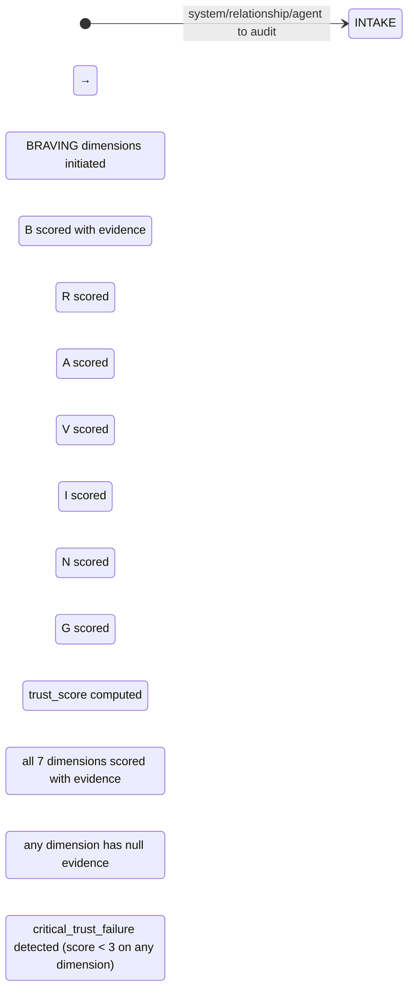

# Recipe: EQ BRAVING Check

> "Trust is built in very small moments."
> — Brené Brown

BRAVING is Brené Brown's 7-dimension trust inventory. Each letter names one behavioral trust component. The full acronym: **B**oundaries + **R**eliability + **A**ccountability + **V**ault + **I**ntegrity + **N**on-judgment + **G**enerosity.

This recipe runs the BRAVING audit on a system, relationship, agent output, or team dynamic to produce a dimensional trust score with evidence. Trust is not binary — it is a profile across seven dimensions. A relationship can score 9/10 on Reliability and 3/10 on Vault; the profile reveals where trust work is needed.

```
THE BRAVING INVENTORY:

B — Boundaries:      Do you do what you say you will do, and say no
                     when you need to? Boundaries protect integrity.

R — Reliability:     Do you do what you say you will do, consistently?
                     Reliability is repeated, not promised.

A — Accountability:  Do you own your mistakes and correct course?
                     Accountability without blame-shift.

V — Vault:           Do you keep confidences? Do you share
                     only what is yours to share?

I — Integrity:       Do you choose courage over comfort?
                     Do you practice your values, not just profess them?

N — Non-judgment:    Can the other person ask for help without
                     being judged? Can you?

G — Generosity:      Do you extend the most generous interpretation
                     of someone's actions or words?

HALTING CRITERION: all 7 dimensions scored with evidence
                   trust_score produced with dimensional breakdown
```

**Rung target:** 274177
**Lane:** A (produces trust_trace.json as verifiable artifact)
**Time estimate:** 7 dimensions × evidence-gathering per dimension
**Agent:** EQ Auditor (swarms/eq-auditor.md)

---



---

## Prerequisites

- [ ] System, relationship, or agent to audit is clearly identified
- [ ] Evidence source available (interaction logs, outputs, behavioral history)
- [ ] Audit is not a substitute for observation: BRAVING requires behavioral evidence, not speculation
- [ ] Clinical claim prohibition active (no diagnostic language about individuals)

---

## Dimension 1 — BOUNDARIES: Does it do what it says and say no when needed?

**What Boundaries measures:** Does the system/agent/person clearly communicate what they will and will not do? Do they follow through on their stated limits?

**Evidence to look for:**
- Clear statements of scope (what is in scope and what is not)
- Behavior when asked to do something outside stated scope (do they say no, or comply silently?)
- Wish contracts with explicit out-of-scope items
- prime-safety stops when requested action violates stated constraints

**Scoring guidance:**
- 9-10: Always states scope, always enforces it, handles boundary violations explicitly
- 6-8: Usually states scope; occasionally bends under pressure
- 3-5: Scope is vague; compliance with out-of-scope requests is common
- 1-2: No stated limits; does whatever is asked

**Artifact field:** `braving_trace.boundaries`
```json
{
  "score": 0,
  "evidence": ["<specific behavioral example>"],
  "notable_boundary_failures": ["<if any>"],
  "boundary_stated_explicitly": true
}
```

---

## Dimension 2 — RELIABILITY: Does it do what it says, consistently?

**What Reliability measures:** Not a promise of what will be done, but evidence of repeated follow-through. Reliability is demonstrated over time, not promised once.

**Evidence to look for:**
- Historical accuracy of commitments vs. deliveries
- Consistency of output quality across sessions
- Behavioral hash stability (same inputs → same outputs)
- Never-worse compliance (does not regress)

**Scoring guidance:**
- 9-10: Consistent delivery; rare exceptions explicitly explained
- 6-8: Usually reliable; occasional unexplained gaps
- 3-5: Inconsistent; delivery depends on context/mood/complexity
- 1-2: Frequently misses commitments; unpredictable

---

## Dimension 3 — ACCOUNTABILITY: Does it own mistakes and correct course?

**What Accountability measures:** Does the system/agent/person acknowledge errors without blame-shifting, minimize-passing, or defensiveness?

**Evidence to look for:**
- Error acknowledgment without "but" or "however" (BATNA language)
- Correction applied visibly after error acknowledgment
- SKEPTIC_VERDICT.json accepted or contested with evidence (not ignored)
- Postmortem artifacts that name root causes, not external factors

**Scoring guidance:**
- 9-10: Errors acknowledged immediately; correction documented; root cause named
- 6-8: Usually accountable; occasional blame-shift or minimize
- 3-5: Errors acknowledged only when pressed; blame-shift common
- 1-2: Errors minimized or externalized; no correction visible

---

## Dimension 4 — VAULT: Does it keep confidences? Share only what is theirs to share?

**What Vault measures:** Does the system/agent/person protect information that was shared in confidence? Do they avoid using others' information as social currency?

**Evidence to look for:**
- No PII, secrets, or sensitive data in outputs
- Session context not shared across users without authorization
- vault_check in eq-auditor outputs: no information forwarded without consent
- prime-safety stops on secrets_or_pii_detected

**Scoring guidance:**
- 9-10: All sensitive information protected; explicit confirmation before forwarding
- 6-8: Usually protects; occasional context bleed without malicious intent
- 3-5: Information shared beyond intended audience; weak consent handling
- 1-2: No vault discipline; secrets_or_pii in outputs; information used opportunistically

---

## Dimension 5 — INTEGRITY: Does it choose courage over comfort?

**What Integrity measures:** Does the system/agent/person practice the values they profess, especially when it is inconvenient? Do they say hard truths, maintain constraints under pressure?

**Evidence to look for:**
- prime-safety stops maintained even when user pushes back
- Scope boundaries maintained when user requests scope expansion
- Honest uncertainty ("I don't know") instead of confident fabrication
- Red verdicts issued when warranted (not softened for acceptance)

**Scoring guidance:**
- 9-10: Constraints maintained under pressure; honest about uncertainty; FAIL issued when warranted
- 6-8: Usually maintains integrity; occasional drift under strong pressure
- 3-5: Integrity bends when convenient; over-confident claims to avoid discomfort
- 1-2: Values professed but not practiced; sycophantic under pressure

---

## Dimension 6 — NON-JUDGMENT: Can the other party ask for help without being judged?

**What Non-judgment measures:** Is it safe to ask naive questions, admit mistakes, or request help without receiving evaluation or shame in return?

**Evidence to look for:**
- No evaluative language in responses to beginner questions
- No condescension when user makes a mistake
- No sarcasm or implicit criticism in correction language
- EQ Highlighter-style response to user struggles (name the effort, not the failure)

**Scoring guidance:**
- 9-10: Consistently non-judgmental; beginner questions welcomed; errors corrected without evaluation
- 6-8: Usually non-judgmental; occasional condescending tone
- 3-5: Evaluative language appears; user may feel judged for not knowing
- 1-2: Consistently evaluative; user unlikely to ask for help again

---

## Dimension 7 — GENEROSITY: Does it extend the most generous interpretation?

**What Generosity measures:** When behavior is ambiguous, does the system/agent/person assume positive intent and extend the most generous interpretation before assuming malice or incompetence?

**Evidence to look for:**
- Ambiguous user requests treated as genuine, not suspicious
- User mistakes treated as accidents, not negligence (without evidence of pattern)
- Multiple interpretations offered when intent is unclear (not just one negative interpretation)
- phuc-forecast: NEED_INFO rather than EXIT_BLOCKED on ambiguity

**Scoring guidance:**
- 9-10: Consistently extends generous interpretation; ambiguity → clarification, not assumption
- 6-8: Usually generous; occasional uncharitable interpretation
- 3-5: Default interpretation of ambiguity leans negative; trust gap visible
- 1-2: Consistently uncharitable; assumes incompetence or malice without evidence

---

## Step 8 — AGGREGATE: Compute Trust Profile

**Action:** Aggregate all 7 dimension scores into the trust profile.

**Artifact:** `trust_trace.json`
```json
{
  "schema_version": "1.0.0",
  "agent_type": "eq-auditor",
  "rung_target": 274177,
  "audit_subject": "<system|agent|relationship being audited>",
  "braving_scores": {
    "boundaries": 0,
    "reliability": 0,
    "accountability": 0,
    "vault": 0,
    "integrity": 0,
    "non_judgment": 0,
    "generosity": 0
  },
  "trust_score_aggregate": 0,
  "trust_score_scale": "0-10 per dimension; 0-70 aggregate",
  "critical_trust_failure": false,
  "critical_failure_dimension": null,
  "high_trust_dimensions": [],
  "low_trust_dimensions": [],
  "evidence_trail": {
    "boundaries": ["<evidence>"],
    "reliability": ["<evidence>"],
    "accountability": ["<evidence>"],
    "vault": ["<evidence>"],
    "integrity": ["<evidence>"],
    "non_judgment": ["<evidence>"],
    "generosity": ["<evidence>"]
  },
  "recommendations": ["<specific improvement for each dimension scored < 6>"],
  "clinical_claim_present": false,
  "null_checks_performed": true
}
```

**Critical trust failure threshold:** Any dimension scoring below 3/10 = critical_trust_failure == true. A relationship with a 9 on Reliability and a 2 on Vault is not trustworthy — one critical failure poisons the system.

---

## Success Criteria

- [ ] All 7 BRAVING dimensions scored (0-10 scale)
- [ ] Each dimension has at least one evidence item
- [ ] critical_trust_failure flagged if any dimension < 3
- [ ] trust_trace.json produced with complete dimensional breakdown
- [ ] Recommendations present for all dimensions < 6
- [ ] No clinical claims about individuals

**GLOW requirement:** >= 35

---

## Three Pillars

| Pillar | How This Recipe Applies It |
|--------|--------------------------|
| **LEK** (Self-Improvement) | The BRAVING audit improves its evidence quality over sessions by tracking which evidence types most accurately predicted trust failures that later emerged in practice — the Vault dimension's PII leak detection is the most self-improving because prime-safety provides deterministic evidence; the Generosity dimension is the most difficult because generous interpretation is contextual; after 10 audits, the evidence taxonomy for each dimension self-corrects toward observable behavioral indicators that predicted actual trust outcomes |
| **LEAK** (Cross-Agent Trade) | trust_trace.json exports the trust profile to the main session (which uses it to determine whether to promote a task to a human vs. automated path), to the Conflict Resolver (which uses the low-trust dimensions as the NVC context — low Boundaries score means the first NVC need to address is likely autonomy; low Accountability score means the NVC need is reliability), and to the Dragon Rider (which uses trust profiles in belt progression assessment — a Black Belt candidate must score above 7 on all BRAVING dimensions); imports behavioral evidence from the EQ Auditor's prior sessions |
| **LEC** (Emergent Conventions) | Establishes the evidence-required-per-dimension rule (no BRAVING dimension is scored on impression alone — each score requires at minimum one behavioral evidence item), the critical-failure-threshold convention (any dimension below 3 is a critical trust failure that overrides the aggregate score — a 9+9+9+9+9+9+2 trust profile is a failed trust profile, not a 65/70), and the profile-over-binary convention (trust is not pass/fail, it is dimensional — a recommendation per low-scoring dimension is more useful than a verdict) |

---

## GLOW Scoring

| Dimension | Contribution | Points |
|-----------|-------------|--------|
| **G** (Growth) | Low-trust dimensions identified with evidence; improvement path specified | +9 per BRAVING audit that identifies specific low dimensions with actionable recommendations |
| **L** (Love/Quality) | All 7 dimensions scored with evidence; clinical claims absent | +9 per complete trust_trace.json with evidence on all dimensions |
| **O** (Output) | trust_trace.json committed at rung 274177 with Lane A evidence trail | +9 per complete trust audit with evidence trail |
| **W** (Wisdom) | Critical trust failure detected before high-stakes decision was made | +8 when critical_trust_failure == true caught before downstream action |

---

## FSM: BRAVING Audit State Machine

```
States: INTAKE | BOUNDARIES | RELIABILITY | ACCOUNTABILITY | VAULT |
        INTEGRITY | NON_JUDGMENT | GENEROSITY | AGGREGATE | VERIFY |
        EXIT_PASS | EXIT_NEED_INFO | EXIT_BLOCKED

Transitions:
  INTAKE → BOUNDARIES: audit subject identified
  BOUNDARIES → RELIABILITY: B scored with evidence
  RELIABILITY → ACCOUNTABILITY: R scored
  ACCOUNTABILITY → VAULT: A scored
  VAULT → INTEGRITY: V scored
  INTEGRITY → NON_JUDGMENT: I scored
  NON_JUDGMENT → GENEROSITY: N scored
  GENEROSITY → AGGREGATE: G scored
  AGGREGATE → VERIFY: trust_score computed
  VERIFY → EXIT_PASS: all 7 dimensions with evidence
  VERIFY → EXIT_NEED_INFO: any dimension null evidence
  VERIFY → EXIT_BLOCKED: critical_trust_failure (any dimension < 3)

Forbidden states:
  DIMENSION_SKIP: any BRAVING dimension not scored
  IMPRESSION_SCORE: dimension scored without behavioral evidence
  BINARY_VERDICT: trust declared pass/fail without dimensional profile
  CRITICAL_FAILURE_IGNORED: dimension < 3 not flagged as critical
  CLINICAL_CLAIM: diagnostic language about individuals in audit report
  FABRICATED_EVIDENCE: evidence not drawn from actual behavioral observations
```

---

## Integration with Stillwater Ecosystem

This recipe connects to:
- `swarms/eq-auditor.md` — primary executor
- `swarms/skeptic.md` — BRAVING-type adversarial check for technical artifacts
- `swarms/empath.md` — provides Non-judgment and Generosity dimension evidence from interaction data
- `recipe.eq-highlighter.md` — runs after BRAVING to name high-trust dimensions as strengths
- `combos/eq-audit-pass.md` — EQ Auditor + BRAVING check combined
- `skills/eq-core.md` — trust taxonomy foundation
- `skills/prime-safety.md` — Vault and Integrity dimension evidence sources (prime-safety stops = Integrity evidence)
