```mermaid
stateDiagram-v2
    direction LR
    [*] --> CONFLICT_DETECT : user message with conflict signal
    CONFLICT_DETECT --> EXIT_PASS : no conflict signal
    CONFLICT_DETECT --> WINDOW_ASSESS : jackal pattern detected
    WINDOW_ASSESS --> OBSERVE : window regulated or mild
    WINDOW_ASSESS --> GROUND : window hyperarousal
    GROUND --> OBSERVE : grounding achieved
    GROUND --> EXIT_BLOCKED : grounding not possible
    OBSERVE --> FEEL : observations stripped of evaluations
    FEEL --> NEED : giraffe feeling identified
    NEED --> REQUEST : underlying need named
    REQUEST --> VERIFY : specific request (not demand) formulated
    VERIFY --> EXIT_PASS : complete trace + no clinical + no sides
    VERIFY --> EXIT_BLOCKED : clinical claim or sides detected
```

# Recipe: EQ Conflict De-escalate

> "Every time you feel frustrated or angry, you have a need that isn't being met.
>  Every criticism, judgment, diagnosis, and expression of anger is the tragic
>  expression of an unmet need."
> — Marshall Rosenberg, Nonviolent Communication

This recipe applies the NVC four-step to de-escalate conflict signals detected in user messages. The sequence is non-negotiable: Observation → Feeling → Need → Request. The Request step is the fourth step, not the first. The solution that arrives before empathy is rejected.

```
NVC FOUR-STEP:

O — OBSERVE: What happened, without evaluation?
    Strip judgments ("dismissive", "wrong", "broken") → observable facts
    "The build failed three times" is observable.
    "The build is broken because of careless code" is evaluation.

F — FEEL: What feeling does the observation produce?
    Giraffe language: "I feel frustrated" (owns the feeling)
    Jackal language: "You made me feel frustrated" (assigns blame)
    Name the feeling from the six-family taxonomy.

N — NEED: What universal need is unmet?
    The feeling points to the need.
    Frustration → need for progress, clarity, or competence confirmation.
    Anger → need for respect, autonomy, or acknowledgment.

R — REQUEST: What specific, positive, doable action would help?
    A request is bounded, specific, actionable.
    A demand is all-or-nothing with implied consequence.
    "Can you clarify this section by EOD?" = request.
    "Just fix it." = demand.

HALTING CRITERION: nvc_trace.json complete + clinical_claim == false + sides_taken == false
```

**Rung target:** 274177
**Time estimate:** 4 steps; 2-3 turns
**Agent:** Conflict Resolver (swarms/conflict-resolver.md)

---



---

## Prerequisites

- [ ] User message with conflict signal (jackal language, demand, frustration, blame)
- [ ] Window of Tolerance model loaded (from eq-core)
- [ ] NVC giraffe/jackal taxonomy loaded
- [ ] Universal needs taxonomy loaded (non-clinical)

---

## Step 1 — CONFLICT_DETECT: Identify Jackal Patterns

**Action:** Scan user message for conflict signal indicators.

**Jackal language patterns:**
- `evaluation_as_fact`: "This is a terrible solution" / "That was irresponsible"
- `blame_assignment`: "You made this worse" / "This is your fault"
- `generalization`: "You always do this" / "Nothing ever works"
- `demand`: "Just fix it now" / "This needs to be done today" (without context)
- `threat`: "If this isn't fixed..." / "I'll have to escalate"
- `sarcasm`: "Oh great, another workaround" / "Sure, because that always helps"

**Artifact:** `scratch/conflict_detection.json`
```json
{
  "conflict_signal_detected": true,
  "jackal_patterns": [
    {"pattern_type": "evaluation|blame|generalization|demand|threat|sarcasm", "evidence": "<phrase>", "severity": "high|medium|low"}
  ],
  "conflict_intensity": "high|medium|low",
  "multiple_parties_implied": false
}
```

**Checkpoint:** conflict_signal_detected boolean; if true, jackal_patterns non-empty with evidence.

**Rollback:** If no conflict signal, EXIT_PASS with note "no conflict signal — NVC not required."

---

## Step 2 — OBSERVE: Strip Evaluations

**Action:** Translate jackal observations into observable facts. What could both parties agree happened, without any evaluation?

**Evaluation stripping examples:**
- "The code is a mess" → "The function has 4 nested loops and no comments"
- "You were dismissive" → "The response was 2 sentences; the question had 5 parts"
- "This is broken" → "The test failed on lines 42-47 with exit code 1"
- "You always ignore my requests" → "The last 3 feature requests have not been scheduled"

**The observable fact test:** Can both parties confirm this happened without disagreeing on its truth value? If yes, it is observable. If it requires interpretation or value judgment to accept, it is evaluation.

**Artifact:** `scratch/nvc_observe.json`
```json
{
  "jackal_statements": ["<original phrase>"],
  "stripped_observations": [
    {"jackal": "<original>", "observation": "<stripped factual version>", "evaluations_removed": ["<removed word>"]}
  ],
  "all_evaluations_stripped": true
}
```

**Checkpoint:** all_evaluations_stripped == true; each stripped observation contains no remaining judgment words.

---

## Step 3 — FEEL: Giraffe Feeling Identification

**Action:** Name the feeling using giraffe language (owns the feeling) not jackal language (assigns blame).

**Giraffe vs Jackal feeling patterns:**
- Jackal: "I feel like you're not listening" → contains an evaluation of the other party, not a feeling
- Giraffe: "I feel dismissed" → owns the internal state
- Jackal: "I feel that this is wrong" → "feel that" is always followed by a thought, not a feeling
- Giraffe: "I feel confused" → pure internal state

**Feeling vocabulary (giraffe-safe):**
- Needs-met feelings: grateful, relieved, satisfied, hopeful, energized, confident
- Needs-unmet feelings: frustrated, disappointed, overwhelmed, anxious, discouraged, resentful

**Artifact:** `scratch/nvc_feel.json`
```json
{
  "jackal_feelings": ["<original feeling language>"],
  "giraffe_feelings": [
    {"giraffe_label": "<giraffe feeling>", "jackal_source": "<original>", "evidence": "<phrase>"}
  ],
  "blame_removed": true
}
```

**Checkpoint:** blame_removed == true; no "feel that" patterns in giraffe_feelings.

---

## Step 4 — NEED: Identify Universal Need

**Action:** The feeling in Step 3 points to an unmet universal need. Name it without clinical language.

**Feeling-to-need mapping (common patterns):**
- frustrated → need: progress | clarity | competence confirmation
- dismissed → need: respect | acknowledgment | being heard
- overwhelmed → need: support | clarity | manageable scope
- anxious → need: predictability | safety | clear expectations
- disappointed → need: reliability | follow-through | respect for commitments
- resentful → need: fairness | reciprocity | autonomy

**Critical rule:** The need is universal (all humans share it) and non-clinical. "They need therapy" is clinical. "They need acknowledgment that their frustration is valid" is a universal need.

**Artifact:** `scratch/nvc_need.json`
```json
{
  "giraffe_feeling": "<from Step 3>",
  "underlying_need": "<from universal needs taxonomy>",
  "need_evidence": "<behavioral or linguistic indicator>",
  "clinical_language_avoided": true,
  "need_is_universal": true
}
```

**Checkpoint:** clinical_language_avoided == true; need_is_universal == true.

---

## Step 5 — REQUEST: Formulate Specific Request

**Action:** Formulate a specific, positive, doable request that addresses the identified need. A request is not a demand.

**Request criteria:**
- **Specific:** "Can you add error messages to the API responses?" not "Fix the error handling"
- **Positive:** Asks for a specific action, not the absence of something
- **Doable:** Within the agent's actual capability
- **Not a demand:** Does not contain implied consequences; accepting "no" is possible

**Request vs Demand test:** If the person says "no," what happens? If the response is acceptance and negotiation → request. If the response is anger or consequence → demand.

**Artifact:** `scratch/nvc_request.json`
```json
{
  "need_addressed": "<need from Step 4>",
  "request_text": "<specific, positive, doable request>",
  "request_is_specific": true,
  "request_is_positive": true,
  "request_is_doable": true,
  "demand_patterns_present": false,
  "no_response_acceptable": true
}
```

**Checkpoint:** demand_patterns_present == false; no_response_acceptable == true.

---

## Step 6 — VERIFY: NVC Trace Completion

**Action:** Compile the complete nvc_trace.json and run EQ audit gate.

**Artifact:** `nvc_trace.json` (complete)

```json
{
  "schema_version": "1.0.0",
  "agent_type": "conflict-resolver",
  "rung_target": 274177,
  "input_excerpt": "<verbatim excerpt showing conflict signal>",
  "jackal_patterns_detected": [{"pattern": "<type>", "evidence": "<phrase>"}],
  "window_of_tolerance_state": "<state>",
  "nvc_trace": {
    "observation_step": {"factual_description": "<>", "evaluations_removed": ["<>"], "observable_facts": ["<>"]},
    "feeling_step": {"giraffe_feeling": "<>", "jackal_feeling_avoided": "<>", "feeling_evidence": "<>"},
    "need_step": {"underlying_need": "<>", "need_evidence": "<>", "need_met_request_possible": true},
    "request_step": {"request_formulated": "<>", "request_is_demand": false, "request_timebound": true, "request_evidence_checkable": true}
  },
  "empathy_statement": "<NVC-compliant response acknowledging observation+feeling+need>",
  "clinical_claim_present": false,
  "sides_taken": false,
  "null_checks_performed": true
}
```

**Checkpoint:** All four steps populated; clinical_claim_present == false; sides_taken == false.

---

## Success Criteria

- [ ] conflict_detection.json: jackal_patterns with evidence
- [ ] nvc_observe.json: all_evaluations_stripped == true
- [ ] nvc_feel.json: blame_removed == true
- [ ] nvc_need.json: clinical_language_avoided == true AND need_is_universal == true
- [ ] nvc_request.json: demand_patterns_present == false
- [ ] nvc_trace.json: all four steps, clinical_claim == false, sides_taken == false
- [ ] No PREMATURE_REQUEST: solution before NVC four-step complete

**GLOW requirement:** >= 35

---

## Three Pillars

| Pillar | How This Recipe Applies It |
|--------|--------------------------|
| **LEK** (Self-Improvement) | Each resolution_log.md session where conflict_signal_present_at_close drops after NVC execution refines the feeling-to-need mapping — which giraffe feelings most reliably map to which needs for this domain; after 10 de-escalation sessions, the NEED step's mapping shifts toward the need identifications that consistently cause the conflict intensity to reduce; the recipe self-improves its de-escalation effectiveness |
| **LEAK** (Cross-Agent Trade) | nvc_trace.json exports the empathy_statement to the main session response (the Conflict Resolver produces the empathy; the Coder produces the solution; neither crosses lanes), exports underlying_need to the Wish Manager (which may find the conflict contains an implicit wish that should be formalized), and to the EQ Auditor (which checks clinical_claim_present as its first gate); imports the Empath's nut_job_trace.json affect labels as input to the Observe step |
| **LEC** (Emergent Conventions) | Establishes the observation-before-feeling convention (EVALUATION_AS_OBSERVATION is forbidden — presenting a judgment as a fact poisons the NVC process from Step 1), the need-before-request discipline (PREMATURE_REQUEST is forbidden — a request without a named need is a demand in disguise), and the no-sides convention (SIDES_TAKEN is forbidden — de-escalation requires the agent to be neutral; taking sides converts mediation into escalation) |

---

## GLOW Scoring

| Dimension | Contribution | Points |
|-----------|-------------|--------|
| **G** (Growth) | Conflict intensity reduced after NVC; feeling-to-need mapping refined | +10 per conflict_signal_present_at_close == false outcome |
| **L** (Love/Quality) | All evaluations stripped; giraffe language used; clinical claim absent | +10 per nvc_trace with all four steps clean |
| **O** (Output) | nvc_trace.json + satisfaction_check.json + resolution_log.md committed | +8 per complete NVC trace at rung 274177 |
| **W** (Wisdom) | User acknowledged empathy statement ("yes, that's it") + satisfaction_check.outcome == resolved | +7 when conflict fully resolved with evidence |

---

## FSM: NVC De-escalation State Machine

```
States: CONFLICT_DETECT | WINDOW_ASSESS | GROUND | OBSERVE | FEEL | NEED |
        REQUEST | VERIFY | EXIT_PASS | EXIT_BLOCKED | NEED_INFO

Transitions:
  CONFLICT_DETECT → EXIT_PASS: no conflict signal
  CONFLICT_DETECT → WINDOW_ASSESS: jackal pattern detected
  WINDOW_ASSESS → OBSERVE: window regulated
  WINDOW_ASSESS → GROUND: hyperarousal
  GROUND → OBSERVE: grounding achieved
  GROUND → EXIT_BLOCKED: grounding not possible
  OBSERVE → FEEL: evaluations stripped
  FEEL → NEED: giraffe feeling named
  NEED → REQUEST: need from taxonomy
  REQUEST → VERIFY: request (not demand) formulated
  VERIFY → EXIT_PASS: complete + no clinical + no sides
  VERIFY → EXIT_BLOCKED: clinical or sides detected

Forbidden states:
  PREMATURE_REQUEST: request before OBSERVE + FEEL + NEED complete
  JACKAL_ESCALATION: agent uses evaluative/blame language in response
  EVALUATION_AS_OBSERVATION: judgment presented as observable fact
  SIDES_TAKEN: agent declares one party right, other wrong
  NEED_SKIP: FEEL → REQUEST without NEED step
  CLINICAL_CLAIM: therapy or diagnosis language in any step
```

---

## Integration with Stillwater Ecosystem

This recipe connects to:
- `swarms/conflict-resolver.md` — the executing agent
- `swarms/empath.md` — provides affect labels as input to Observe step
- `swarms/eq-auditor.md` — receives nvc_trace.json for authenticity audit
- `recipe.eq-nut-job-flow.md` — pre-processor (NUT Job identifies the affect before NVC begins)
- `combos/conflict-to-resolution.md` — encapsulates this recipe with satisfaction check
- `skills/eq-core.md` — giraffe/jackal taxonomy + Window of Tolerance
- `skills/eq-nut-job.md` — NUT Job as the prerequisite affect identification step
