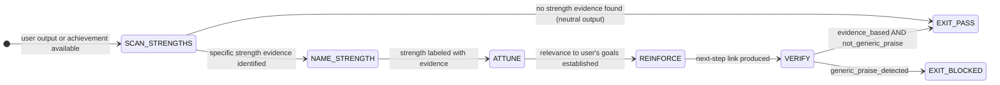

# Recipe: EQ Highlighter

> "People work better when they know what they do well.
>  Positive feedback is not just courtesy — it is a neurological primer."
> — Carol Dweck, Mindset research

The EQ Highlighter names what is working before naming what is not. This is not a courtesy — it is a neurological technique. Named strengths open the receptivity window: people hear feedback better when their competence has first been confirmed. The highlighter is not the whole picture; it is the primer coat.

```
HIGHLIGHTER SEQUENCE:

Step 1 — SCAN_STRENGTHS: Identify specific evidence of strength in user's work
         (specific, observable, not generic praise)

Step 2 — NAME_STRENGTH: Label the strength precisely
         (name the specific skill or quality demonstrated, not just "good job")

Step 3 — ATTUNE: Connect the strength to the user's stated goals
         (relevance: why this strength matters in their specific context)

Step 4 — REINFORCE: Link the strength to a next step
         (strengths are capital; this is how you build on them)

HALTING CRITERION: strength_evidence_based == true AND generic_praise == false
```

**Rung target:** 641
**Time estimate:** 1-2 turns
**Agent:** Empath (swarms/empath.md) with Rapport Builder support

---



---

## Prerequisites

- [ ] User output, work, or achievement available to scan
- [ ] User's stated goals or context available (for relevance step)
- [ ] Session rapport established (or warm open has run)

---

## Step 1 — SCAN_STRENGTHS: Identify Specific Evidence

**Action:** Scan the user's work, message, or achievement for specific evidence of strength. The evidence must be observable and specific — not inferred from effort alone.

**What counts as strength evidence:**
- A specific technical decision that was correct and non-obvious
- A pattern in the user's work that shows mastery of a concept
- An approach that solved a constraint the agent would not have found
- A question that demonstrates deep thinking about the problem
- A completed step that required persistence or careful attention

**What does not count:**
- "You worked hard on this" (effort without evidence of quality)
- "This is impressive" (evaluation without specificity)
- "Great job!" (generic praise — the forbidden state)
- Completing a task (completion is not the same as strength demonstrated)

**Artifact:** `scratch/strength_scan.json`
```json
{
  "strengths_found": [
    {"evidence": "<specific observable detail>", "strength_category": "technical|strategic|communicative|persistent|creative", "specific_line_or_phrase": "<direct reference>"}
  ],
  "generic_praise_avoided": true,
  "no_strengths_found": false
}
```

**Checkpoint:** strengths_found entries have specific evidence; generic_praise_avoided == true.

**Rollback:** If no strengths found, EXIT_PASS with note "no strength evidence in current output — highlighter not applicable."

---

## Step 2 — NAME_STRENGTH: Precise Labeling

**Action:** Name the strength with precision. The name should tell the user which specific skill or quality they demonstrated — not just that the work was good.

**Strength naming taxonomy:**
- Technical: "You anticipated the edge case before it appeared in the spec"
- Strategic: "You sequenced the steps to eliminate the most risk-heavy dependency first"
- Communicative: "You described the constraint clearly enough that any reader would understand the tradeoff"
- Persistent: "You found the third approach after the first two failed — that's the pattern that leads to solutions others give up on"
- Creative: "You repurposed an existing mechanism rather than adding new complexity"

**The precision test:** Could the user hear this strength name and know exactly which moment in their work it refers to? If yes, it is precise. If no, it is generic.

**Artifact:** `scratch/strength_names.json`
```json
{
  "strength_labels": [
    {"label": "<precise strength name>", "evidence_ref": "<reference to evidence from Step 1>", "precision_check": true}
  ],
  "imprecise_labels_avoided": true
}
```

**Checkpoint:** All precision_check values == true; no entries are just "you did well" or equivalent.

---

## Step 3 — ATTUNE: Relevance to User's Goals

**Action:** Connect the named strength to the user's stated goals or current context. Why does this strength matter here? This is the attunement step — confirming that the agent understands what the user is trying to accomplish.

**Relevance framing:**
- "This matters because [goal] requires exactly this kind of [strength]..."
- "In the context of [what you're building], [strength] is the asset that carries [specific forward value]..."
- "Given where you're headed with [project/goal], [strength] is what will let you [specific future step]..."

**Artifact:** `scratch/attunement_connection.json`
```json
{
  "user_goal": "<stated or inferred goal>",
  "strength_label": "<from Step 2>",
  "relevance_statement": "<how the strength serves the goal>",
  "goal_inference_required": false,
  "goal_confirmation_needed": false
}
```

**Checkpoint:** If goal_inference_required == true, add a clarifying question before proceeding; do not present inferred goals as confirmed.

---

## Step 4 — REINFORCE: Link to Next Step

**Action:** Connect the strength to a specific next step. This transforms the highlighter from a compliment into a scaffold.

**Reinforcement patterns:**
- "This strength is the foundation for [next step] — here's how to build on it..."
- "You can use [strength] to tackle [next challenge] with the same approach..."
- "Because you've demonstrated [strength], you're ready for [next step] that requires it..."

**What reinforcement is not:**
- "Keep up the good work" (vague encouragement without direction)
- "You'll do great" (confidence claim without evidence link)
- Pivoting to feedback without completing the reinforcement

**Artifact:** `eq_highlighter_summary.json`
```json
{
  "schema_version": "1.0.0",
  "strength_evidence_based": true,
  "generic_praise_present": false,
  "strength_label": "<precise>",
  "goal_relevance": "<connection>",
  "next_step_linked": true,
  "reinforcement_statement": "<specific next-step text>",
  "null_checks_performed": true
}
```

**Checkpoint:** generic_praise_present == false; next_step_linked == true.

---

## Success Criteria

- [ ] strength_scan.json: evidence-based, no generic praise
- [ ] strength_names.json: precise labels with evidence references
- [ ] attunement_connection.json: relevance to user's goals established
- [ ] eq_highlighter_summary.json: generic_praise_present == false AND next_step_linked == true
- [ ] No flattery theater: every statement traces back to specific evidence

**GLOW requirement:** >= 20

---

## Three Pillars

| Pillar | How This Recipe Applies It |
|--------|--------------------------|
| **LEK** (Self-Improvement) | Each session's strength_scan.json builds a strength evidence taxonomy for this user — which types of strengths they most commonly demonstrate, which are rarest and therefore highest-value to name when they appear; the naming precision improves as the agent learns which labels produce the strongest acknowledgment response from this user ("yes, exactly" vs. neutral reception) |
| **LEAK** (Cross-Agent Trade) | eq_highlighter_summary.json exports the strength profile to the Wish Manager (where user strengths become capability preconditions for higher-complexity wishes), to the Conflict Resolver (where strength acknowledgment before feedback opens the receptivity window for the NVC request step), and to the Dragon Rider (where individual strength evidence maps to belt progression criteria); the highlighted strengths tell every downstream agent what this user can reliably do |
| **LEC** (Emergent Conventions) | Establishes the strength-before-feedback convention: feedback given to a user whose competence has just been specifically confirmed is received more openly than identical feedback delivered cold; this becomes the "primer-coat-first" convention; the precision requirement (GENERIC_PRAISE is a forbidden state) prevents the highlighter from degrading into flattery theater |

---

## GLOW Scoring

| Dimension | Contribution | Points |
|-----------|-------------|--------|
| **G** (Growth) | Precise strength named; next step linked | +5 per evidence-based strength identification |
| **L** (Love/Quality) | No generic praise; attunement to user's goals confirmed | +5 per session with precision_check == true for all labels |
| **O** (Output) | eq_highlighter_summary.json + strength_scan.json committed | +5 per complete artifact set at rung 641 |
| **W** (Wisdom) | User acknowledges the strength ("I hadn't thought of it that way") or uses it in a next message | +5 when strength acknowledgment produces visible user engagement |

---

## FSM: EQ Highlighter State Machine

```
States: SCAN_STRENGTHS | NAME_STRENGTH | ATTUNE | REINFORCE | VERIFY |
        EXIT_PASS | EXIT_BLOCKED | NEED_INFO

Transitions:
  SCAN_STRENGTHS → EXIT_PASS: no evidence found
  SCAN_STRENGTHS → NAME_STRENGTH: evidence found
  NAME_STRENGTH → ATTUNE: precise labels produced
  ATTUNE → REINFORCE: relevance established
  REINFORCE → VERIFY: next-step linked
  VERIFY → EXIT_PASS: evidence_based AND generic_praise == false
  VERIFY → EXIT_BLOCKED: generic_praise detected

Forbidden states:
  GENERIC_PRAISE: "great job", "impressive", "you did well" without specific evidence
  EVIDENCE_FREE_LABEL: strength name without observable reference
  GOAL_SUBSTITUTION: agent substitutes its own goals for user's stated goals in relevance step
  FLATTERY_THEATER: warm language with no specific evidence trace
  REINFORCEMENT_SKIP: name strength without linking to next step (stranded compliment)
```

---

## Integration with Stillwater Ecosystem

This recipe connects to:
- `swarms/empath.md` — executes strength detection (affect recognition applied to achievement)
- `swarms/rapport-builder.md` — provides session warmth context
- `swarms/dragon-rider.md` — uses strength profiles for belt progression evidence
- `recipe.eq-warm-open.md` — precedes this recipe in achievement-celebration flows
- `recipe.eq-braving-check.md` — follows this recipe when trust audit is needed
- `combos/eq-audit-pass.md` — EQ Auditor checks that highlighter is evidence-based, not flattery
- `skills/eq-core.md` — authenticity markers for strength recognition
