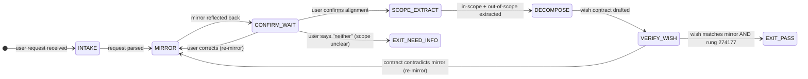

# Recipe: EQ Mirror + Wish

> "Most people do not listen with the intent to understand;
>  they listen with the intent to reply."
> — Stephen Covey

This recipe closes the gap between what the user said and what the user meant. Mirroring prevents the costly error of building the wrong thing with perfect technique. The wish decomposition only begins after the mirror confirms alignment.

```
MIRROR + WISH SEQUENCE:

Step 1 — MIRROR: Reflect back the user's intent in their own vocabulary
         (register-matched, not paraphrased into agent vocabulary)

Step 2 — CONFIRM: User confirms or corrects the mirror
         (if correction: re-mirror until alignment)

Step 3 — SCOPE: Extract explicit in-scope and out-of-scope from the confirmed intent
         (the scope is the wish contract boundary)

Step 4 — DECOMPOSE: prime-wishes decomposition into wish contract
         (preconditions + postconditions + evidence criteria)

Step 5 — VERIFY: Wish contract confirms the mirrored intent
         (integrity check: does the wish match the confirmed mirror?)

HALTING CRITERION: wish.{id}.md produced + mirror_alignment_confirmed == true
```

**Rung target:** 274177
**Time estimate:** 2-3 turns for mirror + confirm; 1 turn for decompose
**Agents:** Rapport Builder (mirror) → Wish Manager (decompose)

---



---

## Prerequisites

- [ ] User request message available (complex, ambiguous, or multi-step)
- [ ] Prior session context available (or null — first session)
- [ ] prime-wishes skill loaded (wish contract format)
- [ ] Rapport score from warm open (or null — default to professional register)

---

## Step 1 — MIRROR: Reflect Intent Back

**Action:** Reflect the user's request back using:
1. The user's own vocabulary (not agent vocabulary)
2. The detected register
3. A brief summary that names the goal, not the implementation
4. Optional: one clarifying question if a key dimension is ambiguous

**Mirroring rules:**
- Mirror the GOAL, not the METHOD: "You want to X" not "You want me to implement Y"
- Use the user's words: If they said "broken", don't say "defective"
- One clarifying question maximum: Mirror first, ask after
- Never paraphrase into jargon the user did not use

**Artifact:** `scratch/mirror_draft.md`
```
MIRROR DRAFT:
---
"If I understood correctly, you're looking to [GOAL] and it matters because [REASON].
The key part that needs to work is [CRITICAL_CONSTRAINT].

Is that right, or did I miss something?"
```

**Checkpoint:** Mirror uses user's vocabulary; names goal not method; ends with explicit confirmation request.

---

## Step 2 — CONFIRM: Alignment Gate

**Action:** Wait for user confirmation or correction. Track correction count.

**Alignment states:**
- `confirmed`: User affirms the mirror (verbally or behaviorally)
- `corrected`: User identifies a misunderstanding → re-mirror with the correction
- `scope_expanded`: User says "also X" → update mirror, re-confirm
- `neither`: User says the mirror was fundamentally wrong → ask one direct question about goal

**Artifact:** `scratch/mirror_alignment.json`
```json
{
  "mirror_version": 1,
  "alignment_state": "confirmed|corrected|scope_expanded|neither",
  "correction_applied": "<what was corrected, or null>",
  "confirmation_phrase": "<user phrase indicating alignment>",
  "re_mirror_count": 0,
  "aligned": true
}
```

**Checkpoint:** aligned == true before proceeding; re_mirror_count <= 3 (if 3 re-mirrors fail → EXIT_NEED_INFO).

---

## Step 3 — SCOPE_EXTRACT: Define Wish Boundary

**Action:** From the confirmed mirror, extract explicit scope:
- **In scope:** What must be delivered
- **Out of scope:** What is explicitly excluded (minimum 2 items)
- **Constraints:** Time, quality, format, dependencies

**Scope extraction is not inference.** If the user has not stated it, it is not in scope. Inferred scope is implicit scope and violates prime-wishes.

**Artifact:** `scratch/scope_definition.json`
```json
{
  "in_scope": ["<item 1>", "<item 2>"],
  "out_of_scope": ["<item 1>", "<item 2>"],
  "constraints": {"time": "<null or value>", "quality": "<null or value>", "format": "<null or value>"},
  "implicit_scope_items": ["<things user did not state but might expect — flagged for confirmation>"]
}
```

**Checkpoint:** out_of_scope has minimum 2 items; implicit_scope_items list explicitly present (may be empty); no inferred in-scope items presented as confirmed.

---

## Step 4 — DECOMPOSE: prime-wishes Wish Contract

**Action:** Decompose the confirmed, scoped intent into a prime-wishes wish contract.

**Wish contract structure:**
```markdown
---
wish_id: {auto-generated}
version: 1.0.0
state: PHASED
belt: white
---

# Wish: [GOAL from confirmed mirror]

## Statement
<one-sentence wish statement matching the confirmed mirror>

## Success Criteria
- [ ] <criterion 1 — observable, checkable>
- [ ] <criterion 2 — observable, checkable>

## Preconditions
<what must be true before this wish starts>

## Postconditions
<what must be true when this wish is done>

## Scope
**In scope:** <from scope_definition>
**Out of scope:** <from scope_definition — minimum 2>

## Evidence Required
<artifacts that prove this wish is done>
```

**Artifact:** `wish.{id}.md` — complete wish contract

**Checkpoint:** Scope section has both in-scope and out-of-scope; at minimum 2 out-of-scope items; statement matches confirmed mirror vocabulary.

---

## Step 5 — VERIFY: Mirror–Wish Integrity

**Action:** Verify that the wish contract faithfully represents the confirmed mirror. The two documents must be consistent:
- Wish statement = mirror goal in wish format
- In-scope items = confirmed deliverables from mirror
- Out-of-scope = exclusions confirmed during scope extraction

**Integrity check:** Can a developer who only reads the wish contract produce what the user confirmed in the mirror? If no → wish contract is incomplete or diverged.

**Artifact:** `scratch/mirror_wish_integrity.json`
```json
{
  "mirror_statement": "<confirmed mirror goal>",
  "wish_statement": "<wish contract statement>",
  "semantically_equivalent": true,
  "scope_consistent": true,
  "drift_detected": false,
  "drift_description": "<if drift_detected: what diverged>"
}
```

**Checkpoint:** semantically_equivalent == true; scope_consistent == true; drift_detected == false.

---

## Success Criteria

- [ ] mirror_draft.md produced using user's vocabulary
- [ ] mirror_alignment.json: aligned == true
- [ ] scope_definition.json: out_of_scope has >= 2 items
- [ ] wish.{id}.md: all sections populated, scope section complete
- [ ] mirror_wish_integrity.json: drift_detected == false
- [ ] No implicit scope items presented as confirmed

**GLOW requirement:** >= 35

---

## Three Pillars

| Pillar | How This Recipe Applies It |
|--------|--------------------------|
| **LEK** (Self-Improvement) | The Mirror step improves over sessions by tracking which mirror phrasings consistently produce first-turn confirmation versus which require re-mirroring; the mirror vocabulary that achieves alignment in one turn represents the most compressed representation of the user's goal; after 10 sessions, the mirror-drafting algorithm shifts toward the phrasing patterns that achieve single-turn confirmation most reliably |
| **LEAK** (Cross-Agent Trade) | The Rapport Builder owns the mirror step (vocabulary matching, register detection) and the Wish Manager owns the decompose step (preconditions, postconditions, evidence); they trade via scope_definition.json — the Rapport Builder extracts the scope from the confirmed mirror, the Wish Manager converts it into a formal wish contract; neither can complete their step without the other's output |
| **LEC** (Emergent Conventions) | Establishes the mirror-before-decompose convention: no wish contract is drafted without first mirroring the intent back to the user; a wish contract drafted without mirror confirmation is a wish contract that may not reflect what the user actually wanted; this becomes the "confirm before build" convention — the EQ equivalent of specifying the API contract before implementing |

---

## GLOW Scoring

| Dimension | Contribution | Points |
|-----------|-------------|--------|
| **G** (Growth) | Mirror achieved alignment in one turn | +10 per single-turn alignment; +5 per two-turn alignment |
| **L** (Love/Quality) | Wish contract has >= 2 out-of-scope items; drift_detected == false | +10 per wish contract with scope integrity confirmed |
| **O** (Output) | wish.{id}.md + mirror_alignment.json + scope_definition.json committed | +8 per complete artifact set at rung 274177 |
| **W** (Wisdom) | Northstar metric (recipe_hit_rate) advances — each confirmed wish becomes a replay-stable recipe | +7 when wish.{id}.md is used by Coder without scope expansion |

---

## FSM: Mirror + Wish State Machine

```
States: INTAKE | MIRROR | CONFIRM_WAIT | SCOPE_EXTRACT | DECOMPOSE |
        VERIFY_WISH | EXIT_PASS | EXIT_NEED_INFO | EXIT_BLOCKED

Transitions:
  INTAKE → MIRROR: request parsed
  MIRROR → CONFIRM_WAIT: mirror reflected (with confirmation request)
  CONFIRM_WAIT → SCOPE_EXTRACT: user confirms
  CONFIRM_WAIT → MIRROR: user corrects (bounded retry <= 3)
  CONFIRM_WAIT → EXIT_NEED_INFO: re_mirror_count > 3 OR user says "neither"
  SCOPE_EXTRACT → DECOMPOSE: in-scope + out-of-scope extracted
  DECOMPOSE → VERIFY_WISH: wish contract drafted
  VERIFY_WISH → EXIT_PASS: drift_detected == false
  VERIFY_WISH → MIRROR: drift detected (must re-confirm the drifted scope)

Forbidden states:
  WISH_WITHOUT_MIRROR: wish contract drafted without prior mirror confirmation
  IMPLICIT_SCOPE_AS_CONFIRMED: inferred items presented as confirmed scope
  SCOPE_WITHOUT_EXCLUSIONS: wish contract with no out-of-scope items (minimum 2 required)
  VOCABULARY_SUBSTITUTION: agent's vocabulary used in mirror where user's vocabulary was available
  WISH_DRIFT: wish contract diverges from confirmed mirror without re-confirmation
```

---

## Integration with Stillwater Ecosystem

This recipe connects to:
- `swarms/rapport-builder.md` — executes the mirror step
- `swarms/wish-manager.md` — executes the decompose step
- `swarms/empath.md` — provides session emotional context for mirror register
- `recipe.eq-warm-open.md` — precedes this recipe in the session flow
- `recipe.eq-nut-job-flow.md` — runs in parallel if emotional signal detected during mirror
- `combos/wish-with-mirror.md` — encapsulates this recipe as the intent-confirm stage
- `skills/prime-wishes.md` — wish contract format and constraints
