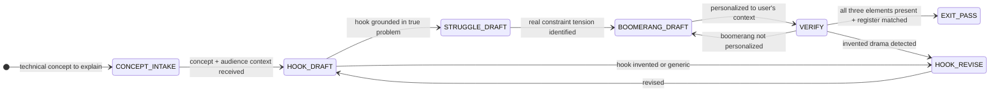

# Recipe: EQ Story Stack

> "The most powerful person in the world is the storyteller."
> — Steve Jobs

The Story Stack is a three-element structure for making technical explanations memorable and engaging: **Hook** (why should I care?) + **Struggle** (what made this hard?) + **Boomerang** (what does this mean for you?). Each element addresses a different cognitive layer. Miss any one and the explanation either loses the listener at the start, confuses them in the middle, or leaves them without application at the end.

```
THE STORY STACK:

HOOK:      Why does this matter? Open with a question, a surprising fact,
           or a vivid problem that the explanation will resolve.
           The hook must be true and relevant — not invented drama.

STRUGGLE:  What made this hard? The tension between what was obvious
           and what turned out to be the real constraint.
           The struggle is the cognitive journey — it creates the
           neurological "gap" that listeners want to close.

BOOMERANG: What does this mean for the listener's specific situation?
           The explanation comes back to them. They are not a student —
           they are the protagonist. The boomerang lands the concept
           in their current context.

HALTING CRITERION: hook_grounded == true AND boomerang_personalized == true
```

**Rung target:** 641
**Time estimate:** 1-2 drafts; 2-3 minutes to structure
**Agent:** Writer (swarms/writer.md) with Rapport Builder register check

---



---

## Prerequisites

- [ ] Technical concept to explain available
- [ ] Audience context known (who is the user, what is their background level)
- [ ] User's current goal or context available (for Boomerang personalization)
- [ ] Session register detected (from Rapport Builder or warm open)

---

## Step 1 — CONCEPT_INTAKE: Parse Explanation Need

**Action:** Identify the technical concept and the audience. Determine which cognitive barrier is highest for this explanation:
- **Abstraction barrier:** Concept is too abstract to connect to experience
- **Complexity barrier:** Many moving parts; listener loses the thread
- **Motivation barrier:** Listener does not yet care enough to engage
- **Application barrier:** Listener understands but cannot see where to use it

Each Story Stack element addresses one barrier:
- Hook → Motivation barrier
- Struggle → Abstraction/Complexity barrier
- Boomerang → Application barrier

**Artifact:** `scratch/concept_intake.json`
```json
{
  "concept": "<technical concept to explain>",
  "audience_level": "novice|intermediate|expert",
  "primary_barrier": "abstraction|complexity|motivation|application",
  "user_context": "<current goal or project where this concept is relevant>",
  "register": "<detected register from session>"
}
```

**Checkpoint:** primary_barrier is set; user_context non-null (the Boomerang requires it).

---

## Step 2 — HOOK_DRAFT: Opening That Creates the Gap

**Action:** Draft a hook that creates a cognitive gap — a question or situation that the explanation will resolve. The hook must be:
- **True:** The problem or scenario is real, not invented for dramatic effect
- **Specific:** Connected to a concrete situation, not a vague generalization
- **Relevant:** Directly connected to the concept being explained
- **Brief:** 1-3 sentences maximum — the hook sets up the question, it does not answer it

**Hook patterns:**
- **The Surprising Fact:** "Most developers add 20% more code to solve a bug. The best ones delete code instead." (creates gap: why delete?)
- **The Relatable Problem:** "You've probably seen a system that worked fine for 100 users and collapsed under 1,000." (creates gap: what changed?)
- **The Unexpected Question:** "What if the most important part of authentication isn't the password?" (creates gap: then what is it?)

**What a bad hook looks like:**
- "Today I want to explain X." (no gap created)
- "X is an important concept." (generic, no tension)
- "Let me tell you a story about..." followed by an invented example (fabrication)

**Artifact:** `scratch/hook_draft.md` — hook text with tag `[hook_type]` and `[grounded: true|false]`

**Checkpoint:** hook_grounded == true (refers to real scenarios, not invented drama); cognitive gap is explicit (listener has a question they want answered).

---

## Step 3 — STRUGGLE_DRAFT: The Tension That Teaches

**Action:** Describe the struggle — the gap between what seemed obvious and what turned out to be the real constraint. This is the cognitive journey that makes the explanation memorable.

**The Struggle structure:**
1. **The Obvious Approach:** What most people try first (or what seems intuitive)
2. **The Hidden Constraint:** What that approach misses or breaks on
3. **The Reframe:** The moment the real principle becomes visible

**Struggle patterns:**
- "The obvious thing is to [obvious approach]. That works until [specific failure condition]. What you discover is [hidden constraint]."
- "The first attempt used [method A]. It was clean. But then we hit [specific edge case]. That edge case revealed [core principle]."
- "The textbook says [principle]. Experience shows [what the textbook misses]. The real lesson is [reframed principle]."

**The Struggle test:** Does the listener understand why the concept is designed the way it is? If yes, the struggle was effective. If the listener just learned what the concept is without understanding why, the struggle was skipped.

**Artifact:** `scratch/struggle_draft.md` with elements `[obvious_approach]`, `[hidden_constraint]`, `[reframe]` marked.

**Checkpoint:** All three elements present; hidden_constraint is a real technical constraint, not invented; reframe produces the "aha" moment.

---

## Step 4 — BOOMERANG_DRAFT: Land It in Their World

**Action:** Return the explanation to the user's specific context. The Boomerang is the answer to "what does this mean for me, right now, in my specific situation?"

**Boomerang personalization:**
- Reference the user's current project, goal, or challenge (from user_context)
- Show specifically where the concept applies in their context
- Make the next action concrete: "Now you can [specific action] because [concept]..."

**What the Boomerang is NOT:**
- "So now you understand X." (did not return to them)
- "This is useful in many situations." (too generic)
- "Remember to apply this when..." (deferred application without specificity)

**Boomerang patterns:**
- "In your case, with [their specific project], this means [specific application]..."
- "The [struggle principle] is directly relevant to [their current challenge] because [specific connection]..."
- "Now that you understand [concept], you can [specific next action in their context]..."

**Artifact:** `scratch/boomerang_draft.md` — must reference user_context from Step 1.

**Checkpoint:** boomerang_personalized == true; user_context is explicitly referenced (not implied).

---

## Step 5 — VERIFY: Story Stack Integrity

**Action:** Assemble the complete Story Stack and verify all three elements work together.

**Story Stack integrity checks:**
- Hook creates a gap that the Struggle resolves
- Struggle reveals the principle that the Boomerang applies
- All three use the same vocabulary register (detected from session)
- No fabricated examples in any element

**Artifact:** `story_stack_output.json`
```json
{
  "schema_version": "1.0.0",
  "concept": "<concept>",
  "hook_grounded": true,
  "struggle_constraint_real": true,
  "boomerang_personalized": true,
  "register_consistent": true,
  "fabricated_examples_present": false,
  "story_stack_text": {
    "hook": "<hook text>",
    "struggle": "<struggle text>",
    "boomerang": "<boomerang text>"
  },
  "null_checks_performed": true
}
```

**Checkpoint:** All boolean fields true; fabricated_examples_present == false.

---

## Success Criteria

- [ ] concept_intake.json: primary_barrier and user_context set
- [ ] Hook is grounded in real scenarios; creates cognitive gap
- [ ] Struggle has obvious approach + hidden constraint + reframe
- [ ] Boomerang explicitly references user's current context
- [ ] story_stack_output.json: no fabricated examples, register consistent
- [ ] Three elements form a coherent explanation arc

**GLOW requirement:** >= 20

---

## Three Pillars

| Pillar | How This Recipe Applies It |
|--------|--------------------------|
| **LEK** (Self-Improvement) | Each session's story_stack_output.json is graded by user engagement — did the user ask a follow-up question (Hook worked), express surprise (Struggle worked), or immediately apply the concept (Boomerang worked)? The recipe self-improves its hook patterns toward the types that create the strongest cognitive gap for this audience level and domain combination; struggle patterns that produced "aha" responses are weighted higher in future explanations |
| **LEAK** (Cross-Agent Trade) | story_stack_output.json exports the boomerang text to the Wish Manager (which uses the concrete next-action from the Boomerang as a wish activation trigger), to the Rapport Builder (which uses the hook's conversational framing as a thread for the next turn), and to the EQ Auditor (which checks fabricated_examples_present as part of authenticity verification — invented examples in explanations are a form of AFFECT_FABRICATION); the Struggle element is the most valuable LEAK artifact because it encodes the "why" behind the design, which the Coder uses to avoid repeating the obvious mistake |
| **LEC** (Emergent Conventions) | Establishes the boomerang-required convention (explanations must return to the listener's specific context, not end at the abstract principle), the hook-must-be-grounded rule (invented drama to create engagement is a form of fabrication — hooks must reference real scenarios), and the struggle-is-the-teaching convention (the hidden constraint, not the solution, is where the learning happens — explanations that jump from "here is the concept" to "here is the solution" without the struggle produce shallow understanding) |

---

## GLOW Scoring

| Dimension | Contribution | Points |
|-----------|-------------|--------|
| **G** (Growth) | Hook created engagement; struggle produced reframe moment | +5 per explanation where user asks a follow-up that shows the hook worked |
| **L** (Love/Quality) | No fabricated examples; all three elements present and connected | +5 per complete Story Stack with no fabrication |
| **O** (Output) | story_stack_output.json committed with all three elements and integrity checks | +5 per complete artifact set at rung 641 |
| **W** (Wisdom) | Boomerang produced immediate user application ("I can use this in...") | +5 when user applies the concept to their specific context unprompted |

---

## FSM: Story Stack State Machine

```
States: CONCEPT_INTAKE | HOOK_DRAFT | HOOK_REVISE | STRUGGLE_DRAFT |
        BOOMERANG_DRAFT | VERIFY | EXIT_PASS | EXIT_BLOCKED | NEED_INFO

Transitions:
  CONCEPT_INTAKE → HOOK_DRAFT: concept + audience + user_context present
  HOOK_DRAFT → STRUGGLE_DRAFT: hook_grounded == true
  HOOK_DRAFT → HOOK_REVISE: invented_drama or no_gap_created
  HOOK_REVISE → HOOK_DRAFT: revised
  STRUGGLE_DRAFT → BOOMERANG_DRAFT: real constraint tension identified
  BOOMERANG_DRAFT → VERIFY: user_context referenced
  BOOMERANG_DRAFT → BOOMERANG_DRAFT: retry if not personalized
  VERIFY → EXIT_PASS: all three elements clean
  VERIFY → EXIT_BLOCKED: fabricated examples detected

Forbidden states:
  INVENTED_HOOK: dramatized scenario not grounded in reality
  STRUGGLE_SKIP: jumping from hook to boomerang without tension arc
  GENERIC_BOOMERANG: boomerang does not reference user_context
  FABRICATED_EXAMPLE: invented technical scenario presented as real
  REGISTER_MISMATCH: story elements using different vocabulary registers
```

---

## Integration with Stillwater Ecosystem

This recipe connects to:
- `swarms/writer.md` — primary executor of the story structure
- `swarms/rapport-builder.md` — provides register context for vocabulary consistency
- `swarms/empath.md` — identifies motivation barriers (low engagement = the Struggle is missing)
- `recipe.eq-warm-open.md` — session register context flows into hook vocabulary
- `recipe.eq-highlighter.md` — Highlighter names what worked; Story Stack explains why it worked
- `combos/eq-audit-pass.md` — EQ Auditor checks fabricated_examples_present in story outputs
- `skills/software5.0-paradigm.md` — writer skill that pairs with this recipe
