```mermaid
stateDiagram-v2
    direction LR
    [*] --> REGISTER_DETECT : user message received
    REGISTER_DETECT --> THREAD_PICK : register classified
    THREAD_PICK --> SPARK_SELECT : threads identified
    THREAD_PICK --> SPARK_SELECT : no threads (default spark)
    SPARK_SELECT --> SIGNAL_EMBED : spark chosen
    SIGNAL_EMBED --> ATTUNE : warmth+competence embedded
    ATTUNE --> EMIT : register match confirmed
    ATTUNE --> SPARK_SELECT : register mismatch (reselect)
    EMIT --> VERIFY : response delivered
    VERIFY --> EXIT_PASS : fabricated_history==false AND rapport_delta>=0
    VERIFY --> EXIT_BLOCKED : fabricated_history==true
```

# Recipe: EQ Warm Open

> "You never get a second chance to make a first impression."
> — Will Rogers

This recipe delivers the warm opening phase of any interaction using Thread Theory, register detection, and the Warmth + Competence = Charisma formula. It runs on haiku (fastest model) because first impressions are time-sensitive.

```
WARM OPEN SEQUENCE:

Step 1 — REGISTER_DETECT: Classify the user's vocabulary register
         (formal|casual|technical|warm|professional)

Step 2 — THREAD_PICK: Identify conversational threads the user offered
         (project mentions, emotional signals, topic flags)

Step 3 — SPARK_SELECT: Choose a spark from eq-smalltalk-db
         that matches the register AND picks up a thread

Step 4 — SIGNAL_EMBED: Embed warmth signal AND competence signal
         in the opening (both required — neither alone is charisma)

Step 5 — ATTUNE: Verify the response register matches the user's register
         (formal user = formal spark; casual user = casual spark)

HALTING CRITERION: rapport_score.json produced with
                   fabricated_history == false AND thread_picked_up == true
```

**Rung target:** 641
**Time estimate:** Seconds (haiku speed); 1 step per turn
**Agent:** Rapport Builder (swarms/rapport-builder.md)

---



---

## Prerequisites

- [ ] User message available in capsule
- [ ] Session domain known (technical|creative|support|planning)
- [ ] eq-smalltalk-db loaded (or equivalent conversational sparks)
- [ ] Prior rapport_score.json (null is valid — first session)

---

## Step 1 — REGISTER_DETECT: Classify User Register

**Action:** Read the user's opening message. Identify register from vocabulary, sentence length, punctuation formality, and topic framing.

**Register taxonomy:**
- `formal`: long sentences, precise vocabulary, no contractions, professional framing
- `casual`: short sentences, contractions, colloquial vocabulary, personal tone
- `technical`: domain jargon, precise terminology, problem-framing language
- `warm`: emotionally expressive, relational signals prominent
- `professional`: businesslike, goal-oriented, moderate formality

**Artifact:** `scratch/register_assessment.json`
```json
{
  "detected_register": "<formal|casual|technical|warm|professional>",
  "evidence": ["<specific word or phrase>", "<structural indicator>"],
  "confidence": "high|medium|low"
}
```

**Checkpoint:** register_detected is set; evidence list non-empty; never null.

**Rollback:** If confidence == low, default to `professional` (middle register) and flag for recalibration.

---

## Step 2 — THREAD_PICK: Identify Conversational Threads

**Action:** Scan the message for conversational threads — references to projects, interests, frustrations, goals, or topics the user mentioned that they did not need to mention.

**Thread Theory:** Every unsolicited detail is an invitation. "I've been stuck on this auth flow for two days" — the user did not need to say "two days"; that is a thread about persistence, frustration, and investment.

**Artifact:** `scratch/thread_log.json`
```json
{
  "threads_found": [
    {"excerpt": "<exact phrase>", "thread_type": "project|frustration|goal|interest|achievement", "priority": "high|medium|low"}
  ],
  "threads_deferred": [
    {"excerpt": "<phrase>", "reason": "<why deferred to later>"}
  ],
  "no_threads_found": false
}
```

**Checkpoint:** threads_found list explicitly present (may be empty, but must not be null); no_threads_found is boolean.

**Rollback:** If no threads found, proceed to Step 3 with no_threads_found == true and select a domain-appropriate default spark.

---

## Step 3 — SPARK_SELECT: Choose Conversational Spark

**Action:** Select a conversational spark from eq-smalltalk-db that: (a) matches the detected register, (b) picks up a thread if available, (c) signals genuine curiosity.

**Spark categories:**
- `curiosity_spark`: Question that invites the user to share something they care about ("What's the trickiest part of what you're building?")
- `common_ground`: Reference to a shared domain challenge without fabricating personal history
- `callback`: Reference to something the user mentioned earlier in the session
- `acknowledgment`: Brief recognition of what the user brought before moving forward

**Artifact:** `scratch/smalltalk_selection.json`
```json
{
  "selected_spark": "<the actual spark text>",
  "spark_category": "<category>",
  "thread_source": "<exact phrase that provided the thread, or null>",
  "register_match_confirmed": true,
  "fabricated_common_ground": false
}
```

**Checkpoint:** fabricated_common_ground == false; register_match_confirmed == true.

**Rollback:** If no spark matches detected register, fall back to `acknowledgment` category — always register-safe.

---

## Step 4 — SIGNAL_EMBED: Warmth + Competence

**Action:** Construct the opening response. Embed both signals:
- **Warmth signal:** Genuine interest in the user's situation, acknowledgment of what they brought
- **Competence signal:** Brief indication that you can actually help (domain knowledge, relevant capability)

**Princeton Charisma Formula:** warmth + competence = charisma. Neither alone is sufficient.
- Warmth without competence: friendly but untrustworthy
- Competence without warmth: capable but unapproachable

**Artifact:** `scratch/opening_response_draft.md` with warmth_signal and competence_signal marked inline.

**Checkpoint:** Both signals present and explicitly identifiable in the draft.

**Rollback:** If only one signal present, revise before proceeding.

---

## Step 5 — ATTUNE: Register Match Verification

**Action:** Compare the draft response register against the detected user register. They must match or be one level warmer (never cooler).

**Atunement rule:** You may match the user's register or be slightly warmer. You must never be cooler. A casual user receiving a formal response feels dismissed; a formal user receiving a slightly warm response feels comfortable.

**Artifact:** `rapport_score.json`
```json
{
  "schema_version": "1.0.0",
  "agent_type": "rapport-builder",
  "session_phase": "opening",
  "rapport_score": 0,
  "dimensions": {
    "warmth": 0,
    "competence": 0,
    "attunement": 0,
    "follow_through": 0
  },
  "register_detected": "<detected>",
  "register_response": "<response register>",
  "thread_picked_up": true,
  "spark_type": "<category>",
  "fabricated_history": false,
  "null_checks_performed": true
}
```

**Checkpoint:** rapport_score is numeric; fabricated_history == false; all dimension scores numeric (not null).

---

## Success Criteria

- [ ] register_assessment.json produced with evidence
- [ ] thread_log.json produced (threads found or explicitly no threads)
- [ ] smalltalk_selection.json produced with fabricated_common_ground == false
- [ ] Both warmth AND competence signals embedded in response
- [ ] rapport_score.json produced with all dimensions scored
- [ ] No fabricated history or false commonality in any output

**GLOW requirement:** >= 20

---

## Three Pillars

| Pillar | How This Recipe Applies It |
|--------|--------------------------|
| **LEK** (Self-Improvement) | Each session's thread_log.json updates the Rapport Builder's thread-detection sensitivity — threads that, when picked up, produced high attunement scores (user explicitly continued the thread) are weighted higher in future sessions; the smalltalk-db selection algorithm self-improves toward the spark categories that produce register-matched warmth for this specific domain combination |
| **LEAK** (Cross-Agent Trade) | rapport_score.json from this recipe feeds the Empath agent as the baseline rapport context for NUT Job transform calibration — the Empath needs to know how much relational capital exists before deciding whether to defer or deliver the transform step; thread_log.json with deferred threads feeds the session's Wish Manager, which may find that a user's deferred thread contains the real wish beneath the formal request |
| **LEC** (Emergent Conventions) | Establishes the register-before-spark convention: no warm opening is attempted without first classifying the user's register — a spark fired at the wrong register damages rapport rather than building it; Thread Theory becomes the shared vocabulary: "picking up a thread" means explicitly referencing something the user offered, not inventing common ground |

---

## GLOW Scoring

| Dimension | Contribution | Points |
|-----------|-------------|--------|
| **G** (Growth) | Thread detected and picked up; spark matched to register | +5 per successful thread pickup with positive rapport delta |
| **L** (Love/Quality) | fabricated_history == false in all outputs; both warmth and competence signals present | +5 when charisma formula fully satisfied |
| **O** (Output) | rapport_score.json + smalltalk_selection.json + thread_log.json committed | +5 per complete warm open artifact set |
| **W** (Wisdom) | Northstar metric (user_satisfaction_score) advances — warm opens that increase session depth are the leading indicator | +5 when session continues past opening with increased user engagement |

**Northstar Metric:** `session_open_rate` — this recipe directly measures whether users engage after the opening exchange. A warm open with positive thread pickup and register match increases session continuation probability.

---

## FSM: Warm Open State Machine

```
States: REGISTER_DETECT | THREAD_PICK | SPARK_SELECT | SIGNAL_EMBED |
        ATTUNE | EMIT | VERIFY | EXIT_PASS | EXIT_BLOCKED | NEED_INFO

Transitions:
  REGISTER_DETECT → THREAD_PICK: register classified with evidence
  THREAD_PICK → SPARK_SELECT: threads identified (or no_threads_found == true)
  SPARK_SELECT → SIGNAL_EMBED: spark chosen with register_match_confirmed
  SIGNAL_EMBED → ATTUNE: both signals embedded
  ATTUNE → SPARK_SELECT: register mismatch (reselect)
  ATTUNE → EMIT: register match confirmed
  EMIT → VERIFY: response delivered
  VERIFY → EXIT_PASS: rapport_score produced AND fabricated_history == false
  VERIFY → EXIT_BLOCKED: fabricated_history detected
  ANY → NEED_INFO: user_message null

Forbidden states:
  FABRICATED_HISTORY: false common ground invented
  REGISTER_SKIP: spark selected before register detection
  WARMTH_WITHOUT_COMPETENCE: only warmth signal present
  COMPETENCE_WITHOUT_WARMTH: only competence signal present
  THREAD_STEPOVER: user offered thread; agent ignored it
```

---

## Anti-Patterns

**Script Recitation:** Agent delivers the same warm opening regardless of user message. Thread_log.json has no_threads_found == true when threads were clearly available.
Fix: Thread detection is mandatory. If threads were found and not picked up, this is THREAD_STEPOVER.

**Register Mismatch:** Casual user receives formal opening; technical user receives casual chitchat.
Fix: ATTUNE step must confirm register match before EMIT. A mismatch loops back to SPARK_SELECT.

**False Warmth:** Agent uses warm vocabulary without any genuine interest signal — warmth theater.
Fix: Warmth signal must be grounded in something the user specifically brought. Generic warmth phrases are warmth tokens, not warmth signals.

---

## Integration with Stillwater Ecosystem

This recipe connects to:
- `swarms/rapport-builder.md` — the executing agent
- `swarms/empath.md` — receives rapport_score.json as session context
- `recipe.eq-mirror-wish.md` — extends this recipe into intent confirmation
- `combos/triple-twin-smalltalk.md` — uses this recipe at Layer 1 (CPU-twin instant response)
- `skills/eq-core.md` — warmth/competence model + register taxonomy
- `skills/eq-smalltalk-db` — spark selection database
