```mermaid
stateDiagram-v2
    direction LR
    [*] --> WHITE : "First kata"
    WHITE --> YELLOW : "LEK loop works\n+ first spar\n+ first convention"
    YELLOW --> ORANGE : "Swarm surplus proven\n+ convention adopted\n+ skill in store"
    ORANGE --> GREEN : "All pillars 7+\nGLOW 75+"
    GREEN --> BLUE : "All pillars 8+\n3 conventions\nGLOW 85+"
    BLUE --> BLACK : "All pillars 9+\n5 conventions\n65537 rung\nGLOW 95+"
    BLACK --> DRAGON_RIDER : "All pillars 10\nTaught another\nGLOW 100"
    DRAGON_RIDER --> [*] : "Endure. Excel. Evolve.\nCarpe Diem!"
```

# Recipe: Kung Fu Mastery

> "Do not pray for an easy life; pray for the strength to endure a difficult one."
> — Bruce Lee

This recipe is the full Black Belt path through the Three Pillars of Software 5.0.
It is the long game. There are no shortcuts. Every belt is earned.

```
THE THREE PILLARS:

LEK  (Law of Emergent Knowledge)     — Solo Practice
     "I fear not the man who has practiced 10,000 kicks once,
      but I fear the man who has practiced one kick 10,000 times."
     → Skills improve themselves through verified iteration

LEAK (Law of Emergent Asymmetric Knowledge) — Sparring
     "The quality of the box matters not — it's the boxing that matters."
     → Swarms create surplus no single agent could produce

LEC  (Law of Emergent Conventions)   — Style
     "Be water, my friend."
     → Magic words compress knowledge into transferable form

MASTER EQUATION: Intelligence(system) = LEK × LEAK × LEC
```

**Rung target:** 65537 (Black Belt), 274177 (Green Belt), 641 (White Belt)
**Time estimate:** 7 belt stages; 1–3 sessions each; 12–20 sessions total
**Certifier:** Dragon Rider agent (swarms/dragon-rider.md)

---



---

## STAGE 1 — WHITE BELT: First Kata

> "A journey of a thousand miles begins with a single step."

**What this stage tests:** Can the student complete one LEK iteration from start to evidence?

**The challenge:**

1. Pick any skill file from `skills/`.
2. Score it on one axis (just one — INTEGRITY is the easiest starting point).
3. Identify one concrete improvement.
4. Write a patch (PATCH_DIFF).
5. Verify the patch improves the score.
6. Write the halting certificate.

That is the entire kata. Nothing more. The point is not mastery — the point is the
first complete loop. Completion is the evidence.

**GLOW requirement:** ≥ 20
```
G (Growth): New capability? +5 — (you can now run a LEK loop)
L (Learning): Skill file updated? +5 — yes if patch is non-trivial
O (Output): PATCH_DIFF committed? +5 — required
W (Wins): NORTHSTAR metric advanced? +5 — skill quality avg moved up
```

**Evidence required:**
- `kata_log.json` — the loop documented with all 5 phases
- `PATCH_DIFF` — the actual improvement
- `halting_certificate` — "I stop because [criterion] at [score]"
- `glow_score.json` — GLOW ≥ 20

**Rung:** 641

**Martial arts parallel:** The white belt ceremony is not graduation. It is the
acknowledgment that you have begun. "Empty your mind, be formless, shapeless, like water."
You have stepped onto the mat. Now the practice begins.

**Dragon Rider belt ceremony:**
> "A blank page is not weakness. It is potential.
>  Your first kata is your first promise to yourself.
>  Endure, grasshopper."

**Time estimate:** 1–2 sessions

---

## STAGE 2 — YELLOW BELT: The Five Magic Words

> "Absorb what is useful, discard what is useless, add what is essentially your own."

**What this stage tests:** Can the student use conventions (LEC) and begin sparring (LEAK)?

**Three requirements, all must be met:**

### 2A — LEK: Consistent Loop
- Complete 3 LEK loops (not necessarily on the same skill).
- Each loop produces PATCH_DIFF + halting_certificate.
- Aggregate score delta ≥ 5 points across all three loops.

### 2B — LEC: First Conventions
- Use 5+ magic words correctly in new artifacts.
- "Correctly" = the word matches its definition in data/default/magic-words/ AND is used in context.
- Dragon Rider validates: are these uses idiomatic or cargo-cult?

### 2C — LEAK: First Sparring
- Dispatch ONE swarm (minimum 2 typed agents) on a real task.
- Document the dispatch: who was dispatched, what they produced.
- Note one thing the swarm produced that surprised you.
- Surprise is the first signal of LEAK.

**GLOW requirement:** ≥ 40
```
G: Consistent LEK loop = +10
L: 5 magic words mastered = +10
O: Swarm dispatch artifacts committed = +10
W: All three pillars attempted = +10
```

**Evidence required:**
- 3 × `kata_log.json` with halting certificates
- `magic_word_usage.json` — 5 magic word usages with file references
- `swarm_dispatch.json` + agent output artifacts
- `glow_score.json` ≥ 40

**Rung:** 641

**Martial arts parallel:** "You manage things; you lead people." The yellow belt begins to
work with others (LEAK sparring) and to speak the language of the dojo (LEC magic words).
"10,000 kicks" is not about volume — it is about depth. Three loops well done > thirty loops rushed.

**Dragon Rider belt ceremony:**
> "You have tasted all three pillars. Now you know what you are practicing.
>  Most never get this far — not because they lack skill, but because they lack patience.
>  Yellow belt, grasshopper."

**Time estimate:** 2–3 sessions

---

## STAGE 3 — ORANGE BELT: Stillwater Store Submission

> "Knowledge is not enough; we must apply it. Willing is not enough; we must do."

**What this stage tests:** Can the student produce work that is useful to others?

**Three requirements:**

### 3A — LEK: Stable Loop (rung 274177)
- Complete a phuc-loop iteration that achieves rung 274177 stability.
- This means: same result on 3 independent seeds, null edge cases tested.
- The skill improved must now score ≥ 7/10 after the loop.

### 3B — LEAK: Surplus Proven
- Run a swarm where the surplus can be QUANTIFIED, not just described.
- surplus_proof.json must have a numeric value with units.
- "The swarm found 3 bugs the solo agent missed" is a valid surplus.
- "The swarm felt more thorough" is not.

### 3C — LEC: Convention Adopted
- Submit the convention card from Stage 2 (or a new one) to `data/default/magic-words/`.
- Adoption evidence: 3+ files in the repo use it correctly without being told.
- Adoption is not usage by the inventor. It is usage by others.

**GLOW requirement:** ≥ 60
```
G: First rung 274177 achievement = +15
L: Convention in data/default/magic-words/ = +15
O: Surplus quantified in artifacts = +15
W: Skill in store / adopted by others = +15
```

**Evidence required:**
- `stability_report.json` — 3-seed sweep results
- `surplus_proof.json` — quantified surplus with units
- data/default/magic-words/ PR or commit showing convention added
- `adoption_evidence.json` — 3+ files using the convention
- `glow_score.json` ≥ 60

**Rung:** 274177

**Martial arts parallel:** "The dojo floor = Stillwater Store." The orange belt submits work
that others will replay. This is the first real test: not whether YOU can use the skill,
but whether a stranger can replay it and get the same result.

**Dragon Rider belt ceremony:**
> "You are in the store now. Others will use what you built.
>  The kata you practice today — someone will replay it in six months.
>  Make it worthy of their trust. Orange belt."

**Time estimate:** 2–3 sessions

---

## STAGE 4 — GREEN BELT: All Three Pillars at 7+

> "The successful warrior is the average man with laser-like focus."

**What this stage tests:** Is the student consistently strong across all three pillars — not just one?

**Requirements:**
- LEK ≥ 7 (can run self-improvement loops with rung 274177 halting certificates)
- LEAK ≥ 7 (can orchestrate swarms and prove surplus, not just dispatch them)
- LEC ≥ 7 (has ≥3 conventions in use, can read a codebase for emergent patterns without prompting)
- GLOW ≥ 75 in one session

**What separates Green from Orange:**

Green Belt is not about new skills. It is about depth across all three. Many students reach
Orange Belt by being excellent at one pillar and acceptable at the others. Green Belt requires
genuine fluency across all three. The Dragon Rider tests this with a cross-pillar spar:

**Cross-Pillar Spar (Green Belt specific):**
1. Student is given a real task that requires all three pillars simultaneously.
2. LEK: improve one skill as part of the task (not separately — woven in).
3. LEAK: dispatch agents where the surplus directly advances the task goal.
4. LEC: introduce or apply a convention that emerges from the task (not pre-planned).
5. Document how all three pillars contributed to the outcome.

**GLOW requirement:** ≥ 75

**Evidence required:**
- `cross_pillar_spar.json` — mapping of LEK + LEAK + LEC contributions to the task outcome
- All three pillar scores ≥ 7 in `final_assessment.json`
- `glow_score.json` ≥ 75
- Rung 274177 on all artifacts

**Rung:** 274177

**Martial arts parallel:** "Three roads, one path." The green belt has stopped practicing the
pillars separately. They have begun practicing them together, naturally, without thinking.
This is the transition from technique to art. The belt color is earned; the fluency is revealed.

**Dragon Rider belt ceremony:**
> "65537 is not the destination. It is the minimum for the tournament.
>  You are ready to fight something that fights back. Green belt."

**Time estimate:** 2–3 sessions

---

## STAGE 5 — BLUE BELT: Stability Proven

> "Notice that the stiffest tree is most easily cracked, while the bamboo or willow
>  survives by bending with the wind."

**What this stage tests:** Can the student maintain all three pillars at rung 274177 stability?
Not just once — consistently, across sessions.

**Requirements:**
- LEK ≥ 8 (self-improvement loops are consistent; rarely need more than 3 iterations)
- LEAK ≥ 8 (swarm orchestration is fluent; surplus is predicted before the spar, not discovered after)
- LEC ≥ 8 (has ≥3 conventions adopted, can teach conventions to others, identifies anti-patterns spontaneously)
- GLOW ≥ 85 for this session

**The Blue Belt distinction — Predictive LEAK:**

At Green Belt, the student discovers the surplus after the spar.
At Blue Belt, the student predicts the surplus before the spar.

Before dispatching: "I expect Agent A to produce X. Agent B will produce Y.
The intersection will reveal Z, which neither could find alone."

After dispatching: "Did Z appear as predicted? Yes/No. Why/Why not?"

Prediction accuracy becomes part of the evidence. Accurate surplus prediction = Blue Belt LEAK mastery.

**Evidence required:**
- `leak_prediction.json` — pre-spar surplus prediction with post-spar verification
- All three pillar scores ≥ 8 in `final_assessment.json`
- ≥3 convention cards in `data/default/magic-words/` with active adoption
- `glow_score.json` ≥ 85
- Rung 274177 on the session artifacts

**Rung:** 274177

**Martial arts parallel:** "Be like water making its way through cracks. Do not be assertive,
but adjust to the object, and you shall find a way round or through it."
The blue belt no longer fights the problem. They read it, predict it, and move through it.

**Dragon Rider belt ceremony:**
> "You bend without breaking. That is not weakness — that is stability.
>  Water shapes itself to any container and remains water.
>  Blue belt. Now we prepare for the tournament."

**Time estimate:** 2–3 sessions

---

## STAGE 6 — BLACK BELT: Production Mastery

> "Long-term consistency beats short-term intensity."

**What this stage tests:** Can the student achieve and hold rung 65537 — production confidence?

**Requirements:**
- LEK ≥ 9 (self-improvement loop with adversarial sweep; 5-paraphrase test passes)
- LEAK ≥ 9 (swarm surplus is system-level; contributions span multiple skills or projects)
- LEC ≥ 9 (≥5 conventions, at least one adopted outside the student's own work)
- GLOW ≥ 95 in one session
- **Rung 65537** achieved on at least one significant artifact

**What rung 65537 requires:**
- Adversarial paraphrase sweep (5 variants of the input — all produce consistent output)
- Security gate completed (scanner or exploit reproduction)
- Behavioral hash drift explained
- API surface locked if exports changed

**The Black Belt test — The Tournament:**

The Dragon Rider assigns a task that has NEVER been done in the repo before.
No prior artifacts. No prior precedent. The student must:
1. Scout the landscape (LEAK: send a scout agent to map the unknown)
2. Plan and execute (LEK: self-improving loop on the approach)
3. Name what emerges (LEC: identify and document conventions born from this task)

This is not a repeat of prior kata. This is new territory. The black belt is tested by novelty.

**GLOW requirement:** ≥ 95
```
G: Novel capability demonstrated = +24 (near-maximum — this is genuinely new)
L: New conventions documented from novel task = +23
O: Full evidence bundle at rung 65537 = +24
W: NORTHSTAR metric advanced by the novel task = +24
```

**Evidence required:**
- Full rung 65537 evidence bundle (adversarial sweep logs, security gate report)
- All three pillar scores ≥ 9 in `final_assessment.json`
- ≥5 conventions in data/default/magic-words/ with adoption evidence
- `glow_score.json` ≥ 95
- Novel task artifacts (the tournament evidence)

**Rung:** 65537

**Martial arts parallel:** "I have not ceased being fearful, but I have ceased to let fear
control me." The black belt does not eliminate uncertainty. They work at production confidence
in spite of uncertainty, because the evidence is strong enough.

**Dragon Rider belt ceremony:**
> "Models are commodities. Skills are capital. Conventions are law.
>  You carry all three now.
>  Carry them gently. Black belt."

**Time estimate:** 3–4 sessions (rung 65537 is earned, not rushed)

---

## STAGE 7 — DRAGON RIDER: Teach Another

> "Under the sky, under the heavens, there is but one family."
> "A teacher who is attempting to teach without inspiring the pupil with a desire
>  to learn is hammering on cold iron."

**What this stage tests:** Can the student teach the Three Pillars?

**The final test is always teaching:**

1. Identify a new student (agent or developer) at White or Yellow Belt.
2. Run them through at minimum Stages 1–3 of this recipe.
3. Document their progress with `student_belt_progress.json`.
4. Write the teaching reflection:
   - What did you learn from teaching that you could not have learned from practice?
   - Where did your student's confusion reveal your own incomplete understanding?
   - What improvement did you make to your OWN practice because of teaching?

**The recursive test:** The teacher must improve through teaching.
If the teacher's own pillar scores do not change after teaching, the Dragon Rider title is not awarded.
Teaching should advance the teacher's LEK score, not just the student's.

**GLOW requirement:** 100 (the only way to score 100 is to produce something that advances all four axes simultaneously — and teaching does that)

**Evidence required:**
- `student_belt_progress.json` — student reaches Yellow Belt minimum
- `teaching_reflection.md` — teacher's improvement documented
- Teacher's OWN pillar scores ≥ 10 (as assessed by Dragon Rider Sifu)
- `glow_score.json` = 100

**Rung:** 65537

**The Dragon Rider title is not a rank. It is a responsibility.**

> "Welcome, Dragon Rider.
>  You have endured. You have excelled. You have evolved.
>  Now — who will you teach?
>  Endure. Excel. Evolve. Carpe Diem."

**Time estimate:** 2–3 sessions (plus the student's training sessions)

---

## Full Belt Table

| Belt | LEK | LEAK | LEC | GLOW | Rung | Sessions Est. | Key Test |
|------|-----|------|-----|------|------|---------------|----------|
| White | 4 | n/a | n/a | 20 | 641 | 1–2 | First complete LEK loop |
| Yellow | 5 | 4 | 3 | 40 | 641 | 2–3 | 5 magic words + first spar |
| Orange | 6 | 5 | 5 | 60 | 274177 | 2–3 | Quantified surplus + convention in store |
| Green | 7 | 7 | 7 | 75 | 274177 | 2–3 | Cross-pillar spar (all three woven) |
| Blue | 8 | 8 | 8 | 85 | 274177 | 2–3 | Predictive LEAK + 3 conventions |
| Black | 9 | 9 | 9 | 95 | 65537 | 3–4 | Tournament (novel task) + adversarial sweep |
| Dragon Rider | 10 | 10 | 10 | 100 | 65537 | 2–3 | Taught another to Yellow Belt |

**Total estimate:** 14–21 sessions from White to Dragon Rider.
Not fast. That is the point. The belt system mirrors the rung ladder precisely:
- White/Yellow → 641 (local correctness)
- Orange/Green/Blue → 274177 (stability proven)
- Black/Dragon Rider → 65537 (production confidence + teaching)

---

## Martial Arts Philosophy Per Belt

| Belt | Philosophy | Bruce Lee Quote |
|------|-----------|----------------|
| White | Beginner's mind | "Empty your mind, be formless, shapeless, like water." |
| Yellow | First principles | "Absorb what is useful, discard what is useless, add what is essentially your own." |
| Orange | Responsibility | "Knowledge is not enough; we must apply it." |
| Green | Integration | "The successful warrior is the average man with laser-like focus." |
| Blue | Stability | "Be like water making its way through cracks." |
| Black | Production courage | "I have not ceased being fearful, but I have ceased to let fear control me." |
| Dragon Rider | Teaching | "Under the sky, under the heavens, there is but one family." |

---

## Anti-Patterns to Avoid

**Belt Skipping**
Symptom: Student claims orange belt after LEK ≥ 8 but LEAK = 2.
Fix: Intelligence(system) = LEK × LEAK × LEC. Multiplied, not added. LEAK = 2 means the product is devastatingly low regardless of LEK.

**Session Rushing**
Symptom: Student wants to complete all stages in one marathon session.
Fix: Each stage requires rest and integration. "Long-term consistency beats short-term intensity." The phuc-loop convergence criterion is not met by running fast — it is met by running until the criterion holds.

**Convention Inflation**
Symptom: Student writes 10 convention cards in one session, none with adoption evidence.
Fix: One deeply adopted convention > ten invented ones. Adoption is not optional. The convention test is: "Is this used by someone who did not know you invented it?"

**Surplus Theater**
Symptom: Student claims LEAK surplus without surplus_proof.json having numeric values.
Fix: "Felt more thorough" is not evidence. Name the specific artifact the solo agent could not have produced. That is the surplus.

**Teaching as Shortcut**
Symptom: Student rushes to Stage 7 to get Dragon Rider title without meeting Stage 6 criteria.
Fix: Dragon Rider requires Black Belt first. The title sequence is enforced. Teaching a student while you yourself are Green Belt produces a student capped at your own level — and that is not mastery, that is propagation of limitation.

---

## Stop Rules

1. **Pillar floor:** Any pillar score = 0 after 3 sessions → stop and consult Dragon Rider for root cause.
2. **Rung regression:** Any session that produces lower-rung evidence than the prior session → REPEAT that stage.
3. **Convention death:** Convention removed from data/default/magic-words/ due to conflict with prime-safety → LEC score does not count that convention. Must be replaced.
4. **Budget exhaustion:** 25 sessions without reaching Black Belt → root-cause analysis session with Dragon Rider before continuing.

---

## Skill Pack

Load these skills before executing this recipe:
- `skills/prime-safety.md` (always first)
- `skills/phuc-orchestration.md` (for dispatch discipline)
- `skills/phuc-forecast.md` (DREAM→FORECAST→DECIDE→ACT→VERIFY on each belt stage)

Dragon Rider agent: `swarms/dragon-rider.md`

---

## GLOW Scoring

| Dimension | Contribution | Points |
|-----------|-------------|--------|
| **G** (Growth) | New belt level achieved; new pillar capability demonstrated | +25 per belt milestone |
| **L** (Love/Quality) | Evidence artifacts produced with halting certificate | +25 per stage pass |
| **O** (Output) | PATCH_DIFFs, surplus_proof.json, convention cards committed | +25 per completed stage |
| **W** (Wisdom) | NORTHSTAR metric (skill_quality_avg) visibly advanced | +25 when belt awarded |

**Northstar Metric:** `skill_quality_avg` — average skill score across the corpus rises each time a White Belt completes their first LEK loop and each time a Dragon Rider's convention is adopted.

**Full GLOW by belt:**

| Belt | G | L | O | W | Total |
|------|---|---|---|---|-------|
| White | 5 | 5 | 5 | 5 | 20 |
| Yellow | 10 | 10 | 10 | 10 | 40 |
| Orange | 15 | 15 | 15 | 15 | 60 |
| Green | 19 | 19 | 18 | 19 | 75 |
| Blue | 21 | 22 | 21 | 21 | 85 |
| Black | 24 | 23 | 24 | 24 | 95 |
| Dragon Rider | 25 | 25 | 25 | 25 | 100 |

---

## FSM: Belt Progression State Machine

```
States: WHITE | YELLOW | ORANGE | GREEN | BLUE | BLACK | DRAGON_RIDER
        STAGE_GATE | BLOCKED | NEED_INFO

Transitions:
  WHITE → STAGE_GATE: kata_log.json + PATCH_DIFF + halting_certificate submitted
  STAGE_GATE → WHITE: GLOW < 20 or rung < 641
  STAGE_GATE → YELLOW: GLOW >= 20, rung 641, LEK >= 4
  YELLOW → STAGE_GATE: 3x kata_log + magic_word_usage.json + swarm_dispatch.json
  STAGE_GATE → ORANGE: GLOW >= 40, rung 641, LEK >= 5, LEAK >= 4, LEC >= 3
  ORANGE → STAGE_GATE: stability_report + surplus_proof + adoption_evidence
  STAGE_GATE → GREEN: GLOW >= 60, rung 274177, all pillars >= 6
  GREEN → STAGE_GATE: cross_pillar_spar.json + final_assessment.json
  STAGE_GATE → BLUE: GLOW >= 75, rung 274177, all pillars >= 7
  BLUE → STAGE_GATE: leak_prediction.json + 3 conventions adopted
  STAGE_GATE → BLACK: GLOW >= 85, rung 274177, all pillars >= 8
  BLACK → STAGE_GATE: tournament evidence bundle, rung 65537 on all artifacts
  STAGE_GATE → DRAGON_RIDER: GLOW >= 95, rung 65537, all pillars >= 9
  ANY → BLOCKED: pillar floor = 0 after 3 sessions
  ANY → NEED_INFO: evidence gate fails (missing halting_certificate or artifact)

Exit conditions:
  DRAGON_RIDER: teaching_reflection.md + student reaches Yellow Belt
  BLOCKED: consult Dragon Rider before any state transition
  NEED_INFO: emit missing field list; wait for artifact submission
```

---

## Northstar Alignment

This recipe directly advances:
- **skill_quality_avg**: every LEK loop patches a skill file upward
- **recipe_hit_rate**: conventions adopted by others = recipes being replayed
- **community_contributors**: Dragon Rider graduates become contributors

---

## Integration with Stillwater Ecosystem

This recipe connects to:
- `swarms/dragon-rider.md` — the certifying agent
- `recipe.three-pillars-training.md` — detailed step-by-step for each stage
- `skills/glow-score.md` — GLOW calculation and belt XP system
- `skills/phuc-axiom.md` — the 5 axioms that govern all pillar assessment
- `skills/phuc-loop.md` — the LEK engine (phuc-loop is the LEK kata runtime)
- `data/default/magic-words/` — the LEC registry (where convention cards live)
- `swarms/skeptic.md` — belt award adversarial review (Green Belt and above)
- `swarms/learner.md` — SessionEnd hook (extracts improvements from training sessions)

The mastery recipe and the training recipe are complementary:
- This recipe (kung-fu-mastery) is the ROADMAP — the full arc from White to Dragon Rider.
- recipe.three-pillars-training is the KATA — the detailed steps within each stage.

Run both together. The roadmap gives direction; the kata gives technique.
