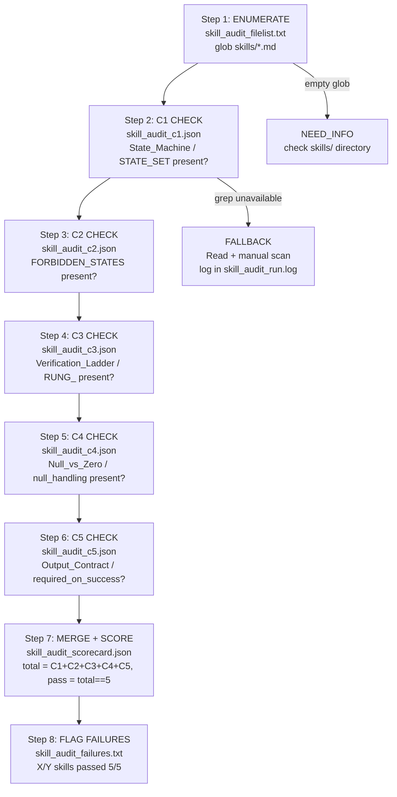

# Recipe: Skill Completeness Audit (5/5 Binary Scorecard)

## Purpose

Run a deterministic, automated 5-criterion binary scorecard across every skill file in the repository. Each skill is graded PASS (5/5) or flagged with the specific missing sections. Designed to replace 2 hours of manual swarm audit with a 15-minute automated sweep.

## When to Use

- Before a skill promotion sweep (to ensure all skills meet rung 641 minimums)
- After adding new skill files (to catch missing sections early)
- As a CI gate on PRs that touch `skills/`

## 5 Criteria (Binary: 0 or 1 each)

| # | Criterion | Detection Pattern |
|---|-----------|-------------------|
| C1 | FSM present | `State_Machine:` or `STATE_SET:` or `## State Machine` |
| C2 | Forbidden states defined | `FORBIDDEN_STATES:` or `forbidden_states:` |
| C3 | Verification ladder | `Verification_Ladder:` or `RUNG_` or `verification_rung` |
| C4 | Null/zero handling | `Null_vs_Zero` or `NULL_ZERO` or `null_handling` |
| C5 | Output contract | `Output_Contract:` or `required_on_success` |

## Output Artifacts

- `scratch/skill_audit_scorecard.json` — machine-parseable per-file scorecard
- `scratch/skill_audit_failures.txt` — list of failing files with missing criteria
- `scratch/skill_audit_run.log` — tool call log and any fallback events

## Notes

- All grep patterns are case-insensitive anchored to field names; literal string matches only
- A score of 0 results from a grep with zero matches — this is NOT an error; it is a clean false
- Do not conflate "grep returned empty" (zero hits, valid result) with "grep failed" (tool error)

---

## Audit Flow (Mermaid Diagram)



---

## FSM: Skill Completeness Audit State Machine

```
States: ENUMERATE | C1_CHECK | C2_CHECK | C3_CHECK | C4_CHECK |
        C5_CHECK | MERGE_SCORE | FLAG_FAILURES | PASS | BLOCKED | NEED_INFO

Transitions:
  [*] → ENUMERATE: audit invoked on skills/ directory
  ENUMERATE → NEED_INFO: glob returns empty (widen to *.yaml; if still empty → NEED_INFO)
  ENUMERATE → C1_CHECK: file list non-empty
  C1_CHECK → C2_CHECK: all files have c1_pass entry (true or false)
  C2_CHECK → C3_CHECK: all files have c2_pass entry
  C3_CHECK → C4_CHECK: all files have c3_pass entry
  C4_CHECK → C5_CHECK: all files have c4_pass entry
  C5_CHECK → MERGE_SCORE: all files have c5_pass entry
  MERGE_SCORE → FLAG_FAILURES: scorecard.json parses, all total == sum(c1..c5)
  FLAG_FAILURES → PASS: summary line printed, failure file written

  Fallback branch:
  ANY_CHECK → FALLBACK_READ: grep tool unavailable
  FALLBACK_READ → NEXT_CHECK: manual scan complete, tool fallback logged

Exit conditions:
  PASS: scorecard.json complete, summary line "X/Y skills passed 5/5" printed
  NEED_INFO: skills/ directory empty or inaccessible
  BLOCKED: not used (audit never blocks; it reports findings)
```

---

## GLOW Scoring

| Dimension | Contribution | Points |
|-----------|-------------|--------|
| **G** (Growth) | Audit run reveals which criteria are most commonly missing — pattern accumulates into better expansion heuristics | +3 per run that identifies a previously unknown failure pattern |
| **L** (Love/Quality) | Scorecard is machine-parseable; total == sum(C1..C5) verified by Python assertion | +3 per run where verification script exits 0 |
| **O** (Output) | skill_audit_scorecard.json + skill_audit_failures.txt committed with complete file coverage | +3 per complete audit run |
| **W** (Wisdom) | Northstar metric (skill_quality_avg) measurably rises when failing skills are fixed after audit | +3 when re-audit shows X/Y improved vs prior run |

**Northstar Metric:** `skill_quality_avg` — the audit directly measures this metric. Each run produces the ground truth on how many skills are 5/5 complete. The delta between consecutive runs shows whether skill_quality_avg is improving.

---

## Three Pillars of Software 5.0 Kung Fu

| Pillar | How This Recipe Applies It |
|--------|--------------------------|
| **LEK** (Self-Improvement) | Each audit run produces a scorecard that reveals which criteria are most commonly missing across the skill corpus — tracking failure patterns over time guides skill authors toward the sections that the community most frequently omits, improving the average skill quality with each audit cycle |
| **LEAK** (Cross-Agent Trade) | The skill_audit_scorecard.json is a shared artifact between the auditor agent and the expansion agent: the auditor identifies gaps (C1–C5 failures), the expander fills them using recipe.skill-expansion — the scorecard is the handoff contract that makes this division of labor precise |
| **LEC** (Emergent Conventions) | Enforces the 5-criterion binary scorecard as the community-wide skill completeness standard: FSM + forbidden states + verification ladder + null/zero handling + output contract become the non-negotiable structural conventions that every skill must satisfy before promotion |

**Belt Level:** Yellow — demonstrates the ability to assess any skill file against a structured rubric, produce a machine-parseable scorecard, and identify specific gaps rather than making vague quality judgments.

**GLOW Score:** +3 per successful audit run where skill_audit_scorecard.json is emitted with every file checked, total == sum(C1..C5) verified, and the summary line X/Y skills passed 5/5 is printed.
