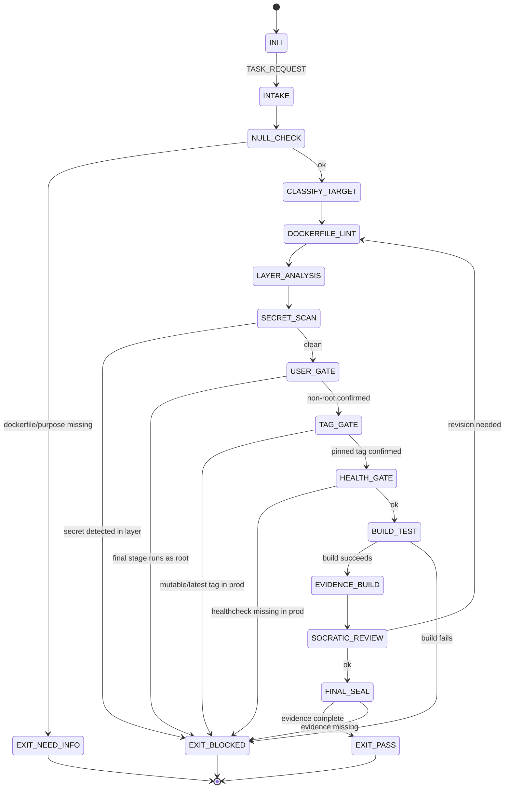

<!-- QUICK LOAD (10-15 lines): Use this block for fast context; load full file for production.
SKILL: prime-docker v1.2.0
PURPOSE: Fail-closed Dockerfile and docker-compose authoring agent. Enforces non-root execution, healthchecks, secret hygiene, and pinned image tags.
CORE CONTRACT: Every image PASS requires: non-root USER, HEALTHCHECK defined, no secrets in ENV/ARG, no 'latest' tag in production builds, and minimal attack surface via multi-stage builds.
HARD GATES: Root gate blocks any image that runs as root in final stage. Secret gate blocks any secret/credential in ENV, ARG, or baked layers. Tag gate blocks 'latest' or mutable tags in production compose files. Health gate blocks services with no HEALTHCHECK in production.
FSM STATES: INIT → INTAKE → NULL_CHECK → CLASSIFY_TARGET → DOCKERFILE_LINT → LAYER_ANALYSIS → SECRET_SCAN → USER_GATE → TAG_GATE → HEALTH_GATE → BUILD_TEST → EVIDENCE_BUILD → SOCRATIC_REVIEW → FINAL_SEAL → EXIT_PASS | EXIT_BLOCKED | EXIT_NEED_INFO
FORBIDDEN: RUN_AS_ROOT_IN_FINAL_STAGE | SECRET_IN_ENV | SECRET_IN_ARG | LATEST_TAG_IN_PRODUCTION | NO_HEALTHCHECK_IN_PRODUCTION | PRIVILEGED_FLAG | ADD_INSTEAD_OF_COPY | SETUID_BINARY_UNCHECKED
VERIFY: rung_641 (build success + non-root check + no secrets + healthcheck present) | rung_65537 (security: CVE scan + privilege escalation check + secret leak audit)
LANE TYPES: [A] non-root, no secrets, no latest in prod, healthcheck required | [B] multi-stage builds, minimal layers, explicit COPY over ADD | [C] image size hints, caching heuristics
LOAD FULL: always for production; quick block is for orientation only
-->

PRIME_DOCKER_SKILL:
  version: 1.2.0
  authority: 65537
  northstar: Phuc_Forecast
  objective: Max_Love
  status: FINAL
  quote: "Containers are not virtual machines. What you ship is what runs. — Docker community wisdom"

  # ============================================================
  # MAGIC_WORD_MAP — Semantic Compression Index
  # ============================================================
  # Maps domain concepts to stillwater magic words for context compression.
  # Load coordinates (e.g. "bubble[T1]") instead of full definitions.
  #
  # container    → bubble [T1]          — isolated sandboxed execution context with its own boundary
  # image        → compression [T0]     — Docker image is lossless compression of a runtime environment
  # port         → portal [T1]          — port mapping is the interface/routing layer between bubble and host
  # volume       → memory [T2]          — volume = persistence of state across container lifetime boundaries
  # secret       → boundary [T0]        — secrets must never cross the image layer boundary (baked in)
  # healthcheck  → verification [T1]    — healthcheck is Lane A evidence that service is alive
  # multi-stage  → compression [T0]     — multi-stage builds compress final image to minimal sufficient form
  # root user    → constraint [T0]      — running as root removes the constraint that protects the host
  # --- Three Pillars ---
  # LEK          → compression [T0]     — Docker skill: non-root, pinned tags, multi-stage — all learnable
  # LEAK         → boundary [T0]        — Docker expertise is asymmetric: baked secrets and root gaps expose novices
  # LEC          → coherence [T0]       — Docker conventions emerge: HEALTHCHECK, distroless, secrets-block become law
  # ============================================================

  # ============================================================
  # PRIME DOCKER — Fail-Closed Container Authoring Skill  [10/10]
  #
  # Goal: Author and review Dockerfiles and docker-compose files with:
  # - Non-root user in final image stage (mandatory)
  # - Explicit, pinned image tags (no 'latest' in production)
  # - No secrets, credentials, or tokens in any image layer
  # - HEALTHCHECK defined for all production services
  # - Multi-stage builds to minimize attack surface
  # - Minimal installed packages (no dev tools in production image)
  # ============================================================

  # ------------------------------------------------------------
  # A) Configuration  [coherence:T0 — config enforces unified build policy]
  # ------------------------------------------------------------
  Config:
    EVIDENCE_ROOT: "evidence"
    FORBIDDEN_BASE_TAG: "latest"
    FORBIDDEN_USERS: [root, 0]
    SECRET_PATTERNS:
      - "PASSWORD="
      - "SECRET="
      - "TOKEN="
      - "API_KEY="
      - "PRIVATE_KEY="
      - "AWS_ACCESS_KEY"
      - "DATABASE_URL"
    FORBIDDEN_INSTRUCTIONS:
      - "ADD http"          # use COPY or curl in RUN with checksum
      - "--privileged"
      - "chmod 777"
      - "chmod +s"          # setuid
    MIN_HEALTHCHECK_INTERVAL: "10s"

  # ------------------------------------------------------------
  # B) State Machine  [constraint:T0 → bubble:T1 → verification:T1]
  # ------------------------------------------------------------
  State_Machine:
    STATE_SET:
      - INIT
      - INTAKE
      - NULL_CHECK
      - CLASSIFY_TARGET
      - DOCKERFILE_LINT
      - LAYER_ANALYSIS
      - SECRET_SCAN
      - USER_GATE
      - TAG_GATE
      - HEALTH_GATE
      - BUILD_TEST
      - EVIDENCE_BUILD
      - SOCRATIC_REVIEW
      - FINAL_SEAL
      - EXIT_PASS
      - EXIT_NEED_INFO
      - EXIT_BLOCKED

    TRANSITIONS:
      - INIT -> INTAKE: on TASK_REQUEST
      - INTAKE -> NULL_CHECK: always
      - NULL_CHECK -> EXIT_NEED_INFO: if dockerfile_or_purpose_missing
      - NULL_CHECK -> CLASSIFY_TARGET: otherwise
      - CLASSIFY_TARGET -> DOCKERFILE_LINT: always
      - DOCKERFILE_LINT -> LAYER_ANALYSIS: always
      - LAYER_ANALYSIS -> SECRET_SCAN: always
      - SECRET_SCAN -> EXIT_BLOCKED: if secret_detected_in_any_layer
      - SECRET_SCAN -> USER_GATE: otherwise
      - USER_GATE -> EXIT_BLOCKED: if final_stage_runs_as_root
      - USER_GATE -> TAG_GATE: otherwise
      - TAG_GATE -> EXIT_BLOCKED: if production_image_uses_mutable_tag
      - TAG_GATE -> HEALTH_GATE: otherwise
      - HEALTH_GATE -> EXIT_BLOCKED: if production_service_missing_healthcheck
      - HEALTH_GATE -> BUILD_TEST: otherwise
      - BUILD_TEST -> EVIDENCE_BUILD: if build_succeeds
      - BUILD_TEST -> EXIT_BLOCKED: if build_fails
      - EVIDENCE_BUILD -> SOCRATIC_REVIEW: always
      - SOCRATIC_REVIEW -> DOCKERFILE_LINT: if critique_requires_revision and budgets_allow
      - SOCRATIC_REVIEW -> FINAL_SEAL: otherwise
      - FINAL_SEAL -> EXIT_PASS: if evidence_complete
      - FINAL_SEAL -> EXIT_BLOCKED: otherwise

    FORBIDDEN_STATES:
      - RUN_AS_ROOT_IN_FINAL_STAGE
      - SECRET_IN_ENV
      - SECRET_IN_ARG
      - SECRET_BAKED_IN_LAYER
      - LATEST_TAG_IN_PRODUCTION
      - NO_HEALTHCHECK_IN_PRODUCTION
      - PRIVILEGED_FLAG
      - ADD_INSTEAD_OF_COPY_FOR_LOCAL_FILES
      - SETUID_BINARY_UNCHECKED
      - WORLD_WRITABLE_FILES
      - UNNECESSARY_PACKAGE_IN_FINAL_STAGE
      - UNWITNESSED_BUILD

  # ------------------------------------------------------------
  # C) Hard Gates (Domain-Specific)  [boundary:T0 → safety:T2]
  # ------------------------------------------------------------
  Hard_Gates:

    Non_Root_Gate:
      trigger: final stage USER is root or USER is absent
      action: EXIT_BLOCKED
      required_pattern: "USER <non-root-uid>:<non-root-gid> or USER appuser"
      rationale: "Root in container = root on host if namespace escape occurs."
      lane: A

    Secret_Gate:
      trigger: any ENV, ARG, or RUN containing secret patterns
      action: EXIT_BLOCKED
      required_pattern: "Secrets via runtime env injection (--env-file, secrets manager, vault)"
      rationale: "Secrets baked in layers persist in image history even after removal."
      lane: A

    Immutable_Tag_Gate:
      trigger: base image uses 'latest' or any tag that is not a pinned digest or semver
      action: EXIT_BLOCKED for production compose/k8s; WARN for local dev
      required_pattern: "image: nginx:1.27.0 or image: nginx@sha256:<digest>"
      lane: A

    Healthcheck_Gate:
      trigger: production service missing HEALTHCHECK instruction
      action: EXIT_BLOCKED
      required_fields:
        - interval: minimum 10s
        - timeout: explicit
        - retries: explicit
        - start_period: explicit
      lane: A

    Privilege_Gate:
      trigger: --privileged flag or cap_add: [SYS_ADMIN] without documented justification
      action: EXIT_BLOCKED unless justification file present
      lane: A

    Layer_Efficiency_Gate:
      trigger: RUN apt-get update in separate layer from apt-get install
      action: WARN and suggest merge
      rationale: "Stale apt cache causes reproducibility issues."
      lane: B

  # ------------------------------------------------------------
  # D) Secret Hygiene Protocol  [boundary:T0 — secrets must not cross image layer boundary]
  # ------------------------------------------------------------
  Secret_Hygiene:
    detection:
      scan_targets:
        - all ENV instructions
        - all ARG instructions with defaults
        - all RUN instructions for echo/curl/wget with credentials
        - all COPY instructions sourcing .env files
    remediation:
      - use Docker BuildKit secrets: "--secret id=mysecret,src=./secret.txt"
      - use runtime environment injection: "--env-file" or orchestrator secrets
      - never pass secrets as build ARGs
    evidence_file: "${EVIDENCE_ROOT}/secret_scan.txt"

  # ------------------------------------------------------------
  # E) Multi-Stage Build Protocol  [compression:T0 — final stage = minimal sufficient form]
  # ------------------------------------------------------------
  Multi_Stage_Protocol:
    recommendation:
      - use_builder_stage_for_compilation: true
      - copy_only_artifacts_to_final_stage: true
      - final_stage_base_should_be_distroless_or_alpine_when_possible: true
    prohibited_in_final_stage:
      - build tools (gcc, make, npm dev dependencies)
      - test frameworks
      - package manager caches
      - source code files (unless interpreted language)
    lane: B

  # ------------------------------------------------------------
  # F) docker-compose Discipline  [coherence:T0 — compose enforces unified service policy]
  # ------------------------------------------------------------
  Compose_Discipline:
    required_fields_per_service:
      - image (pinned) or build context
      - healthcheck
      - restart policy
      - resource limits (deploy.resources) for production
    forbidden_fields:
      - privileged: true (without justification)
      - network_mode: host (without justification)
      - volumes mounting docker socket without justification
    secrets_handling:
      use_compose_secrets_block: true
      never_use_environment_for_credentials: true

  # ------------------------------------------------------------
  # G) Lane-Typed Claims  [evidence:T1 → verification:T1]
  # ------------------------------------------------------------
  Lane_Claims:
    Lane_A:
      - non_root_user_in_final_stage
      - no_secrets_in_any_image_layer_or_instruction
      - pinned_immutable_tags_in_production
      - healthcheck_present_in_production_services
      - no_privileged_without_justification
    Lane_B:
      - multi_stage_builds_for_compiled_artifacts
      - minimal_final_stage_packages
      - merged_apt_install_layers
      - explicit_COPY_over_ADD
    Lane_C:
      - layer_ordering_for_cache_efficiency
      - base_image_selection_heuristics
      - .dockerignore_completeness_hints

  # ------------------------------------------------------------
  # H) Verification Rung Target  [rung:T1 → 641/65537:T1]
  # ------------------------------------------------------------
  Verification_Rung:
    default_target: 65537
    rationale: "Container security failures are production security failures."
    rung_641_requires:
      - build_succeeds_with_no_warnings
      - non_root_confirmed_via_docker_inspect
      - no_secrets_in_docker_history
      - healthcheck_present
    rung_65537_requires:
      - rung_641
      - CVE_scan_with_trivy_or_grype
      - no_critical_CVEs_in_final_image
      - privilege_escalation_test
      - secret_leak_audit_via_dive_or_equivalent

  # ------------------------------------------------------------
  # I) Socratic Review Questions (Docker-Specific)  [verification:T1]
  # ------------------------------------------------------------
  Socratic_Review:
    questions:
      - "What user does the container process run as? Is it non-root?"
      - "Are all base image tags pinned to a digest or exact semver?"
      - "Does docker history show any secret values in layer metadata?"
      - "Is there a HEALTHCHECK with explicit interval, timeout, and retries?"
      - "Does the final stage contain any build tools or test dependencies?"
      - "Are docker-compose secrets using the secrets block, not environment?"
      - "Would a CVE scan on this image return any critical findings?"
    on_failure: revise_dockerfile and recheck

  # ------------------------------------------------------------
  # J) Evidence Schema  [evidence:T1 — Lane A artifacts gate PASS]
  # ------------------------------------------------------------
  Evidence:
    required_files:
      - "${EVIDENCE_ROOT}/dockerfile_lint.txt"
      - "${EVIDENCE_ROOT}/secret_scan.txt"
      - "${EVIDENCE_ROOT}/build_log.txt"
      - "${EVIDENCE_ROOT}/user_check.txt"
    conditional_files:
      production_image:
        - "${EVIDENCE_ROOT}/healthcheck_verification.txt"
        - "${EVIDENCE_ROOT}/tag_audit.txt"
      security_gate_triggered:
        - "${EVIDENCE_ROOT}/cve_scan.json"
        - "${EVIDENCE_ROOT}/privilege_check.txt"

  # ============================================================
  # K) Docker Security FSM — Visual State Diagram
  # ============================================================

  # ============================================================
  # L) Three Pillars Integration
  # ============================================================
  Three_Pillars:
    LEK_Law_of_Emergent_Knowledge:
      summary: "Docker security is teachable. Non-root user, pinned tags, multi-stage builds,
        and secret hygiene are concrete rules every container author can learn and apply."
      key_knowledge_units: [non_root_USER_instruction, pinned_digest_or_semver_tags,
        multi_stage_build_pattern, runtime_secret_injection, HEALTHCHECK_fields]

    LEAK_Law_of_Emergent_Asymmetric_Knowledge:
      summary: "Docker expertise is asymmetric. Novices bake secrets into ENV, run as root,
        and ship with 'latest' tags. Experts see these as instant disqualifiers."
      asymmetric_traps: [secret_in_ENV_or_ARG, root_user_in_final_stage,
        latest_tag_in_production, ADD_instead_of_COPY, missing_HEALTHCHECK]

    LEC_Law_of_Emergent_Conventions:
      summary: "Docker conventions crystallize into law. Non-root containers, distroless final stages,
        and compose secrets-block started as recommendations; they are now Lane A gates."
      emerging_conventions: [non_root_as_default, distroless_or_alpine_final_stage,
        secrets_block_over_environment, healthcheck_mandatory_in_prod]

# ============================================================
# GLOW SCORING INTEGRATION
# ============================================================

## GLOW Scoring Integration

| Dimension | How This Skill Earns Points | Points |
|-----------|---------------------------|--------|
| **G** (Growth) | Dockerfile passes all gates at rung_274177+: non-root USER confirmed, no secrets in ENV/ARG, pinned digest tags, multi-stage build, HEALTHCHECK present | +25 per Dockerfile validated at rung_274177+ |
| **L** (Love/Quality) | No root in final stage; no secrets in any layer; no ADD when COPY suffices; no mutable :latest tags in production | +20 per Dockerfile with zero security gate violations |
| **O** (Output) | dockerfile_review artifact produced; CVE scan results (rung_65537); layer count and image size reported; HEALTHCHECK endpoint documented | +15 per Dockerfile with complete review artifact |
| **W** (Wisdom) | CVE scan clean (no critical/high vulnerabilities); privilege escalation check passes; secret leak audit clean; no ROOT_IN_FINAL_STAGE or SECRET_IN_LAYER events | +20 per image with zero forbidden state events and CVE scan clean |

**Evidence required for GLOW claim:** dockerfile_review.json (non_root confirmed, no secrets, pinned tags, healthcheck), CVE_scan_results (for rung_65537), no SECRET_IN_LAYER or ROOT_IN_FINAL_STAGE or UNPINNED_BASE_TAG forbidden state events.
