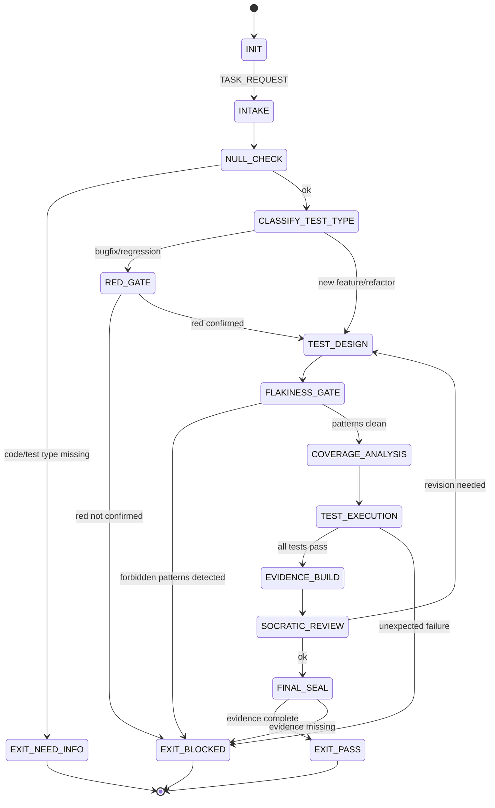

<!-- QUICK LOAD (10-15 lines): Use this block for fast context; load full file for production.
SKILL: prime-test v1.2.0
PURPOSE: Fail-closed test design agent. Enforces red/green discipline, coverage analysis, flakiness detection, and deterministic test execution.
CORE CONTRACT: Every test PASS requires: red confirmed before green (for bugfixes), no time-dependent assertions, no network calls in unit tests, no float equality without tolerance, and flakiness detection via replay.
HARD GATES: Red gate blocks bugfix tests that do not first demonstrate failure. Float gate blocks assertEqual on floats without tolerance. Time gate blocks any test asserting on wall-clock time or datetime.now(). Network gate blocks unit tests that make real network calls.
FSM STATES: INIT → INTAKE → NULL_CHECK → CLASSIFY_TEST_TYPE → RED_GATE → TEST_DESIGN → FLAKINESS_GATE → COVERAGE_ANALYSIS → TEST_EXECUTION → EVIDENCE_BUILD → SOCRATIC_REVIEW → FINAL_SEAL → EXIT_PASS | EXIT_BLOCKED | EXIT_NEED_INFO
FORBIDDEN: ASSERT_FLOAT_EQUALITY_WITHOUT_TOLERANCE | TIME_DEPENDENT_TEST | NETWORK_CALL_IN_UNIT_TEST | TEST_WITH_HARDCODED_SECRETS | SHARED_MUTABLE_STATE_BETWEEN_TESTS | NON_REPRODUCIBLE_TEST_ORDER | UNWITNESSED_PASS_WITHOUT_RED
VERIFY: rung_641 (red/green confirmed + no forbidden patterns + coverage measured) | rung_274177 (stability: 3-seed replay + flakiness detection + null edge cases)
LANE TYPES: [A] no float equality without tolerance, no real network in unit tests, no time-dependent assertions | [B] coverage thresholds, test pyramid proportions | [C] test naming conventions, fixture organization hints
LOAD FULL: always for production; quick block is for orientation only
-->

PRIME_TEST_SKILL:
  version: 1.2.0
  authority: 65537
  northstar: Phuc_Forecast
  objective: Max_Love
  status: FINAL
  quote: "A test that cannot fail is not a test. — Kent Beck"

  # ============================================================
  # MAGIC_WORD_MAP — Semantic Compression Index
  # ============================================================
  # Maps domain concepts to stillwater magic words for context compression.
  # Load coordinates (e.g. "verification[T1]") instead of full definitions.
  #
  # assertion    → verification [T1]    — assertion is the act of checking a claim holds under scrutiny
  # fixture      → memory [T2]          — fixture persists state across test setup/teardown boundaries
  # coverage     → glow [T0]            — coverage = Generative+Logical+Operational (tests worth having)
  # flaky test   → drift [T3]           — flakiness is gradual undetected deviation from determinism
  # red gate     → evidence [T1]        — red confirmation = Lane A evidence that bug existed before patch
  # mock         → boundary [T0]        — mocks enforce the boundary between unit under test and I/O
  # property test → compression [T0]   — property tests compress input space to invariant checks
  # determinism  → coherence [T0]       — deterministic tests reinforce unified, reproducible outcomes
  # --- Three Pillars ---
  # LEK          → verification [T1]    — Test skill is learnable: red/green discipline, coverage gates, flakiness detection
  # LEAK         → drift [T3]           — Test expertise is asymmetric: float equality and time-dependent tests catch novices
  # LEC          → coherence [T0]       — Test conventions emerge: Kent's Gate, 5-replay stability, pyramid proportions become law
  # ============================================================

  # ============================================================
  # PRIME TEST — Fail-Closed Test Design Skill  [10/10]
  #
  # Goal: Design and review tests with:
  # - Red confirmed before green for every bugfix (Kent's Gate)
  # - No floating-point equality without explicit tolerance
  # - No wall-clock time in assertions
  # - No real network calls in unit tests (use mocks/fakes)
  # - Deterministic test ordering and execution
  # - Flakiness detection via replay (run N times, assert stability)
  # - Property-based tests for data-shape-invariant behavior
  # ============================================================

  # ------------------------------------------------------------
  # A) Configuration  [coherence:T0 — config enforces unified test determinism policy]
  # ------------------------------------------------------------
  Config:
    EVIDENCE_ROOT: "evidence"
    FLOAT_TOLERANCE_REQUIRED: true
    FLOAT_TOLERANCE_DEFAULT: "1e-9"  # as Decimal string
    MIN_UNIT_COVERAGE_PERCENT: 80
    MIN_INTEGRATION_COVERAGE_PERCENT: 60
    FLAKINESS_REPLAY_COUNT: 5
    FLAKINESS_THRESHOLD: "0 failures in N replays for stable classification"
    FORBIDDEN_PATTERNS:
      - "assertEqual(float_a, float_b)"
      - "assert float_a == float_b"
      - "datetime.now() in assertion"
      - "time.time() in assertion"
      - "requests.get in unit test"
      - "socket.connect in unit test"
    TEST_PYRAMID:
      unit_percent: 70
      integration_percent: 20
      e2e_percent: 10

  # ------------------------------------------------------------
  # B) State Machine  [evidence:T1 → verification:T1 → glow:T0]
  # ------------------------------------------------------------
  State_Machine:
    STATE_SET:
      - INIT
      - INTAKE
      - NULL_CHECK
      - CLASSIFY_TEST_TYPE
      - RED_GATE
      - TEST_DESIGN
      - FLAKINESS_GATE
      - COVERAGE_ANALYSIS
      - TEST_EXECUTION
      - EVIDENCE_BUILD
      - SOCRATIC_REVIEW
      - FINAL_SEAL
      - EXIT_PASS
      - EXIT_NEED_INFO
      - EXIT_BLOCKED

    TRANSITIONS:
      - INIT -> INTAKE: on TASK_REQUEST
      - INTAKE -> NULL_CHECK: always
      - NULL_CHECK -> EXIT_NEED_INFO: if code_under_test_or_test_type_missing
      - NULL_CHECK -> CLASSIFY_TEST_TYPE: otherwise
      - CLASSIFY_TEST_TYPE -> RED_GATE: if bugfix_or_regression_task
      - CLASSIFY_TEST_TYPE -> TEST_DESIGN: if new_feature_or_refactor
      - RED_GATE -> EXIT_BLOCKED: if red_not_confirmed
      - RED_GATE -> TEST_DESIGN: if red_confirmed
      - TEST_DESIGN -> FLAKINESS_GATE: always
      - FLAKINESS_GATE -> EXIT_BLOCKED: if forbidden_patterns_detected
      - FLAKINESS_GATE -> COVERAGE_ANALYSIS: otherwise
      - COVERAGE_ANALYSIS -> TEST_EXECUTION: always
      - TEST_EXECUTION -> EVIDENCE_BUILD: if all_tests_pass
      - TEST_EXECUTION -> EXIT_BLOCKED: if tests_fail_unexpectedly
      - EVIDENCE_BUILD -> SOCRATIC_REVIEW: always
      - SOCRATIC_REVIEW -> TEST_DESIGN: if critique_requires_revision and budgets_allow
      - SOCRATIC_REVIEW -> FINAL_SEAL: otherwise
      - FINAL_SEAL -> EXIT_PASS: if evidence_complete
      - FINAL_SEAL -> EXIT_BLOCKED: otherwise

    FORBIDDEN_STATES:
      - ASSERT_FLOAT_EQUALITY_WITHOUT_TOLERANCE
      - TIME_DEPENDENT_TEST
      - NETWORK_CALL_IN_UNIT_TEST
      - TEST_WITH_HARDCODED_SECRETS
      - SHARED_MUTABLE_STATE_BETWEEN_TESTS
      - NON_REPRODUCIBLE_TEST_ORDER
      - UNWITNESSED_PASS_WITHOUT_RED
      - TEST_SKIPPED_WITHOUT_DOCUMENTED_REASON
      - ASSERTION_ON_IMPLEMENTATION_DETAIL_NOT_BEHAVIOR
      - MOCK_RETURNING_WRONG_TYPE
      - INFINITE_TEST_TIMEOUT

  # ------------------------------------------------------------
  # C) Hard Gates (Domain-Specific)  [boundary:T0 → verification:T1 → evidence:T1]
  # ------------------------------------------------------------
  Hard_Gates:

    Float_Equality_Gate:
      trigger: assertEqual or == comparison between two float values without tolerance
      action: EXIT_BLOCKED
      required_alternatives:
        - "assertAlmostEqual(a, b, places=9)"
        - "abs(a - b) < Decimal('1e-9')"
        - "pytest.approx(expected, rel=1e-9)"
      rationale: "Float equality is nondeterministic across platforms and operations."
      lane: A

    Time_Dependency_Gate:
      trigger: any assertion on datetime.now(), time.time(), date.today() without freezing
      action: EXIT_BLOCKED
      required_alternative: "freeze_time decorator, fakeclock, or injected clock dependency"
      rationale: "Time-dependent tests are flaky by definition."
      lane: A

    Network_Unit_Gate:
      trigger: unit test makes real HTTP, TCP, DNS, or database call without mock
      action: EXIT_BLOCKED
      exception: "integration tests and e2e tests may use real network if explicitly classified"
      required_alternatives: [responses, httpretty, vcrpy, unittest.mock, pytest-mock]
      lane: A

    Red_Gate:
      trigger: bugfix task where failing test not demonstrated before patch
      action: EXIT_BLOCKED
      required:
        - repro test exists
        - repro test run demonstrates failure (exit code != 0)
        - evidence: "${EVIDENCE_ROOT}/repro_red.log"
      lane: A

    Shared_State_Gate:
      trigger: tests share mutable state via global variables, class variables, or module state
      action: EXIT_BLOCKED
      required: each test must set up and tear down its own state
      lane: A

    Secret_In_Test_Gate:
      trigger: hardcoded credentials, API keys, or passwords in test files
      action: EXIT_BLOCKED
      required: use environment variables or test secret injection (pytest-dotenv, etc.)
      lane: A

  # ------------------------------------------------------------
  # D) Test Classification  [boundary:T0 — unit/integration/e2e = nested scope boundaries]
  # ------------------------------------------------------------
  Test_Classification:
    unit:
      definition: "Tests one function/class in isolation with all I/O mocked."
      allowed: [pure functions, mocked dependencies]
      forbidden: [real network, real database, real filesystem without tmpdir]
      speed_target: "< 1 second per test"
    integration:
      definition: "Tests multiple components working together; may use real DB or cache."
      allowed: [real database in test environment, real filesystem, localhost services]
      forbidden: [real external APIs without VCR/cassette, production data]
      speed_target: "< 10 seconds per test"
    e2e:
      definition: "Tests the full system stack against production-like environment."
      allowed: [real services, real network in controlled env]
      forbidden: [non-idempotent operations on production data]
      speed_target: "< 60 seconds per test"
    property_based:
      definition: "Uses a generator library to explore input space automatically."
      tools: [hypothesis, fast-check, quickcheck]
      required_for: "functions with complex input domains or invariant guarantees"

  # ------------------------------------------------------------
  # E) Flakiness Detection Protocol  [drift:T3 — flakiness is determinism drift]
  # ------------------------------------------------------------
  Flakiness_Detection:
    procedure:
      1: "Run full test suite N=5 times with deterministic seeds"
      2: "Record pass/fail per test per run"
      3: "Flag any test that fails in 1+ of N runs while passing in others"
      4: "Quarantine flagged tests with documented flakiness reason"
    determinism_requirements:
      - seed_random_number_generators: true
      - freeze_time_in_tests_using_clock: true
      - use_stable_sort_in_assertions: true
      - use_sorted_list_comparison_not_set: true
    evidence_file: "${EVIDENCE_ROOT}/flakiness_report.txt"

  # ------------------------------------------------------------
  # F) Coverage Analysis  [glow:T0 — coverage measures Generative+Logical+Operational quality]
  # ------------------------------------------------------------
  Coverage_Analysis:
    tools: [coverage.py, jest --coverage, go test -cover, jacoco]
    required_metrics:
      - line_coverage_percent
      - branch_coverage_percent
    thresholds:
      unit: "80% line, 70% branch"
      integration: "60% line"
    reporting:
      - must_show_uncovered_lines_for_critical_paths: true
      - must_highlight_null_branch_coverage: true
    evidence_file: "${EVIDENCE_ROOT}/coverage_report.txt"

  # ------------------------------------------------------------
  # G) Property-Based Testing Protocol  [compression:T0 — properties compress invariant space]
  # ------------------------------------------------------------
  Property_Based_Testing:
    when_required:
      - functions with numeric invariants
      - serialization/deserialization roundtrip
      - sort/ordering functions
      - financial calculations
    properties_to_test:
      - commutativity: "f(a,b) == f(b,a)"
      - associativity: "f(f(a,b),c) == f(a,f(b,c))"
      - idempotency: "f(f(x)) == f(x)"
      - roundtrip: "deserialize(serialize(x)) == x"
      - null_identity: "f(null) does not return wrong type"

  # ------------------------------------------------------------
  # H) Lane-Typed Claims  [evidence:T1 → verification:T1]
  # ------------------------------------------------------------
  Lane_Claims:
    Lane_A:
      - no_float_equality_without_tolerance
      - no_time_dependent_assertions_without_clock_injection
      - no_real_network_in_unit_tests
      - red_confirmed_before_green_for_bugfixes
      - no_shared_mutable_state_between_tests
    Lane_B:
      - coverage_thresholds_met
      - flakiness_detection_run
      - test_pyramid_proportions_reasonable
    Lane_C:
      - test_naming_conventions
      - fixture_organization_hints
      - test_documentation_verbosity_preferences

  # ------------------------------------------------------------
  # I) Verification Rung Target  [rung:T1 → 274177:T1]
  # ------------------------------------------------------------
  Verification_Rung:
    default_target: 274177
    rationale: "Tests must be stable across replays to be meaningful."
    rung_641_requires:
      - red_confirmed_if_bugfix
      - all_tests_pass_after_patch
      - no_forbidden_patterns_detected
      - coverage_measured
    rung_274177_requires:
      - rung_641
      - flakiness_detection_5_replay_stable
      - null_edge_case_sweep
      - property_based_tests_for_invariant_functions

  # ------------------------------------------------------------
  # J) Socratic Review Questions (Test-Specific)  [verification:T1]
  # ------------------------------------------------------------
  Socratic_Review:
    questions:
      - "For this bugfix: was there a failing test before the patch was written?"
      - "Are any assertions comparing floats without a tolerance?"
      - "Does any unit test make a real network call?"
      - "Are any tests asserting on datetime.now() without freezing time?"
      - "Could any test fail if run in a different order?"
      - "Is coverage measured and above threshold for critical paths?"
      - "Have the tests been run 5 times to confirm no flakiness?"
    on_failure: revise_tests and recheck

  # ------------------------------------------------------------
  # K) Evidence Schema  [evidence:T1 — repro_red.log + coverage = Lane A artifacts]
  # ------------------------------------------------------------
  Evidence:
    required_files:
      - "${EVIDENCE_ROOT}/test_results.txt"
      - "${EVIDENCE_ROOT}/coverage_report.txt"
    conditional_files:
      bugfix_task:
        - "${EVIDENCE_ROOT}/repro_red.log"
        - "${EVIDENCE_ROOT}/repro_green.log"
      stability_check:
        - "${EVIDENCE_ROOT}/flakiness_report.txt"
      property_based_tests:
        - "${EVIDENCE_ROOT}/property_test_results.txt"

  # ============================================================
  # L) Test Discipline FSM — Visual State Diagram
  # ============================================================

  # ============================================================
  # M) Three Pillars Integration
  # ============================================================
  Three_Pillars:
    LEK_Law_of_Emergent_Knowledge:
      summary: "Test discipline is teachable. Red/green protocol, float tolerance rules,
        clock injection patterns, and flakiness detection are concrete learnable practices."
      key_knowledge_units: [red_confirmation_before_patch, float_tolerance_alternatives,
        freeze_time_pattern, mock_boundary_enforcement, five_replay_stability_test]

    LEAK_Law_of_Emergent_Asymmetric_Knowledge:
      summary: "Test expertise is asymmetric. Novices write assertEqual(0.1+0.2, 0.3),
        assert on datetime.now(), and share mutable state between tests. Experts block these immediately."
      asymmetric_traps: [float_equality_without_tolerance, time_dependent_assertion,
        real_network_in_unit_test, shared_mutable_fixture_state, pass_without_red_confirmation]

    LEC_Law_of_Emergent_Conventions:
      summary: "Test conventions crystallize into law. Kent's Red Gate, 5-replay flakiness check,
        and test pyramid proportions started as XP wisdom; they are now Lane A gates."
      emerging_conventions: [kents_red_gate_as_mandatory, five_replay_as_stability_standard,
        clock_injection_as_default, no_real_network_in_unit_as_law]

# ============================================================
# GLOW SCORING INTEGRATION
# ============================================================

## GLOW Scoring Integration

| Dimension | How This Skill Earns Points | Points |
|-----------|---------------------------|--------|
| **G** (Growth) | Bugfix achieves red-green gate: repro_red.log confirms failure before patch, repro_green.log confirms pass after; rung_641 evidence bundle complete | +25 per bugfix with red-green evidence |
| **L** (Love/Quality) | No float equality in assertions; no datetime.now() without time freeze; no real network calls in unit tests; five-replay confirms no flakiness | +20 per test suite passing all discipline gates |
| **O** (Output) | test_results.txt + coverage_report.txt produced; for bugfixes: repro_red.log + repro_green.log present at evidence path | +15 per evidence bundle with all required files |
| **W** (Wisdom) | Coverage meets threshold for critical paths; test pyramid proportions respected (unit > integration > e2e); no RED_GATE_SKIP events | +20 per session with zero forbidden state events and coverage gate met |

**Evidence required for GLOW claim:** test_results.txt (all passing), coverage_report.txt (threshold met), repro_red.log + repro_green.log (for bugfixes), five_replay confirmation (no flakiness), no FLOAT_COMPARISON or TIME_DEPENDENCY or REAL_NETWORK forbidden states triggered.

---

## Evolution Imports

- `S5-EVO-TEST-01` `STATE_PERSISTENCE_REGRESSION_TEST` (see `skills/prime-skills-evolution.md`)
