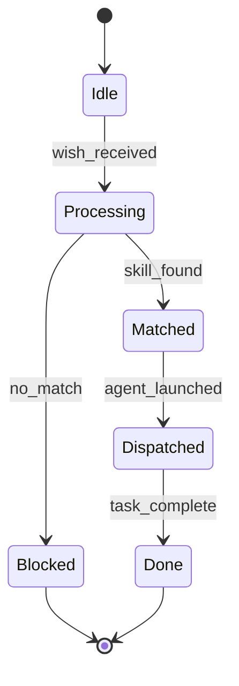

## Wish Catalog

| wish_id | name | category | swarm | skill_pack_hint | confidence |
|---------|------|----------|-------|-----------------|------------|
| oauth-integration | OAuth Integration | security | coder | coder+security | 0.92 |
| database-optimization | Database Optimization | performance | coder | coder | 0.90 |
| video-compression | Video Compression | media | coder | coder | 0.88 |
| api-design | REST API Design | backend | coder | coder | 0.87 |
| docker-containerization | Docker Containerization | devops | coder | coder+devops | 0.91 |
| security-audit | Security Audit | security | security-auditor | coder+security | 0.93 |
| ci-cd-pipeline | CI/CD Pipeline | devops | coder | coder+devops | 0.89 |
| machine-learning-training | Machine Learning Model Training | ml | mathematician | coder+math | 0.88 |
| react-frontend | React Frontend Development | frontend | coder | coder | 0.90 |
| python-performance | Python Performance Optimization | performance | coder | coder | 0.87 |
| test-development | Test Suite Development | quality | test-developer | coder+test | 0.91 |
| git-workflow | Git Workflow | devops | coder | coder | 0.86 |
| debugging | Bug Debugging | quality | coder | coder | 0.89 |
| documentation-writing | Documentation Writing | docs | writer | writer | 0.84 |
| code-refactoring | Code Refactoring | quality | coder | coder | 0.88 |
| dependency-management | Dependency Management | devops | coder | coder+security | 0.87 |
| logging-monitoring | Logging and Monitoring | devops | coder | coder+devops | 0.86 |
| data-pipeline | Data Pipeline | data | coder | coder | 0.86 |
| websocket-realtime | WebSocket / Real-time Communication | backend | coder | coder | 0.85 |
| encryption-cryptography | Encryption and Cryptography | security | security-auditor | coder+security | 0.93 |
| cache-optimization | Cache Optimization | performance | coder | coder | 0.88 |
| infrastructure-as-code | Infrastructure as Code | devops | coder | coder+devops | 0.87 |
| file-storage-upload | File Storage and Upload | backend | coder | coder | 0.85 |
| rate-limiting | Rate Limiting | security | coder | coder+security | 0.87 |
| search-indexing | Search and Indexing | backend | coder | coder | 0.86 |
