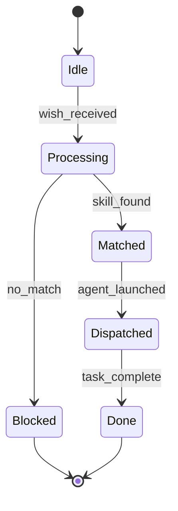

## Wish Catalog

| wish_id | name | category | swarm | skill_pack_hint | confidence | maps_to |
|---------|------|----------|-------|-----------------|------------|---------|
| oauth-integration | OAuth Integration | security | coder | coder+security | 0.92 | integrate |
| database-optimization | Database Optimization | performance | coder | coder | 0.90 | performance |
| video-compression | Video Compression | media | coder | coder | 0.88 | performance |
| api-design | REST API Design | backend | coder | coder | 0.87 | design |
| docker-containerization | Docker Containerization | devops | coder | coder+devops | 0.91 | deploy |
| security-audit | Security Audit | security | security-auditor | coder+security | 0.93 | audit |
| ci-cd-pipeline | CI/CD Pipeline | devops | coder | coder+devops | 0.89 | deploy |
| machine-learning-training | Machine Learning Model Training | ml | mathematician | coder+math | 0.88 | data |
| react-frontend | React Frontend Development | frontend | coder | coder | 0.90 | feature |
| python-performance | Python Performance Optimization | performance | coder | coder | 0.87 | performance |
| test-development | Test Suite Development | quality | test-developer | coder+test | 0.91 | test |
| git-workflow | Git Workflow | devops | coder | coder | 0.86 | deploy |
| debugging | Bug Debugging | quality | coder | coder | 0.89 | debug |
| documentation-writing | Documentation Writing | docs | writer | writer | 0.84 | docs |
| code-refactoring | Code Refactoring | quality | coder | coder | 0.88 | refactor |
| dependency-management | Dependency Management | devops | coder | coder+security | 0.87 | security |
| logging-monitoring | Logging and Monitoring | devops | coder | coder+devops | 0.86 | deploy |
| data-pipeline | Data Pipeline | data | coder | coder | 0.86 | data |
| websocket-realtime | WebSocket / Real-time Communication | backend | coder | coder | 0.85 | integrate |
| encryption-cryptography | Encryption and Cryptography | security | security-auditor | coder+security | 0.93 | security |
| cache-optimization | Cache Optimization | performance | coder | coder | 0.88 | performance |
| infrastructure-as-code | Infrastructure as Code | devops | coder | coder+devops | 0.87 | deploy |
| file-storage-upload | File Storage and Upload | backend | coder | coder | 0.85 | integrate |
| rate-limiting | Rate Limiting | security | coder | coder+security | 0.87 | security |
| search-indexing | Search and Indexing | backend | coder | coder | 0.86 | data |
| bugfix | Bug Fix | quality | coder | coder+skeptic | 0.90 | bugfix |
| feature | New Feature | development | coder | coder+safety | 0.90 | feature |
| deploy | Deployment | devops | coder | coder+devops | 0.90 | deploy |
| test | Testing | quality | coder | coder+test | 0.90 | test |
| security | Security Review | security | security-auditor | coder+security | 0.92 | security |
| performance | Performance Optimization | performance | coder | coder | 0.88 | performance |
| docs | Documentation | docs | writer | writer | 0.85 | docs |
| refactor | Refactoring | quality | coder | coder | 0.88 | refactor |
| plan | Architecture Planning | planning | planner | forecast | 0.87 | plan |
| debug | Debugging | quality | coder | coder | 0.89 | debug |
| review | Code Review | quality | skeptic | coder+skeptic | 0.88 | review |
| research | Research | exploration | scout | forecast | 0.85 | research |
| support | User Support | support | support | support | 0.84 | support |
| design | System Design | planning | planner | forecast | 0.86 | design |
| audit | Security Audit | security | security-auditor | coder+security | 0.93 | audit |
| integrate | API Integration | integration | coder | coder+api | 0.88 | integrate |
| browser | Browser Automation | automation | twin-agent | browser | 0.87 | browser |
| communicate | Communication | messaging | coder | coder+api | 0.86 | communicate |
| data | Data Processing | data | coder | coder+data | 0.88 | data |
| content | Content Creation | content | writer | docs | 0.85 | content |
| math | Mathematical Proofs | research | mathematician | math | 0.90 | math |
