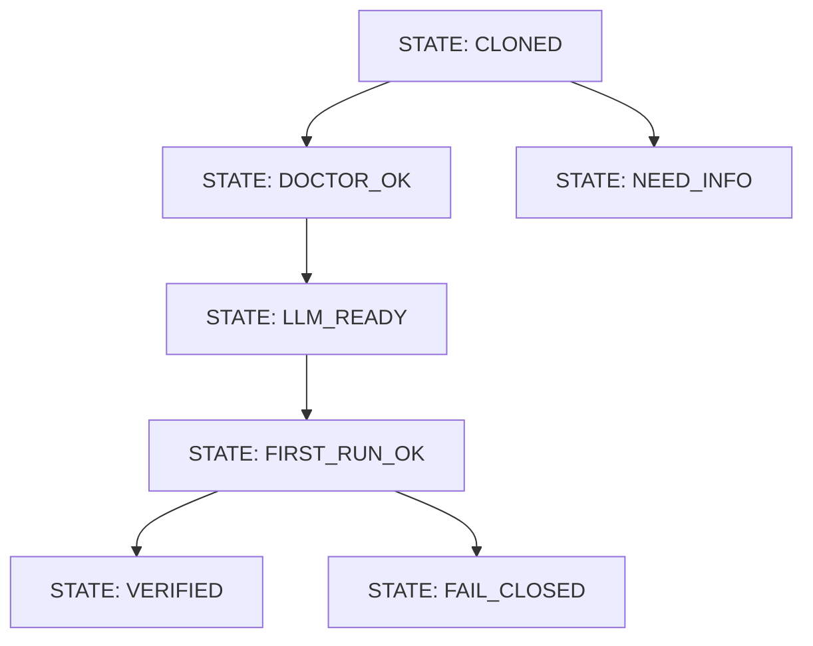

# Example Wish: Clone To First Run

Wish ID: `wish.clone_to_first_run.v1`

## Quest + Belt

- Quest: "Open the Cave, Light the CLI"
- Current belt: `White Belt`
- Target belt: `Green Belt`
- Promotion rule: all acceptance tests pass + hash stable on rerun

## Capability

A new user can clone Stillwater and get a verified first CLI run in under 5 minutes.

## Non-goals

- No production hardening in this wish
- No cloud deployment automation
- No benchmark comparison claims

## Prime Mermaid

## Forbidden states

- `RUN_WITHOUT_DOCTOR`
- `RUN_WITHOUT_LLM_ENDPOINT_DECISION`
- `SUCCESS_WITHOUT_ARTIFACTS`

## Acceptance tests

1. `stillwater paths` lists root notebooks including Prime Mermaid notebook.
2. `stillwater llm probe-ollama` reports endpoint status cleanly.
3. A first run writes artifacts and verification summary.

## Evidence artifacts

- `artifacts/wishes/wish.clone_to_first_run.v1/state.mmd`
- `artifacts/wishes/wish.clone_to_first_run.v1/state.sha256`
- `artifacts/wishes/wish.clone_to_first_run.v1/results.json`

## Scorecard (gamified)

- Clarity: 10
- Determinism: 10
- Replayability: 9
- Suggested belt after proof: `Green Belt`
