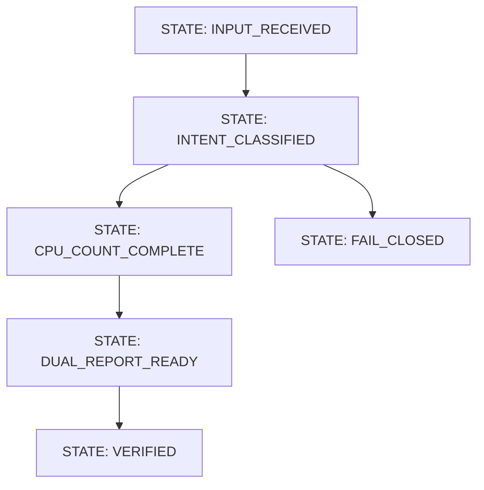

# Example Wish: OOLONG Counter Bypass

Wish ID: `wish.oolong_counter_bypass.v1`

## Quest + Belt

- Quest: "Bind the Counting Genie"
- Current belt: `Yellow Belt`
- Target belt: `Brown Belt`
- Promotion rule: strict verifier passes (`rung_641`, `rung_274177`, `rung_65537`)

## Capability

CLI answers aggregation questions using CPU counting only, while LLM is limited to routing/classification.

## Non-goals

- No freeform numeric generation by LLM
- No probabilistic aggregation fallback
- No hidden correction without dual reporting

## Prime Mermaid

## Forbidden states

- `LLM_GENERATED_NUMBER_NOT_IN_CPU_OUTPUT`
- `SINGLE_REPORT_WHEN_CORRECTION_OCCURRED`
- `COUNTING_DONE_INSIDE_LLM`

## Acceptance tests

1. Any numeric output must be witnessed in CPU artifact.
2. If mismatch exists, output includes `RAW` and `CORRECTED`.
3. Verifier fails on introduced numbers.

## Evidence artifacts

- `artifacts/wishes/wish.oolong_counter_bypass.v1/state.mmd`
- `artifacts/wishes/wish.oolong_counter_bypass.v1/state.sha256`
- `artifacts/wishes/wish.oolong_counter_bypass.v1/results.json`

## Scorecard (gamified)

- Counter-bypass discipline: 10
- Forbidden-state enforcement: 10
- Replayability: 9
- Suggested belt after proof: `Brown Belt`
